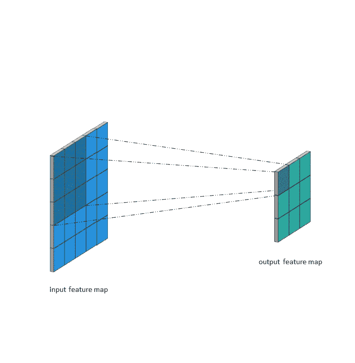
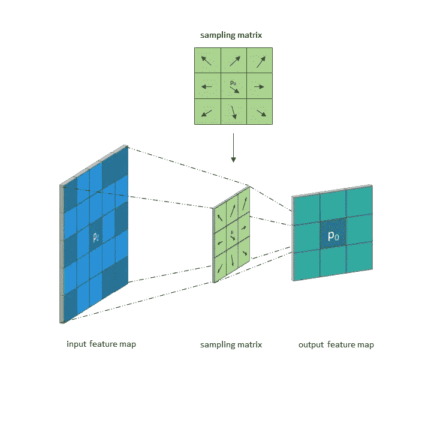
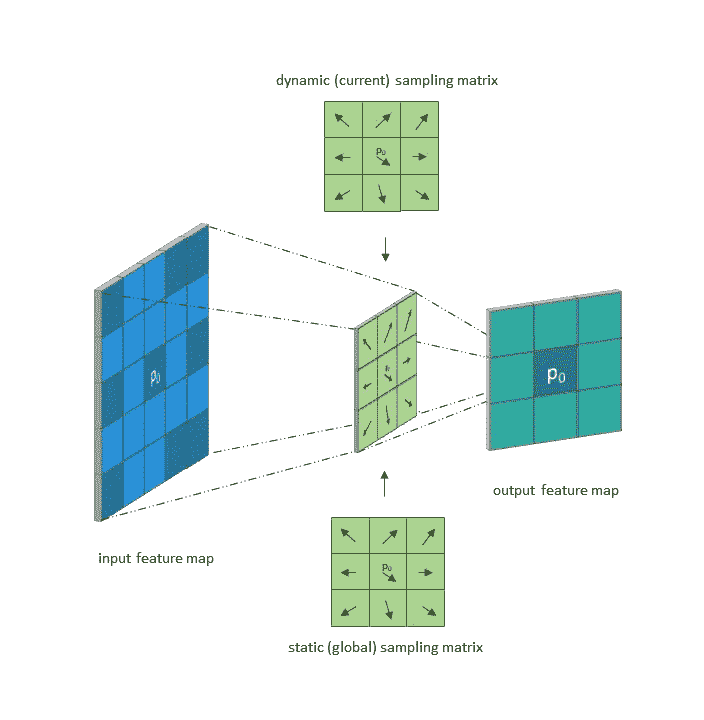

# 卷积的类型:可变形和可变换的卷积

> 原文：<https://towardsdatascience.com/type-of-convolutions-deformable-and-transformable-convolution-1f660571eb91?source=collection_archive---------17----------------------->

## 让 ML 变得有趣

## 理解可变形和可变换卷积的直观方法

如果你听说过可变形或可变换卷积，并对它们的实际含义感到困惑，那么这篇文章就是为你准备的。我将尝试用直观的方式向你们解释两个不太为人所知但非常有趣的卷积。

假设你已经熟悉标准卷积，我将从以直观(但不常见)的方式介绍标准卷积开始，引出可变形和可变换卷积。

这篇文章的内容包括:

1.  背景
2.  可变形卷积
3.  可变换卷积

# 1.背景

Figure 1: 2D convolution using a kernel size of 3, stride of 1 and no padding

首先，我们需要理解一个标准的 2D 卷积运算。标准的 2D 卷积在 ***固定感知场*** 和 ***空间位置*** 对输入应用 2D 滤波器/核，以生成输出特征图。卷积运算中涉及某些参数，如内核大小、步幅和填充。

**内核大小:**定义卷积的视场。

**Stride:** 定义内核遍历图像时的步长。

**填充:**定义如何处理样本的边框。例如，对于步长为 1 的核 3，没有填充将导致下采样。

## 取样矩阵

标准卷积本质上是在图像上应用采样矩阵来提取输入样本，然后在其上应用核。下图说明了采样矩阵的概念:

Figure 2: 2D convolution using a kernel size of 3, stride of 1 and no padding represented with sampling matrix. Note that sampling matrix is just an overlay over the kernel, defining how the input should be sampled

对于输入中的任何 pₒ位置，采样矩阵(表示为绿色矩形网格)定义了如何从输入中采样点，以应用内核(表示为输入网格上的深蓝色贴图)，如图 2 所示。

> 核的形状可以由中心位置 pₒ和采样位置 pᵢ(与 pₒ.的相对距离)来描述这些取样地点的收集 pₒ,….,pᵢ被称为**采样矩阵**。

输出特征图由核 w 和输入 x 之间的卷积运算生成，可以表示为 ***y = w * x*** ，特征图 y 中的每个元素可以计算为:

其中 pₒ是输入样本的中心位置，pᵢ列举了采样点集合中的点(即采样矩阵)。

Figure 3: 2D convolution using a kernel size of 3 and an offset of 2 (dilation = 2). Notice how the offsets are changed in the sampling matrix

给定一个采样矩阵，我们可以改变偏移(pᵢ),以在应用内核的输入中获得任何任意接收域。

在标准卷积运算中，所有方向上的偏移量始终为 1，如图 2 所示。

在另一种类型的卷积中，称为**扩张卷积**(也称为 atrous 卷积)，使用大于 1 的偏移量，允许更大的感受野来应用内核(图 3)。

如果到目前为止你能够理解取样矩阵的概念，理解可变形和可转换卷积在这个阶段应该是非常容易的。但首先让我们谈谈标准卷积运算的一个固有限制。

> 由于采样矩阵的固定几何结构，CNN 固有地局限于模拟大的未知变换。例如，同一 CNN 层中所有激活单位的感受野大小是相同的。
> 
> — [微软亚洲研究院](https://arxiv.org/pdf/1703.06211.pdf)

因为输入特征图中的不同位置可能对应于具有不同尺度或变形的对象，所以对于某些任务来说，尺度或感受野大小的自适应确定是合乎需要的。

例如，在自然语言处理中，使用传统的 CNN 从可变换的和不连续的语言短语中捕获不同的适应性特征提出了巨大的挑战，例如，直接捕获“非……”。短语“差远了”的“好”模式。此外，从不同的转换形式(如“不太好”和“甚至不好”)中捕捉上述模式是困难的。

> 如果我们可以使采样矩阵适应输入中的要素变换，会怎么样？

可变形和可变换卷积都试图通过引入参数来学习 ***自适应采样矩阵*** (也称为偏移或偏差矩阵，通常表示为 R 或 C)以识别同一模式的各种变换，从而解决上述问题。

# 1.可变形卷积

变形卷积引入了变形模块的机制，它具有可学习的形状以适应特征的变化。传统上，由采样矩阵定义的卷积中的核和样本的形状从一开始就是固定的。

可变形卷积使得采样矩阵是可学习的，允许核的形状适应输入中未知的复杂变换。让我们看看下图来理解这个概念。[1]

[1] Figure 4: Illustration of the sampling matrix in 3 × 3 standard and deformable convolutions. (a) regular sampling matrix (green points) of standard convolution. (b) deformed sampling locations (dark blue points) with augmented offsets (light blue arrows) in deformable convolution. c & d are special cases of (b), showing that the deformable convolution generalizes various transformations for scale, (anisotropic) aspect ratio and rotation

Figure 5: Deformable convolution using a kernel size of 3 and learned sampling matrix

不像在图 2 的标准卷积中那样使用具有固定偏移的固定采样矩阵，可变形卷积学习具有位置偏移 的 ***采样矩阵。通过附加的卷积层，从前面的特征图中学习偏移。***

因此，变形以局部、密集和自适应的方式取决于输入要素。

为了将此放入等式中，在可变形卷积中，常规采样矩阵 c 增加了偏移{∆pᵢ|n = 1，…，N}，其中 N = |C|。

情商。(1)变成

其中，pₒ是输入中样本的中心位置，pᵢ列举了采样/偏移点集合 c 中的点。现在，采样是在不规则和偏移位置 pᵢ + ∆pᵢ上进行的，即内核的采样位置被重新分布，而不再是规则的矩形。

# 2.可变换卷积

Figure 6: Transformable convolution using a kernel size of 3 and two learned sampling matrices

像可变形卷积一样，可变形卷积也将位置偏移添加到核上，使它们的形状通过采样矩阵变得灵活和可适应。

但是可变换卷积通过将采样矩阵分裂成两个称为 ***动态和静态偏差*** 的矩阵来进行下一步。

因此，使用两个已学习的采样矩阵从输入中获取两个样本，并将其相加以获得输出特征图。

## 动态偏差

在推理阶段，动态偏差与当前输入相关，其值从当前特征中主动学习以捕捉当前变换信息(就像变形卷积中的偏移矩阵)。

## 静态偏差

静态偏差的值通过反向传播来更新，并在推理状态下保持静态，这描述了形状信息的全局分布。

因此，采样矩阵 C 被分成两部分，一部分与当前特征相关，另一部分与全局相关。让 D𝒸 ⊂ C 和 S𝒸 ⊂ C 分别表示它们。然后，它们被加上不同的偏差/偏移 D𝒸的∆pᵢ和 S𝒸的∆pᵢ，以调整采样位置。

情商。(2)成为

这里，采样也是在不规则和偏移的位置 pᵢ + ∆pᵢ和 pᵢ + ∆pᵢ上进行的，即内核的采样位置是重新分布的，并且不是矩形的。但不是一个，而是两个样本，一个基于静态偏差矩阵，另一个基于动态偏差矩阵。然后对两个样本进行核卷积，并将结果相加，以获得输出特征图中的元素。

我希望这篇文章能让你更容易对这两个卷积有一个直观的理解，并作为你学习/研究的有用参考。

感谢您阅读这篇文章..如果您有任何困惑，请随时在下面留下问题和评论。

# 参考

[1]【戴，齐，熊，李，张，胡，魏，可变形卷积网络(2017)，微软亚洲研究院

[2] [戴，齐，熊，李，张，胡，魏，可转换卷积神经网络用于文本分类(2018)，国际人工智能联合会议(IJCAI)](https://www.ijcai.org/proceedings/2018/0625.pdf)