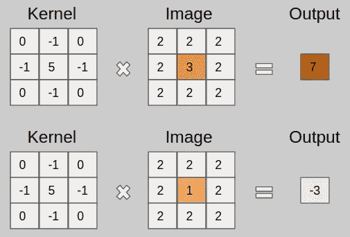
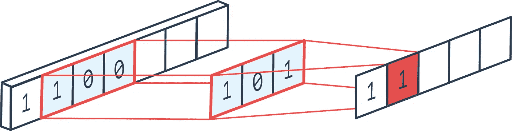
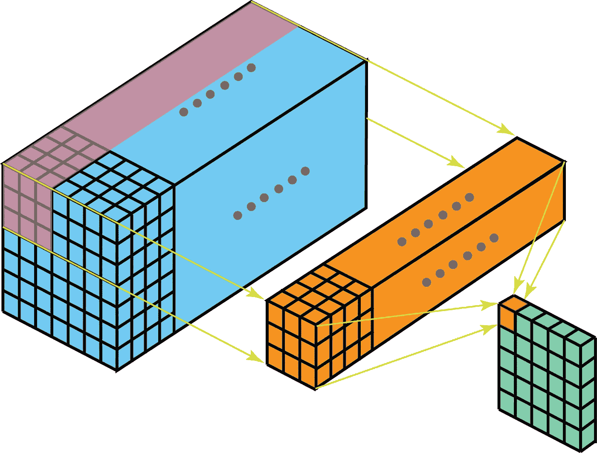
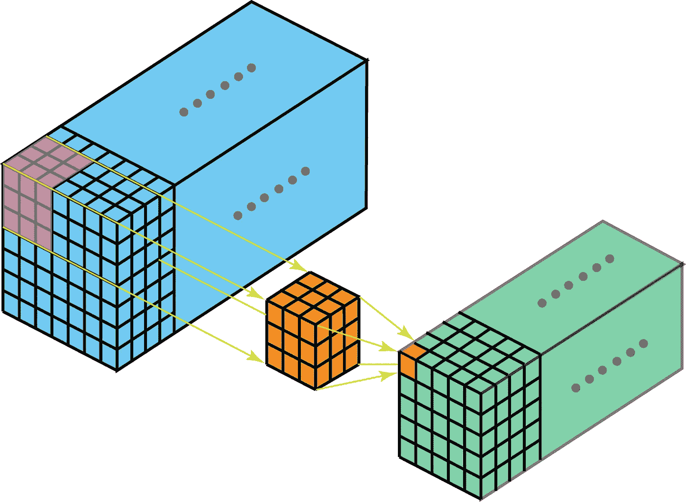
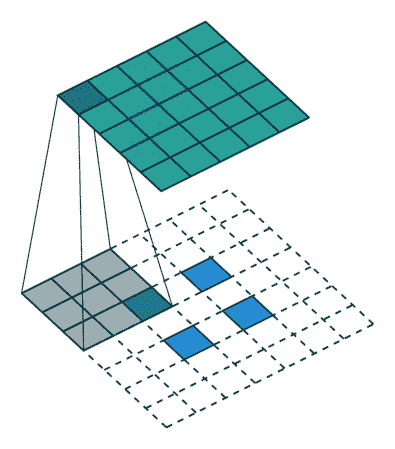
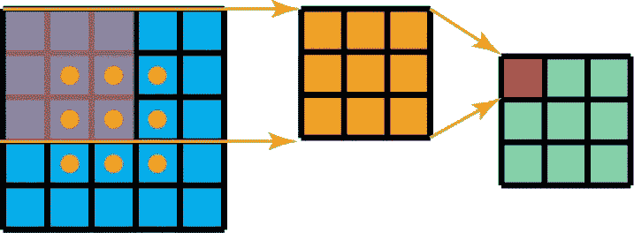
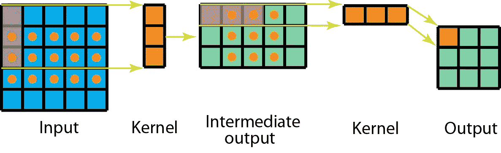
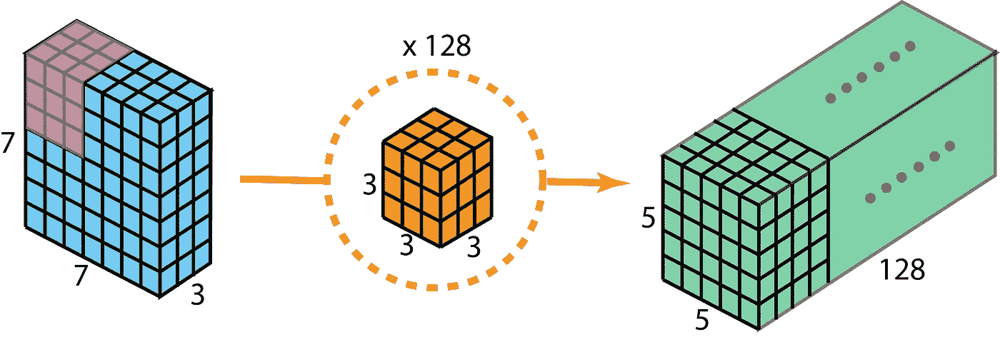
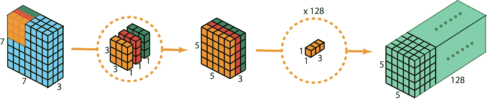
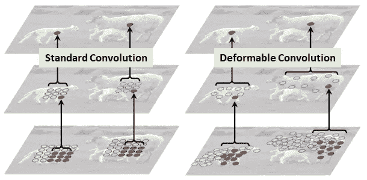

# 卷积核的类型:简化

> 原文：<https://towardsdatascience.com/types-of-convolution-kernels-simplified-f040cb307c37?source=collection_archive---------1----------------------->

对迷人的 CNN 层的不同变化的直观介绍

## 简单介绍一下

*卷积使用“内核”从输入图像中提取某些“特征”*。让我解释一下。核是一个矩阵，它在图像上滑动并与输入相乘，从而以某种期望的方式增强输出。请看下面的实际操作。

例如，上面使用的内核对于锐化图像很有用。但是这个内核有什么特别之处呢？？考虑两种输入图像排列，如下例所示。对于第一幅图像，中心值为 3*5 + 2*-1 + 2*-1 + 2*-1 + 2*-1 = 7。值 3 增加到 7。对于第二幅图像，输出为 1*5+ 2*-1 + 2*-1 + 2*-1 + 2*-1 = -3。值 1 减小到-3。很明显，3 和 1 之间的对比度增加到 7 和-3，这又会使图像变得清晰。

通过深度细胞神经网络，我们可以学习这些能够提取潜在特征的核值，而不是使用手工制作的核进行特征提取。为了进一步了解传统 CNN 的工作，我推荐这个博客。

 [## 直观理解用于深度学习的卷积

### 探索让它们工作的强大的视觉层次

towardsdatascience.com](/intuitively-understanding-convolutions-for-deep-learning-1f6f42faee1) 

## 内核与过滤器

在我们深入讨论之前，我只想弄清楚“内核”和“过滤器”这两个术语之间的区别，因为我见过很多人互换使用它们。如前所述，核是权重矩阵，与输入相乘以提取相关特征。核矩阵的维数是*卷积如何得到它的名字*。例如，在 2D 卷积中，核矩阵是 2D 矩阵。

然而，滤波器是多个内核的级联，每个内核被分配给输入的特定通道。过滤器总是比内核多一个维度。例如，在 2D 卷积中，滤波器是 3D 矩阵(本质上是 2D 矩阵即核的串联)。因此，对于具有核维数 h*w 和输入通道 k 的 CNN 层，滤波器维数为 k*h*w。

一个公共卷积层实际上由多个这样的滤波器组成。*为了下面讨论的简单起见，除非特别说明，否则假设只存在一个过滤器，因为相同的行为在所有过滤器上重复。*

## 1D、2D 和三维卷积

1D 卷积通常用于时间序列数据分析(因为在这种情况下的输入是 1D)。如前所述，1D 数据输入可以有多个通道。滤光器只能在一个方向上移动，因此输出是 1D。见下面一个单通道 1D 卷积的例子。

我们已经在本文开头看到了一个单通道 2D 卷积的例子，所以让我们来想象一个多通道 2D 卷积，并试着理解它。在下图中，内核尺寸为 3*3，过滤器中有多个这样的内核(标记为黄色)。这是因为输入中有多个通道(标记为蓝色),并且我们有一个对应于输入中每个通道的内核。显然，这里的滤波器可以在两个方向上移动，因此最终输出是 2D。2D 卷积是最常见的卷积，在计算机视觉中被大量使用。

很难将 3D 滤波器可视化(因为它是 4D 维矩阵)，所以我们将在这里讨论单通道 3D 卷积。正如你从下图中看到的，在 3D 卷积中，一个内核可以在 3 个方向上移动，因此得到的输出也是 3D 的。

在修改和定制 CNN 层中所做的大部分工作都只集中在 2D 卷积上，所以从现在开始，我将只讨论 2D 卷积环境中的这些变化。

## 转置卷积(去卷积)

下面的 GIF 很好地捕捉了 2D 卷积如何降低输入的维数。但有时我们需要做输入处理，例如增加它的尺寸(也称为“上采样”)。

为了使用卷积实现这一点，我们使用了一种称为转置卷积或反卷积的修改(尽管它并不是卷积运算的真正“反转”，所以很多人不喜欢使用这个术语)。下面 GIF 中的虚线块代表填充。

我认为这些动画给出了一个很好的直觉，如何基于填充模式从相同的输入创建不同的上采样输出。这种卷积在现代 CNN 网络中非常常用，主要是因为它们能够增加图像尺寸。

## 可分卷积

可分离卷积指的是将卷积核分解成低维核。可分卷积有两种主要类型。首先是空间上可分离的卷积，例如见下文。

A standard 2D convolution kernel

Spatially separable 2D convolution

然而，空间可分离的卷积在深度学习中并不常见。另一方面，深度方向可分离卷积被广泛应用于轻量级 CNN 模型，并提供了非常好的性能。例如，见下文。

A standard 2D convolution with 3 input channels and 128 filters

Depthwise separable 2D convolution which first processes each channel separately and then applies inter-channel convolutions

但是为什么可分卷积？ **效率！！**使用可分离卷积可以显著减少所需的参数数量。随着我们今天拥有的深度学习网络的日益复杂和巨大规模，能够以更少的参数提供类似的性能无疑是一个要求。

## 扩张(阿特鲁)卷积

正如你在上面的所有卷积层中看到的(无一例外)，它们一起处理所有相邻的值。然而，有时跳过某些输入值可能对流水线最有利，这就是膨胀卷积(也称为 atrous 卷积)的引入方式。这样的修改允许内核在不增加参数数量的情况下增加它的*视图范围*。

很明显，从上面的动画中我们可以注意到，内核能够使用与之前相同的 9 个参数处理更宽的邻域。这也意味着信息的丢失，因为不能处理细粒度的信息(因为它跳过了某些值)。然而，在某些应用中，总体效果似乎是积极的。

## 可变形卷积

就特征提取的形状而言，卷积是非常严格的。也就是说，内核形状只是正方形/长方形(或者其他需要人工决定的形状)，因此它们只能在这种模式上工作。*如果卷积的形状本身是可以学习的呢？*这是引入可变形卷积的核心理念。

可变形卷积的实现实际上非常简单。每个内核实际上都用两个不同的矩阵来表示。第一个分支学习预测从原点的“偏移”。该偏移量表示原点周围的哪些输入将被处理。由于每个偏移都是独立预测的，它们之间不需要形成任何刚性形状，因此允许可变形的性质。第二个分支只是卷积分支，其输入现在是这些偏移处的值。

## 下一步是什么？

已经有了 CNN 层的多种变体，这些变体已经被独立使用或者相互结合使用来创建成功且复杂的架构。每一种变化都源于对特征提取应该如何工作的直觉。因此，我相信，虽然这些深度 CNN 网络学习我们无法解释的权重，但形成它们的直觉对它们的性能非常重要，在那个方向上的进一步工作对高度复杂的 CNN 的成功非常重要。

*这个博客是努力创建机器学习领域简化介绍的一部分。点击此处查看完整系列*

 [## 机器学习:简化

### 在你一头扎进去之前就知道了

towardsdatascience.com](/machine-learning-simplified-1fe22fec0fac) 

或者只是阅读系列的下一篇博客

 [## 分布式矢量表示:简化

### 可以说是机器学习中最基本的特征表示方法

towardsdatascience.com](/distributed-vector-representation-simplified-55bd2965333e) 

## 参考

克里热夫斯基、亚历克斯、伊利亚·苏茨基弗和杰弗里·e·辛顿。"使用深度卷积神经网络的图像网络分类."神经信息处理系统进展。2012.
[2]杜默林、文森特、弗朗切斯科·维辛。"深度学习卷积算法指南."arXiv 预印本 arXiv:1603.07285 (2016)。
[3]陈，梁杰，等.“Deeplab:基于深度卷积网、atrous 卷积和全连通条件随机场的语义图像分割”IEEE 模式分析与机器智能汇刊 40.4(2017):834–848。
[4]戴，季峰，等.“可变形卷积网络”IEEE 计算机视觉国际会议论文集。2017.
[5] Howard，Andrew G .等，“移动网络:用于移动视觉应用的高效卷积神经网络”arXiv 预印本 arXiv:1704.04861 (2017)。
【6】