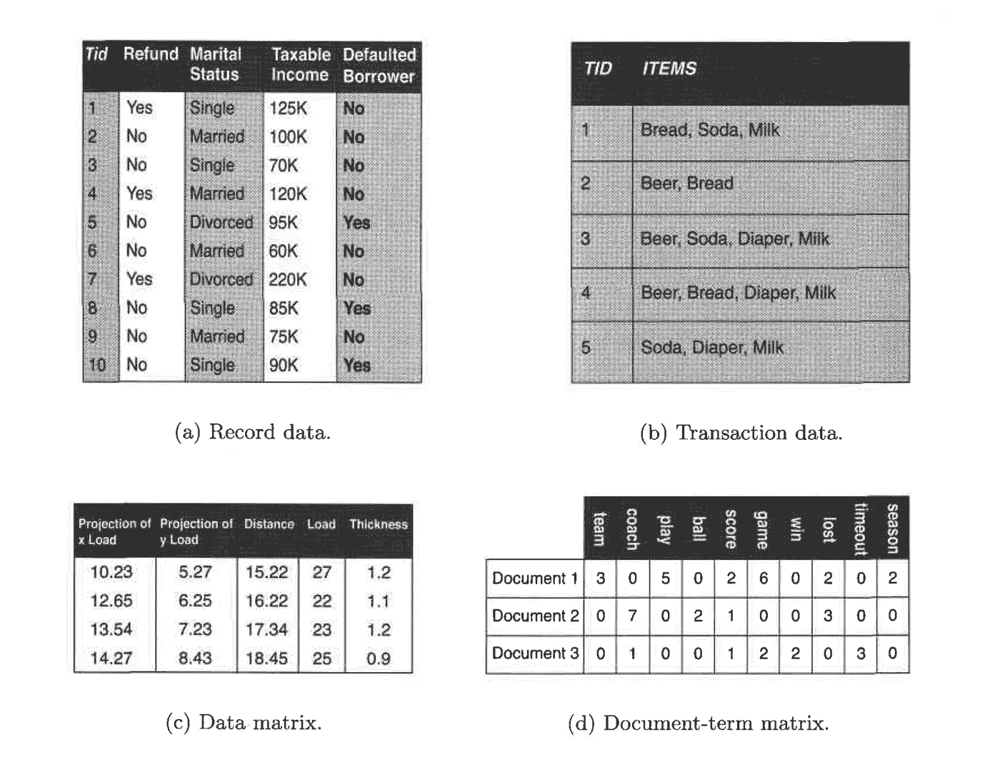
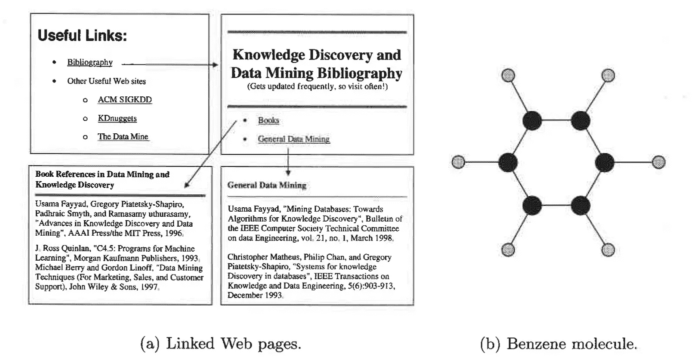
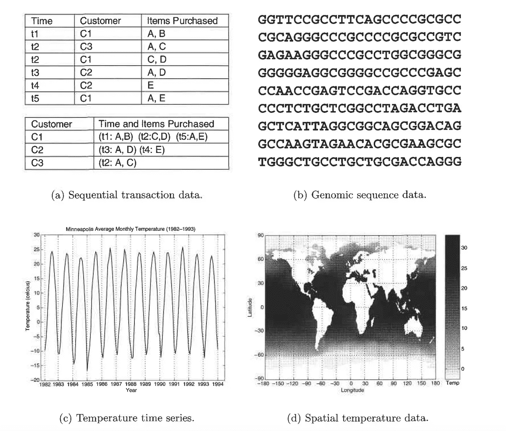

# 数据科学、数据挖掘和机器学习中的数据集类型

> 原文：<https://towardsdatascience.com/types-of-data-sets-in-data-science-data-mining-machine-learning-eb47c80af7a?source=collection_archive---------2----------------------->

## 以及它们的一般特征…

Video version of the story, if you are into that sort of thing

在 [*我之前的一篇*](/journey-into-data-mining-3b5ccfa5343) 中，我讲过什么是**数据**以及**数据属性**是什么意思。这个就继续那个，如果还没看的话，这里看一下**以便对我在文章中要讲的话题和概念有一个恰当的把握。**

> **请原谅我的概念性部分，我知道这可能有点无聊，但如果你有强大的基础，那么没有什么可以阻止你成为一名伟大的 ***数据科学家*** *或* ***机器学习工程师*** *。***

**T 这里有*数据集的三个*一般特征，即:**维数、稀疏度、**和**分辨率。我们将一次一个地讨论它们到底是什么意思。****

> **什么是**维度？****

**→数据集的维度是数据集中的对象所具有的属性的数量。**

**在一个特定的数据集中，如果有大量的属性(也称为高维数)，那么分析这样一个数据集会变得困难。当面对这个问题时，它被称为**维数灾难。****

**为了理解这个**维数灾难到底是什么，**我们首先需要理解数据的另外两个特征。**

> **什么是**稀疏性？****

**→对于某些数据集，如具有非对称特征的数据集，一个对象的大多数属性的值为 0；在许多情况下，不到 1%的条目是非零的。这样的数据称为**稀疏数据**或者可以说数据集具有**稀疏性。****

> **什么是**分辨率**？**

**→数据中的模式取决于分辨率水平。如果分辨率太精细，图案可能不可见或者可能被淹没在噪声中；如果分辨率太粗糙，图案可能会消失。例如，以小时为单位的大气压力变化反映了风暴和其他天气系统的运动。在几个月的时间里，这种现象是无法察觉的。**

**现在，回到**维数灾难，**这意味着随着数据集的维数(数据集中属性的数量)增加，许多类型的数据分析变得困难。具体来说，随着维度的增加，数据在其占据的空间中变得越来越稀疏。对于分类，这可能意味着没有足够的数据对象来允许创建一个模型，该模型可靠地将类别分配给所有可能的对象。对于聚类来说，对聚类至关重要的密度和点之间距离的定义变得不那么有意义了。**

**F 最后，根据**数据集的类型，**我们将其定义为*三个*类别，即**记录数据、**和**有序数据。让我们一次看一个。****

> ****记录数据****

****

**Introduction to Data Mining — Pang-Ning Tan, Michael Steinbach, Vipin Kumar**

**→大多数*数据挖掘*工作假设数据是记录(数据对象)的集合。**

**→记录数据最基本的形式，记录或数据字段之间没有明确的关系，每条记录(对象)都有相同的属性集。记录数据通常存储在平面文件或关系数据库中。**

****记录数据有一些变化，**有一些特征属性。**

1.  ****交易或购物篮数据:**是一种特殊类型的记录数据，其中每条记录包含一组项目。例如，在超市或杂货店购物。对于任何特定的客户，记录将包含客户在相应的超市或杂货店访问中购买的一组商品。这种类型的数据称为**市场篮子数据。**交易数据是一组项目的集合，但可以看作是一组字段为非对称属性的记录。大多数情况下，这些属性是二进制的，表示一个商品是否被购买。**
2.  ****数据矩阵:**如果数据集合中的数据对象都具有相同的固定数值属性集，那么数据对象可以被认为是多维空间中的点(向量)，其中每个维度表示描述对象的不同属性。一组这样的数据对象可以被解释为一个 m×n 矩阵，其中有 n 行(每个对象一行)和 n 列(每个属性一列)。可以应用标准的矩阵运算来转换和处理数据。因此，数据矩阵是大多数统计数据的标准数据格式。**
3.  ****稀疏数据矩阵:**稀疏数据矩阵(有时也称为**文档-数据矩阵**)是数据矩阵的一种特殊情况，其中属性是相同类型的并且是非对称的；即，只有非零值是重要的。**

> ****基于图表的数据****

****

**Introduction to Data Mining — Pang-Ning Tan, Michael Steinbach, Vipin Kumar**

**这可以进一步分为以下类型:**

1.  ****具有对象间关系的数据:**数据对象被映射到图的节点，而对象间的关系由对象间的链接和链接属性捕获，例如方向和权重。考虑万维网上的网页，它包含文本和到其他网页的链接。为了处理搜索查询，网络搜索引擎收集和处理网页以提取它们的内容。**
2.  ****对象为图的数据:**如果对象有结构，即对象包含有关系的子对象，那么这样的对象经常被表示为图。例如，化学化合物的结构可以用图来表示，图中的节点是原子，节点之间的链接是化学键。**

> ****有序数据****

****

**Introduction to Data Mining — Pang-Ning Tan, Michael Steinbach, Vipin Kumar**

**对于某些类型的数据，属性具有涉及时间或空间顺序的关系。如上图所示，它可以分为四种*类型:***

1.  ****顺序数据:**也称为**时态**数据，可以认为是记录数据的扩展，其中每个记录都有一个与之相关联的时间。考虑一个零售交易数据集，它也存储交易发生的时间**
2.  ****序列数据:**序列数据由一个数据集组成，该数据集是一个单个实体的序列，例如一个单词或字母的序列。它与顺序数据非常相似，只是没有时间戳；相反，在有序的序列中有位置。例如，植物和动物的遗传信息可以以被称为基因的核苷酸序列的形式来表示。**
3.  ****时间序列数据:**时间序列数据是一种特殊类型的序列数据，其中每条记录都是一个时间序列，即一段时间内的一系列测量值。例如，金融数据集可能包含各种股票每日价格的时间序列对象。**
4.  ****空间数据:**有些对象有空间属性，比如位置或者面积，还有其他类型的属性。空间数据的一个例子是为各种地理位置收集的天气数据(降水、温度、气压)。**

**这篇关于数据集类型的文章到此结束。**

**这个帖子的后续是[这里](/assessing-the-quality-of-data-e5e996a1681b)。**

** [## 评估数据质量

### 对于数据挖掘和机器学习算法…

towardsdatascience.com](/assessing-the-quality-of-data-e5e996a1681b)** 

**我将免费赠送一本关于一致性的电子书。在这里获得你的免费电子书。**

**如果你喜欢阅读这样的故事，那么你应该 [**在你的收件箱**](https://tarun-gupta.medium.com/subscribe) 中收到我的帖子，如果你想支持我成为一名作家，考虑[注册成为一名媒体成员](https://tarun-gupta.medium.com/membership)。每月 5 美元，你可以无限制地阅读媒体上的故事。如果你注册使用我的链接，我会赚一小笔佣金，不需要你额外付费。**

** [## 加入我的推荐链接-塔伦古普塔

### 作为一个媒体会员，你的会员费的一部分会给你阅读的作家，你可以完全接触到每一个故事…

tarun-gupta.medium.com](https://tarun-gupta.medium.com/membership) 

感谢阅读。如果你喜欢这篇文章，请访问我在这里的其他文章:

 [## 标记故事列表的快速链接—感谢您的访问

### 我也有一份以快节奏出版为目标的出版物。读书成为作家。

tarun-gupta.medium.com](https://tarun-gupta.medium.com/thank-you-for-visiting-my-profile-9f708062c75e)**