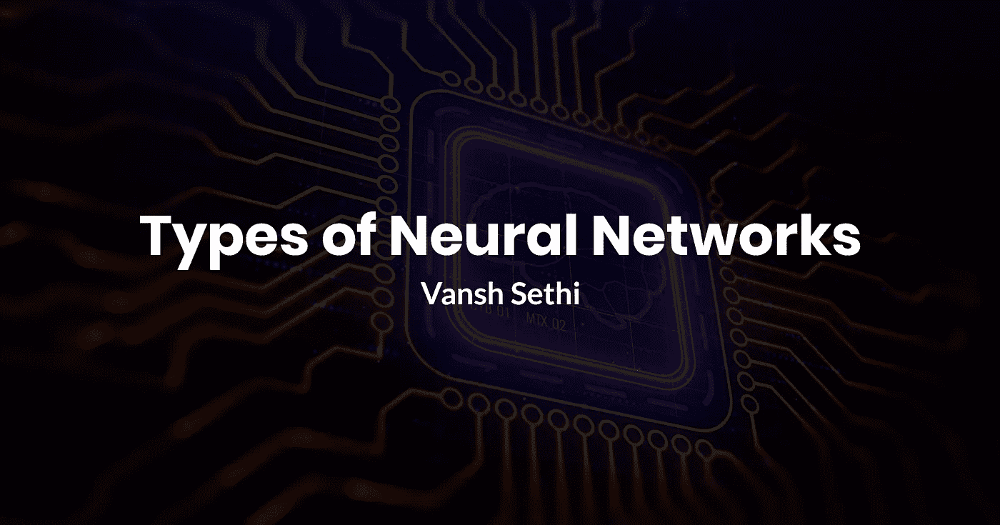
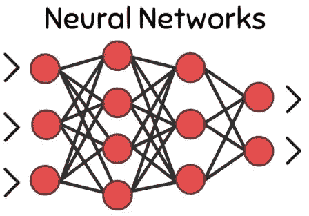
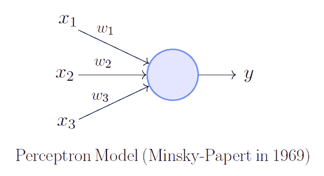
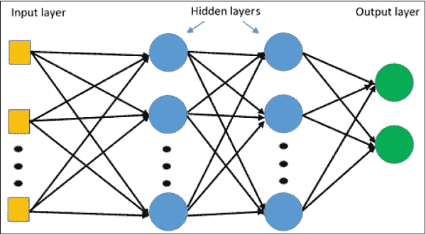
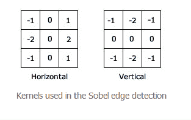
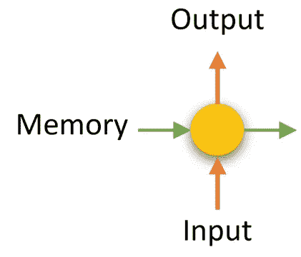
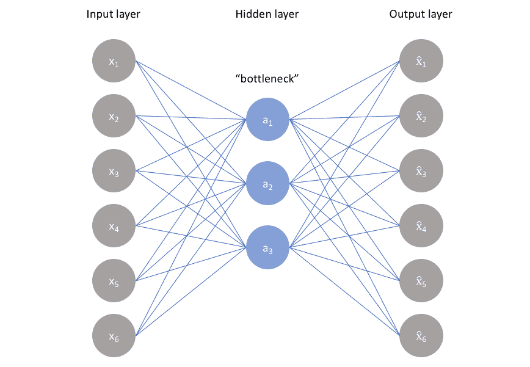

# 神经网络的类型(以及每种类型的作用！)解释道

> 原文：<https://towardsdatascience.com/types-of-neural-network-and-what-each-one-does-explained-d9b4c0ed63a1?source=collection_archive---------2----------------------->

## 有大量的神经网络具有吸引人的特性。以下是最著名的几个。

机器学习是人工智能的一个子集，它结合神经网络来创建一些我们日常使用的令人惊叹的软件。

如果你用谷歌找到这篇中型文章，你用的是谷歌的神经网络，它会根据你给的关键词对最相关的页面进行排序。如果你最近去了 Amazon.com，该网站向你推荐的所有产品都是由神经网络策划的。即使在今天，如果你使用手机，你可能会遇到一个神经网络，让你的生活变得更容易。它就在我们身边，它们都做着不同的事情，以不同的方式工作。

# *那么……什么是“神经网络”*

“神经”这个词只是大脑的另一种说法。*“那么这是一个* ***大脑*** *网络？”*本质上，完全！神经网络是我们最强大的工具——大脑的简化。它使用的**神经元**都是通过**权重**相互连接的(下图中的线)。给神经元一些数字输入，并乘以权重。权重是神经网络的核心，通过将它们更改为特定的数值，我们可以处理任何输入并获得所需的输出。神经网络只是处理数据的一种方式。数据是🔑在这里，通过各种神经网络操纵数据…我们可以建立非常强大的工具，做一些疯狂的事情！

# *感知器——最古老的&最简单的神经网络*

感知器是最古老的神经网络，创建于 1958 年。也是最简单的神经网络。由 Frank Rosenblatt 开发的感知机为神经网络的基础奠定了基础。

这个神经网络只有一个神经元，因此非常简单。它取 n 个数量的输入并乘以相应的权重。它只计算一个输出。它的缺点是缺乏复杂性，因为它只能处理一种复杂程度的数据。

## 使用案例:

*   了解人类大脑
*   针对更高级的神经网络进行扩展

# *多层感知器——什么是层？*

多层感知器(MLP)仍然是一个感知器，但是通过**层**的出现增加了复杂性。MLP 中有三种类型的图层:

## *输入图层*:

输入层就是它听起来的样子，你输入到神经网络的数据。输入数据必须是数字。这意味着你可能需要一些非数字的东西，并找到一种方法把它变成数字。在将数据输入到神经网络之前处理数据的过程被称为**数据** **处理**，通常情况下，这将是制作机器学习模型最耗时的部分。

## *隐藏图层*:

隐藏层由神经网络中的大多数神经元组成，是操纵数据以获得所需输出的核心。数据将通过隐藏层，并受到许多权重和偏见的操纵。它被称为“隐藏”层，因为与输入和输出层相反，神经网络的开发人员不会直接使用这些层。

## *输出层:*

输出层是处理神经网络中的数据的最终产品，可以表示不同的事物。通常，输出层由神经元组成，每个神经元代表一个对象，附加的数值是它是该特定对象的概率。其他时候，它可能是一个神经元输出，当给定某些输入时，它就是某个东西的值。主要思想是输出层是数据通过神经网络时的结果，也是我们试图达到的目标。

## 前馈本金:

这个想法是，我们将数字数据传递到网络中，它继续向前进行许多操作。我们向前输送数据。为了获得正确的操作，使得任何给定的输入总是产生期望的输出，需要**训练**。训练本质上是找到产生最佳结果的东西，并将它们应用到网络中。

## 使用案例:

*   计算机视觉
*   自然语言处理
*   其他神经网络的基础

# *卷积神经网络—卷积层？*

卷积神经网络仍然使用 MLP 使用的相同原理，但是该神经网络实现卷积层。值得注意的是，卷积神经网络通常用于图像和视频。

重要的是要认识到，图像只是一个数字网格，每个数字都告诉你某个像素有多强烈。知道了这是一个数字网格，我们就可以操纵这些数字来寻找图像的模式和特征。卷积层通过使用滤波器来实现这一点。

## *过滤器*

滤镜是一个定义的 N x M (N & M 代表网格的大小)的数字网格，它与原始图像相乘多次。要了解实际发生的情况，请参考动画。

过滤器在网格中移动并产生新值。这些新值可以表示图像中的边缘或线条。例如，以下面的过滤器为例:

水平过滤器试图消除垂直中心以外的值。它通过使用负值来去除边缘，使用 0 表示中心来使像素保持中性。如果过滤成功，您将能够从新值中看到一条水平线。对于刚刚反转的垂直滤波器也是如此。

在整个图像中应用过滤器后，我们可以使用合并层轻松提取过滤器发现的主要特征。在训练模型时，确定哪些数字应该出现在过滤器中。弄清楚什么是最好的数字将为整个任务带来最好的结果。

## *汇集层*

池层做他们听起来像的事情。它们将过滤器发现的最重要的特征“汇集”在一起。这是通过使用多种方法完成的。一种流行的方法是 Max Pooling，对于图像的每个过滤部分，取最大的数字并存储到新的网格中。这基本上是把最重要的特征压缩成一幅图像，以便处理成 MLP。这个过程也可以称为数据采样，使用这个过程会产生非常有希望的结果。

## *用例*

*   图像分类
*   计算机视觉
*   在图像中寻找特征/模式

# *递归神经网络——时态数据？*

我们可以用神经网络分析的数据并不完全局限于静态数据。像图像、数字、帧这些东西，都是可以自己分析的数据。然而，依赖于自身的过去实例来预测未来的数据是时态数据的例子。像股票市场数据、时间序列数据、脑波数据等总是通过使用因变量的过去实例来分析。到目前为止，提到的神经网络没有处理数据的其他状态，但是 RNNs 是解决方案。

## *状态矩阵*

rnn 通过将最后一次输出存储在自己的存储器中来记住以前的数据状态。这些被称为**状态矩阵**。它的工作方式类似于 MLP 中的普通图层，但它使用状态矩阵来计算新的输出。使用以前的输出和数据状态实质上是考虑最终输出中的数据。这对于股票市场预测和时间序列预测等应用至关重要。

## *LSTMs*

长短期记忆网络进一步扩展了将状态矩阵**保存为两种状态的思想。有长期状态和短期状态。如果一个状态持续存在于模型输出中，它将成为一个长期的状态矩阵，并且在考虑新数据时会更有分量。**

LSTM 系统在发现连续数据的模式时非常有效，是股市预测的先锋。

## *用例*

*   自然语言处理
*   股票市场预测
*   基于时间的数据预测

# *自动编码器——以压缩方式表示数据*

大多数神经网络接收数据并做出某些类型的决策。自动编码器有一个不同的任务，那就是找出一种方法来压缩数据，但保持相同的质量。

传统上，在机器学习中，附加到我们数据上的标签是不同的，并且是神经网络要产生的目标。在自动编码器中，标签与输入相同。

因此，在这种架构中，您有一个相同的输入和输出层。隐藏层比输入和输出层小(就节点而言)，被称为**【瓶颈】**。由于瓶颈变小了，被迫想办法压缩原始数据，放回输出层。这种压缩通常比传统方法更好，因为它仍然可以保持高质量。

## *用例:*

*   主要用于以较小的压缩方式表示大量数据。

# *关键要点*

> 多层感知器

*   基本神经网络
*   用于简单的任务

> 卷积神经网络

*   使用过滤器和池来查找数据中的特征
*   主要用于图像任务

> 递归神经网络

*   使用以前的数据结果来计算新的输出
*   用于时态数据

> 自动编码器

*   一种无损质量的压缩数据的新方法