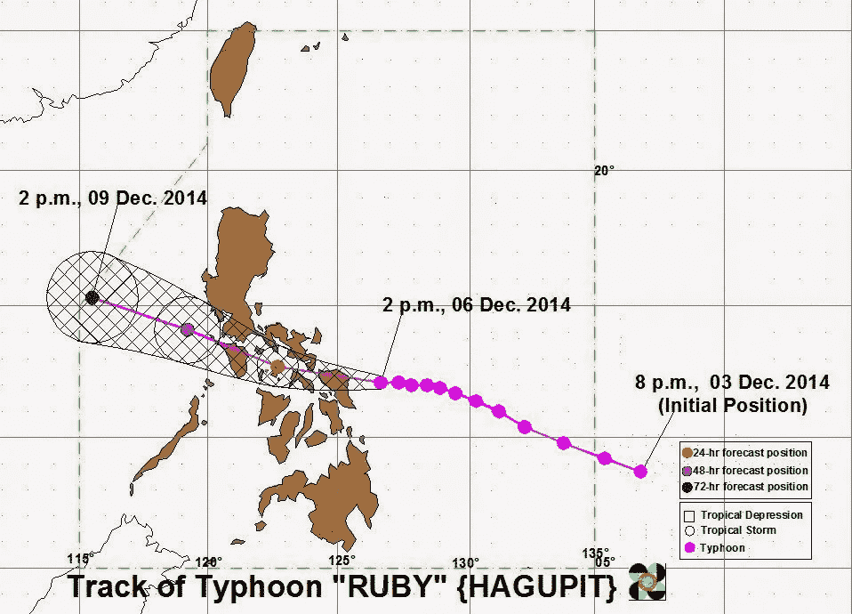
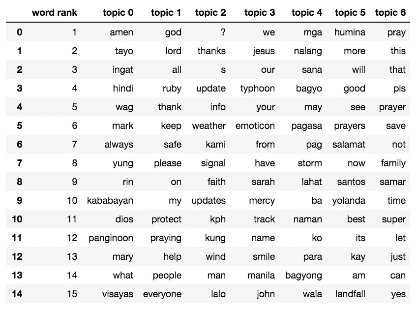
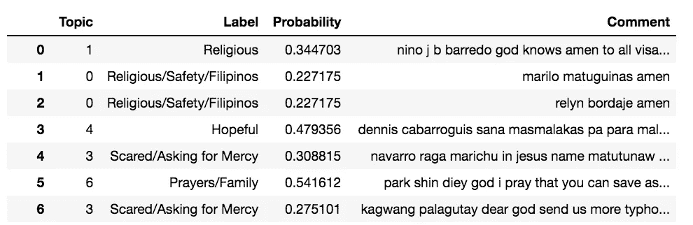
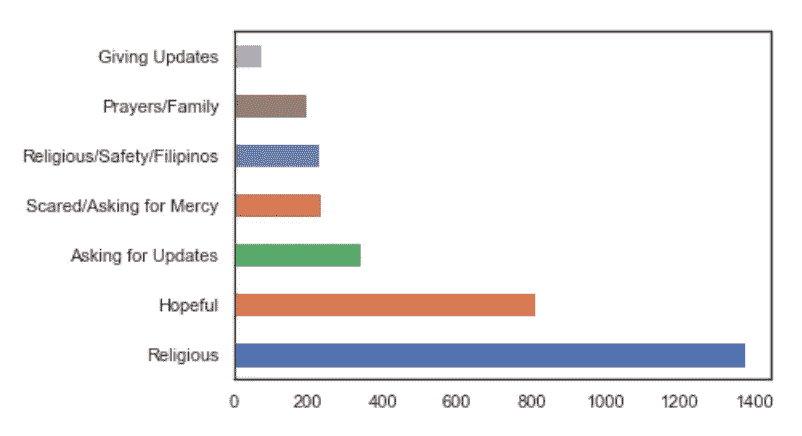
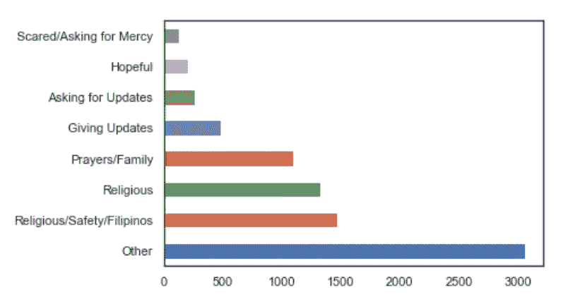

# 2014 年台风“红宝石”:情绪分析

> 原文：<https://towardsdatascience.com/typhoon-ruby-2014-a-sentiment-analysis-a1a630a95ebb?source=collection_archive---------20----------------------->

## 基于潜在狄利克雷分析的脸书评论情感分类

高中时，我和格里·巴格塔萨博士一起做过短期实习，他是菲律宾迪利曼大学环境科学和气象研究所的教授。他的项目包括发现在脸书的菲律宾人在跟踪台风“红宝石”(2014 年)时对气象局(PAGASA)发布的更新的反应。

我们从菲律宾大气、地球物理学和天文学服务管理局发布的 23 条脸书天气更新中收集了 2300 条评论，这些更新追踪了台风“鲁比”袭击菲律宾的路径。由于对 Python 一无所知，我和一个实验室伙伴(Derrick)花了两周时间费力地将这些评论逐一分类。


Derrick hard at work on our tiny laptops

# 菲律宾的台风

菲律宾的季风季节很疯狂。每年六月到八月都会带来一连串的大雨、疯狂的洪水，以及被倒下的树木和电线阻塞的道路等等。台风“红宝石”是 2014 年菲律宾最严重的台风之一，夺去了 18 条生命，916 人受伤，造成 50.9 亿菲律宾比索(1.14 亿美元)的损失。尽管该国在备灾方面取得了长足进步，但仍有许多工作要做——其中一个方面是信息传播和反馈。脸书在菲律宾是一个极其强大的工具，近 98.6%的互联网用户都在这个社交媒体平台上。因此，这是一个很好的途径，可以找到市民需要的关于台风的更新/信息，并随着台风的展开收集用户提供的任何信息。



[https://www.thesummitexpress.com/2014/12/typhoon-ruby-speeds-up-to-make-landfall-tonight-in-dolores-eastern-samar.html](https://www.thesummitexpress.com/2014/12/typhoon-ruby-speeds-up-to-make-landfall-tonight-in-dolores-eastern-samar.html)

# 方法

我们最近在课堂上讨论了主题模型，从此我的生活发生了变化(开玩笑)。但在此之前，一些数据清洗。

与菲律宾人打交道时，困难的是人们想出一堆同一个单词的缩写，以及许多其他创造性的拼写方法。例如，“thanks”的拼写是“thx”、“tnx”和“thanxs”(我妈妈也这么做)。因为模式多种多样，我把单词分类，集中在更常用的上，然后编辑它们。

我删除了 25 个最常用的词，目的是删除文章，但是像“上帝”、“主”、“阿门”和“祈祷”这样的词最终出现在列表中——我手动删除了这些词。这表明宗教和祈祷是评论中的一个主题。

然后，我使用类中的代码生成了单词集，它将每个评论总结为一个关键字及其对应计数的列表。举个例子，

```
**Comment**: '**Rosnel Amuan** lord pls help our country to be safe amen'
**Corpus**: [(58, 1), (107, 1), (61, 1), (37, 1), (86, 1), (87, 1)]
**Vocab List**: 58: 'lord', 107: 'pls', 61: 'help', 37: 'our', 86: 'country', 87: 'safe'
```

**潜在的狄利克雷分配(以及我对它的解释)**

然后我使用 Python 中的 **gensim** 包运行了潜在的狄利克雷分配(LDA)。LDA 是一种算法，旨在揭示一些文档共有的潜在主题或主题，在我们的情况下是 FB 评论。LDA 要求我们指定我们期望它生成的主题数量。我最初选择了 6，因为我们在进行手动分类时提出了六个一般主题供评论，但后来经过微调和重新运行模型，结果证明 7 产生了更明智的单词列表。

该算法首先通过随机给每个单词分配一个主题(用一个数字表示)来猜测哪些单词属于哪些主题。

然后，该算法通过计算每个可能主题的分数来更新对每个单词的猜测。分数是两个概率的乘积:

*   **#1:** 主题出现在该文档中的概率(即，基于我的文档是关于什么的，这个单词很有可能与主题 *x* 相关联吗？)
*   **#2:** 该单词属于某个主题的概率(即，基于该单词在其他文档中被分类的主题，该单词被分类为主题 *x* 的可能性大吗？)

具有最高分数的主题被分配给该单词，并且对所有单词重复这一过程，直到主题的分配不再改变(即，它们的概率已经收敛到某个后验概率)。这是因为单词对主题的分配不断翻转，直到单词最终开始为特定主题累积越来越高的分数。这个分数影响相同单词在其他文档中的分配，这又进一步增加了单词 *w* 属于其主题的概率。

**评估**

LDA 根据主题对脸书的评论进行了总结。例如，“上帝请帮助拯救我的同胞”可能被归类为 75%关于 **宗教**和 **25%关于菲律宾同胞**。我选择了构成大部分评论的主题——所以在这种情况下，评论将被归类为**关于宗教**。

然后我把它和我和德里克最初做的分类进行了比较。因为这六个分类在手动分类下被分成更具体的类别，所以我将它们汇总起来，并查看它们与模型预测的对比情况。

# 结果

该算法得出了这六组单词，每组代表一个主题:



Look at all this Taglish!

根据单词和以前的分类，我将主题分类如下:

1.  **宗教/安全/菲律宾人**:因加特(保持安全)，卡巴延(国人)，迪奥斯&潘吉诺恩(神)，玛丽(圣母玛利亚)
2.  宗教:上帝，主，保护，祈祷，帮助
3.  **请求更新**:更新，信息，天气，信号，时速，风，？(问号说了很多！)
4.  **害怕/求饶**:有，仁慈，耶稣
5.  **有希望的** : sana(有希望)，pagasa(希望)
6.  **更新**:胡米娜(减弱，如“台风减弱”)，登陆，上午，
7.  **祈祷/家庭**:祈祷、祈祷、拯救、家庭

然后生成了下表



Someone asked to send more typhoons?

综上所述，这些是我们获得的主题



# 估价

不可否认，这个模型没有我希望的那么好。这是我们之前进行的手动分类的总结



分布差异很大，分类为**其他**的评论有多个。发生这种情况是因为我们能够手动确定不属于这些一般类别的许多其他主题，但是，这些主题出现的频率不够高，模型无法充分提取它们。

在排除**其他**下的评论后，我发现该模型给出的准确率为 **48.78%** 。按主题分类，我们看到宗教评论分类更准确——因为它们有与主题相关的非常独特的关键词(“祈祷”、“主”、“潘吉诺恩”等)。)，而像**更新**或**害怕/求饶**这样的主题是由其他句子或评论使用的相同单词构成的，可能更难分类。

```
Religious:                  70.6
Prayers/Family:             67.1
Religious/Safety/Filipinos: 64.9
Hopeful:                    54.4
Asking for Updates:         45.5
Scared/Asking for Mercy:    13.6
Giving Updates:             12.7
```

# 下一步是什么

虽然这个模型没有我希望的那么好，但我希望使用其他模型(可能是嵌入)重新进行分析。主题模型在 NLP 中的应用相当惊人，我期待着将它们应用到其他数据集。

# 附录

点击查看代码