# 灰度图像的 U-Net 深度学习着色

> 原文：<https://towardsdatascience.com/u-net-deep-learning-colourisation-of-greyscale-images-ee6c1c61aabe?source=collection_archive---------11----------------------->

本文描述了使用深度学习训练神经网络从单通道灰度图像生成 3 通道彩色图像的实验。在我看来，尽管结果因主题不同而不同，但却令人震惊，因为模特会对原始主题应该是什么颜色产生幻觉。

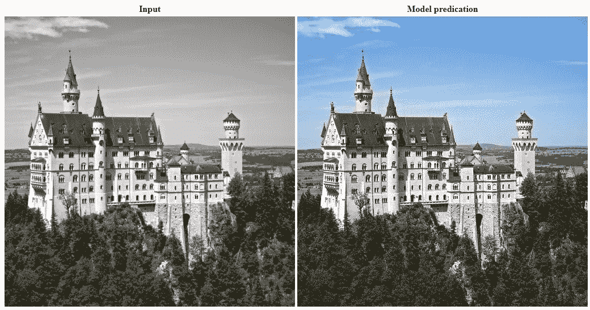

Enhancement of a Greyscale 1 channel image to a 3 channel colour image.

Div2k([https://data.vision.ee.ethz.ch/cvl/DIV2K/](https://data.vision.ee.ethz.ch/cvl/DIV2K/))训练数据集用于训练，本文中的这些图像基于 Div2k 验证集。

这是基于 Fastai 深度学习课程中建议和教授的技术。

尝试给灰度图像上色的灵感来自于一位来自 Fastai 学生/校友的 GAN critic 训练的模型，Jason Antic 和他的去灰度化模型:【https://github.com/jantic/DeOldify】T2

该方法使用以下内容:

*   一种交叉连接的 U-Net 架构，类似于 DenseNet
*   一个基于 ResNet 的编码器和一个基于 ResNet 的解码器
*   用 ICNR 初始化进行像素混洗放大
*   基于来自 VGG-16 模型的激活、像素损失和克矩阵损失的损失函数
*   从预训练的 ImageNet 模型进行迁移学习

这个模型或数学函数有超过 4000 万个参数或系数。

损失函数真正使最终模型的预测如此之好，允许模型中的可训练参数接近最佳值。这几乎与我的超分辨率实验中使用的损失函数相同。

通过使用在训练期间是静态的损失函数，而不是作为生成对抗网络(GAN)的变化，critic 允许更快地收敛到给定架构的接近最优的训练模型。

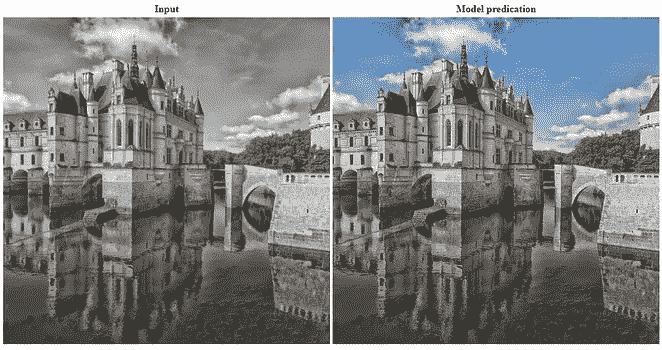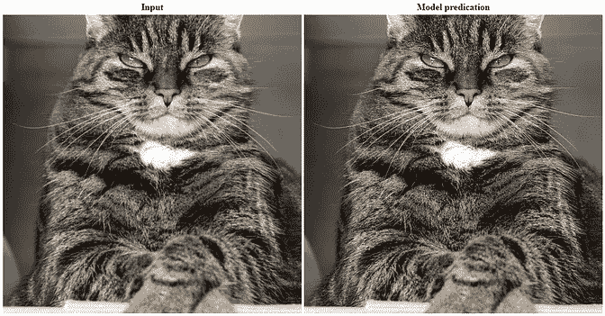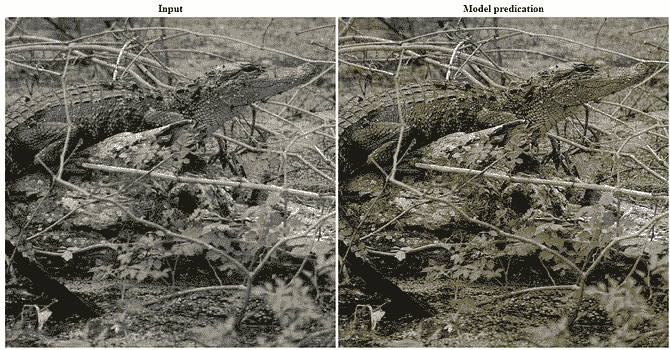

Examples of this model’s enhancement of Greyscale 1 channel images to 3 channel colour images.

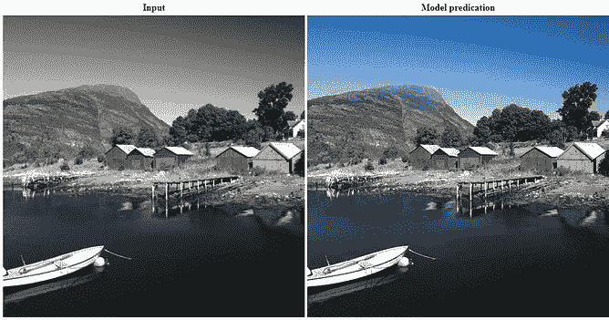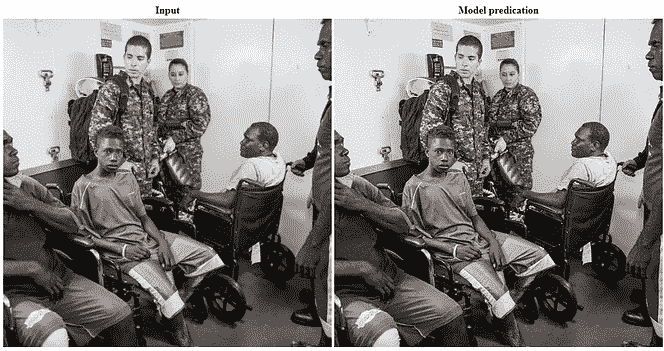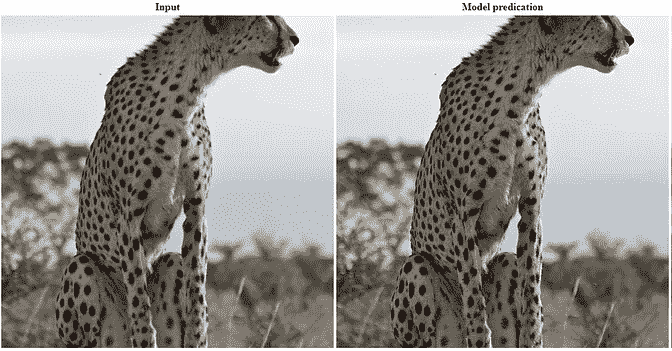

Examples of this model’s enhancement of Greyscale 1 channel images to 3 channel colour images.

# 架构细节

基于 U-Net 的学习器和特征损失函数的体系结构相当复杂，因为它是其背后的推理。由于这些是我在不同实验中使用的架构和损失函数，我将它们分成两篇文章:

基于 U-Net 的模型架构:
[https://towardsdatascience . com/u-nets-with-resnet-encoders-and-cross-connections-d8ba 94125 a2c](/u-nets-with-resnet-encoders-and-cross-connections-d8ba94125a2c)

用于训练网络的特征损失函数:[https://towardsdatascience . com/loss-functions-based-on-feature-activation-and-style-loss-2f 0 b 72 FD 32 a 9](/loss-functions-based-on-feature-activation-and-style-loss-2f0b72fd32a9)

## ResNet-34 编码器

ResNet-34 是一个 34 层 ResNet 架构，它被用作 U-Net(U 的左半部分)的下采样部分中的编码器。

## 解码器

在将 ResNet-34 编码器转换为具有交叉连接的 U-Net 的情况下，Fastai 动态 U-Net 学习器在配备有编码器架构时将自动构建 U-Net 架构的解码器端。

## 预训练编码器

对于知道如何执行图像改进的模型来说，使用预先训练的模型极大地加快了训练时间，使得模型具有需要检测和改进的特征种类的初始知识。使用在 ImageNet 上预先训练好的模型和重量几乎是最理想的。用于 pyTorch 的预训练 ResNet-34 可从卡格尔:[https://www.kaggle.com/pytorch/resnet34](https://www.kaggle.com/pytorch/resnet34)获得

# 培训详情

## 资料组

Div2k 数据集提供了 800 幅训练图像和 100 幅验证图像。在训练过程中，我使用了一定百分比的训练图像进行验证，使 Div2K 验证集与训练过程完全隔离，以避免模型在训练过程中观察到这些图像时出现任何错误。

每个图像被缩减到一个通道以用作灰度输入，原始的 RGB 图像被用作目标/背景真相。

通过以下方式进一步扩充了训练数据:

*   随机选择农作物
*   水平翻转图像
*   调整图像的照明
*   添加透视扭曲

训练过程从如上所述的模型开始:使用基于在 ImageNet 上预训练的 VGG-16 架构的损失函数结合像素损失和 gram 矩阵，在 ImageNet 上预训练的基于 ResNet-34 架构的 U-Net。

## 特征损失函数

损失函数使用来自 VGG-16 模型的激活、像素损失和克矩阵损失。

像素损失是预测中每个像素颜色与目标/地面真实颜色接近程度的简单像素比较。

来自 VGG-16 模型的激活允许损失函数确定特征看起来是否正确，在这种情况下，它们看起来颜色是否正确。

克损失着眼于所生成图像的艺术风格、其特征以及在颜色方面预测与原始图像的接近程度。

这些要素的组合允许损失函数检查上下文中要素的细节和样式，以改进模型的预测。

这允许模型学习令人信服的颜色，以应用于构成生成的预测图像的特征。

关于这个损失函数的更多细节在我的关于特征和风格损失函数的文章中有描述:[https://towardsdatascience . com/loss-functions-based-on-feature-activation-and-style-loss-2f 0 b 72 FD 32 a 9](/loss-functions-based-on-feature-activation-and-style-loss-2f0b72fd32a9)

## 训练模特的头部和骨干

这里使用的三种方法特别有助于训练过程。这些是渐进调整大小、冻结然后解冻主干中权重的梯度下降更新和区别学习率。

该模型的架构分为两部分，主干和头部。

主干是 U-Net 的左侧部分，是基于 ResNet-34 的网络的编码器/下采样部分。头部是 U-Net 的右侧部分，即网络的解码器/上采样部分。

主干已经基于在 ImageNet 上训练的 ResNet34 预先训练了权重，这就是迁移学习。

头部需要训练其权重，因为这些层的权重被随机初始化以产生期望的最终输出。在最开始，网络的输出基本上是像素的随机变化，而不是使用 ICNR 初始化的像素混洗子卷积，其被用作网络的解码器/上采样路径中每个升级的第一步。

网络主干中的权重被冻结，因此最初只训练头部中的权重。

## 渐进调整大小

首先在大量较小的映像上进行训练，然后扩展网络和训练映像，这样会更快。与对 512 px x 512px 的图像进行着色相比，对 64px x 64px 的图像进行着色要容易得多，而且对更大的数据集进行着色要快得多。这被称为渐进式调整大小，它也有助于模型更好地概括，因为它看到更多不同的图像，不太可能过度拟合。

对于每个图像训练大小，模型被训练，直到训练损失和验证损失的改善趋于平稳，然后图像数据维度加倍。动态 U-Net 学习器处理较大的输入和输出图像。

## 64 x 64 像素图像的训练着色

较大的批量加速了小图像的训练。

训练了 50 个周期后，损失才停止显著改善。随着模型需要更多的像素/数据来预测特征的颜色和着色风格，损失停止显著改善。

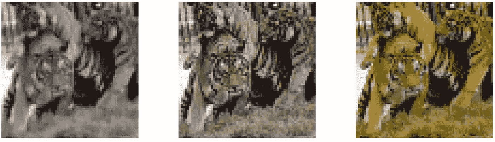

Training colourising 64 x 64 pixel images

## 128 x 128 像素图像的训练着色

在 25 个训练周期后，损失停止显著改善。同样，随着模型需要更多的像素/数据，损失停止显著改善。训练图像尺寸加倍。

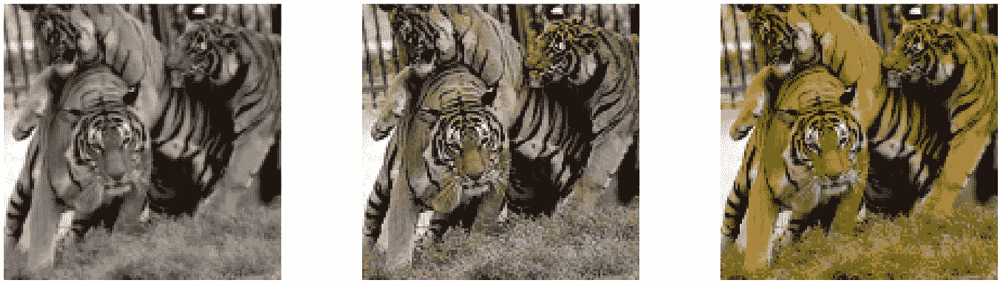

Training colourising 128 x 128 pixel images

## 256 x 256 像素图像的训练着色

在 10 个训练周期之后，损失停止显著改善，训练大小增加到 512×512 像素。同样，随着模型需要更多的像素/数据，损失停止显著改善。

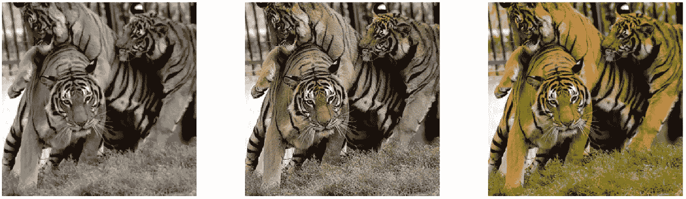

Training colourising 256 x 256 pixel images

## 512 x 512 像素图像的训练着色

在 10 个训练周期之后，由于 GPU 内存限制，损失停止显著改善，增加训练图像大小完成，并且训练转移到解冻整个网络的权重。

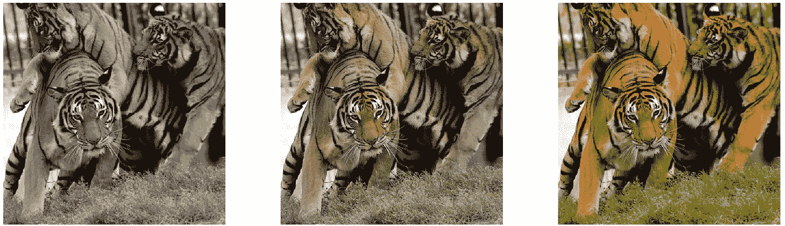

Training colourising 512 x 512 pixel images

## 在 512x512 像素图像上训练，其中主干权重未冻结

现在，经过训练，骨架顶部的头部允许模型学习用骨架中预先训练的知识做一些不同的事情。

然后，整个模型的权重被解冻，并且该模型以判别学习率进行训练。这些学习率在第一层组中要小得多，然后在第二层组中增加，最后一层组在头部再次增加。

在 10 次训练后，损失停止显著改善。

预测中的颜色看起来更接近目标/实际情况。

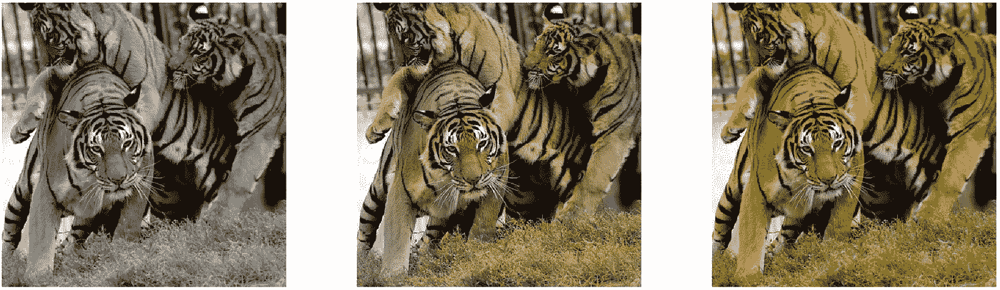

Training on 512 x 512 pixel images with the backbone weights unfrozen

# 结果

此结果来自在 Div2K 验证集上对训练模型进行的预测。

如果颜色与目标和地面真实不匹配的结果令人信服，则不一定是坏的预测，如果目标/地面真实图像不可比较，则可能被认为是正确的。

这种算法没有办法知道图像中的原始颜色。该模型本质上可以将其训练的知识与基于图像中的内容、图像中的特征和图像中的风格的上下文的信息进行比较。然后模型会想象或产生幻觉，想象那里应该是什么颜色。

## 良好的结果

在这里，模型已经对目标图像/地面真实中的颜色产生了几乎完美的预测。

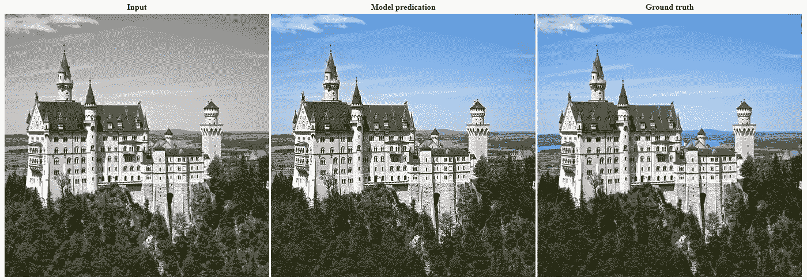

Examples of this model’s enhancement of a Greyscale 1 channel image to a 3 channel colour image.

该模型已经对目标图像/地面真实中的颜色产生了非常好且令人信服的预测。

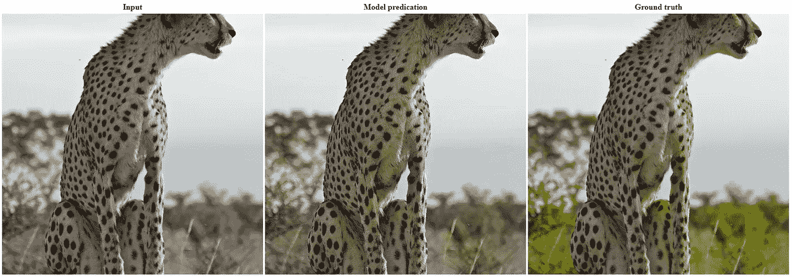

Examples of this model’s enhancement of a Greyscale 1 channel image to a 3 channel colour image.

这个预测真的让我印象深刻，看起来很真实。该模型不能预测一些颜色，伪装色是错误的，但它们在孤立的地面真实/目标下看起来令人信服。

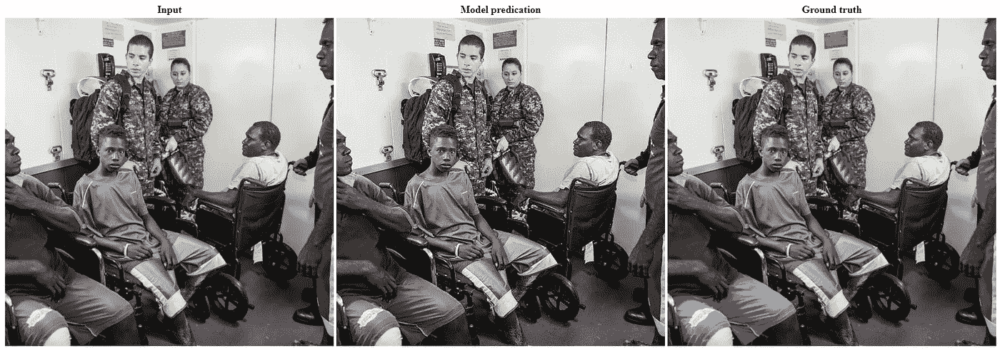

Examples of this model’s enhancement of a Greyscale 1 channel image to a 3 channel colour image.

另一个非常有说服力的颜色预测。在我看来，预测看起来与实际情况/目标一样真实，即使颜色不太匹配:

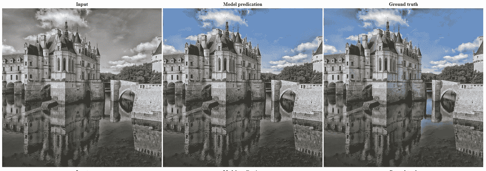

Examples of this model’s enhancement of a Greyscale 1 channel image to a 3 channel colour image.

这里的头发颜色和肤色很接近。

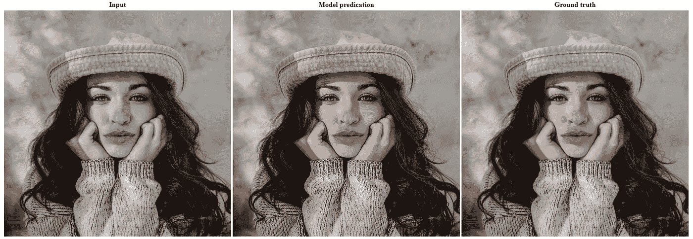

Examples of this model’s enhancement of a Greyscale 1 channel image to a 3 channel colour image.

该模型预测了猫的皮毛会有很深的颜色，眼睛的颜色也很准确。

Examples of this model’s enhancement of a Greyscale 1 channel image to a 3 channel colour image.

除了金属屋顶的金色色调，几乎完美的颜色预测。

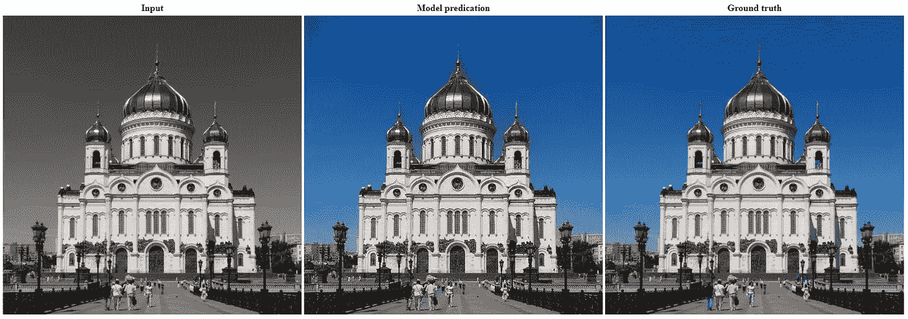

Examples of this model’s enhancement of a Greyscale 1 channel image to a 3 channel colour image.

## 有趣的结果

即使颜色明显是错误的，如果你看不到地面的真相，这个预测也会看起来令人信服。

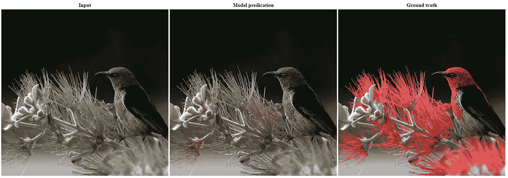

Examples of this model’s enhancement of a Greyscale 1 channel image to a 3 channel colour image.

同样，一些颜色显然是错误的，但是模型怎么知道一朵花是什么颜色呢？如果你看不到事实真相，预测看起来会很有说服力。

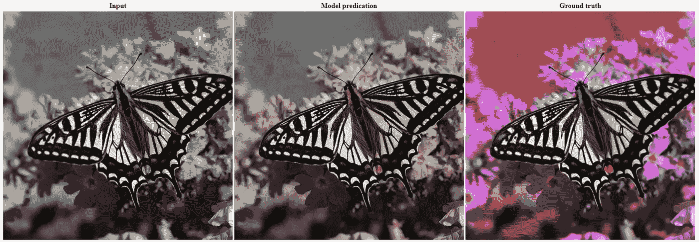

Examples of this model’s enhancement of a Greyscale 1 channel image to a 3 channel colour image.

## 糟糕的结果

太多时候，论文和文章显示的是最佳结果，而不是模型表现不佳的地方。强调模型的局限性和/或不能很好概括的地方是很重要的。

总的来说，模型对绿色的预测缺乏鲜明的色调，这一点在这里非常明显。绿色非常柔和，通常缺乏对比。如果黄色/绿色更饱和，预测会更接近。

Examples of this model’s enhancement of a Greyscale 1 channel image to a 3 channel colour image.

在这里，模型没有真正创造任何颜色，预测类似于一个褐色的图像。

Examples of this model’s enhancement of a Greyscale 1 channel image to a 3 channel colour image.

# 结论

这种方法在高比例的验证图像上非常有效，几乎总是产生令人信服的彩色图像。

对一个人来说，做出这些着色是如此的辛苦和缓慢，在我看来，我要说这比人类的尝试要好，可能被认为是超人。

## 更多的结果

这里有一些来自模型和基本事实的预测，以便与介绍性的例子进行比较。

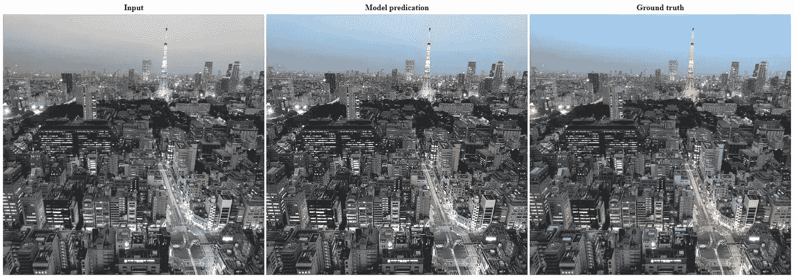

Examples of this model’s enhancement of a Greyscale 1 channel image to a 3 channel colour image.

预测与目标几乎无法区分:

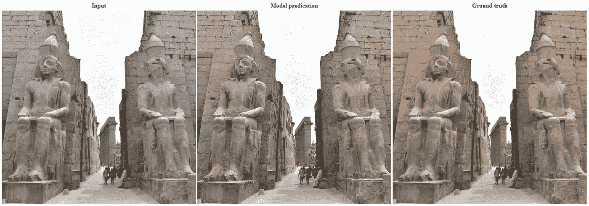

Examples of this model’s enhancement of a Greyscale 1 channel image to a 3 channel colour image.

同样，预测与目标几乎无法区分:

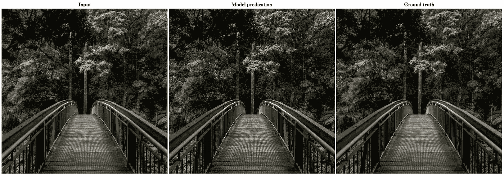

Examples of this model’s enhancement of a Greyscale 1 channel image to a 3 channel colour image.

虽然预测与目标的颜色不同，但它非常有说服力:

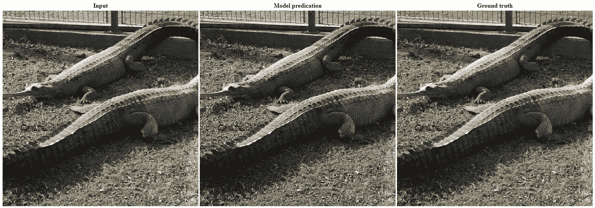

Examples of this model’s enhancement of a Greyscale 1 channel image to a 3 channel colour image.

该模型已经计算出图像中有水，但不知道水可能是绿色而不是蓝色。天空近乎完美。

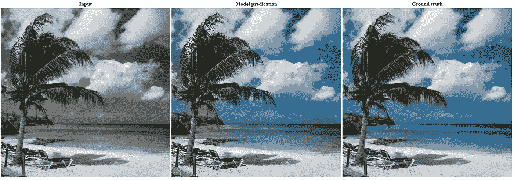

Examples of this model’s enhancement of a Greyscale 1 channel image to a 3 channel colour image.

狐狸非常接近目标/地面的真实情况，天空和草地没有正确的颜色，尽管它们的颜色看起来很有说服力。

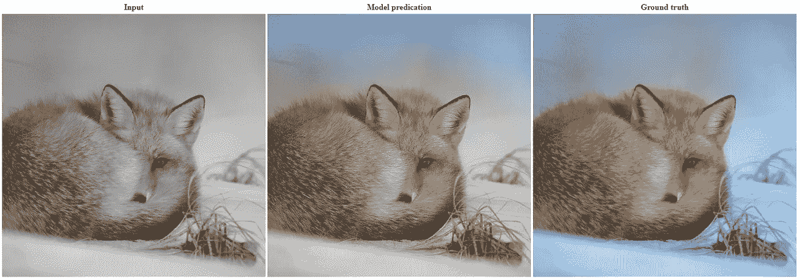

Examples of this model’s enhancement of a Greyscale 1 channel image to a 3 channel colour image.

狮子皮毛颜色的变化并不完美，草/植物的绿色缺乏对比，悬停生成的预测图像相当有说服力。

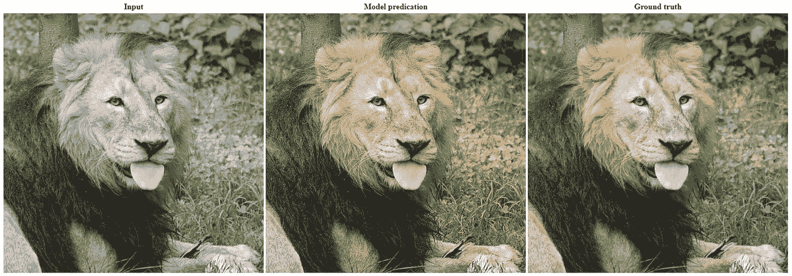

Examples of this model’s enhancement of a Greyscale 1 channel image to a 3 channel colour image.

这是一张复杂的图像，许多物体都被正确着色，其他的则令人信服:

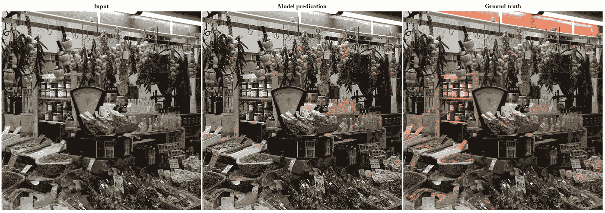

Examples of this model’s enhancement of a Greyscale 1 channel image to a 3 channel colour image.

对原始主题/目标中的颜色的另一个令人信服的预测。

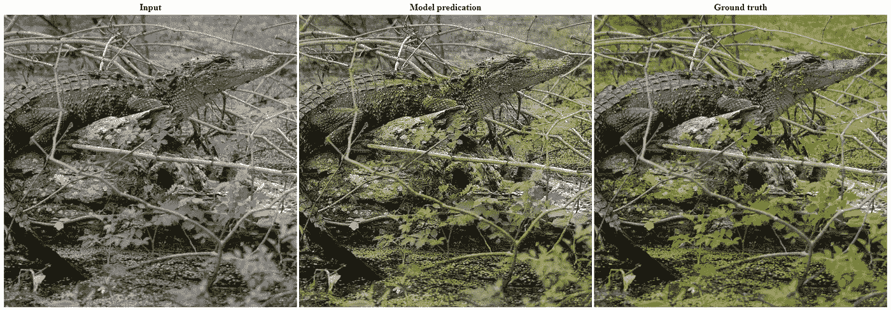

Examples of this model’s enhancement of a Greyscale 1 channel image to a 3 channel colour image.

除了一些小细节，如浮标和船舱的木材颜色，大部分颜色都预测正确。

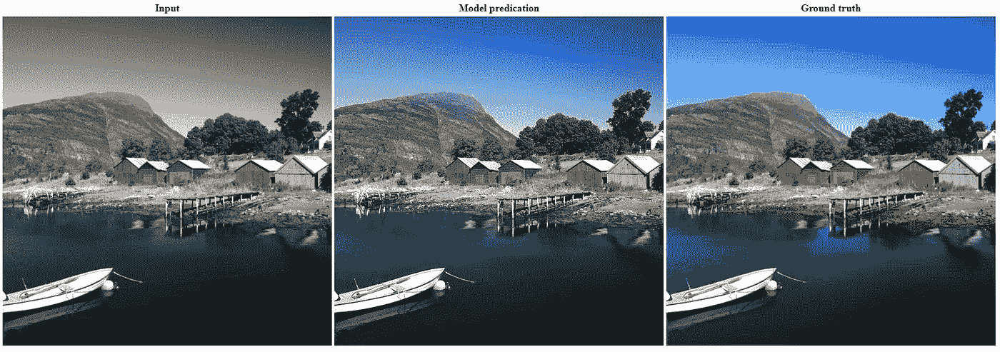

Examples of this model’s enhancement of a Greyscale 1 channel image to a 3 channel colour image.

## 技术细节

这个模型是由 Fastai 动态 U-Net 学习者[https://docs.fast.ai/vision.models.unet.html](https://docs.fast.ai/vision.models.unet.html)创建的

这使用了 Fastai 软件库、PyTorch 深度学习平台和 CUDA 并行计算 API。

所有训练都是在 Nvidia Tesla K80 GPU 上进行的，内存为 12GB，从开始到结束不到 12 个小时，逐步调整大小。

# 法斯泰

感谢 Fastai 团队，没有你们的课程和软件库，我怀疑我是否能够进行这些实验并了解这些技术。