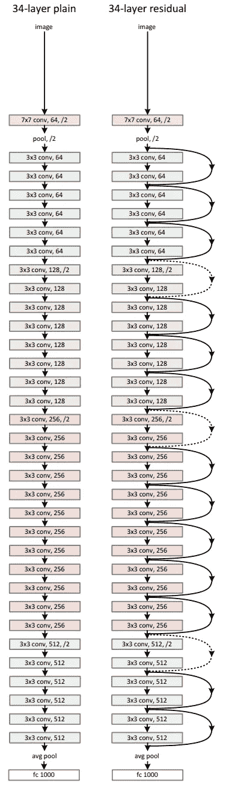
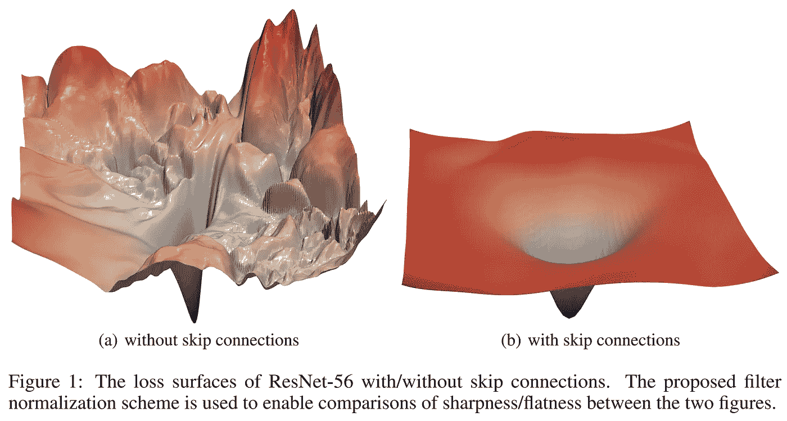
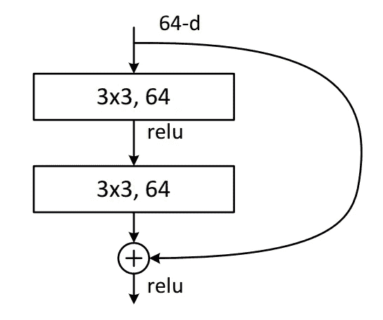
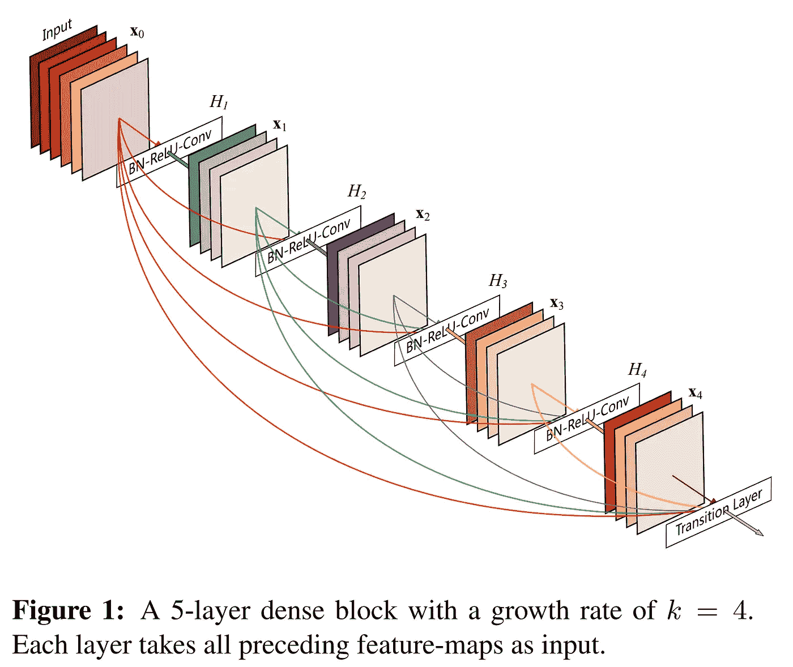
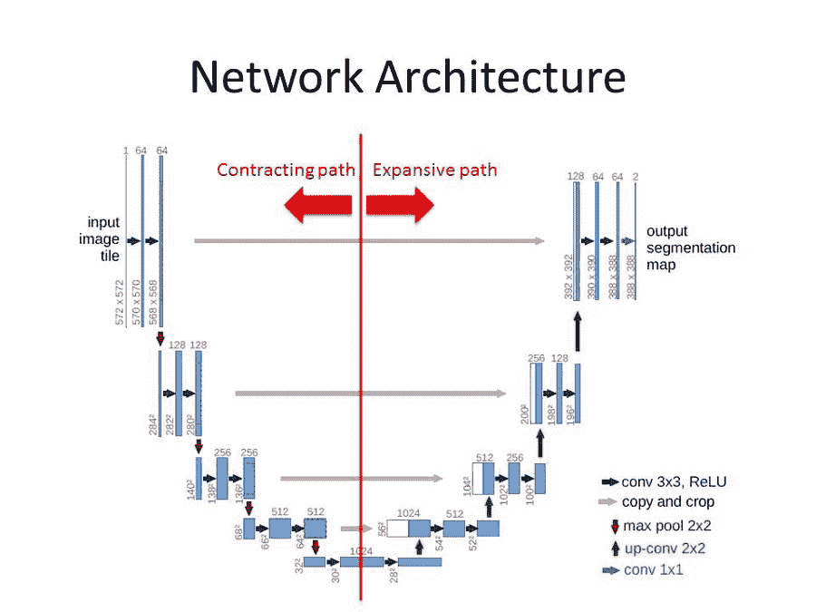
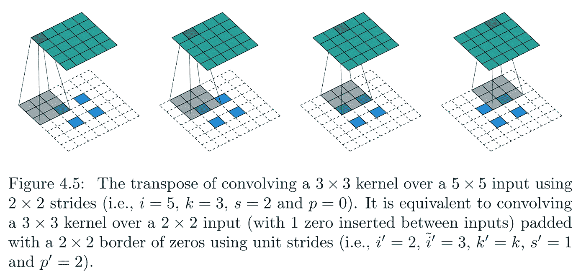
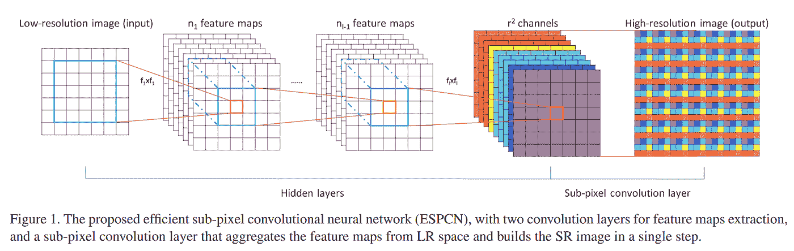

# 带 ResNet 编码器和交叉连接的 u 型网络

> 原文：<https://towardsdatascience.com/u-nets-with-resnet-encoders-and-cross-connections-d8ba94125a2c?source=collection_archive---------1----------------------->

我已经将这一点从我关于超级分辨率的文章中分离出来([https://towards data science . com/deep-learning-based-Super-Resolution-without-use-a-gan-11 C9 bb 5b 6 CD 5](/deep-learning-based-super-resolution-without-using-a-gan-11c9bb5b6cd5))，以更加通用，因为我在其他基于 U-Net 的模型上使用了相同的架构来预测自动协作的数据。

这是基于 Fastai 深度学习课程中演示和教授的技术。

Fastai 软件库打破了很多复杂深度学习入门的障碍。由于它是开源的，很容易定制和替换你的架构元素，以适应你的预测任务。

Fastai U-Net 学习者提供了实现这些技术的基础:【https://docs.fast.ai/vision.models.unet.html

该体系结构使用以下各项，下面将进一步解释每项内容:

*   一种交叉连接的 U-Net 架构，类似于 DenseNet
*   一个基于 ResNet 的编码器和一个基于 ResNet 的解码器
*   用 ICNR 初始化进行像素混洗放大

# 剩余网络

ResNet 是一种卷积神经网络(CNN)架构，由一系列残差块(ResBlocks)组成，如下所述，通过跳跃连接将 ResNet 与其他 CNN 区分开来。

当最初设计 ResNet 时，它以显著的优势赢得了当年的 ImageNet 竞争，因为它解决了渐变消失的问题，即随着层数的增加，训练速度变慢，准确性没有提高，甚至变得更差。正是网络跳过连接完成了这一壮举。

这些在下面的图表中显示，并在描述 ResNet 中的每个 ResBlock 时进行更详细的解释。

Left 34 Layer CNN, right 34 Layer ResNet CNN. Source Deep Residual Learning for Image Recognition: [https://arxiv.org/abs/1512.03385](https://arxiv.org/abs/1512.03385)

## 残余块(ResBlocks)和密集块

如果卷积网络在靠近输入的层和靠近输出的层之间包含较短的连接，则卷积网络可以训练得更深入、更准确、更有效。

如果您将损失面(模型预测的变化损失的搜索空间)可视化，这看起来就像下图中左侧图像所示的一系列山丘和山谷。最低的损失就是最低点。研究表明，一个较小的最优网络可以被忽略，即使它是一个较大网络的一部分。这是因为损失面太难导航。这意味着在一个模型中增加许多深层，会使预测变得更糟。

Loss surface with and without skip connections. Source: Visualising loss space in Neural networks: [https://arxiv.org/abs/1712.09913](https://arxiv.org/abs/1712.09913)

一个非常有效的解决方案是在网络各层之间增加交叉连接，允许在需要时跳过大部分。这创建了一个损失表面，看起来像右边的图像。这对于用最佳权重训练模型以减少损失要容易得多。

A ResBlock within a ResNet. Source: Deep Residual Learning for Image Recognition: [https://arxiv.org/abs/1512.03385](https://arxiv.org/abs/1512.03385)

每个 ResBlock 从其输入有两个连接，一个经过一系列卷积、批量规格化和线性函数，另一个连接跳过这一系列卷积和函数。这些被称为身份连接、交叉连接或跳过连接。两个连接的张量输出相加在一起。

## 稠密连接的卷积网络和稠密块

在 ResBlock 提供张量相加的输出的情况下，这可以被改变为张量连接。随着每个交叉/跳跃连接，网络变得更加密集。然后，ResBlock 变成 DenseBlock，网络变成 DenseNet。

这允许计算跳过架构中越来越大的部分。

DenseBlocks within a DenseNet. Source: Densely Connected Convolutional Networks: [https://arxiv.org/pdf/1608.06993.pdf](https://arxiv.org/pdf/1608.06993.pdf)

由于串联，DenseBlocks 与其他架构相比会消耗大量内存，非常适合较小的数据集。

# u 型网

U-Net 是为生物医学图像分割开发的卷积神经网络架构。已经发现 u-网对于输出与输入大小相似并且输出需要该量的空间分辨率的任务非常有效。这使得它们非常适用于创建分割蒙版和图像处理/生成，如超分辨率或着色。

当卷积神经网络通常与用于分类的图像一起使用时，使用一系列每次减小网格大小的两个步长的卷积，图像被获取并向下采样到一个或多个分类中。

为了能够输出与输入大小相同或更大的生成图像，需要有一个上采样路径来增加网格大小。这使得网络布局类似于 U 形，U 形网络下采样/编码器路径形成 U 形的左侧，上采样/解码器路径形成 U 形的右侧

对于上采样/解码器路径，几个转置卷积实现这一点，每个卷积在现有像素之间和周围添加像素。基本上执行下采样路径的相反过程。上采样算法的选项将在后面进一步讨论。

请注意，该模型的基于 U-Net 的架构也有交叉连接，这将在后面详细说明，这些不是原始 U-Net 架构的一部分。

A U-Net network architecture. Source: [http://deeplearning.net/tutorial/_images/unet.jpg](http://deeplearning.net/tutorial/_images/unet.jpg)

原来的研究可在这里:[https://arxiv.org/abs/1505.04597](https://arxiv.org/abs/1505.04597)

## 上采样/转置卷积

网络的解码器/上采样部分(U 的右手部分)中的每个上采样需要在现有像素周围以及现有像素之间添加像素，以最终达到期望的分辨率。

这个过程可以从论文“深度学习卷积算法指南”中可视化如下，其中在像素之间添加零。蓝色像素是原始的 2x2 像素扩展到 5x5 像素。在外部添加 2 个像素的填充，并在每个像素之间添加一个像素。在这个例子中，所有新像素都是零(白色)。

Adding pixels around and between the pixels. Source: A guide to convolution arithmetic for deep learning: [https://arxiv.org/abs/1603.07285](https://arxiv.org/abs/1603.07285)

这可以通过使用像素的加权平均(使用双线性插值)对新像素进行一些简单的初始化来改善，否则会不必要地使模型更难学习。

在这个模型中，它使用了一种改进的方法，称为像素混洗或带有 ICNR 初始化的亚像素卷积，这导致像素之间的间隙被更有效地填充。这在论文“使用高效亚像素卷积神经网络的实时单幅图像和视频超分辨率”中有所描述。

Pixel shuffle. Source: Real-Time Single Image and Video Super-Resolution Using an Efficient Sub-Pixel Convolutional Neural Network, source: [https://arxiv.org/abs/1609.05158](https://arxiv.org/abs/1609.05158)

像素混洗以因子 2 放大，使图像的每个通道中的维度加倍(在网络的该部分的当前表示中)。然后执行复制填充以在图像周围提供额外的像素。然后，执行平均池以平滑地提取特征并避免由许多超分辨率技术产生的棋盘图案。

在添加了这些新像素的表示之后，随着路径继续通过网络的解码器路径，随后的卷积改善了这些像素内的细节，然后再进行另一个步骤并使维度加倍。

## u 网和精细图像细节

当使用唯一的 U-Net 架构时，预测往往缺乏细节，为了帮助解决这个问题，可以在网络的块之间添加交叉或跳过连接。

不是像在 ResBlock 中那样每两个卷积添加一个跳过连接，而是跳过连接从下采样路径中相同大小的部分跨越到上采样路径。这些是上图中显示的灰色线条。

原始像素通过跳过连接与最终的 ResBlock 连接，以允许在知道输入到模型中的原始像素的情况下进行最终计算。这导致输入图像的所有细节都在 U-Net 的顶部，输入几乎直接映射到输出。

U-Net 块的输出被连接起来，使它们更类似于 DenseBlocks 而不是 ResBlocks。但是，有两个跨距卷积可以减小网格大小，这也有助于防止内存使用量增长过大。

# ResNet 编码器

ResNet 可用于 U-Net 的编码器/下采样部分(U 的左半部分)。

在我的模型中，我使用了一个 ResNet-34，一个 34 层的 ResNet 架构，因为 Fastai 的研究人员发现这非常有效，比 ResNet-50 训练起来更快，使用的内存更少。

# 解码器

在将 ResNet-34 编码器转换为具有交叉连接的 U-Net 的情况下，Fastai U-Net 学习器在配备有编码器架构时将自动构建 U-Net 架构的解码器端。

# 预训练编码器

为了使图像生成/预测模型知道如何有效地执行其预测，如果使用预训练的模型，将大大加快训练时间。然后，该模型具有需要检测和改进的特征种类的初始知识。当照片被用作输入时，使用在 ImageNet 上预先训练的模型和权重是一个很好的开始。

# 损失函数

当使用这种 U-Net 架构进行图像生成/预测时，使用基于来自预训练模型(例如 VGG)的激活和格拉姆矩阵损失的损失函数非常有效。关于特征和风格损失函数的更多细节可以在我的文章中找到:[https://towardsdatascience . com/loss-functions-based-on-feature-activation-and-style-loss-2f 0 b 72 FD 32 a 9](/loss-functions-based-on-feature-activation-and-style-loss-2f0b72fd32a9)

# 法斯泰

感谢 Fastai 团队，没有你们的课程和软件库，我怀疑我是否能够学习这些技术。