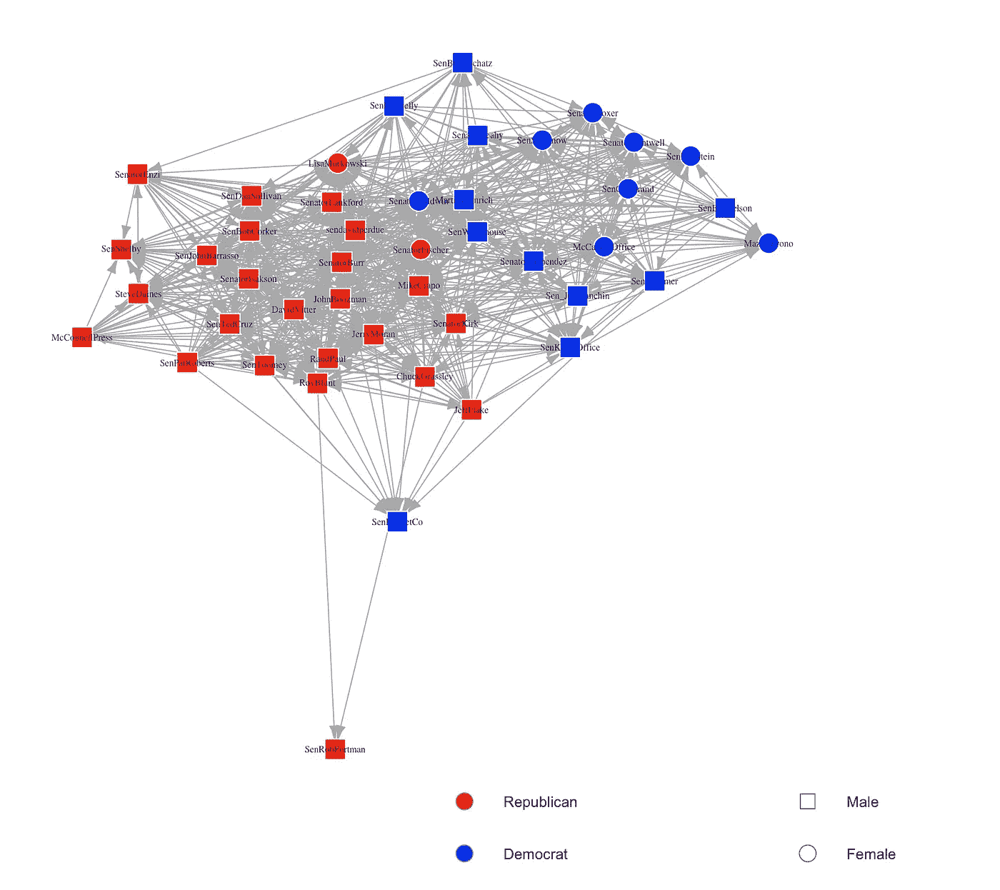
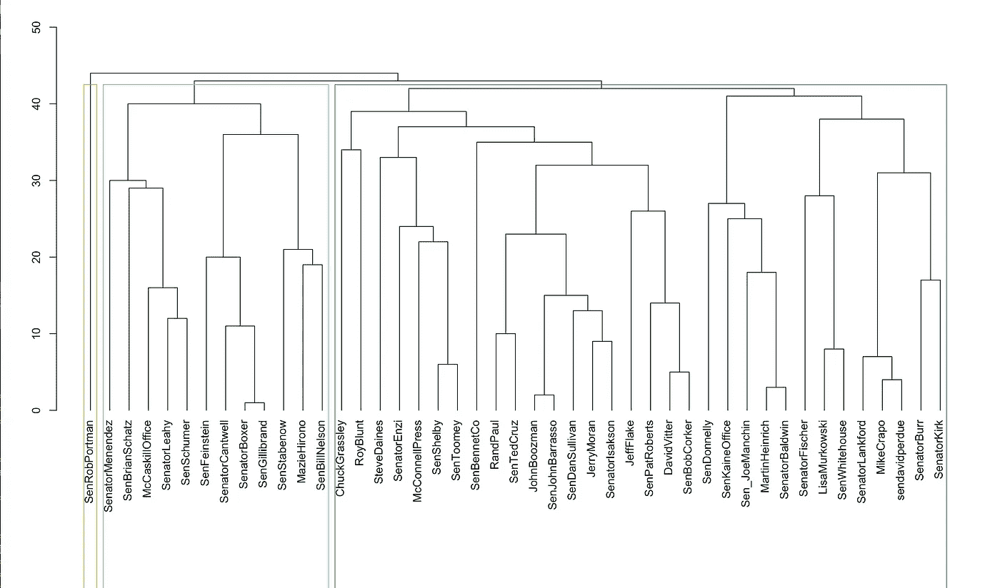
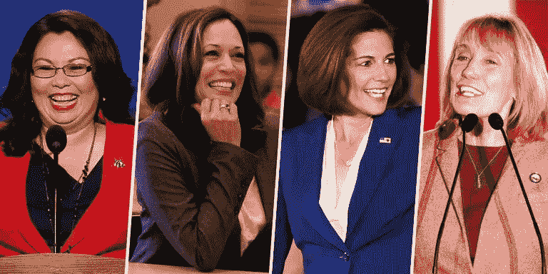
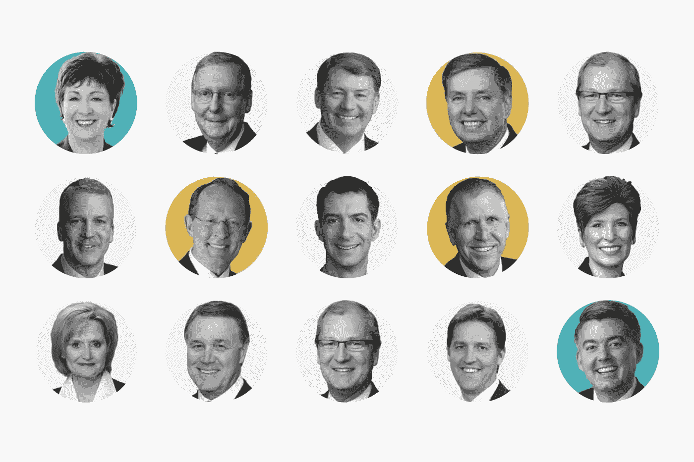

# 美国参议员的社交网络——基于 Twitter 的分析

> 原文：<https://towardsdatascience.com/u-s-senators-social-network-analysis-based-on-twitter-147a5df968c7?source=collection_archive---------9----------------------->

随着“触网”的不断扩大，社交媒体已经融入现代生活的方方面面，成为我们学习、工作、交友、获取信息不可或缺的方式。除了作为日常交流工具，社交媒体在这个时代被赋予了更大的意义——政治家们将社交媒体作为自我宣传的重要阵地。

本文用 ***图论*** 和 ***网络分析*** 来描绘美国参议员在推特上的社交地图，分析他们之间的相互关系以及他们在这个社交网络中的地位。

**The U.S. Senators’ Social Network on Twitter**

根据社交网络计算，美国参议员中的边数为 852，这意味着这 45 名参议员中有 852 个联系，其中包括 26 名共和党人和 19 名民主党人。

 [## 美国参议院(@USSenate) |推特

### 美国参议院最新推文(@USSenate)。我们国家联盟的活象征。华盛顿哥伦比亚特区

twitter.com](https://twitter.com/USSenate) 

度数最高的节点是@sendavidperdue，它属于美国参议员大卫·珀杜。也就是说，45 名参议员中有 39 名追随过大卫·珀杜，他在社交网络中最有声望，受欢迎程度也最高。

 [## 大卫·珀杜(@sendavidperdue) |推特

### 来自大卫·珀杜的最新推文(@sendavidperdue)。美国参议员大卫·珀杜的官方推特账户

twitter.com](https://twitter.com/sendavidperdue) 

小大卫·阿尔弗雷德·濮培德(David Alfred Schmidt Jr .)，美国商人和政治家，自 2015 年以来一直担任佐治亚州的初级美国参议员。濮培德赢得了共和党初选，击败了民主党人米歇尔·纳恩。

出度最高的节点是@ChuckGrassley，属于美国参议员查克·格拉斯利。结果显示，查克关注了 45 名参议员中的 30 名，他在社交网络中处于最中心的位置，并获得了最高的合群度。

 [## ChuckGrassley(@ ChuckGrassley)| Twitter

### ChuckGrassley 的最新推文(@ChuckGrassley)。美国参议员。家庭农场主。新哈特福德的永久居民…

twitter.com](https://twitter.com/ChuckGrassley) 

查克·格拉斯利是美国政治家，爱荷华州资深参议员，也是共和党成员。他第一次当选于 1980 年，现在是他在参议院的第七个任期。

介数最高的节点是@RoyBlunt，属于美国参议员 RoyBlunt。显示@RoyBlunt 在另外两个参议员节点之间沿最短路径充当桥梁的次数为 79.33342，这意味着 RoyBlunt 对其他参议员之间通信的控制力是最高的。

 [## 罗伊·布朗特参议员(@RoyBlunt) |推特

### 罗伊·布朗特参议员的最新推文(@RoyBlunt)。美国参议员罗伊·布朗特的官方账户。很荣幸代表…

twitter.com](https://twitter.com/RoyBlunt) 

罗伊·迪恩·布朗特是美国政治家，也是来自密苏里州的美国资深参议员，自 2011 年以来一直担任参议员。他也是共和党成员，曾在美国众议院任职，并担任密苏里州国务卿。

网络的互惠性为 0.4964706，也就是说，这些参议员之间的双向互动比例为 49.647%，这意味着近一半的参议员在推特上相互关注。

**Community Detection of U.S. Senators on Twitter**

社区检测结果显示，美国参议员中存在三个社区。共和党议员罗布·波特曼(Rob Portman)的 Twitter 账号是@SenRobPortman，他自己也组建了一个社区(黄色部分)。最有可能的原因是，罗布·波特曼在推特上没有关注任何其他参议员，只有两名参议员关注他。

 [## 罗布·波特曼(@senrobportman) |推特

### 罗布·波特曼的最新推文(@senrobportman)。来自七叶树州的美国参议员。俄亥俄州

twitter.com](https://twitter.com/senrobportman?lang=en) 

第二个群体，以蓝色显示，由 12 名参议员组成，他们都是民主党人。合理的解释可能是，所有 12 名参议员都持有相同的政治立场，并且彼此密切互动。

另一个有趣的事情是，第二个社区包含 5 名男性和 7 名女性，这意味着根据 35 名男性和 10 名女性的总数，整个女性参议员的 70%在这个社区。也就是说，第二社区可能是一个女性领导力比较明显的地方。

**Female Senators** (Image Credit to [Marie Claire](https://www.marieclaire.com/culture/news/a25342/new-female-us-senators/))

第三个社区，用绿色显示，由 32 名参议员组成，包括 25 名共和党人和 7 名民主党人，这也可以用同样的理由来解释——政治立场。第三选区的七位民主党参议员是— **马丁·海因里希** (@ [马丁·海因里希](https://twitter.com/MartinHeinrich?lang=en))、**迈克尔·贝内特** (@ [森本内科](https://twitter.com/SenBennetCOgspp?lang=en))、**乔·唐纳利** (@ [森多内利](https://twitter.com/SenDonnelly?lang=en))、**蒂姆·凯恩** (@ [森凯恩办公室](https://twitter.com/timkaine))、**谢尔登·怀特豪斯** (@

在这个社区的 32 名参议员中，只有 3 名是女性，这意味着第三社区是男性话语权占主导地位的地方。

**Republican Senators 2019** (Image Credit to [The Washington Post](https://www.washingtonpost.com/r/2010-2019/WashingtonPost/2019/01/15/National-Politics/Graphics/promo-shutdown-politics-whip-0115.jpg))

基于社区发现的结果，我们可以做出这样的假设:政党的选择和性别之间可能存在某种联系。