# BigQuery 中的优步数据集:旧金山周围的行驶时间(以及您所在的城市)

> 原文：<https://towardsdatascience.com/uber-datasets-in-bigquery-driving-times-around-sf-and-your-city-too-9ad95baa6bfe?source=collection_archive---------15----------------------->

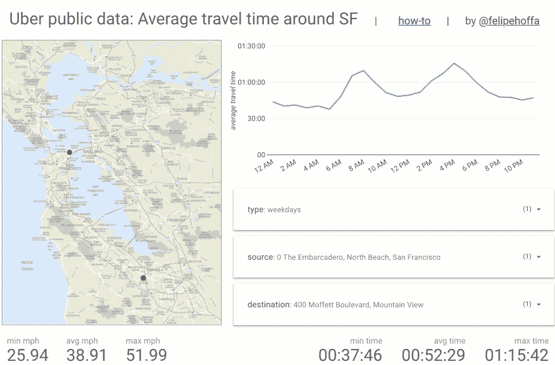

Interactive travel times dashboard around the SF Bay Area. Powered by BigQuery, Data Studio, and Uber’s worldwide movement data.

## 优步一直在向他们的公共数据程序添加新的城市——让我们把它们载入 BigQuery。我们将利用最新的新功能:原生 GIS 功能、分区、集群和带有 BI 引擎的快速仪表板。

首先让我们来玩一下交互式仪表板，我们将在下面研究加载步骤和故障排除。注意，您可以使用这些步骤将任何其他城市加载到 BigQuery 中！[互动数据工作室仪表盘](https://datastudio.google.com/open/1rGk5wVZHgNZEv7XRhN18zM2tWbUDrQDL):

Play with the [interactive Data Studio dashboard](https://datastudio.google.com/open/1rGk5wVZHgNZEv7XRhN18zM2tWbUDrQDL).

# 第一步:从优步获取数据

我们可以在[优步运动的公共数据网站](https://movement.uber.com/explore/san_francisco/travel-times/)找到几个城市的数据。在这里，我将下载一些旧金山旅行时间数据集:

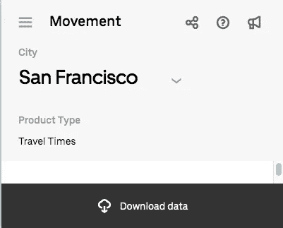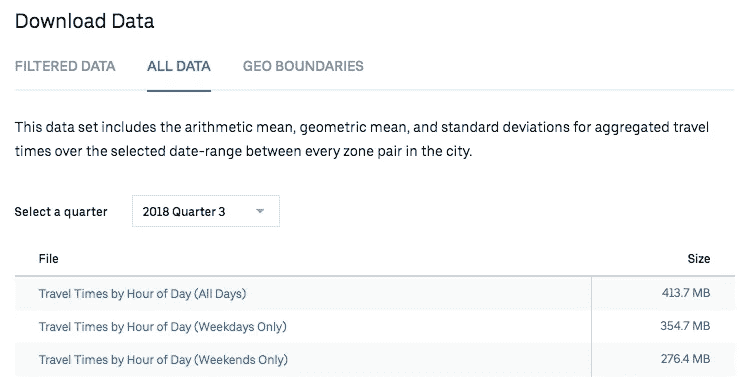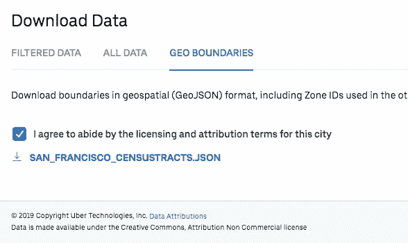

Downloading Uber’s public data for [San Francisco travel times](https://movement.uber.com/explore/san_francisco/travel-times)

# 步骤 2:加载到 BigQuery 中

一旦我们有了文件，加载数据 CSV 就很简单了:

```
bq load --autodetect \
  fh-bigquery:deleting.uber_sf_censustracts_201803_all_hourly \
  san_francisco-censustracts-2018-3-All-HourlyAggregate.csvbq load --autodetect \
  fh-bigquery:deleting.uber_sf_censustracts_201803_weekdays_hourly \
  san_francisco-censustracts-2018-3-OnlyWeekdays-HourlyAggregate.csvbq load --autodetect \
  fh-bigquery:deleting.uber_sf_censustracts_201803_weekends_hourly \
  san_francisco-censustracts-2018-3-OnlyWeekends-HourlyAggregate.csv
```

然而，地理边界文件将带来一些挑战。它们是标准的 GeoJSON 文件，但是我们必须在加载到 BigQuery 之前对它们进行处理:

1.  使用`jq`将 GeoJSON 文件转换为新的行分隔的 JSON 文件。
2.  加载新的。json 文件作为 CSV 文件导入 BigQuery。
3.  解析 BigQuery 中的 JSON 行以生成原生 GIS 几何。

```
jq -c .features[] \
  san_francisco_censustracts.json > sf_censustracts_201905.jsonbq load --source_format=CSV \
  --quote='' --field_delimiter='|' \
  fh-bigquery:deleting.sf_censustracts_201905 \
  sf_censustracts_201905.json row
```

对于步骤 3，我们可以解析 BigQuery 中加载的行:

```
CREATE OR REPLACE TABLE `fh-bigquery.uber_201905.sf_censustracts`
ASSELECT FORMAT('%f,%f', ST_Y(centroid), ST_X(centroid)) lat_lon, *
FROM (
  SELECT *, ST_CENTROID(geometry) centroid
  FROM (
    SELECT 
      CAST(JSON_EXTRACT_SCALAR(row, '$.properties.MOVEMENT_ID') AS INT64) movement_id
      , JSON_EXTRACT_SCALAR(row, '$.properties.DISPLAY_NAME') display_name
      , ST_GeogFromGeoJson(JSON_EXTRACT(row, '$.geometry')) geometry
    FROM `fh-bigquery.deleting.sf_censustracts_201905` 
  )
)
```

从 [Lak Lakshmanan](https://medium.com/u/247b0630b5d6?source=post_page-----9ad95baa6bfe--------------------------------) 和 [Michael Entin](https://medium.com/u/d6fd5605cebd?source=post_page-----9ad95baa6bfe--------------------------------) 中找一些替代品(JavaScript，ogr2ogr)加载这个[栈溢出回复](https://stackoverflow.com/a/24253853/132438)中的 GeoJSON 数据。

# 步骤 3:为性能和效率按摩数据

现在我们在 BigQuery 中有了两个表，让我们处理数据以划分主表，创建本地 BQ GIS 几何列，并将所有内容连接在一起:

让我们创建我们的主表。该表将包含工作日、周末和总体统计数据，并且我们将添加一些人口普查区域数据以使其更易于可视化和理解。为了提高效率，我们将按季度对其进行分区，并按 stat 和旅行起始地的类型进行聚类。

我还会计算一些额外的数据:区域间的平均距离和给定距离的速度。请注意，拥有这些统计信息会使查询运行速度比我们跳过它们时慢得多:

```
CREATE OR REPLACE TABLE `fh-bigquery.uber_201905.sf_hourly`
PARTITION BY quarter 
CLUSTER BY table_source, source, destination
-- don't partition/cluster if using BQ w/o credit cardASSELECT *, distance * 0.000621371192 / geometric_mean_travel_time * 3600 speed_mph
FROM (
  SELECT * EXCEPT(geo_b, geo_c),  (ST_DISTANCE(geo_b, geo_c)+ST_MAXDISTANCE(geo_b, geo_c))/2 distance
  FROM (
    SELECT a.*,  SPLIT(_TABLE_SUFFIX, '_')[OFFSET(0)] table_source
      , b.display_name source  
      , c.display_name destination
      , b.lat_lon sourceid_lat_lon  
      , CAST(SPLIT(b.lat_lon, ',')[OFFSET(0)] AS FLOAT64) sourceid_lat  
      , CAST(SPLIT(b.lat_lon, ',')[OFFSET(1)] AS FLOAT64) sourceid_lon  
      , c.lat_lon dstid_lat_lon
      , CAST(SPLIT(c.lat_lon, ',')[OFFSET(0)] AS FLOAT64) dstid_lat
      , CAST(SPLIT(c.lat_lon, ',')[OFFSET(1)] AS FLOAT64) dstid_lon  
      , DATE('2018-07-01') quarter
      , COUNT(*) OVER(PARTITION BY sourceid, dstid) source_dst_popularity
      , COUNT(*) OVER(PARTITION BY dstid) dst_popularity
      , b.geometry geo_b, c.geometry geo_c
    FROM `fh-bigquery.deleting.uber_sf_censustracts_201803_*` a
    JOIN `fh-bigquery.uber_201905.sf_censustracts` b
    ON a.sourceid=b.movement_id
    JOIN `fh-bigquery.uber_201905.sf_censustracts` c
    ON a.dstid=c.movement_id
  )
)
```

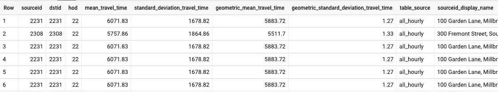

# 步骤 4:查询和可视化

我用 Data Studio 创建了一个交互式仪表板。请注意，由于我们新的 [BigQuery BI 引擎，它的运行速度非常快。](https://cloud.google.com/bi-engine/docs/overview)但是你也可以运行你自己的查询！

例如，旧金山最糟糕的目的地和到达旧金山机场的时间:

```
SELECT ROUND(geometric_mean_travel_time/60) minutes
  , hod hour, ROUND(distance*0.000621371192,2) miles
  , destination 
FROM `fh-bigquery.uber_201905.sf_hourly`
WHERE table_source='weekdays'
AND quarter='2018-07-01'
AND source LIKE '100 Domestic Terminals Departures Level%' 
AND destination LIKE '%San Francisco%'
AND (distance*0.000621371192)>10
ORDER BY 1 DESC
LIMIT 20
```

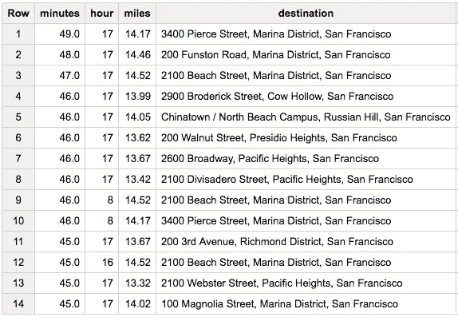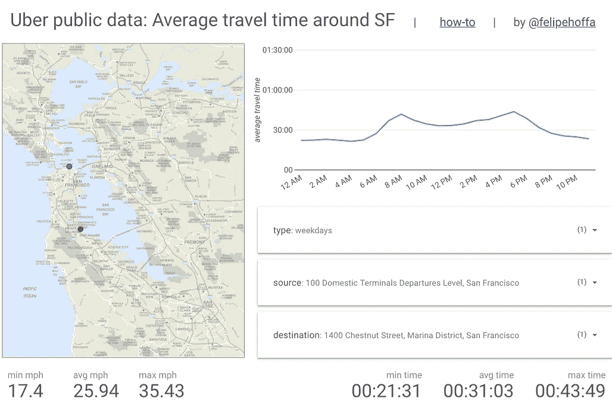

The worst destinations in San Francisco by time to travel starting at the SFO airport. Avoid going to the Marina at 5pm — it will take you 45 minutes on a weekday.

从旧金山到旧金山的最佳旅行地点和时间:

```
SELECT ROUND(geometric_mean_travel_time/60) minutes
  , hod hour, ROUND(distance*0.000621371192,2) miles
  , destination 
FROM `fh-bigquery.uber_201905.sf_hourly`
WHERE table_source='weekdays'
AND quarter='2018-07-01'
AND source LIKE '100 Domestic Terminals Departures Level%' 
AND destination LIKE '%San Francisco%'
AND (distance*0.000621371192)>10
ORDER BY 1 
LIMIT 20
```

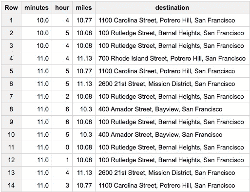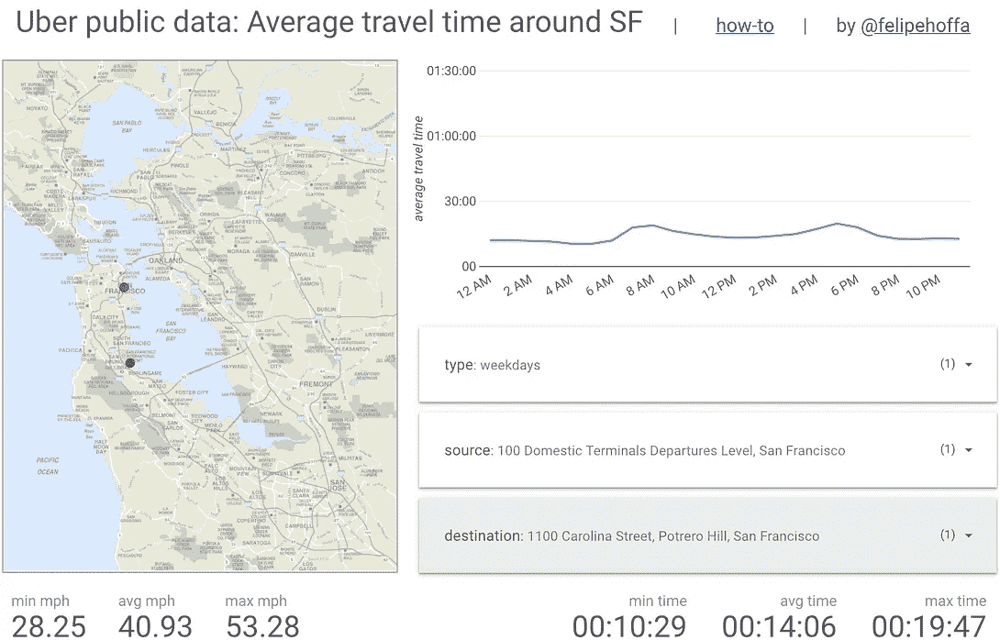

You can get from SFO to Potrero Hills in 10 minutes… at 5am.

从旧金山到奥克兰时，平均时间的最大变化(截至`stddev`)为:

```
SELECT destination 
  , STDDEV(geometric_mean_travel_time) stddev
  , COUNT(*) c
FROM `fh-bigquery.uber_201905.sf_hourly`
WHERE table_source='weekdays'
AND quarter='2018-07-01'
AND source LIKE '100 Domestic Terminals Departures Level%' 
AND destination LIKE '%Oakland%'
AND (distance*0.000621371192)>10
GROUP BY destination
HAVING c=24
ORDER BY stddev DESC
LIMIT 20
```

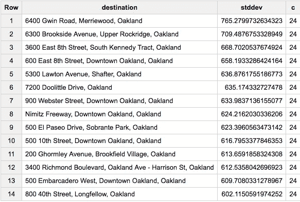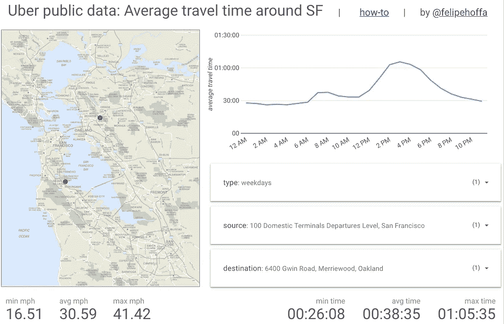

Going from SFO to Gwin Road in Oakland might take you 30 minutes, or double that at peak time.

# 轮到你玩了

在 BigQuery 中找到[共享数据集。](https://bigquery.cloud.google.com/table/fh-bigquery:uber_201905.sf_hourly)

加载[更多城市](https://movement.uber.com/cities?lang=en-US)——优步不断向他们的共享集合添加更多数据！

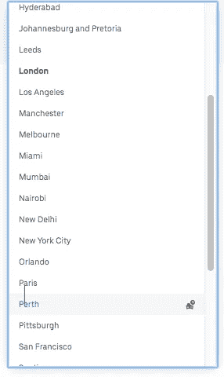

Some of the cities Uber is sharing data for.

# 后续步骤

想要更多的故事？查看我的[媒体](http://medium.com/@hoffa/)，[关注我的推特](http://twitter.com/felipehoffa)，订阅[reddit.com/r/bigquery](https://reddit.com/r/bigquery)。试试 big query——每个月你都可以免费获得一个完整的 TB 级分析。

> 优步的数据许可:数据是在知识共享，署名非商业许可下提供的。[数据属性](https://movement.uber.com/attribution?lang=en-US)
> 
> 背景图:[http://extras . SF gate . com/img/pages/travel/maps/SF bay _ STD . gif](http://extras.sfgate.com/img/pages/travel/maps/sfbay_std.gif)

[](/when-will-stack-overflow-reply-how-to-predict-with-bigquery-553c24b546a3) [## 堆栈溢出何时回复:如何用 BigQuery 预测

### 当你最后发布一个关于栈溢出的问题时，一个漫长的等待就开始了。有人会回答你的问题吗？会不会…

towardsdatascience.com](/when-will-stack-overflow-reply-how-to-predict-with-bigquery-553c24b546a3)