# 优步评论文本分析

> 原文：<https://towardsdatascience.com/uber-reviews-text-analysis-11613675046d?source=collection_archive---------12----------------------->

## 探索性分析，词汇袋，逻辑回归


[Source](https://unsplash.com/photos/7nrsVjvALnA)

# 介绍

他的项目概述了一个使用词袋和逻辑回归的文本挖掘分类模型。我们将尝试理解优步文本评论和游乐设备评级之间的关系。如果您对非结构化数据分析相对陌生，但有一些统计和/或其他分类经验，这是一个很好的起点。

**数据源**:用户 [Purvank](https://www.kaggle.com/purvank) 的 [Kaggle](https://www.kaggle.com/purvank/uber-rider-reviews-dataset)

# 目录

1.  初步分析
2.  格式化/转换文本
3.  逻辑回归
4.  测试/结论

# 初步分析

## 输入数据

首先，让我们引入数据并可视化数据框架:

```
#importing modules
import pandas as pd
import numpy as np
import seaborn as sns
%matplotlib inline
import matplotlib.pyplot as plt
import random#pulling in data
df = pd.read_csv(r'C:\Users\Andrew\Desktop\Python Text Analysis\Uber_Ride_Reviews.csv')
df
```

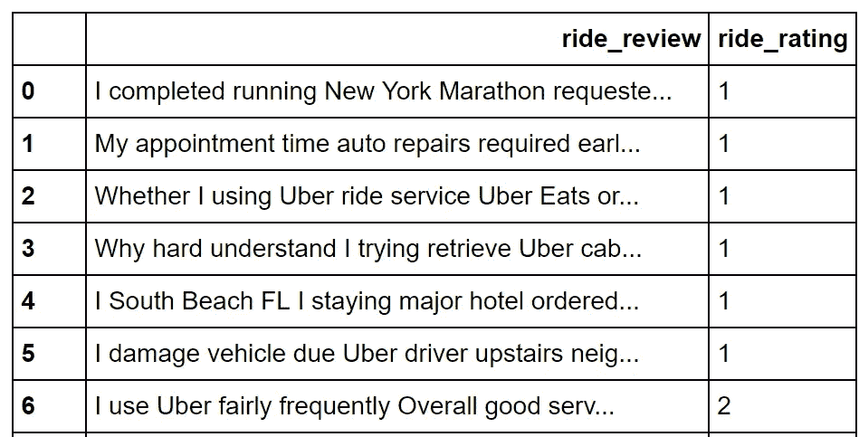

这是一个简单的数据集。我们有“骑行回顾”文本栏和“骑行评级”栏(范围从 1 到 5，最低评级和最高评级)。用户写下这些文字评论来描述他们的体验，分类 5 星评级总结了这一点。

## 基本统计

让我们检查一下。describe()方法来查看我们正在处理的实例数量和其他基本统计数据:

```
df.describe()
```

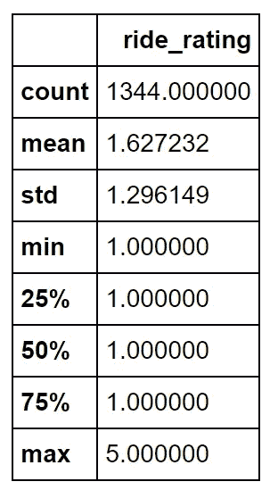

看来优步车手在这个样本中表现不佳。均值是 1.62 的评分，75%的标记是 1 星评论！这告诉我们有不成比例的 1 星评论。希望我们可以通过建立一个模型来深入了解这一点。

## 模型的目的

提到这一点，让我们重申我们将建立的词汇袋/逻辑回归模型的效用:

*   我们将能够衡量未来文本评论的情绪，并将它们分为“好”或“坏”的类别。
*   我们将能够找出对评级情绪有重大影响的特定词语。这些信息对优步来说可能是一笔财富(如果用于他们的整个内部数据集，而不是我们拥有的这个小样本)。例如，单词“rude”可能有一个负系数，促使我们的分类器将该评论标记为不好。单词“great”可能有一个正系数，促使我们的分类器将该评论标记为好。 目标是发现。我们不知道哪些有趣的话可能会对情绪产生影响，这就是有趣的地方。“伟大”这个词比“可怕”更重要吗？这是积极的还是消极的？很多类似这样的问题，都会用我们的模型来回答。

## 零检查

接下来，让我们检查数据集中的空值:

```
#checking for nulls
null_count = df.isnull().sum()
null_count
```

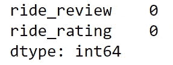

这次没有。如果我们有一些空值，我们需要探索如何处理它们。关于这个主题有很多好的资源，你可以[研究](/data-cleaning-with-python-and-pandas-detecting-missing-values-3e9c6ebcf78b)。

## 分布

接下来，让我们将数据的评级分布可视化:

```
#seperating by groups
groups = df.groupby('ride_rating').count()
Values = groups.ride_review
colors = ['r', 'g', 'b', 'c', 'm']#making bar plot
plt.bar(([1,2,3,4,5]), Values, color= colors)
plt.title('Rating Distribution')
plt.xlabel('Rating')
plt.ylabel('Review Quantity')
plt.show()
```

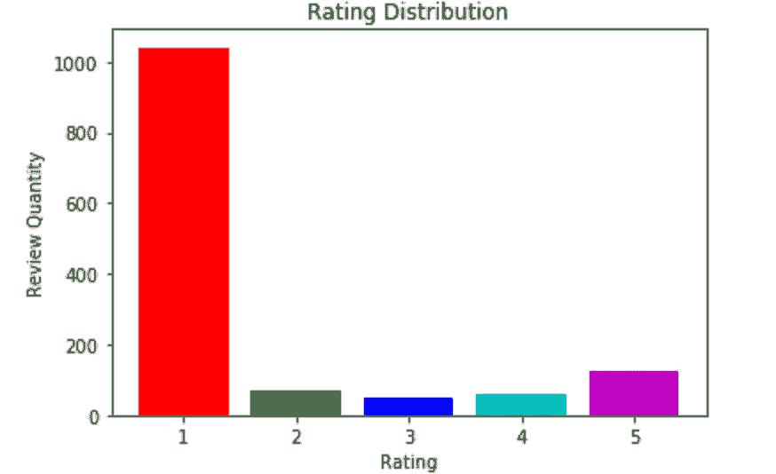

> 正如我们之前发现的，这个样本中有很多 1 星评论。

为了稍后执行逻辑回归，我们需要找出一种方法来将这 5 个评级类别转换为二元类(1 和 0)。记住，逻辑回归只处理“非此即彼”的目标变量。将星级划分为二进制等级的最佳方式(在我看来)是:

*   将低于 3 颗星的评分设为 0 级(负面情绪)
*   将高于 3 的评分设为 1 级(积极情绪)
*   删除 3 星评分。三颗星是中性的，不提供任何情绪洞察。

因此，让我们创建一个新列，删除 3 颗星评级，并创建一个新列，将其他评级分为两类:

```
#deleting all instances with ride_rating = 3
df = df[df.ride_rating != 3]#separating by groups
groups = df.groupby('ride_rating').count()
Values = groups.ride_review
colors = ['r', 'g', 'b', 'c']#making bar plot
plt.bar(([1,2,4,5]), Values, color= colors)
plt.title('Rating Distribution')
plt.xlabel('Rating')
plt.ylabel('Review Quantity')
plt.show()
```

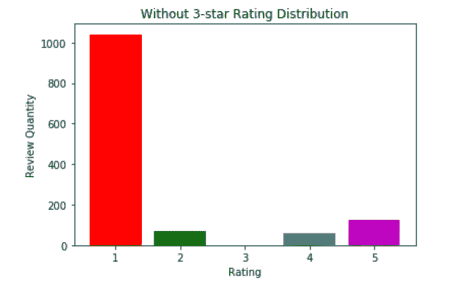

```
#creating new binary_class column
df['binary_class'] = np.where(df['ride_rating'] > 3, 1, 0)
df
```

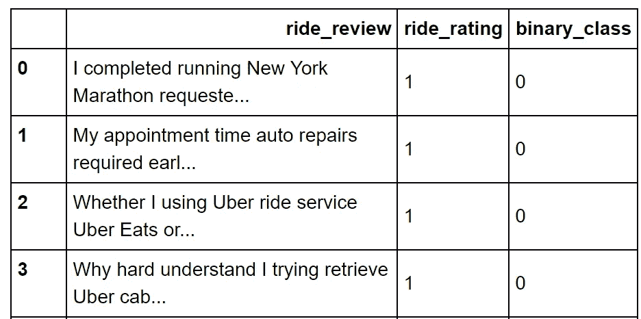

我们准备好了！让我们准备好课文。

# 格式化/转换文本

## 训练/测试分割

这个过程的第一步是将我们的数据分成训练集和测试集。我们将从训练数据中创建我们的模型，并保存一些实例，以便稍后进行测试。我们用 sklearn 来洗牌和分牌。在不干扰参数的情况下，它应该将我们的数据分成 75%的训练和 25%的测试。

通过调用 X_train.shape，我们可以检查这一点。此外，让我们打印一份随机回顾来验证它是否有效，并提醒我们自己我们在做什么。

```
#splitting into train and test
from sklearn.model_selection import train_test_split
X_train, X_test, y_train, y_test = train_test_split(df['ride_review'], df['binary_class'], random_state = 0)#setting random number between 1 and 1000
number = random.randint(1,1000)#printing random training text and X_train shape
print ('Random Review:')
print(' ')
print(X_train[number])
print(' ')
print('X_train shape: ' + str(X_train.shape))
```

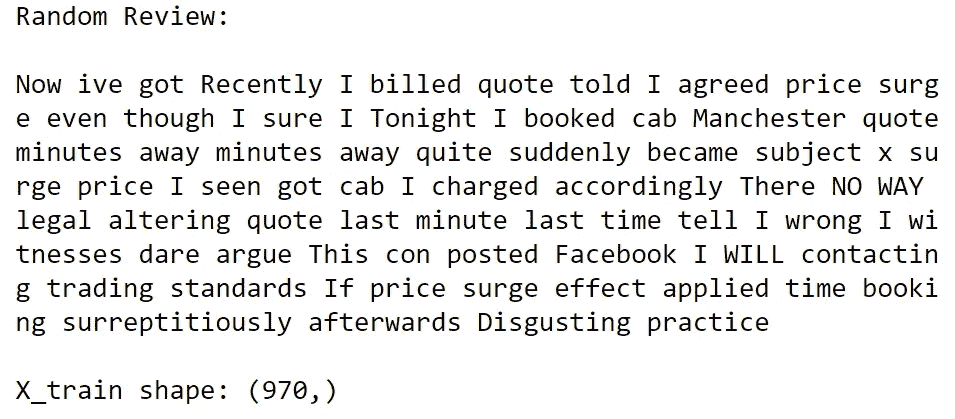

> 不出所料，970/1294 =我们样本的 75%。

## 把单词变成数字

现在到了激动人心的部分，将我们的文本数据转换成数字特征。为了稍后对这些数据进行回归，我们需要为样本中的每个单词建立一个特征。本质上，我们将把每个单词翻译成一个数字，然后计算这些单词/数字在矩阵中的使用频率。**这样做的过程叫做“**[](https://en.wikipedia.org/wiki/Bag-of-words_model)****”。值得注意的是，单词的顺序并不重要，单词袋只计算每个单词实例的使用频率。**首先，我们将使用 Sklearn [计数矢量器](https://scikit-learn.org/stable/modules/generated/sklearn.feature_extraction.text.CountVectorizer.html)**

```
#importing countvectorizer
from sklearn.feature_extraction.text import CountVectorizer#creating variable which assigns X_train to numbers
vect = CountVectorizer().fit(X_train)#translates numbers back to text
vect.get_feature_names()[1:10]
```

**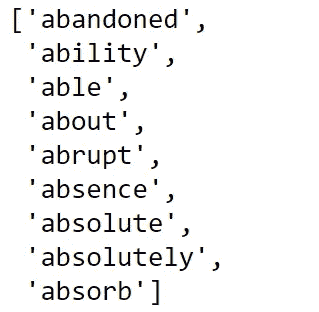**

**Words 1–10**

**我们可以看到使用 len(vect.get_feature_names())方法，所有评论中共有 6607 个单词:**

```
#length of total words
len(vect.get_feature_names())
```

**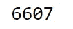**

**Total Words**

**现在，让我们将 X_train 数据转换成一个矩阵，该矩阵以行的形式包含文档(实例),以列的形式包含新功能的数量(6，607)。比如我们上面看到的第一个字(0)就是“弃”。这将是矩阵中的第一列。任何包含“废弃”的优步评论都会计算出它被使用的次数，并添加到那一栏。作为一个旁注，有人使用“放弃”，将有可能对评级产生负面影响。我们可以稍后再做实验。**

```
#creating matrix array for logistic regression
X_train_vectorized = vect.transform(X_train)
print (X_train_vectorized.toarray())
```

**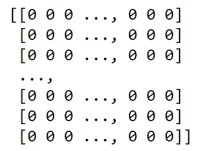**

**1294 instance X 6607 feature array matrix**

> **因为单词太多，而大多数评论只有其中的一小部分，所以这个数组中的大部分数字都会是 0。**

# **逻辑回归**

## **建筑模型**

**我们终于成功回归了。在我们继续之前，如果您需要逻辑回归复习，请在此处查看。**

**同样，我们将使用 sklearn 来执行此模型:**

```
#creating log regression
from sklearn.linear_model import LogisticRegression
model = LogisticRegression()
model.fit(X_train_vectorized, y_train)
```

**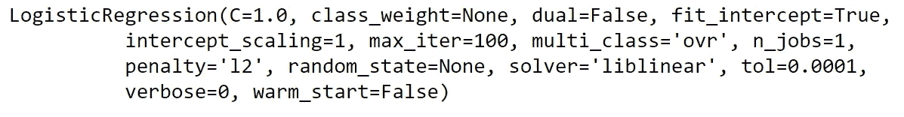**

**现在，我们将计算 AUC，看看它对测试数据的分类有多好。更多关于 ROC 曲线和 AUC 的信息可以在[这里找到](/predicting-cancer-with-logistic-regression-in-python-7b203ace16bc):**

```
#calculating AUC
from sklearn.metrics import roc_auc_score
predictions = model.predict(vect.transform(X_test))
print('AUC: ', roc_auc_score(y_test, predictions))
```

****

> **这很好。理解这个指标的粗略方法是说我们有 75%正确分类的实例。**

# **测试/结论**

## **积极和消极的话**

**我们来深究一下哪些词对阶级分离的影响最大。在这里，我们将数字转换回文字，获得回归输出的系数，将它们添加到数据帧中，并根据系数对它们进行排序。**

```
#creating array variable of all the words
feature_names = np.array(vect.get_feature_names())#creating array of all the regression coefficients per word
coef_index = model.coef_[0]#creating df with both arrays in it
df = pd.DataFrame({'Word':feature_names, 'Coef': coef_index})#sorting by coefficient
df.sort_values('Coef')
```

**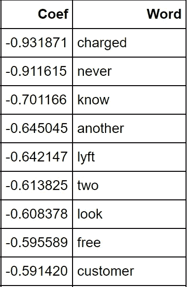**

**Most negative Coefficients (Most correlated with negative review)**

****

**Most positive Coefficients (Most correlated with positive review)**

## **负面情绪:**

**这让我着迷。**

*   **“带电”是最负相关的词。**
*   **“Lyft”我认为也很有趣。如果客户有负面体验，我相信他们会倾向于评论“你的竞争对手比你好！”。**
*   **“免费”这个词让我很困惑。我本以为“免费”会是一个积极向上的词。**

## **积极情绪:**

**当你向下移动数据框，单词变得更加正相关。**

*   **“伟大”是最高的，分数如此积极，甚至超过了“充电”。**
*   **“安全”、“方便”、“干净”……这些词很多都是直觉预期的。**
*   **一个意想不到的正相关词是“她”。女司机是否对客户情绪有更积极的作用？**

> **这些结果可以为优步的利益相关者和领导层提供潜在的无价的商业洞察力。**

## **测试自定义评论**

**最后，我们可以试验和测试我们自己的定制评论。下面以粗体显示的是输入，下面是各自的输出(1 =正；0 =负)。最后一个应该是肯定的，但是我们的分类器把它标为否定的。其余的似乎是准确的。**

```
print(model.predict(vect.transform(['**abandoned great**'])))print(model.predict(vect.transform(['**great she the best**'])))print(model.predict(vect.transform(['**charged slow horrible**'])))print(model.predict(vect.transform(['**it was as average as a trip could be**'])))print(model.predict(vect.transform(['**my family felt safe we got to our destination with ease**'])))print(model.predict(vect.transform(['**i got to my destination quickly and affordably i had a smile on my face from start to finish**'])))
```

**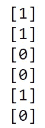**

**感谢阅读。**

**我在 Kaggle 上有一个内核，里面有这个分析[这里](https://www.kaggle.com/hershyandrew/uber-reviews-text-analysis)**

**还有，如果你想联系，我的 LinkedIn 是[这里](https://www.linkedin.com/in/andrew-hershy-a7779199/)**

**如果你觉得这有帮助，请订阅。如果你喜欢我的内容，请查看其他几个项目:**

**[*随机森林是否优于 Logistic 回归？*(一比较)](/is-random-forest-better-than-logistic-regression-a-comparison-7a0f068963e4)**

**[*基尼指数 vs 信息熵*](/gini-index-vs-information-entropy-7a7e4fed3fcb)**

**[*简单线性 vs 多项式回归*](/linear-vs-polynomial-regression-walk-through-83ca4f2363a3)**

**[*用 Python 中的逻辑回归预测癌症*](/predicting-cancer-with-logistic-regression-in-python-7b203ace16bc)**

**[二元逻辑回归示例(python)](/univariate-logistic-regression-example-in-python-acbefde8cc14)**

**[*从头开始计算 R 平方(使用 python)*](/r-squared-recipe-5814995fa39a)**