# 为 Arvato Financial Services 创建客户细分报告

> 原文：<https://towardsdatascience.com/udacity-data-scientice-nano-degree-capstone-project-create-customer-segmentation-report-for-852d3e6d3180?source=collection_archive---------16----------------------->

## 来自数据科学纳米级的 Udacity 顶点项目

Photo by [Christiann Koepke](https://unsplash.com/@christiannkoepke?utm_source=medium&utm_medium=referral) on [Unsplash](https://unsplash.com?utm_source=medium&utm_medium=referral)

# **项目概述**

通过创建客户细分并与一般人群进行比较，可以知道一般人群中的哪一部分更有可能成为客户，哪一部分不是。我分析了德国一家邮购销售公司客户的人口统计数据，并将其与普通人群的人口统计信息进行了比较。

首先，我使用不同的方法对数据进行预处理，然后我使用无监督学习技术，PCA(主成分分析)和 k-NN(k-最近邻算法)，来进行客户细分并识别公司的核心客户特征。

其次，根据公司营销活动目标的人口统计信息，我使用不同的模型来预测哪些人最有可能转化为客户。

最后，我还通过 kaggle 测试了比赛中的模型，其中比赛是[这里](https://www.kaggle.com/c/udacity-arvato-identify-customers)，所有讨论的内容都是基于上传到 [Github 资源库这里](https://github.com/HuangKY/DSND_Term2_Capstone_Arvato)的 jupyter 笔记本。

# **问题陈述**

该目标包括以下四个部分:

1.  数据预处理:清理和重新编码数据。
2.  细分:使用无监督学习技术来创建客户和普通人群的聚类，然后识别差异。
3.  预测:使用人口统计特征来预测一个人在邮寄活动后是否会成为客户。
4.  用同样的算法预测，提交给 Kaggle 竞赛，得到评价。

# 韵律学

在分割部分，解释方差比被用于主成分分析过程。解释方差说明了描述整个特征方差的能力，解释方差越大，组件的重要性越大。

在监督模型预测部分，精度主要用作主要度量。

# 分析和方法——数据探索、可视化和预处理

有四个数据集，它们都具有相同的人口统计特征(只有一部分不同)

*   ***uda city _ AZDIAS _ 052018 . CSV***:德国一般人口的人口统计数据；891 211 人(行)x 366 个特征(列)
*   ***uda city _ CUSTOMERS _ 052018 . CSV***:邮购公司客户的人口统计数据；191 652 人(行)x 369 个特征(列)
*   ***uda city _ MAILOUT _ 052018 _ train . CSV***:作为营销活动目标的个人的人口统计数据；42 982 人(行)x 367 人(列)。
*   ***【uda city _ MAILOUT _ 052018 _ test . CSV***:作为营销活动目标的个人的人口统计数据；42 833 人(行)x 366 人(列)。

除了上述数据，还有两个额外的元数据:

*   ***DIAS 信息级别—属性 2017.xlsx*** :属性和描述的顶级列表，按信息类别组织
*   ***DIAS Attributes-Values 2017 . xlsx***:按字母顺序详细映射每个特征的数据值

还有，我基于***DIAS Attributes-Values 2017 . xlsx***文件创建了一个名为***DIAS _ Attributes _ Values _ 2017 _ details . CSV***的文件，这样我就可以将每个属性映射到它的类型或者缺失值编码。

## 处理缺失/未知值

在数据预处理过程中，我将缺失或未知的值重新编码为 Nan，以确保所有值的编码都是一致的。例如，在 AGER_TYP 属性中'-1 '值表示未知，我用 *np.nan.* 替换它

## 评估每个属性中缺失的数据

在每个属性中，计算缺失值的比例。从缺失率的分布来看，大多数属性都在 20%以下。因此，我根据这个标准删除了异常值。(图 1)

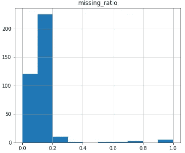

Fig. 1 Distribution of missing ratio for each attribute

## 评估每行中缺失的数据

每行中缺失的数据也会被评估。可以看到，大多数行没有丢失值，所以我将删除至少有一个丢失值的所有行。(图 2)然而，为了确保我删除的数据对整个数据没有大的影响，我将检查一些特征的分布。

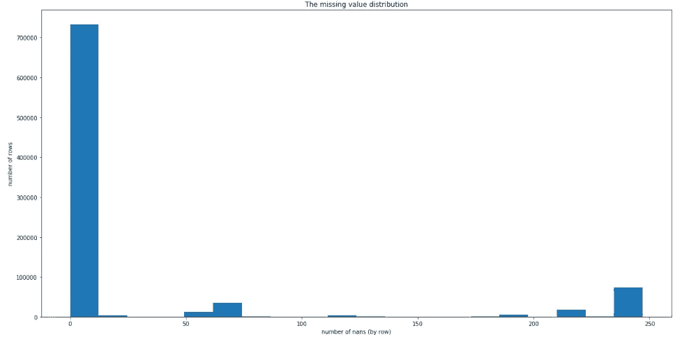

Fig. 2 Distribution of missing ratio in each row

通过比较两个子集(不包括已删除行的数据和只包括已删除行的数据)之间至少五个属性的值的分布，两者之间没有大的差异。(图 3)所以我将在处理行中丢失的值时保留这个标准。

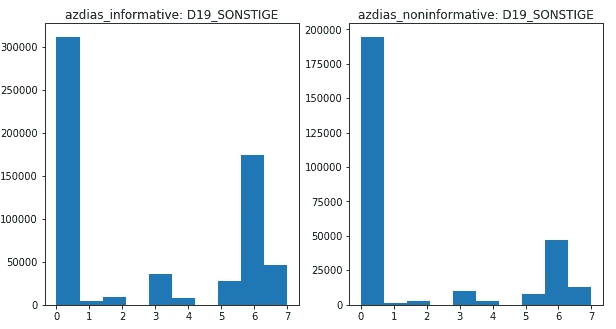

Fig. 3 Comparison of distribution of two data set on specific attributes (see Github for all graphs)

## 重新编码并提取特征

数据中有四种类型的数据:*序数、数值、分类和混合*。对于顺序变量，虽然值可能不是线性相关的，但我在这里假设顺序变量是区间变量。剩余的分类和混合变量将被重新编码和选择。

例如，关于分类变量，OST_WEST_KZ 特征包括二进制的值“W”和“O”。我把它重新编码成 0 和 1 的数值二进制变量。另一方面，CAMEO_DEUG_2015 功能包括详细信息文档中未描述的“X”值，因此我将其重新编码为 Nan。对于其余的分类变量，我绘制了相关图，以了解这些特征是否具有共同的特征。(图 4)

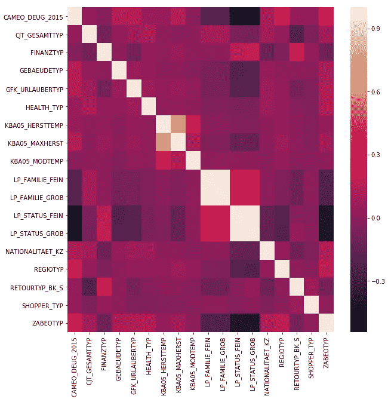

Fig. 4 Correlation heat-map between categorical features

根据上图，LP_FAMILIE_FEIN 和 LP_FAMILIE_GROB 高度相关，LP_STATUS_FEIN 和 LP_STATUS_GROB 也高度相关。由于 LP_FAMILIE_FEIN 和 LP_STATUS_FEIN 太详细了，我在这里把这两个去掉了。此外，虽然上图中没有绘制 CAMEO _ DEUG _ 2015and 和 CAMEO_DEU_2015，但根据描述文件，它们非常相似。所以我去掉了 CAMEO_DEU_2015 来简化。最后，还有一个特性 EINGEFUEGT_AM 没有在文档中描述，我也放弃了这个特性。在重新编码和选择分类变量之后，我使用 Pandas 中的 *get_dummies* 方法转换为虚拟值。

除了分类变量之外，还有如下六个混合特征:

1.  CAMEO_INTL_2015
2.  FEIN 的生活
3.  GROB 的生活
4.  PLZ8_BAUMAX
5.  PRAEGENDE _ JUGENDJAHRE
6.  沃纳拉赫

通过查看 CAMEO_INTL_2015 属性，似乎该属性可以分为两个区间变量:一个与财富有关，另一个与人生阶段有关，因此我使用 map 方法对该特征进行重新编码。关于 LP_LEBENSPHASE_FEIN 和 LP_LEBENSPHASE_GROB，因为它们都描述了与 CAMEO_INTL_2015 具有相似特征的人的生命阶段，所以我在这里放弃了这两个属性。另一方面，PLZ8_BAUMAX 和 WOHNLAGE 属性在某种程度上可以视为区间变量，我在这里保留了它们。最后，在 PRAEGENDE _ JUGENDJAHRE 功能中，它看起来也可以分为两个部分:十年和运动。因此，我创建了两个函数来处理这个变量。

经过所有的预处理和重编码过程后，*uda city _ AZDIAS _ 052018 . CSV*被清洗并转换为熊猫 daframe 对象*AZDIAS _ informational _ dummy。*我还创建了一个函数 *clean_data* ，它包含了上面提到的所有过程，因此对于每个人口统计数据，清理过程都是确定的并且保持不变。

最后，在重新编码的过程中，一些特征变得不规则，所以我用*输入器*来代替带有手段的*。然后我用 *StandardScaler* 来缩放所有的特征。为了检查最终的输出，我计算了每个属性中的 Nans(缺失率)的数量。(图 5)*

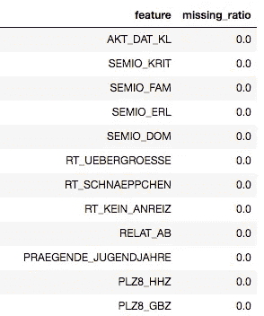

Fig 5\. The missing ratio in each attribute (parial)

## 实施和完善

**客户细分报告部分**

从近 425 个特征中，我进行了主成分分析来提取一般人群的重要特征。知道了每个属性的主要解释方差，我决定使用前 6 个分量，因为在第 6 个分量之后，累积方差缓慢增加。(图 6 和图 7)

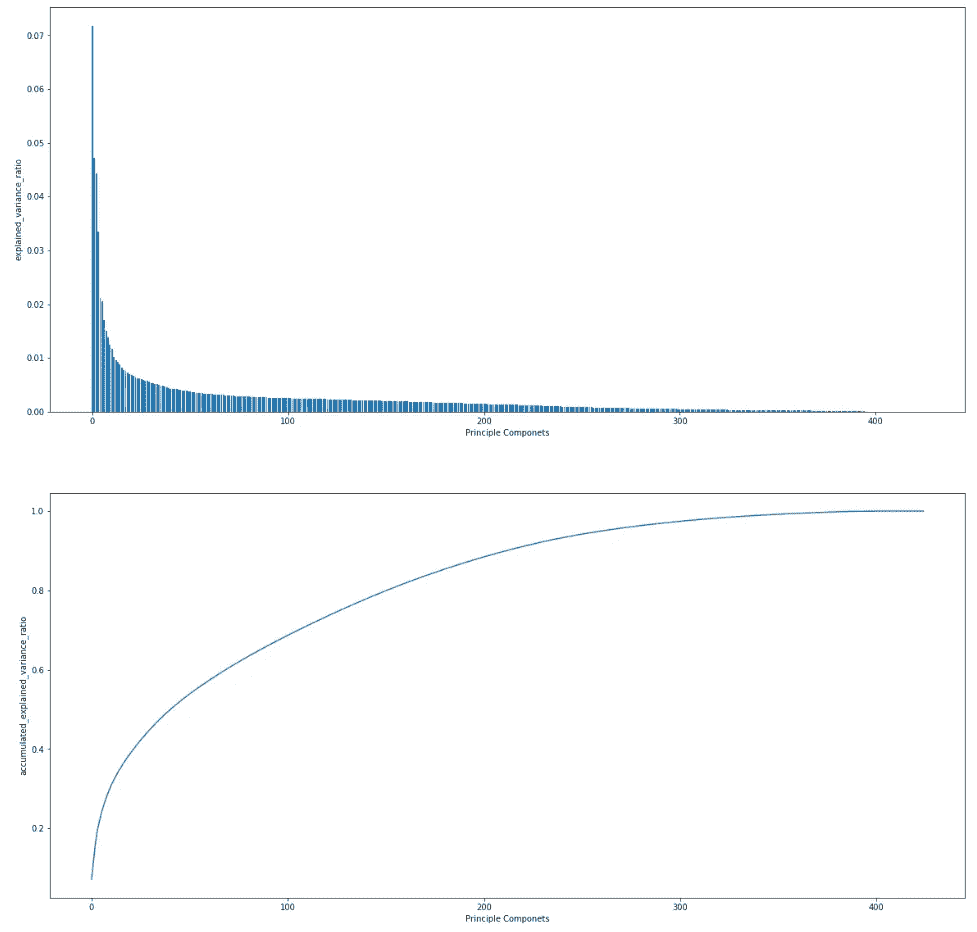

Fig. 6 (Top): Explained variance across different PCA components. (Bottom): Accumulated

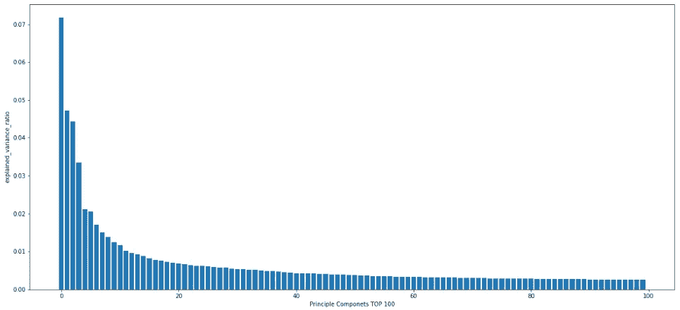

Fig. 7 Accumulated explained variance for top 100 PCA components

在选择了主成分分析后，我使用 KMeans 方法进行聚类。为了决定我应该使用多少个聚类，我调查了 KMeans 分数的聚类数。结果表明，当聚类数增加到大约 30 时，误差(分数)变得足够低，并且不会快速变化。因此，我选择 30 作为聚类数。(图 8)

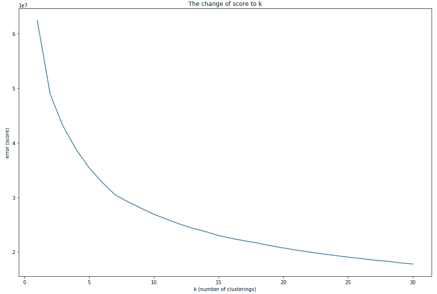

Fig. 8 The change of score (error) to k (number of clusterings)

上面使用的所有过程和方法也适用于客户数据。因此，我可以获得普通人口数据和客户数据的聚类标签。(图 9)通过绘制聚类的分布，我得到了两个数据集之间的差异结果。(图 10)

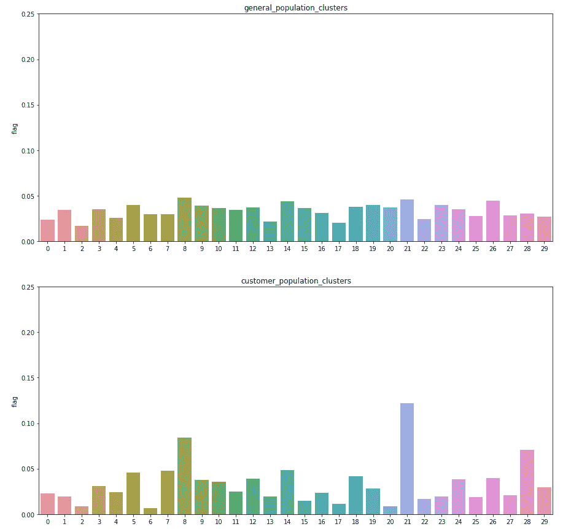

Fig. 9 The distribution of the clusterings across two populations

在此表中，gp_portion 表示一般人群中聚类的比例，cs_portion 表示客户人群中聚类的比例，表明客户和一般人群之间的差异在聚类 21 和 28 中最大，在聚类 6 和 20 中最小。

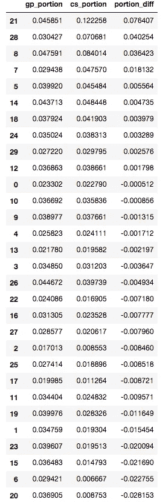

Fig. 10 The difference of clustering distribution in the two datasets

**监督学习模型部分**

在监督学习模型部分中，由于数据与普通人群共享相同的人口统计特征，因此所有预处理都与客户细分部分中的相同。然而，为了确保被清理的列是相同的并且所有的行都被保留，clean_data 函数被修改为 *clean_data_preserve_row* 。在预处理过程之后，我在分割报告部分使用了相同的算法来获得 PCA 值和聚类。

独立变量是原始清理特征、6 个 PCA 分量和聚类标签。因变量是数据集中的响应列。为了预测响应值，即 0 或 1 二进制值，我使用了三种模型:逻辑回归，随机森林和 k-NN 来预测。还进行了网格搜索以获得最佳参数。

# 结果

## 解释、模型评估和验证

**客户细分报告部分**

首先，我将讨论 6 个 PCA 成分，然后我将使用上面的聚类结果来了解一般人群和客户之间的差异。

对于每个 PCA 组件，我显示了主要特性的详细信息，以便了解其特性。(图 11 和图 12)第一列显示了每个特征的重要性。

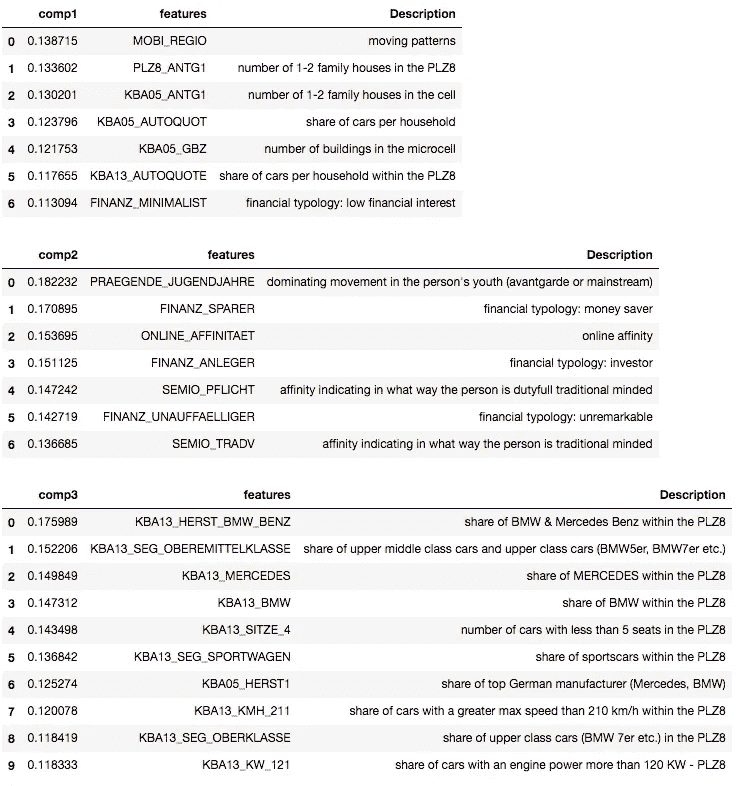

Fig. 11 The details of PCA components 1 to 3

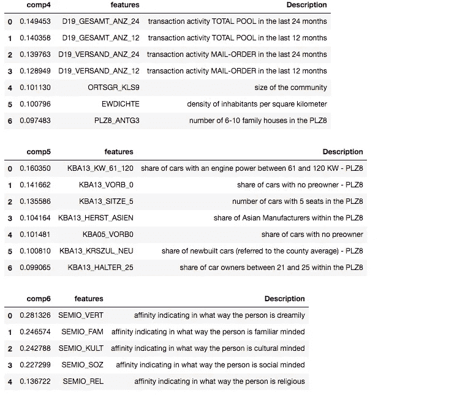

Fig. 12 The details of PCA components 4 to 6

以下是基于每个组件的详细信息的摘要。为了方便起见，我将命名每个组件并在后面解释。

***PCA 成分 1*** : ***富人指数。*可能是一些关心财经新闻或产品的人，住在繁忙的城市地区，倾向于独居或只和伴侣住在一起。**

***PCA 成分 2:年轻和流浪指数。*** 此人出生于 90 年代，主要接触数字媒体，不是存钱的人，有很高的网络亲和力，不是金融投资者，思想不传统。

***PCA 成分 3:汽车品牌狂热指数。*** 由于宝马&奔驰、高级轿车或跑车的高份额，以及顶级德国制造商(奔驰、宝马)的高份额。

***PCA 成分 4:网购者指数。*** 由于交易活跃，邮购交易活跃，每平方公里居民密度高，6-10 户家庭住宅数量多。

***PCA 成分 5:汽车寿命指数。***

***PCA 成分 6:反社会指数。*** 因梦幻亲和力低，熟悉度低，文化社交度低，不信教。

除了 PCA 成分，我还比较了一般人群和顾客的区别。正如前面提到的，我从图 9 和图 10 中得到了下面的结果。

*   一般认为 ***的人群更有可能成为邮购公司的主要客户:集群 21 和 28***
*   不太可能成为邮购公司主要客户的普通人群:集群 6 和 20

查看每个集群，以下是每个集群的特征(为方便起见，采用绝对值为 3 的标准):

*   聚类 21: PCA 成分 2 ( *年轻与流浪指数*)负相关。
*   群集 28: PCA 组件 4 ( *在线购物者指数*)正相关。
*   聚类 6: PCA 成分 1 ( *富人指数*)和 3 ( *汽车品牌狂热指数*)负相关，而 PCA 成分 5 ( *汽车生活指数*)正相关
*   聚类 20: PCA 成分 1 ( *富人指数*)负相关，成分 6 ( *反社会指数*)正相关

综合以上所有信息，这里是总结。

*   倾向于成为顾客的人群:可能是成年人并且通常在网上购物的人群。
*   可能不是消费者的人群:不富裕，也不关注汽车品牌的人。然而，他们倾向于经常使用汽车。他们中的一些人可能有一些反社会的特征。

综上所述，活动的目标应该集中在不年轻且经常在网上购物的用户身上。另一方面，对于那些非常富有或对汽车非常感兴趣或具有反社会特征的人来说，可能没有必要向他们发起这场运动。

**监督学习模型部分**

数据被分成训练数据和测试数据。然而，结果并不好。对于三种模型(逻辑回归、随机森林和 k-NN)，它们都没有很好的精度。我将在下一个理由部分讨论它。

## 正当理由；辩解

**监督学习模型部分**

由于原始数据不平衡(大多数响应为 0，值 1 低于 1 %)，我尝试了以下部分来解决问题:

1.  使用 GridSearch 方法。
2.  设置“class_weight”参数。
3.  在 train_test_split 流程中设置分层参数。
4.  尝试 6 个以上 PCA 成分到 20 个 PCA 成分。

然而，它们都没有提高精度。这部分我最后会留在改进部分。

此外，我已经将测试数据的预测上传到 kaggle。如前所述，模特的表现不好，所以分数也不好。(图 13)

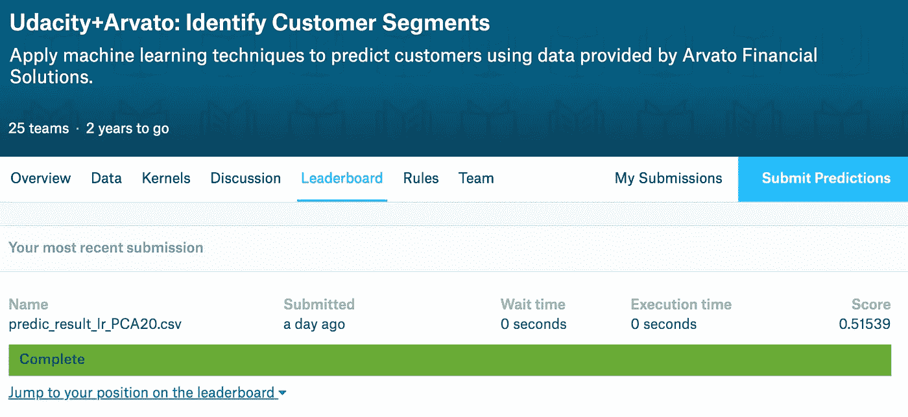

Fig. 13 The submission to kaggle

# **结论**

## 反射

在分割部分，对数据进行了预处理，并采用主成分分析和 k-NN 相结合的方法对不同人群进行聚类。我们讨论了这种差异，我知道哪些人可能是潜在客户，哪些人可能不是。了解了这种差异，公司就可以更专注于他们的目标，然后提高转化率或降低营销成本。影响大。

然而，在监督学习部分，模型的性能并不好。这可能是由于因变量的大部分值为 0 的有偏数据分布造成的。需要进一步调查。

## 改进

为了提高监督学习模型的性能，可以进行以下部分。

1.  处理不平衡数据的方法:欠采样或过采样。
2.  增加 PCA 成分。
3.  仅使用 PCA 成分作为独立变量。