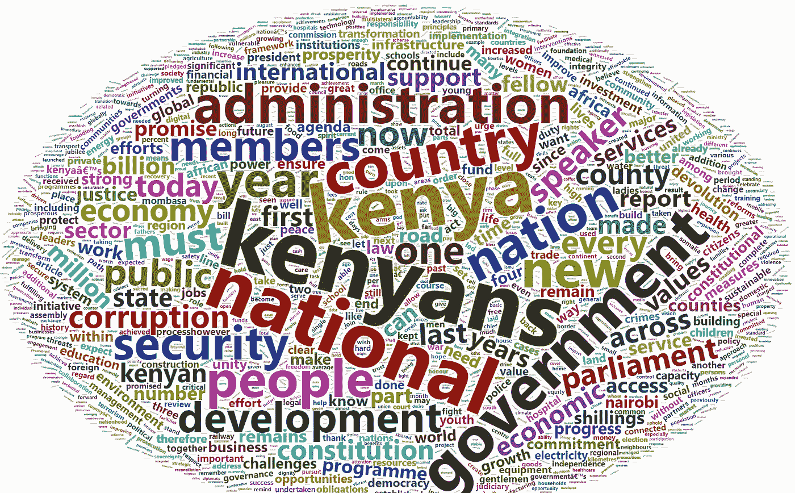
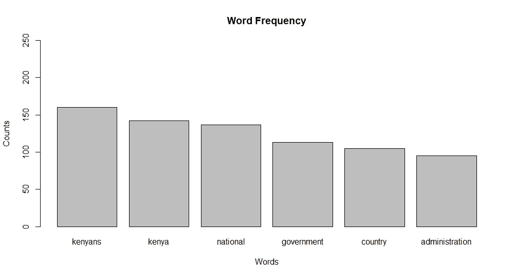
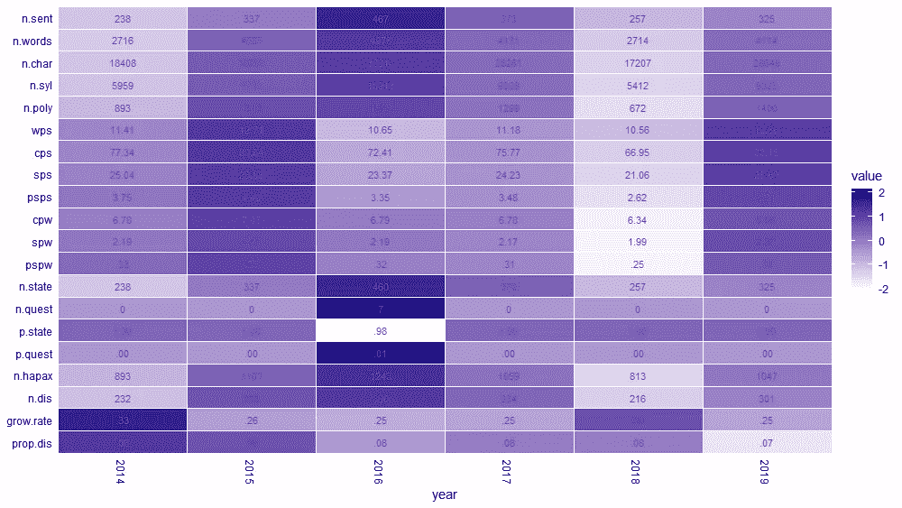
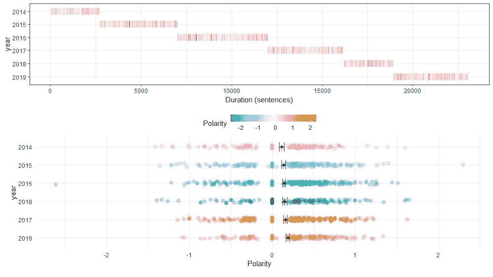
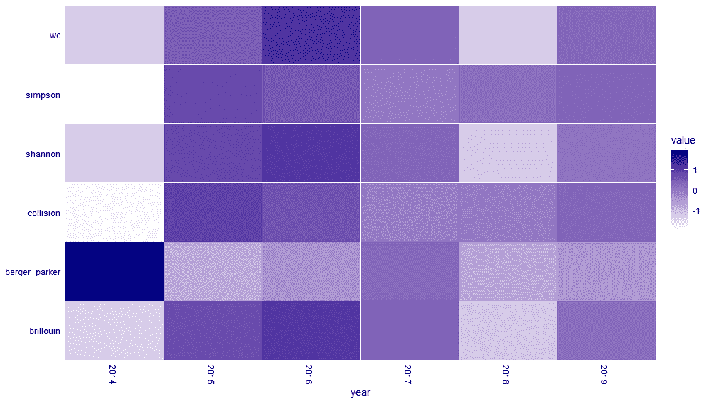

# 乌胡鲁·肯雅塔 2019 年国情咨文，最积极

> 原文：<https://towardsdatascience.com/uhuru-kenyattas-2019-state-of-the-nation-address-most-positive-557d9cfb3f13?source=collection_archive---------20----------------------->

作为肯尼亚总统，https://en.wikipedia.org/wiki/Uhuru_Kenyatta·乌胡鲁·肯雅塔负责通过每年的国情咨文向肯尼亚人民通报政府取得的进步。他在 2013 年掌权，因此他的第一个儿子是在 2014 年。我看了一下演讲稿，发现了一件事。对于像我这样的人来说，它们太长太无聊了。听他们的话本来是有意义的，但我错过了这一切。因此，我部署了一些自然语言处理(NLP)技术来提取演讲中的一些知识。这就是机器比人类做得更好的地方。

**数据**

我们利用了 2014 年(乌呼鲁掌权一年后)至 2019 年间公开发表的国情咨文[演讲](https://github.com/wandabwa2004/StateoftheUnionAddresses_UK/blob/master/data.zip)。我在我的分析中使用了 [R](https://www.r-project.org/) ,其中涵盖了一些数据分析和建模方面。

**数据清理和一点点分析**

我使用了下面的一些库来处理数据。小心！有些可能根本没用。希望你能在这个分析中找出对你有用的东西。

该文档被转换成一个[术语文档矩阵](https://en.wikipedia.org/wiki/Document-term_matrix)，以便于对其中的单词进行统计计算。以下过程如下:-

矩阵中每个单词的频率计算如下。

两者的输出；首字(最常用)和尾字(最不常用)如下

总的来说，总统重复的单词比其他的多。另一方面，根据下表，580 个单词在他的所有演讲中至少被提到两次。

总统强调了下面的单词，因为它们在数据集中出现的频率最高。

*“国家”、“政府”、“肯尼亚”、“肯尼亚人”、“成员”、“民族”、“国家”、“人民”、“年份”*

看一下与上面最常用的单词相关的单词，可以让我们了解这些单词的使用环境。单词 *"country"* 的示例在下面的代码和输出中进行了说明:-

**主要术语汇总**

最主要的术语总结在下面的单词云中。

Summary of all words in Uhurus’ speeches minus stop-words. Bigger words were emphasized by the president more than the ones in smaller fonts.

单词云和条形图通过以下代码生成:-

**主题建模**

在自然语言处理中，主题模型被定义为帮助发现文档中抽象主题的统计模型。在这种情况下，文档可以是演讲、书籍、评论甚至推特的集合。简而言之，主题建模有助于发现描述某个实体的语义相近的单词/术语。例如，人们很自然地会想到“iPhone”和“lightning cable”会经常出现在关于苹果产品的评论中。

潜在狄利克雷分配(LDA)是一种主题建模技术。LDA 的深入描述是[这里](/light-on-math-machine-learning-intuitive-guide-to-latent-dirichlet-allocation-437c81220158)。

从上面的代码中，我选择了 K= 3，这意味着数据集被细分为 3 个具有代表性的集合。k 可以改为任何数字，但我把它设置为 3 个主题。有一些[方法](/10-tips-for-choosing-the-optimal-number-of-clusters-277e93d72d92)可以用来识别最佳集群数。

以下是我多年来在这些话题中收集到的一些词汇的摘要

**话题三(2014，2018)**——*宪法，肯尼亚人，价值观，权力下放，和平，统一*
**话题二(2015，2016，2017)**——*行政，县，经济，人民，服务。*
**话题一(2019)**——*国家、安全、腐败、发展*

从这个分析中我们可以很容易地推断出，总统在 2015-2017 年的演讲中强调了行政管理问题，以及为肯尼亚人的经济繁荣提供县级服务。他 2019 年的演讲以安全、发展和腐败为中心。2014 年和 2018 年强调了权力下放、维护宪法、和平和团结等。

**进一步定量分析**

除了上面的实验，我将对 2014 年至 2019 年的所有演讲进行一系列广泛的对比。我将使用一个叫做[定量话语分析软件包( **qdap)**](https://cran.r-project.org/web/packages/qdap/index.html) **的 R 软件包。**该包规定了几种比较文本文档的方法。演讲将被转换成数据帧，然后用句子标记器分割成句子，然后用一个变量组合成一个数据帧，该变量指定每个演讲的年份。对于文本输入，需要以下过程

1)从 Qdap 应用 **qprep()** 函数
—bracketX()#应用括号移除
— replace_abbreviation() #替换缩写
—replace _ number()#数字到单词，例如“100”变成“一百”
— replace_symbol()#符号变成单词，例如@变成“at”

2)替换缩写(*不要*到*不要* )
3) strip() —删除不需要的字符，句号和问号除外。
4)发送拆分—将文本拆分成句子，然后添加到分组变量中，即演讲的年份。这也创建了**话轮(tot)** 变量作为*句子顺序*的指示器。该位在对话分析中至关重要，例如在问答会话中。

说够了，直接进入有趣的部分。执行上述操作的代码如下

从输出中可以看出，最常见的术语如下所示

Plot showing the most frequent words in Uhuru’s SON speeches between 2014–2019

下面是这些词多年来的使用频率的可视化表格。 **Wordmat** 方法将此过程简化如下。

我们现在可以获得关于数据集的完整单词统计信息，如下所示

Word statistics summary

从上面的剧情来看，2016 演讲最长(n.sent)。他最短的一次演讲是 2014 年的。可能总统害怕围绕他 2014 年演讲的喋喋不休，因为他记得这是他在 2013 年选举后的第一个儿子。上图中统计变量的描述见[此处](http://trinker.github.io/qdap_dev/word_stats.html)。请检查一下。

**极性**

极性被定义为具有两种相反或矛盾的倾向、观点或方面的状态。另一方面，文本情感通常是积极的、消极的或中性的。从下表来看，总统的讲话基本上是积极的。

然而，他 2019 年围绕*国家、安全、腐败、发展*的演讲是最积极的，标准化平均极性为 **0.482** 。在这种情况下，标准化平均极性是平均极性除以标准差。句子的极性总结在这个图中。

2014 Speech was deemed most negative with the 2019 one most positive .

最肯定的否定句是*“遭受严重挫折导致恐怖袭击”*而最肯定的是*“代表总发电量增长百分之三十。”有道理哈！获得这一推论的代码如下*

**可读性**

演讲的可读性遵循[自动可读性指数](https://en.wikipedia.org/wiki/Automated_readability_index)。这只是对文本阅读难度的估计。这是通过测量文本在单词和句子长度、音节数等方面的复杂性来实现的。每个可读性指数给出了一个估计的等级水平。这理想地代表了用英语进行的正规教育的年数。

与其他演讲相比，2018 年的国情咨文可读性最高，因为它比 2014 年的略长。其他演讲在可读性方面表现出稳定性，特别是 2014 年和 2017 年的演讲。2015 年的演讲需要研究生/高级本科水平(正规教育 18 年级)的人才能很好地理解。

Automated Readability Index table

**演讲中的多样性**

应用于对话的多样性是衡量语言丰富程度的一个尺度。具体来说，它在考虑单词的数量和多样性的同时，测量词汇的扩展程度。那么，随着时间的推移，总统的演讲有多大的不同呢？从下面的表格和图表来看，这些演讲并不过分多样化。

Plot showing how diverse the speeches were over time .

这意味着总统在他的演讲中使用了几乎相同的语言。为了清晰地表达他的议程，可能这些年来用词都是一样的。会不会只是政治语言？

最后一个有趣的情节与单词/术语随时间的分散有关。有些词会随着时间的推移而淡化或增加。只要单词存在于语料库中，选择要查看的单词就是用户驱动的。我看了看他演讲中分散的词语*、【安全】、【就业】、【经济】、【青年】、【妇女】、【腐败】，我个人觉得国家元首更有可能强调这些词语。*

从下面的图中可以看出，“腐败”、“安全”以及某种程度上的“经济”是总统六年来演讲的特点。有趣的是，总统在 2014 年没有谈到“就业”，而是强调了安全。简而言之，从这个情节中可以做出许多推论。

Dispersion of terms over time in the speeches.

**结论**

以上分析得出了乌胡鲁·肯雅塔演讲中有趣的见解，从主题到多样性。Qdap 包有助于并排语音比较。我期待听到肯尼亚人在演讲结束后的反应，因为当时推特上有很多活动。多样性情节可能在演讲和肯尼亚人当时的想法之间是有意义的。