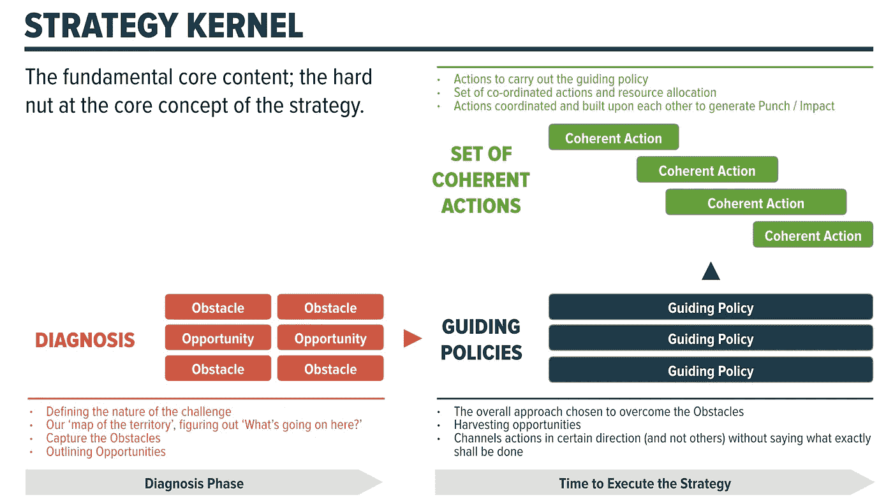
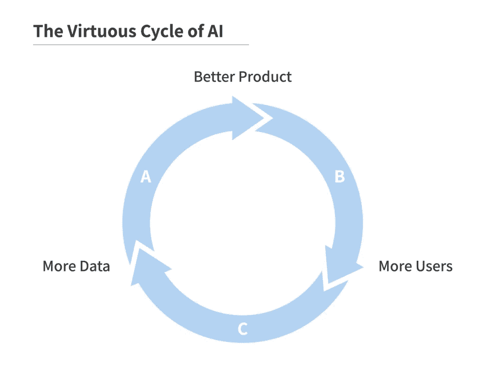
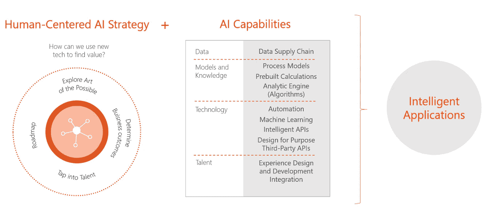
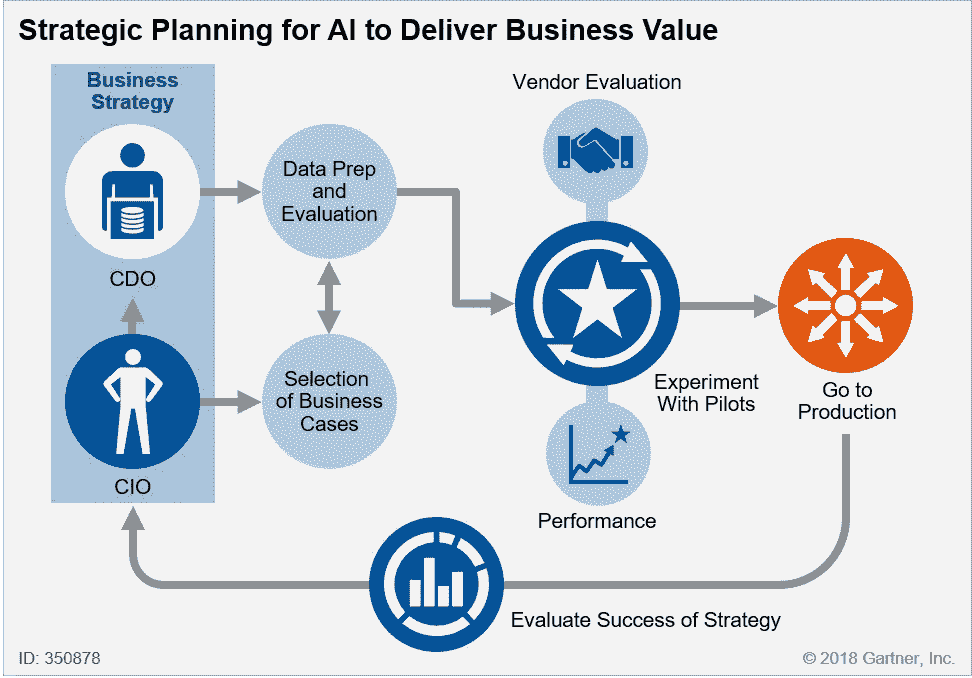
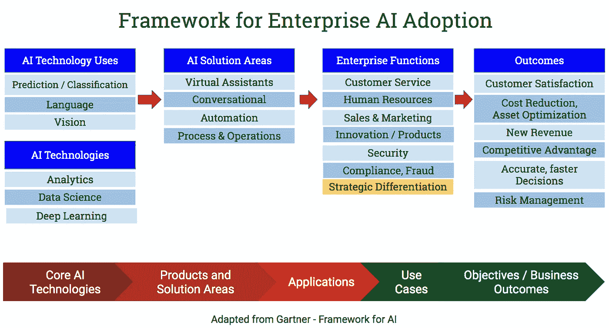
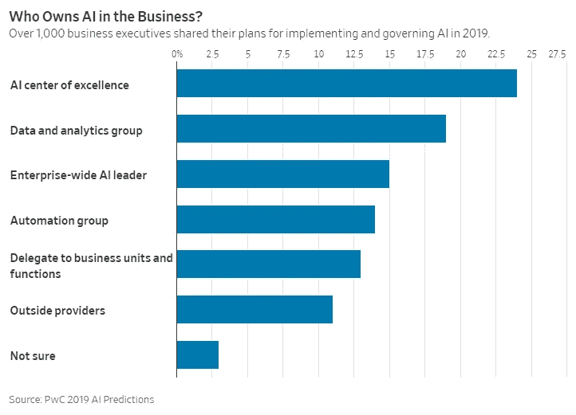
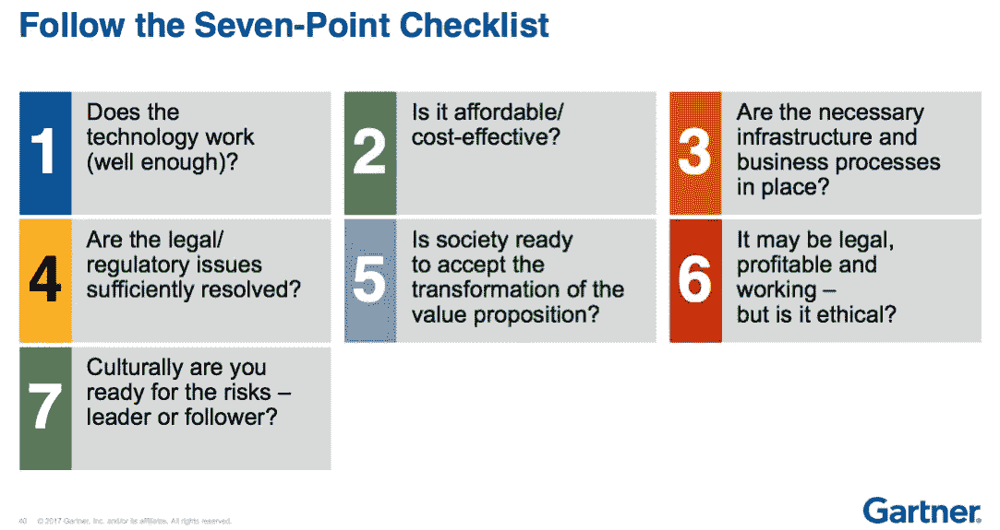

# 终极人工智能战略指南

> 原文：<https://towardsdatascience.com/ultimate-ai-strategy-guide-9bfb5e9ecf4e?source=collection_archive---------5----------------------->

Strategy and AI are terms that are hard to pin down — they mean different things to different people. Combine AI and Strategy — 人工知能 战略 — and now you have a harder problem to tackle! The goal of this post is to bring in the best advice out there about AI strategy and add a practitioner’s point of view for a successfully crafting AI strategy.

这篇文章分为三个部分。战略和规划，构建模块——启动和维持人工智能的技术、人员/文化和路线图。

在过去的几年里，人工智能将成为商业的一个主要因素已经变得非常清楚。Gartner 将人工智能纳入了 2019 年十大战略技术趋势。大多数公司都敏锐地意识到，他们至少应该有一个人工智能战略。不说别的，追随人工智能对手的倾向很高[1]。

> 围绕这项技术的激烈竞争表明，观望策略可能是一个代价高昂的错误。为了从人工智能到 2030 年将产生的 1 万亿美元的全球利润池中分得一杯羹，麦肯锡全球研究所表示，公司应该在未来三年内开始大规模采用人工智能。

然而，企业正在努力制定正确的人工智能战略，这非常像他们在 90 年代末采用电子商务时遇到的挑战。新生技术的采用可能会导致许多问题——选择或花费在错误的计划上，没有找到合适的人才，选择了错误的方向。

## 战略与人工智能基础

首先，让我们明确战略的定义。我喜欢鲁梅尔特定义战略的方式，并将遵循他的不废话、务实的方法。在《好策略，坏策略》中，鲁梅尔特写道，一个策略有三个关键部分，它们构成了*策略核心*。

1.  诊断——出了什么问题，为什么？将技术与商业战略联系起来
2.  指导政策—基础、治理、文化、道德
3.  一致的行动—资源分配、实施、购买/建造决策、流程编排、人才培养/雇用/保留、文化和变革管理

其次，让我们来定义人工智能:广义上讲，人工智能包括用于教计算机学习、推理、感知、推断、交流和做出类似于或优于人类的决策的技术。人工智能领域包括智能自动化、机器学习(经典机器学习和现代深度学习，也称为深度神经网络)和机器人技术。自动驾驶汽车结合了许多现代人工智能的象征。

这是我的一行人工智能商业方程式。

> A **I =数据+算法+计算→业务问题→结果**

困难的问题是制定一个适合你特定业务环境的人工智能策略——也就是说，它考虑了所有的外部因素和内部因素。吴恩达建议“成为你所在行业的领先人工智能公司，开发独特的人工智能能力将让你获得竞争优势。”

安德鲁补充说，人工智能如何影响你公司的战略将因行业和情况而异。

许多专家指出，你不能把人工智能战略作为第一步，因为你需要发展对人工智能的理解，而这需要在不确定的情况下进行实验。这有通过 AI 的所谓良性循环学习的好处。

From Andrew Ng — AI Transformation Playbook [4] — [Link](https://landing.ai/ai-transformation-playbook/)

就像任何坚固建筑的建筑要求一样，你需要从地面条件开始，并确保你建立一个坚固的基础。否则，无论你建造什么上层建筑，将来都会遇到代价高昂的问题。

接下来的部分将更多地讨论如何利用适合您情况的数据、算法和计算基础设施来构建数字基础。你需要具有不同背景、教育和技能的人——例如，你需要具有数据专业知识和机器学习知识的人，但也需要擅长沟通业务和技术问题的人，也称为“翻译”你需要强大的流程。

对人工智能的好处和局限性要现实。人工智能有很好的用例，也有可能让你陷入没有清晰价值路径的兔子路。一家公司可以采取一种渐进的方式，比如在参与更复杂的项目之前，尝试机器人流程自动化。

“人工智能将改善产品和流程，并使决策更加明智——这是重要但基本上不可见的任务。”托马斯·达文波特[10]

正如鲁梅尔特指出的，看看糟糕策略的例子会有所帮助，这样你就可以避免它。以下是一些常见的不良策略。

*   把目标误认为战略——不要只是说你想要人工智能的领导地位，要创造条件让你达到目标
*   模糊的战略目标——一长串要做的事情，却没有如何实现的明确计划，缺乏对精力和资源的关注
*   缺乏协调的行动-重复工作、所有权政治、发出混合信号的决策、高级管理人员缺乏对人工智能的基本理解
*   无法选择和区分优先顺序——哪些项目适合人工智能？我们应该选择什么样的管理和组织结构？

## 了解构建模块—技术

记住，战略就是采取行动克服障碍或抓住机遇。任何人工智能努力都将依赖于三个主要组成部分:数据、基础设施和人才。

*   **数据**是当今人工智能驱动洞察力的基本元素——在许多情况下超过算法本身。需要付出巨大的努力和投资才能让您的数据基础正确。提高数据质量和管理数据是一项复杂而长期的工作。对于所有行业的管理者来说，数据所有权都是一个令人头疼的问题。一些数据是专有的，其他数据是跨数据源的碎片，需要整合并与多个其他组织达成协议，以便获得更完整的信息来训练人工智能系统。

> 跨客户群和渠道链接数据，而不是让数据在孤岛中枯萎，对于创造价值尤为重要。——麦肯锡[15]

*   **计算基础设施，**包括软件和硬件，必须到位以有效运行机器学习模型。ML 需要专门的硬件(GPU、FPGA 或 ASIC)，无论是在云中还是在内部(由于法规或其他业务原因)。)
*   **人工智能**在有效利用机器学习方面至关重要。虽然不是每个公司都会寻求建立一个内部人工智能组织，但接触经验丰富的数据科学家、数据工程师、数据产品经理和人工智能开发运营专家是推动人工智能价值并将其扩展到盈利能力的关键。

吴恩达[4]建议说，一个公司要想在人工智能方面表现出色，它必须具备:

> **在多个有价值的人工智能项目上系统执行**的资源——无论是外包的还是内部的技术和人才。
> 
> 对人工智能有足够的了解:应该对人工智能有一个总体的了解，有适当的过程来系统地识别和选择有价值的人工智能项目。
> 
> **战略方向**:为了在人工智能驱动的未来取得成功，公司的战略是否大体一致**？**

## **建筑材料——人与文化**

**你可能认为技术是人工智能战略的关键，但是人和文化对你的人工智能战略的成功和技术一样重要。在 O'Reilly 最近的一份调查报告中，很明显文化是人工智能采用的主要挑战。首先，人工智能需要不同的团队一起工作，如果合作文化不存在，人工智能计划就会受到影响。**

**人工智能还意味着对人们的工作和流程的改变和破坏。伴随人工智能的自动化可以取代许多工作，并迫使其他人学习新技能。大多数时候它是一个黑盒，对于某些场景，它的价值是未经证实的。难怪许多工作人员担心人工智能，并随着人工智能的实施感到脱离了他们的舒适区。**

**算法需要新的治理模式。正如任何文化变革一样，在做出重大改变之前，要小心谨慎。**

**根据 O'Reilly Media 的调查结果，不承认需求、缺乏数据和人才短缺的企业文化阻碍了人工智能在各组织中的广泛采用。**

> ***瓶颈。*大量受访者(23%)表示，公司文化是采用人工智能的主要障碍，19%表示最大的问题是缺乏数据或数据质量，18%表示缺乏技术人员和难以雇用人才，17%表示难以确定适当的业务用例，8%表示是技术基础设施挑战。**

**人才招聘和管理仍然是一个关键因素。在你开始招聘之前，定义一下合适的团队是什么样的？你需要有深度、多种技能、经验丰富、多元化的人。正如本帖[12]所指出的，正确的团队应该包括领域专家和社会科学家，他们可以提供互补的观点并支持技术团队。不要沉迷于雇佣 AI 的摇滚明星而不创造成功的条件。**

**正如在[6]中提到的，人工智能技术管理还有更多。**

> **人工智能技术的管理还涉及新的领导技能，包括实施嵌入人工智能的现代流程所需的技能。成功接受人工智能的公司致力于转型计划，高层管理人员接受变革，跨职能管理团队准备重新定义他们的流程和活动。**

**创建和鼓励跟踪和揭示人工智能决策的方法——最好使用行动审计跟踪和可视化或解释结果的功能。让设计师和 UI / UX 专家参与进来。确保非技术经理很好地理解解释。**

**当然，良好的沟通或缺乏沟通是问题的主要原因[9]。**

> **人工智能战略之所以失败，是因为人工智能是一种手段，而不是目的。“你有人工智能战略吗？”就像问“我们有 Excel 战略吗？”但对于公司来说，要想摆脱炒作，专注于人工智能提供的真正潜力，他们必须从如何沟通开始。**

****要注意的差距****

**注意 3 个关键差距:业务-IT 差距、数据分析差距和老手-新手差距(稍后会有更多关于人员和文化的部分)。在人工智能中建立信任和检测并消除偏见仍然是人工智能采用的最大挑战之一。**

**正如 Moldoveanu 在这篇 HBR 的文章[9]中提到的，技术人员和商业人士之间有非常不同的工作方式。**

> **开发人员希望清晰、精确的指令能够很容易地翻译成代码或伪代码。业务发展主管为他们提供故事和趣闻。**

****

**Credit: [Avanade.com](https://www.avanade.com/fr-be/solutions/analytics-and-ai/artificial-intelligence)**

**还有一个不容忽视的风险因素。如果你的人工智能策略有负面后果或监管问题，它可能会适得其反。请看[13]了解更多信息，以及[14]如何降低这种风险。**

**道德、公平和包容性需要认真考虑。在[华盛顿邮报的专栏](https://www.washingtonpost.com/opinions/2019/01/23/can-we-make-artificial-intelligence-ethical/)中，黑石集团首席执行官苏世民推荐了一种道德驱动的人工智能方法，告诉消费者人工智能何时被使用，避免偏见，解决隐私问题，并寻求为被技术取代的工人创造机会。**

**这些都是热门话题，有许多不同的观点，详细的讨论超出了本文的范围——参见我关于公平和负责任的人工智能的初级读本[11]中对关键问题的总结。**

## **启动和维持人工智能计划的路线图**

**以上几节谈到了技术、人员、文化和道德。现在，让我们讨论一些部署和扩展人工智能计划的实用方法以及企业面临的常见挑战。成功执行战略的关键成功因素包括有效的流程和治理、管理资源和规避风险。本节包括一系列工具和资源，帮助你走上人工智能应用的正确道路。**

*   **共同的挑战**
*   **结构**
*   **推荐**
*   **清单**
*   **数字成熟度评估**

****挑战——不要低估人工智能成功所需的挑战和努力****

**有了这么多的宣传和炒作，公司可能会很容易加入进来，认为人工智能可以很快产生有利的结果。研究表明，组织往往会低估克服复杂性和让人工智能起飞所需的时间。**

**人工智能的实验和学习可能比其他数字计划需要更长的时间，成功和失败的可变性更高。**

> **根据 2017 年年度企业调查的结果，目前正在试点人工智能项目的公司中，58%的受访者表示花了两年或更长时间才达到试点阶段，只有 28%的受访者报告说在第一年就通过了规划阶段。**

**一些组织迷失在许多不同的原型和 POC 中，无法扩展—您不会经常听到失败的项目或计划，它们开始时有很多讨论，但后来因为结果的质量或缺乏明确的 ROI 而失败。较大的组织在创建卓越中心和提供监督但允许业务单位自治的组织结构方面取得了成功。**

**通过与你的同行交谈和倾听从业者，而不仅仅是倾向于过分强调成功故事的分析师和作者，来获得一些现实。**

**信任是一个主要因素。你如何让非技术团队相信人工智能解决方案是可靠和可依赖的？深度学习是一个热门领域，但众所周知，很难解释它如何做出决定。要做到这一点，需要精心的规划和沟通。**

**如果你的人工智能策略引发负面后果或导致监管问题，它可能会适得其反。请看[13]了解更多信息，以及[14]如何降低这种风险。**

****人工智能战略规划****

**这个简单的图表抓住了人工智能战略计划的关键要素。**

****

**Credit: Gartner, Inc. [5]**

****人工智能框架****

**最好从业务成果的角度来考虑人工智能战略，然后再回到常见的企业功能和解决方案领域。例如，如果你有一个很好的聊天机器人用例，那么这项技术可以被多个群体使用。**

****

**管理人工智能团队**

**存在许多模型——集中式和分布式模型各有利弊。**

****

****AI 策略建议****

1.  ****数字成熟度**:你在数字成熟度曲线上处于什么位置？你如何能加速它，以便你能加快人工智能能力的步伐？**
2.  ****评估业务潜力:**什么是正确的用例？是否有足够的价值？深入思考用例，评估多种场景**
3.  **渐进方法:对人工智能之旅采取分阶段的方法。在短期内，专注于具有成熟技术的用例；中期，试验技术以评估其价值；从长远来看，与尖端技术合作可以给企业带来先发优势。记住，人工智能技术还不成熟，不要期望马上就有投资回报**
4.  **领导能力:抵制让技术团队单独负责人工智能项目的诱惑。发展应该由商业和技术领导者共同领导[麦肯锡]**
5.  ****制造 vs 购买**:你应该建造、购买还是外包？你有理解各种新方法的天赋吗？正如任何被大肆宣传的新技术一样，新创造的解决方案和顾问并不缺乏。在整个组织中发展核心领导力和知识，同时根据需要从外部专家那里获得帮助**

****人工智能战略清单****

**这里有一个 Gartner 关于人工智能采用的简单清单。**

****

**Credit: Gartner, Inc. [5]**

****人工智能数字成熟度评估****

**即使是在有着大量集成新技术和管理数据历史的行业，人工智能采用的障碍也可能难以克服。人工智能需要更激进的思维，因为它影响了基于知识和判断的职业。这篇来自麻省理工斯隆评论的文章问道:是什么阻止了组织采用 AI？**

** [## 用人工智能重塑商业

### 关于作者:Sam Ransbotham 是卡罗尔学校信息系统系的副教授…

sloanreview.mit.edu](https://sloanreview.mit.edu/projects/reshaping-business-with-artificial-intelligence/) 

它定义了四个不同的组织成熟度集群:先锋、调查者、实验者和被动者

*   **先锋(19%):** 既了解又采用 AI 的组织。这些组织在将人工智能纳入其组织的产品和内部流程方面处于领先地位。
*   **调查人员(32%):** 了解人工智能但没有在试点阶段之后部署它的组织。他们对人工智能可能提供什么的调查强调先看后跳。
*   **实验者(13%):** 在没有深入了解的情况下，正在试点或采用 AI 的组织。这些组织在实践中学习。
*   **被动型(36%):** 对 AI 没有采用或了解不多的组织。他们还没有找到符合他们投资标准的可靠的商业案例。领导层可能不同意。

## 结论

这篇文章展示了人工智能策略的许多方面。最终，最重要的是愿景和领导力、开放性和变革能力、长期思维、业务和技术战略的紧密结合，以及克服障碍和适应新技术的文化。

# 参考资料:

1.  雅克·布欣**。观望可能是一种代价高昂的人工智能策略。麻省理工斯隆评论，2018。[https://Sloan review . MIT . edu/article/wait-and-see-be-a-cost-ai-strategy/](https://sloanreview.mit.edu/article/wait-and-see-could-be-a-costly-ai-strategy/)**
2.  好策略，坏策略。皇冠出版社，2011 年。(也可以看这篇关于这本书的 r [兴高采烈的帖子](https://medium.com/@maa1/book-review-good-strategy-bad-strategy-1e7eace07dd1)。)
3.  微软 AI 商学院。在线看[https://www.microsoft.com/en-us/ai/ai-business-school](https://www.microsoft.com/en-us/ai/ai-business-school)
4.  吴恩达。AI 改造剧本(可从[https://landing.ai/ai-transformation-playbook/](https://landing.ai/ai-transformation-playbook/)获得)，登陆 AI。2019.
5.  Bern Elliott，在企业中应用人工智能的框架(网络研讨会演示文稿)，Gartner.com，2018 年。
6.  雅克·布欣和埃里克·哈赞。从人工智能中获得最大收益的五种管理策略。McKinsey.com 和麻省理工斯隆管理评论，2017。[https://www . McKinsey . com/mgi/overview/in-the-news/five-management-strategies-for-get-the-most-from-ai](https://www.mckinsey.com/mgi/overview/in-the-news/five-management-strategies-for-getting-the-most-from-ai)
7.  人工智能战略家指南。普华永道战略+业务，2017。
8.  编辑惠特·安德鲁斯。构建人工智能商业案例。首席信息官在企业中实施人工智能的战略和商业案例指南。Gartner.com。2018.
9.  米尼亚·莫尔多瓦努。为什么人工智能表现不佳，公司可以做些什么。HBR，2019。[https://HBR . org/2019/03/why-ai-表现不佳，公司能做些什么？](https://hbr.org/2019/03/why-ai-underperforms-and-what-companies-can-do-about-it?autocomplete=true)
10.  托马斯·达文波特。人工智能的优势:如何将人工智能革命付诸实施。麻省理工出版社。2018.
11.  巴巴尔·巴蒂。公平负责的 ML 和 AI 入门。[https://towards data science . com/ai-policy-making-part-4-a-primer-on-fair-and-responsible-ai-28f 52 b 32190 f](/ai-policy-making-part-4-a-primer-on-fair-and-responsible-ml-and-ai-28f52b32190f)
12.  卡西·科兹尔科夫。为什么企业在机器学习上失败。[https://hacker noon . com/why-business-fail-at-machine-learning-fbff 41 c 4d db](https://hackernoon.com/why-businesses-fail-at-machine-learning-fbff41c4d5db)
13.  迈克尔斯潘塞。2019 年人工智能的危险。[https://medium . com/future sin/the-dangeries-of-artificial-intelligence-in-2019-19e 14 fa 45 aa 4](https://medium.com/futuresin/the-dangers-of-artificial-intelligence-in-2019-19e14fa45aa4)
14.  伯恩哈德·巴贝尔、凯文·布勒、亚当·皮冯卡、布莱恩·理查德森和德里克·瓦尔德罗。衍生机器学习和人工智能。麦肯锡，2019。[https://www . McKinsey . com/business-functions/risk/our-insights/derisking-machine-learning-and-artificial-intelligence](https://www.mckinsey.com/business-functions/risk/our-insights/derisking-machine-learning-and-artificial-intelligence)
15.  迈克尔·楚伊(Michael Chui)、[詹姆斯·马尼伊卡(James Manyika)](https://www.mckinsey.com/our-people/james-manyika)、迈赫迪·米雷马迪(Mehdi mire madi)[尼古拉·亨克(Nicola us Henke)](https://www.mckinsey.com/our-people/nicolaus-henke)、丽塔·钟(Rita Chung)、彼得·内尔(Pieter Nel)和桑卡普·马尔霍特拉(Sankalp Malhotra)。麦肯锡，2018。[https://www . McKinsey . com/featured-insights/artificial-intelligence/notes-from-the-ai-frontier-applications-and-value-of-deep-learning](https://www.mckinsey.com/featured-insights/artificial-intelligence/notes-from-the-ai-frontier-applications-and-value-of-deep-learning)**