# 数据搜集、清理和可视化初学者终极指南

> 原文：<https://towardsdatascience.com/ultimate-beginners-guide-to-scraping-and-cleaning-twitter-data-a64e4aaa9343?source=collection_archive---------2----------------------->

## 如何简单地通过清理和预处理数据，让您的模型从不起眼变得令人惊叹


Photo by [Nitin Sharma](https://www.pexels.com/@tasveerwala?utm_content=attributionCopyText&utm_medium=referral&utm_source=pexels) from [Pexels](https://www.pexels.com/photo/grey-and-white-monkeys-sitting-near-tree-2861847/?utm_content=attributionCopyText&utm_medium=referral&utm_source=pexels)

如果你有一个结果可以接受但并不惊人的模型，看看你的数据吧！花时间以正确的方式清理和预处理您的数据可以让您的模型成为明星。


Photo by [Burst](https://www.pexels.com/@burst?utm_content=attributionCopyText&utm_medium=referral&utm_source=pexels) from [Pexels](https://www.pexels.com/photo/adult-tan-and-white-french-bulldog-545063/?utm_content=attributionCopyText&utm_medium=referral&utm_source=pexels)

为了更详细地了解搜集和预处理，让我们来看看“你就是你发的微博:通过 Twitter 使用检测社交媒体中的抑郁症”中的一些工作这样，我们可以真正检查抓取推文，然后清理和预处理推文的过程。我们还将做一些探索性的可视化，这是一种更好地了解您的数据的方式！我们将在这里做一些最基本的清理和预处理工作:当你建立你的模型时，真正把这些 Tweets 按顺序整理好是你自己的事！

[](/you-are-what-you-tweet-7e23fb84f4ed) [## 你在推特上说什么就是什么

### 通过 Twitter 使用检测社交媒体中的抑郁症

towardsdatascience.com](/you-are-what-you-tweet-7e23fb84f4ed) 

# 一点背景

超过 3 亿人患有抑郁症，只有一小部分人接受了适当的治疗。抑郁症是全球残疾的主要原因，每年有近 80 万人死于自杀。自杀是 15-29 岁人群的第二大死因。抑郁症的诊断(和随后的治疗)经常被延迟、不精确和/或完全错过。

不一定要这样！社交媒体为转变早期抑郁症干预服务提供了前所未有的机会，特别是在年轻人中。

每秒钟，Twitter 上大约有 6000 条推文，相当于每分钟发送 35 万条推文，每天 5 亿条推文，每年约 2000 亿条推文。皮尤研究中心指出，目前，72%的公众使用某种类型的社交媒体。该项目捕捉并分析与抑郁症状的发作和持续相关的语言标记，以建立一种可以有效预测抑郁的算法。通过建立一种可以分析表现出自我评估抑郁特征的推文的算法，个人、父母、护理人员和医疗专业人员将有可能分析社交媒体帖子，以寻找标志着精神健康恶化的语言线索，这远远早于传统方法。分析社交媒体帖子中的语言标记可以进行低调的评估，这种评估可以补充传统服务，并且可以比传统方法更早地意识到抑郁迹象。

# 我们从哪里开始？

我们需要数据！


Photo by [Quang Nguyen Vinh](https://www.pexels.com/@quang-nguyen-vinh-222549?utm_content=attributionCopyText&utm_medium=referral&utm_source=pexels) from [Pexels](https://www.pexels.com/photo/black-and-tan-smooth-chihuahua-in-blue-and-white-plastic-basket-2135383/?utm_content=attributionCopyText&utm_medium=referral&utm_source=pexels)

# 收集数据

为了建立一个抑郁症检测器，需要两种推文:不一定表明抑郁症的随机推文和表明用户可能患有抑郁症和/或抑郁症状的推文。随机推文的数据集可以来源于 Kaggle 上可用的[sensition 140 数据集，但对于这种二进制分类模型，这种利用 sensition 140 数据集](https://www.kaggle.com/kazanova/sentiment140)并提供一组二进制标签的[数据集被证明是建立稳健模型的最有效方法。没有公开可用的表明抑郁的推文数据集，所以使用 Twitter 抓取工具 TWINT 检索“抑郁”推文。手动检查抓取的推文的相关性(例如，推文表明情绪而非经济或气氛抑郁)，并清理和处理推文。通过搜索与抑郁症特别相关的术语，特别是 De Choudhury 等人在 unigram 中确定的词汇术语，来收集推文。艾尔。](https://www.kaggle.com/ywang311/twitter-sentiment/data)

[TWINT](https://github.com/twintproject/twint) 是一款非常简单易用的工具！

您可以使用以下命令从命令行下载它:

```
pip install twint
```

例如，如果您想要搜索 2019 年 7 月 20 日的术语“抑郁症”，并将数据存储为名为“抑郁症”的新 csv，您可以运行类似以下的命令:

```
twint -s "depression" --since 2019-07-20 -o depression —csv
```

一旦你收集了推文，你就可以开始清理和预处理它们。您可能会得到大量不需要的信息，比如对话 id 等等。您可以决定创建多个想要合并的 CSV。我们会谈到这一切的！

# **模特表现如何？**

一开始？没那么令人印象深刻。在对数据进行基本的清理和预处理之后，最好的结果(即使在花费时间对模型进行微调之后)徘徊在 80%左右。

在我检查了词频和二元模型后，这个原因真的很有意义。探索您的数据！当我看到单词本身时，我意识到以正确的方式清理和准备数据集需要大量的工作，并且这样做是绝对必要的。部分清洁过程必须手动完成，所以不要害怕进去弄脏你的手。这需要时间，但是值得！

最后呢？使用逻辑回归对该模型的准确性进行评估，并与二元分类基线模型进行比较。分析模型的准确性，并运行分类报告以确定精确度和召回分数。数据被分成训练集、测试集和验证集，模型的准确性是根据模型对测试数据的性能来确定的，测试数据是分开保存的。虽然使用相同的数据、学习率和时期，基准逻辑回归模型的性能为 64.32%，但 LSTM 模型的性能明显更好，为 97.21%。

那么，我们是如何从抓取的推文得到结果的呢？

练习，练习，练习！(还有一些正经工作。)


Photo by [DSD](https://www.pexels.com/@dsd-143941?utm_content=attributionCopyText&utm_medium=referral&utm_source=pexels) from [Pexels](https://www.pexels.com/photo/close-up-photo-of-monkey-on-tree-branch-1829979/?utm_content=attributionCopyText&utm_medium=referral&utm_source=pexels)

(如果你是数据科学、机器学习和人工智能的新手，你可能想看看 NumPy 的终极初学者指南！)

[](/the-ultimate-beginners-guide-to-numpy-f5a2f99aef54) [## NumPy 初学者终极指南

### 开始使用 NumPy 需要知道的一切

towardsdatascience.com](/the-ultimate-beginners-guide-to-numpy-f5a2f99aef54) 

# 基本清洁和预处理

比方说，我们在 Twitter 上搜索“抑郁”、“沮丧”、“无望”、“孤独”、“自杀”和“抗抑郁”等搜索词，并将这些搜索到的推文文件保存为文件“tweets.csv”中的“抑郁”等。

我们将从几个进口开始

```
**import** **pandas** **as** **pd**
**import** **numpy** **as** **np**

**import** **pandas** **as** **pd**  
**import** **numpy** **as** **np**
**import** **matplotlib.pyplot** **as** **plt**
plt.style.use('fivethirtyeight')

%matplotlib inline
%config InlineBackend.figure_format = 'retina'
**import** **re**
**from** **nltk.tokenize** **import** WordPunctTokenizer
tok = WordPunctTokenizer()
```

我们将阅读我们的一个 CSV 文件，并看看头部。

```
hopeless_tweets_df = pd.read_csv('hopeless/tweets.csv')
hopeless_tweets_df.head()
```

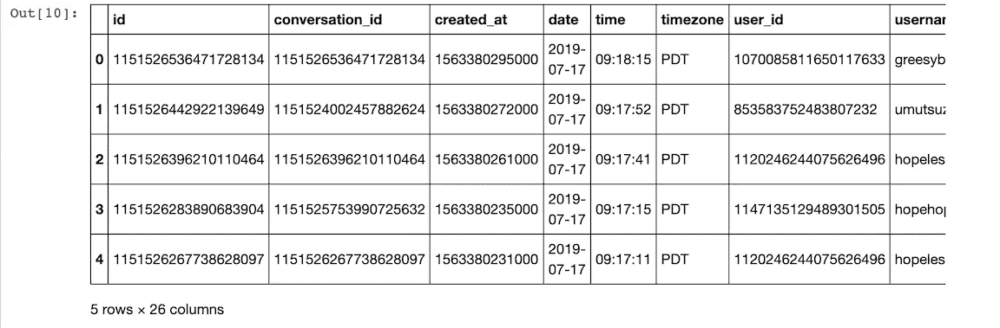

首先，我们应该去掉数据集中存储的任何不必要的信息。对于这个项目，我们不需要名称、id、对话 id、地理位置等等。我们可以通过以下方式将它们取出:

```
hopeless_tweets_df.drop(['date', 'timezone', 'username', 'name', 'conversation_id', 'created_at', 'user_id', 'place', 'likes_count', 'link', 'retweet', 'quote_url', 'video', 'user_rt_id', 'near', 'geo', 'mentions', 'urls', 'photos', 'replies_count', 'retweets_count'], axis = 1, inplace = **True**)
```

现在有了这个，就好处理多了！

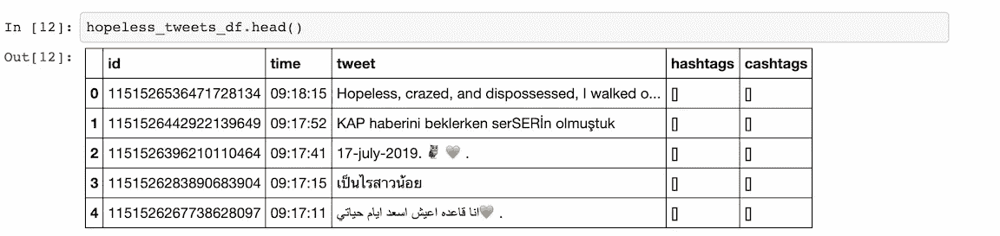

现在，只需对您使用搜索词创建的所有 CSV 进行上述操作，我们就可以将我们单独的数据集合并为一个！

```
df_row_reindex = pd.concat([depression_tweets_df, hopeless_tweets_df, lonely_tweets_df, antidepressant_tweets_df, antidepressants_tweets_df, suicide_tweets_df], ignore_index=**True**)

df_row_reindex
```

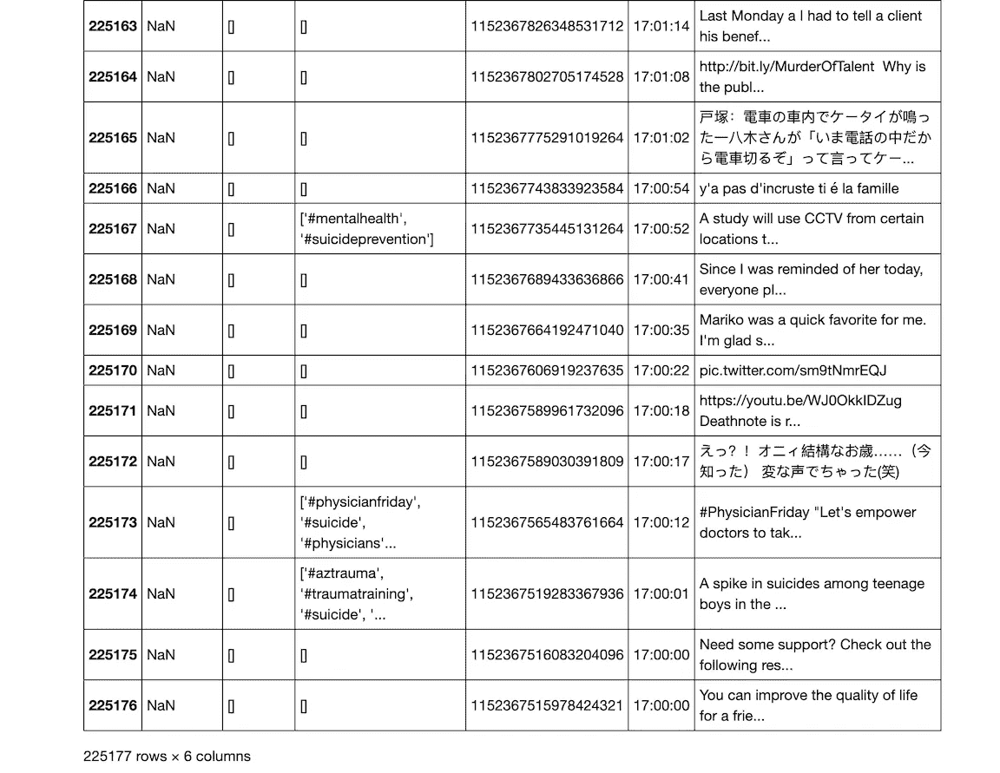

在我们继续之前，让我们放弃重复

```
depressive_twint_tweets_df = df.drop_duplicates()
```

并将我们的数据集保存为新的 CSV 格式！

```
export_csv = depressive_twint_tweets_df.to_csv(r'depressive_unigram_tweets_final.csv')
```

# **更高级的预处理**

在模型中使用数据之前，有必要展开缩写、删除链接、标签、大写和标点符号。需要处理否定。这意味着创建一个否定字典，这样被否定的单词就可以被有效地处理。链接和网址需要删除连同空白。此外，需要删除标准 NLTK 停用词以外的停用词，以使模型更加健壮。这些单词包括一周中的日子及其缩写、月份名称，以及单词“Twitter”，令人惊讶的是，当单词 clouds 被创建时，它作为一个突出的单词出现。然后将推文标记化，并使用 PorterStemmer 来阻止推文。

让我们去掉所有对我们没有帮助的东西！

当然是进口

```
**import** **pandas** **as** **pd**
**import** **numpy** **as** **np**
**import** **matplotlib.pyplot** **as** **plt**
**import** **seaborn** **as** **sns**
**import** **itertools**
**import** **collections
import** **re
import** **networkx** **as** **nx****import** **nltk** nltk.download(['punkt','stopwords'])
**from** **nltk.corpus** **import** stopwords
stopwords = stopwords.words('english')
**from** **nltk.corpus** **import** stopwords
**from** **nltk** **import** bigrams

**import** **warnings**
warnings.filterwarnings("ignore")

sns.set(font_scale=1.5)
sns.set_style("whitegrid")
**from** **vaderSentiment.vaderSentiment** **import** SentimentIntensityAnalyzer
analyzer = SentimentIntensityAnalyzer()%matplotlib inline
%config InlineBackend.figure_format = 'retina'
```

阅读您的新 CSV

```
pd.read_csv('depressive_unigram_tweets_final.csv')
```

把它变成熊猫的数据框

```
df2 = pd.read_csv('depressive_unigram_tweets_final.csv')
```

现在让我们看看是否有空值。我们来清理一下吧！

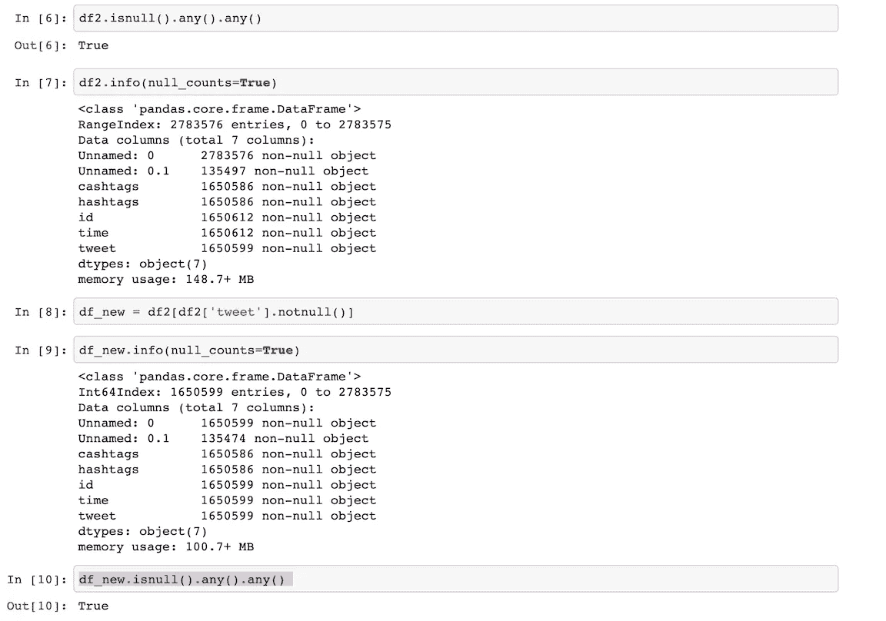

我们将快速删除推文中的停用词

```
df_new['clean_tweet'] = df_new['tweet'].apply(**lambda** x: ' '.join([item **for** item **in** x.split() **if** item **not** **in** stopwords]))
```

如果你愿意，你可以分析这些推文来获得 VADER 情绪分析分数！

```
df_new['vader_score'] = df_new['clean_tweet'].apply(**lambda** x: analyzer.polarity_scores(x)['compound'])
```

在那里，您还可以创建标签。对于二进制分类模型，您可能需要二进制标签系统。但是，要注意你的数据！情绪得分本身并不表明抑郁，假设负得分表明抑郁也太简单了。事实上，快感缺失是抑郁症极其常见的症状。中性或平淡的推文，如果不是更有可能，至少也是抑郁症的一个指标，不应被忽视。

出于实验的目的，您可能想要设置一个这样的情感分析标签。请随意使用它！

```
positive_num = len(df_new[df_new['vader_score'] >=0.05]) negative_num = len(df_new[df_new['vader_score']<0.05])df_new['vader_sentiment_label']= df_new['vader_score'].map(**lambda** x:int(1) **if** x>=0.05 **else** int(0))
```

如果你需要，扔掉你不需要的东西

```
df_new = df_new[['Unnamed: 0', 'vader_sentiment_label', 'vader_score', 'clean_tweet']]df_new.head()
```

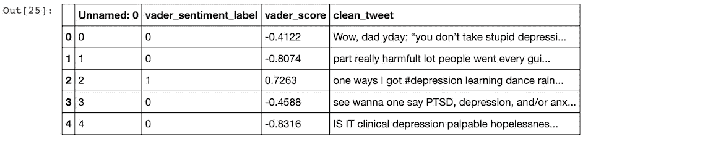

继续保存一个 csv！

```
df_new.to_csv('vader_processed_final.csv')
```

我们继续玩吧！

```
df_new['text'] = df_new['clean_tweet']
df_new['text']
```

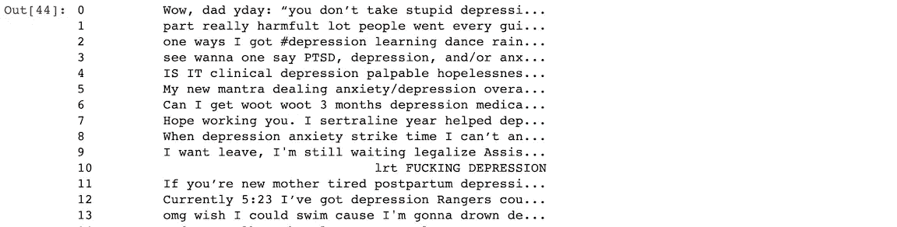

我们可以删除网址

```
**def** remove_url(txt):
    **return** " ".join(re.sub("([^0-9A-Za-z **\t**])|(\w+:\/\/\S+)", "", txt).split())all_tweets_no_urls = [remove_url(tweet) **for** tweet **in** df_new['text']]
all_tweets_no_urls[:5]
```

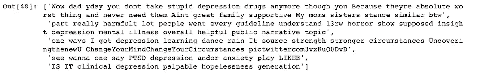

现在让我们把所有的东西都变成小写，把推文分开。

```
*#lower_case = [word.lower() for word in df_new['text']]*
sentences = df_new['text']all_tweets_no_urls[0].split()words_in_tweet = [tweet.lower().split() **for** tweet **in** all_tweets_no_urls]
words_in_tweet[:2]
```

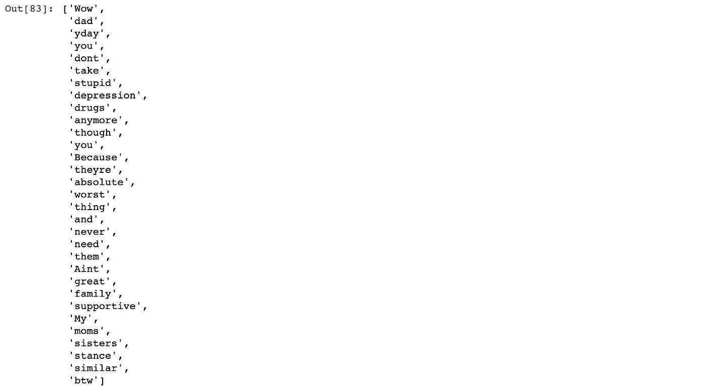

# 手工清洗

这不好玩，也不漂亮，但是手工清洁是至关重要的。这花了几个小时，但是去掉了对热带低气压和经济低气压的引用改进了模型。删除电影标题的推文改进了模型(你可以在下面的二元图中看到“X 特遣队”)。删除包含搜索术语的引用新闻标题改进了模型。感觉要花很长时间才能完成，但是这一步对模型的健壮性产生了巨大的影响。

# 探索性可视化和分析

现在我们来看性格和词频！

分析数据集中最常见的单词相当容易。去掉停用词后，很明显有些词比其他词出现得更频繁。

来统计一下我们最常用的单词吧！

```
*# List of all words*
all_words_no_urls = list(itertools.chain(*words_in_tweet))

*# Create counter*
counts_no_urls = collections.Counter(all_words_no_urls)

counts_no_urls.most_common(15)
```

并把它们转换成数据帧。

```
clean_tweets_no_urls = pd.DataFrame(counts_no_urls.most_common(15),
                             columns=['words', 'count'])

clean_tweets_no_urls.head()
```

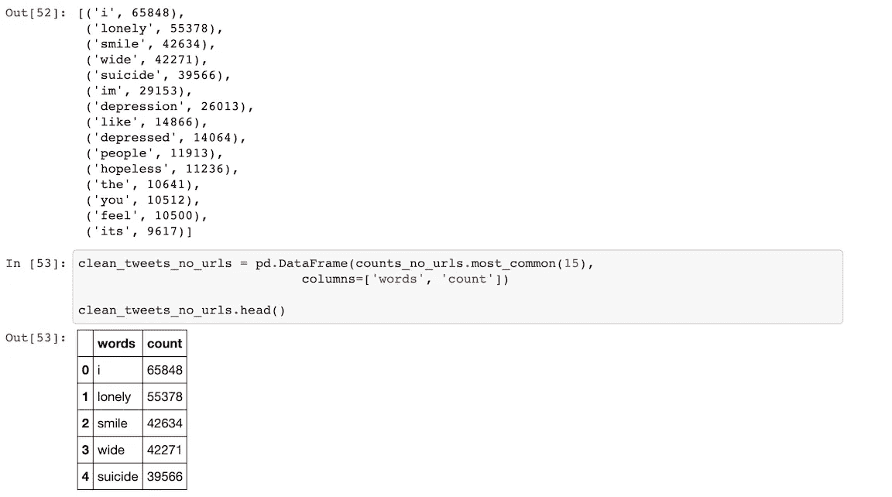

嗯。停用词太多。让我们来处理这些。

```
stop_words = set(stopwords.words('english'))*# Remove stop words from each tweet list of words*
tweets_nsw = [[word **for** word **in** tweet_words **if** **not** word **in** stop_words]
              **for** tweet_words **in** words_in_tweet]

tweets_nsw[0]
```

让我们再看一看。

```
all_words_nsw = list(itertools.chain(*tweets_nsw))  counts_nsw = collections.Counter(all_words_nsw)  counts_nsw.most_common(15)
```

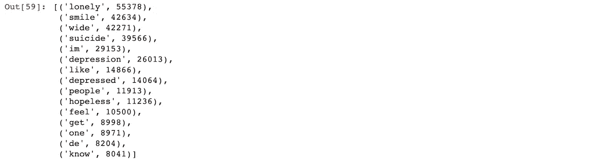

好些了，但还不够好。这些单词中的一些并没有告诉我们太多。再做几个调整吧。

```
collection_words = ['im', 'de', 'like', 'one']
tweets_nsw_nc = [[w **for** w **in** word **if** **not** w **in** collection_words]
                 **for** word **in** tweets_nsw]
```

现在

```
*# Flatten list of words in clean tweets*
all_words_nsw_nc = list(itertools.chain(*tweets_nsw_nc))

*# Create counter of words in clean tweets*
counts_nsw_nc = collections.Counter(all_words_nsw_nc)

counts_nsw_nc.most_common(15)
```

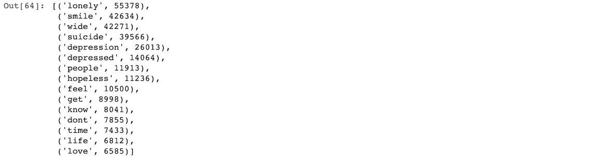

好多了！让我们将它保存为数据帧。

```
clean_tweets_ncw = pd.DataFrame(counts_nsw_nc.most_common(15),
                             columns=['words', 'count'])
clean_tweets_ncw.head()
```

那看起来像什么？我们来形象化一下吧！

```
fig, ax = plt.subplots(figsize=(8, 8))

*# Plot horizontal bar graph*
clean_tweets_no_urls.sort_values(by='count').plot.barh(x='words',
                      y='count',
                      ax=ax,
                      color="purple")

ax.set_title("Common Words Found in Tweets (Including All Words)")

plt.show()
```


让我们来看看一些大人物！

```
**from** **nltk** **import** bigrams

*# Create list of lists containing bigrams in tweets*
terms_bigram = [list(bigrams(tweet)) **for** tweet **in** tweets_nsw_nc]

*# View bigrams for the first tweet*
terms_bigram[0]*# Flatten list of bigrams in clean tweets*
bigrams = list(itertools.chain(*terms_bigram))

*# Create counter of words in clean bigrams*
bigram_counts = collections.Counter(bigrams)

bigram_counts.most_common(20)bigram_df = pd.DataFrame(bigram_counts.most_common(20),                              columns=['bigram', 'count'])  bigram_df
```

某些二元模型也非常常见，包括微笑和宽阔，出现 42，185 次，害怕和孤独，出现 4，641 次，感觉和孤独，出现 3，541 次。

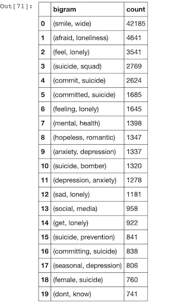

这只是清理、预处理和可视化数据的开始。在构建我们的模型之前，我们还可以从这里做很多事情！

一旦清理了推文，通过用清理过的推文创建单词云，很容易看出两个数据集之间的差异。仅通过 TWINT Twitter 的简短抓取，两个数据集之间的差异就很明显:

**随机推文词云:**

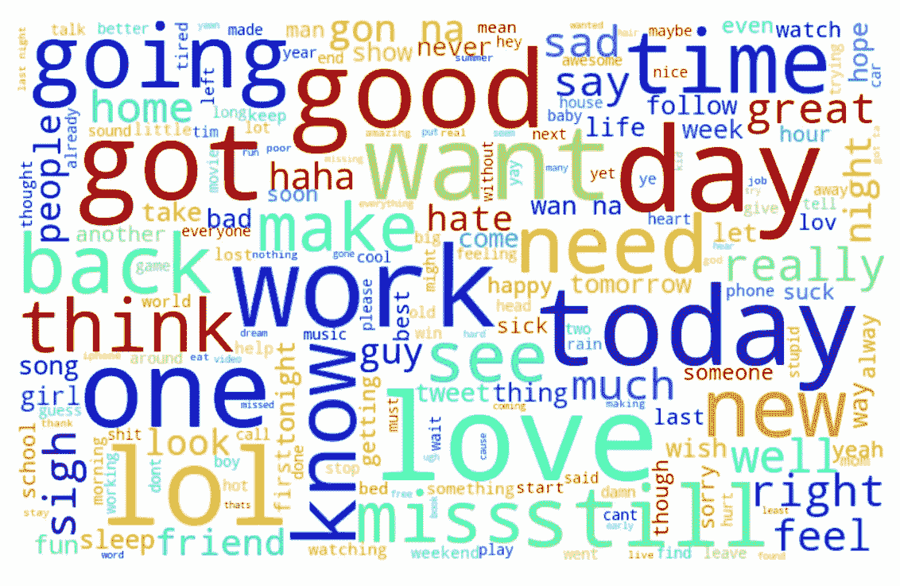

**郁啾词云:**


在这个过程的早期，很明显，为了获得更准确的结果，优化模型的最重要部分是数据收集、清理和预处理阶段。在对推文进行适当的清理之前，该模型的准确性并不令人印象深刻。通过更加仔细地清理和处理推文，模型的鲁棒性提高到了 97%。

如果您对了解数据清理和预处理的绝对基础感兴趣，可以看看这篇文章！

[](/the-complete-beginners-guide-to-data-cleaning-and-preprocessing-2070b7d4c6d) [## 数据清理和预处理完全初学者指南

### 如何在几分钟内为机器学习模型成功准备数据

towardsdatascience.com](/the-complete-beginners-guide-to-data-cleaning-and-preprocessing-2070b7d4c6d) 

感谢阅读！和往常一样，如果你用这些信息做了什么很酷的事情，请在下面的评论中让每个人都知道，或者随时联系我们！