# 解除数据装瓶

> 原文：<https://towardsdatascience.com/un-bottling-the-data-2da3187fb186?source=collection_archive---------32----------------------->

## 探索葡萄酒的大数据世界。

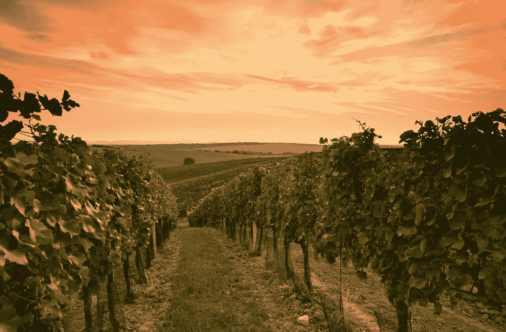

# 动机

在这篇博文中，我们将使用关于葡萄酒的数据来研究几种不同的数据探索方法！我们将展示一步一步的代码，并解释我们的过程。在我们开始深入研究代码之前，我们为自己提出了几个问题，我们希望回答关于葡萄酒数据集的问题:

1.  哪些国家的葡萄酒评论最多？
2.  世界上最好的葡萄酒来自哪里？
3.  最贵的葡萄酒来自哪里？
4.  酒价和积分有关联吗？
5.  有哪些词描述了 10 大葡萄酒类型？
6.  描述能预测葡萄酒的一个特征吗？

这些问题和其他发现将在博客文章的剩余部分使用自然语言处理(NLP)、文字云、地图可视化和 Python 中的其他计算来解决。

# 数据

我们在 [Kaggle](https://www.kaggle.com/zynicide/wine-reviews) 上找到了我们的数据集“葡萄酒评论”。该数据集包含超过 130，000 条葡萄酒评论条目。每个条目都包含葡萄酒来自的国家，葡萄酒的描述，名称(葡萄来自的酒厂内的葡萄园)，葡萄酒爱好者在 1-100 的范围内给葡萄酒评分的点数，一瓶葡萄酒的价格，葡萄酒来自的省或州，葡萄酒产区或葡萄酒种植区，葡萄酒评论的标题，用于酿造葡萄酒的葡萄的品种或类型，最后是酒厂。下面可以看到部分原始数据。

```
wine_reviews = pd.read_csv(“winemag-data_first150k.csv”)
wine_reviews.dropna() # drop any empty entries
del wine_reviews['Unnamed: 0'] # delete first column 
wine_reviews.head()
```

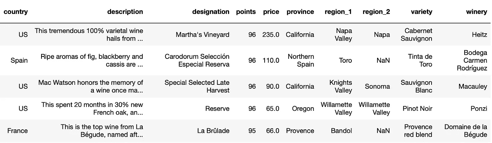

The first five entries from the Wine Reviews dataset.

# 哪些国家的葡萄酒评论最多？

排名前 10 位的国家有 143，344 篇评论，占所有评论的 95%。数据集中总共有 46 个国家。

在这个数据集中，美国拥有最多的葡萄酒评论，有 62397 条评论(41.34%)。这并不令人惊讶，因为数据集来自纽约的 wine fessor 公司。紧随美国之后的是意大利(15.56%)、法国(13.98%)、西班牙(5.48%)和智利(3.85%)。

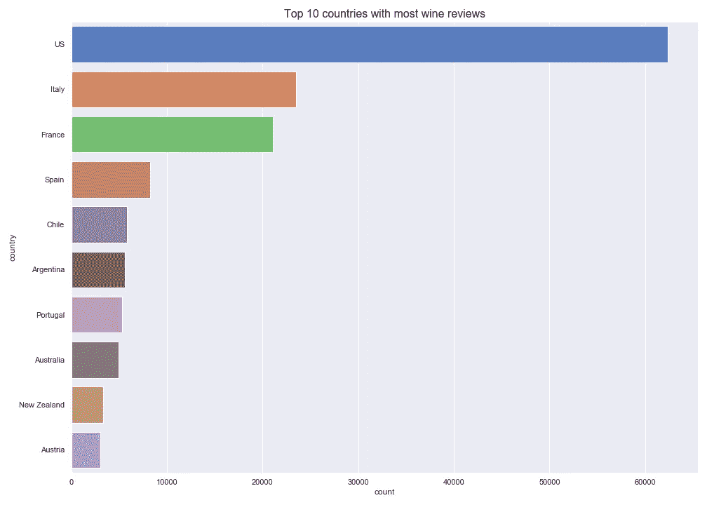

***下面的地图是交互式的，请访问*** [***这个链接***](https://wsjung.github.io/caobd_project/maps/d3-freq.html) ***来看看它在行动。***

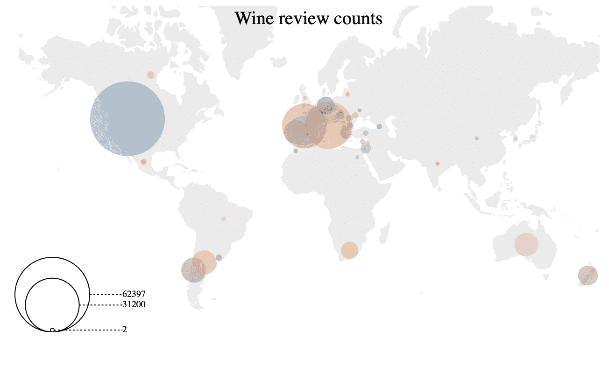

# 世界上最好的葡萄酒来自哪里？

令人惊讶的是，英国以平均 92.89 分的葡萄酒评论分数高居榜首。有趣的是，美国没有进入前十名。回顾频率数据，英国只有 9 篇评论，与美国的 62397 篇相比太少了。我们的数据有偏差，这不是最公平的比较。

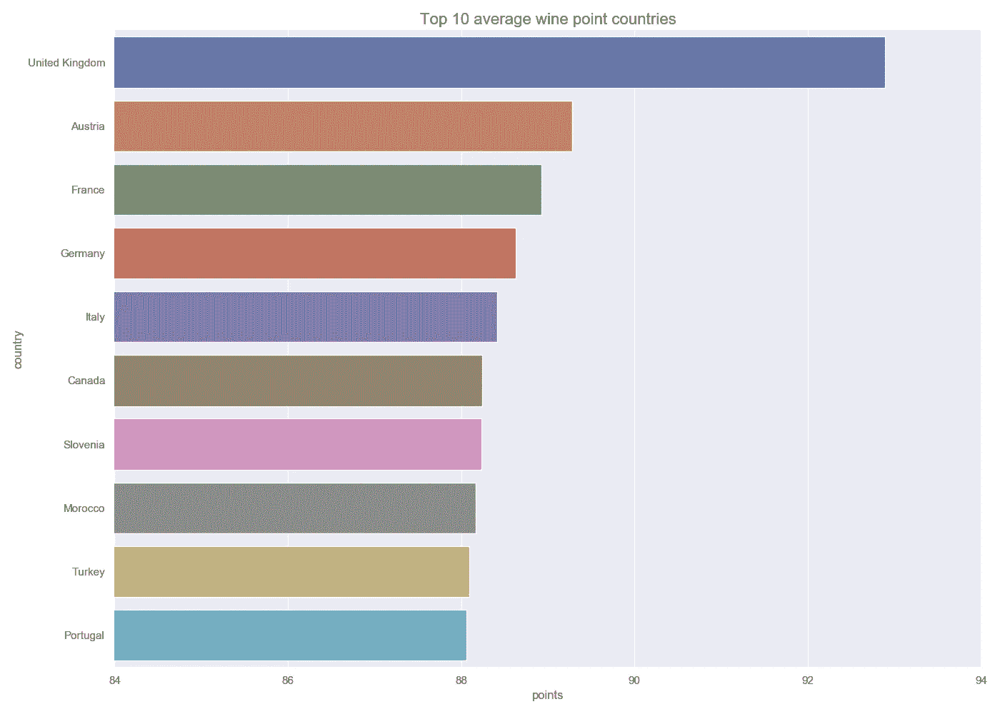

***下面的地图是互动的，请访问*** [***这个链接***](https://wsjung.github.io/caobd_project/maps/d3-points.html) ***来看看它在行动。***

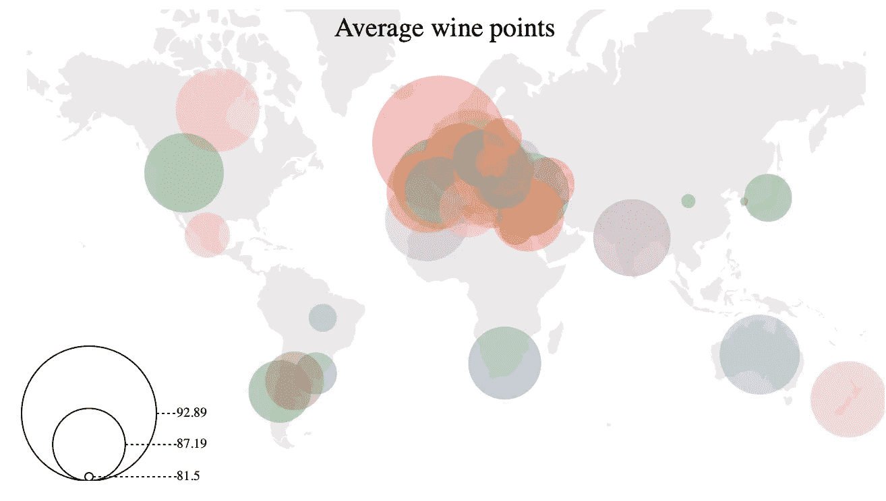

# 最贵的葡萄酒来自哪里？

英国以平均 47.50 美元的价格成为最贵葡萄酒的第一名。法国紧随其后，平均价格为 45.61 美元，匈牙利以 44.20 美元紧随其后。美国排名第 8，均价 33 美元。

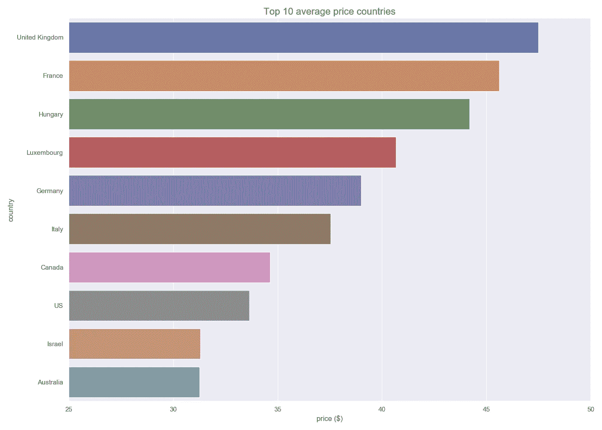

***下面的地图是交互式的，请访问*** [***这个链接***](https://wsjung.github.io/caobd_project/maps/d3-prices.html) ***来看看它的作用。***

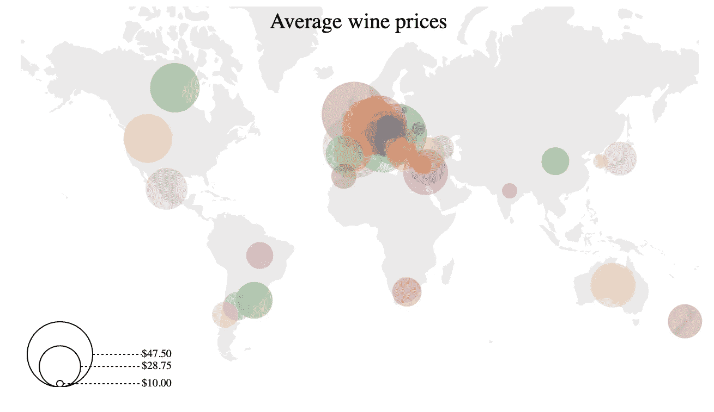

# 酒价和积分有关联吗？

首先，我们可以查看一些价格和积分的汇总统计数据。

```
wine_reviews.describe()
```


我们来形象化一下酒价和积分的分布。

```
plt.figure(figsize=(15,5))
plt.subplot(1, 2, 1)
plt.hist(wine_reviews[‘price’], color='#ba281e')
plt.xlabel(“Price”)
plt.ylabel(“Frequency”)
plt.title(“Distribution of Wine Prices”)plt.subplot(1, 2, 2)
plt.hist(wine_reviews[‘points’], color='#ba281e')
plt.xlabel(“Points”)
plt.ylabel(“Frequency”)
plt.title(“Distribution of Wine Review Points”)plt.tight_layout()
plt.show()
```

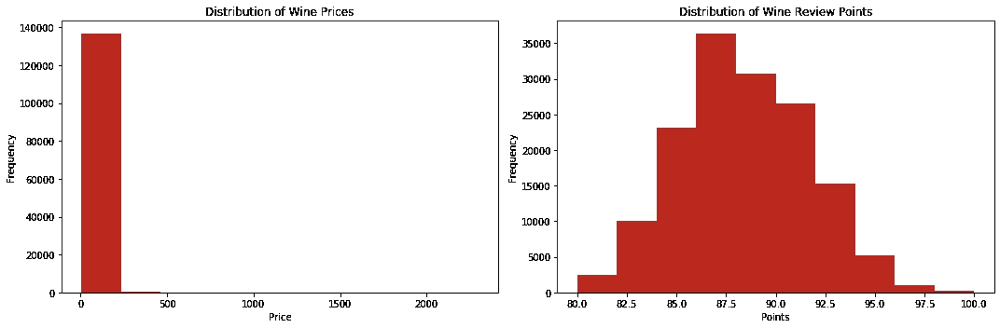

我们现在可以看看变量 price 和 points 之间的关系。使用 seaborn 软件包，我们可以可视化变量之间的关系。

```
import seaborn as snsplt.figure(figsize=(10,14))
ax = sns.jointplot(x='price', y='points', data=x[x['price'] < 200], kind='hex', gridsize=20, cmap='Reds')
plt.tight_layout()
plt.show()
```

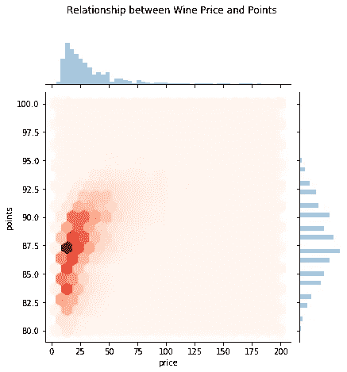

积分和价格之间存在正相关关系——随着葡萄酒价格的上涨，给予葡萄酒的积分也会增加。平均价格在 20 美元左右，平均积分在 88 分左右。我们还可以查看获得 100 分的葡萄酒的分布情况。我们看到即使是再便宜的酒也能拿满分！

```
# prices of wines that received perfect points 
perfect_score = wine_reviews[‘points’]==100
perfect_wines = wine_reviews[perfect_score]
plt.hist(perfect_wines['price'], color ='#ba281e')
plt.xlabel("Price")
plt.ylabel("Frequency")
plt.title("Wines with 100 Points")
plt.show()
```

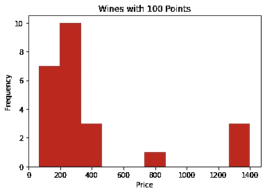

# 有哪些词描述了 10 大葡萄酒类型？

利用词云，我们分析了 10 大葡萄酒类型的描述。我们去掉了像*葡萄酒、瓶子、玻璃杯、香料、葡萄、倒酒、啜饮、*和*品尝*这样的词，这样我们只剩下了描述词。下面的代码展示了我们是如何创建这两个单词云的。其余的单词云也是用同样的方法创建的。

```
# creates the word clouds
bordeaux_wc = wordcloud.WordCloud(background_color=”white”, max_words=1000, mask=transformed_wine_mask, contour_width=3, contour_color=’firebrick’).generate(bordeaux_style_white_blend)syrah_wc = wordcloud.WordCloud(background_color=”white”, max_words=1000, mask=transformed_wine_mask, contour_width=3, contour_color=’firebrick’).generate(syrah)
```

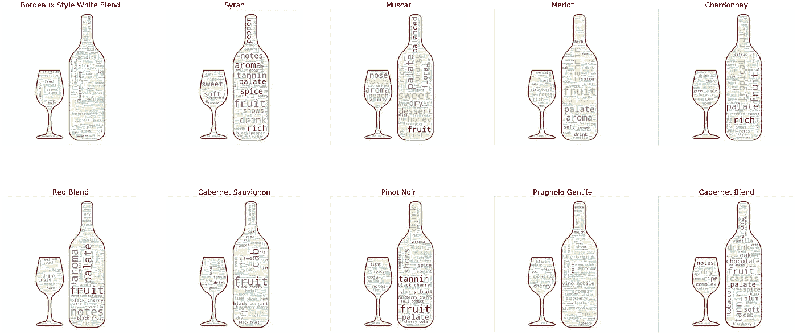

从上面的词云可以看出，排名前 10 的葡萄酒的热门词包括*果味、辛辣、干、甜味、香气、口感、药草、单宁*。一些葡萄酒有更具体的描述:

*   波尔多风格白葡萄酒:*苹果、柑橘、蜂蜜、葡萄柚、酸度*
*   西拉:*胡椒，复杂，甘草，年轻，优雅*
*   麝香葡萄:*甜品，酸度均衡，杏子，金银花*
*   Prugnolo: *皮革、烟、烟草、脆、厚*

# 描述能预测葡萄酒的一个特征吗？

为了解决这个问题，我们研究了数据，寻找可用于预测的特征。我们发现变量*省*和*品种*在很大程度上呈偏态分布，而*点*呈正态分布。我们决定用这个描述来预测一款酒的得分。

***创建和训练模型:*** 首先，我们使用来自预训练的全局向量文本文件的单词嵌入对描述文本进行预处理，该全局向量文本文件根据单词之间的关系对单词进行评级。然后，我们使用 3 种不同的模型来评估如何根据描述预测点数。这些模型包括 1D 卷积神经网络(CNN)、具有长短期记忆(LSTM)层的 1D CNN 和具有门控递归单元(GRU)的 1D CNN。CNN 是阅读单词嵌入的基本模型。LSTM 擅长在单词序列中寻找模式。GRU 是另一种递归神经网络架构，与 LSTM 类似，GRU 擅长理解单词上下文。我们没有使用纯粹的 LSTM 模型，因为它们在情绪预测方面表现不佳。下面的代码是 1D 有线电视新闻网。

```
*# set parameters:*
max_features = vocab_size
maxlen = 132
BATCH_SIZE = 128
embedding_dims = 50
filters = 250
kernel_size = 3cnn = Sequential()

*# start with an efficient embedding layer which maps*
*# vocab indices into embedding_dims dimensions*
embedding_layer = Embedding(vocab_size, 100, weights=[embedding_matrix], input_length=maxlen , trainable=**False**)

cnn.add(embedding_layer)

*# we add a Convolution1D, which will learn filters*
*# word group filters of size filter_length:*
cnn.add(Conv1D(BATCH_SIZE,
                 kernel_size,
                 padding='valid',
                 activation='relu',
                 strides=1))*# we use max pooling:*
cnn.add(GlobalMaxPooling1D())

*# We add a vanilla hidden layer:*
cnn.add(Dense(BATCH_SIZE))
cnn.add(Activation('relu'))

*# We project onto a single layer*
cnn.add(Dense(1))

cnn.compile(loss='mse',
              optimizer='adam',
              metrics=['accuracy'])
```

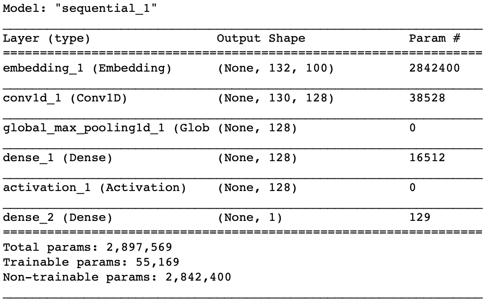

Model summary output for 1D CNN.

***评估模型:*** 表现最好的模型是 1D CNN，其在验证集上获得了 30%的准确度和 3 点的平均误差(基于均方误差的误差)。我们还尝试在 5 分的范围内将分数分成几类。使用这种方法，模型的准确率为 62%，平均误差为 0.3 点。我们的结果告诉我们，对于一个给定的描述，很难预测一个精确的点值，因为有太多的变化。然而，我们似乎可以很好地预测一定范围内的描述。

***问题:*** 给出的描述对预测有些什么问题。只有 20 位独特的审查者对该数据集做出了贡献。每个评论者都有自己的写作风格，使得预测问题变得更具挑战性。

# 反光

这个项目对我们来说是一个很好的机会，可以使用我们在大数据计算分析课上学到的大部分技能。不幸的是，我们无法访问不关注美国葡萄酒的数据集。如果时间允许，我们也想做一个针对美国的分析。我们希望使用更好的数据集来进行其他预测，例如查看葡萄酒的原产地如何影响其评级。

# 参考

 [## 屏蔽的 word cloud-word cloud 1 . 6 . 0 . post 1+g 8217 e 20 文档

amueller.github.io](https://amueller.github.io/word_cloud/auto_examples/masked.html#sphx-glr-auto-examples-masked-py) [](https://www.d3-graph-gallery.com/bubblemap.html) [## 气泡图 D3 图形库

### 如何用 Javascript 和 D3.js 构建顶部带有标记的地图:从最基本的例子到高度定制化…

www.d3-graph-gallery.com](https://www.d3-graph-gallery.com/bubblemap.html)  [## API 参考- seaborn 0.9.0 文档

### 在 FacetGrid 上绘制关系图的图形级界面。

seaborn.pydata.org](https://seaborn.pydata.org/api.html) 

由 Derek Albosta、Woo Jung、Emma Sheridan 和 Erik Tacam 完成的大数据计算分析课程项目。这个项目的源代码可以在 [*GitHub*](https://github.com/wsjung/caobd_project) *上找到。在* *这里可以找到* [*的交互式地图可视化。*](https://wsjung.github.io/caobd_project/)