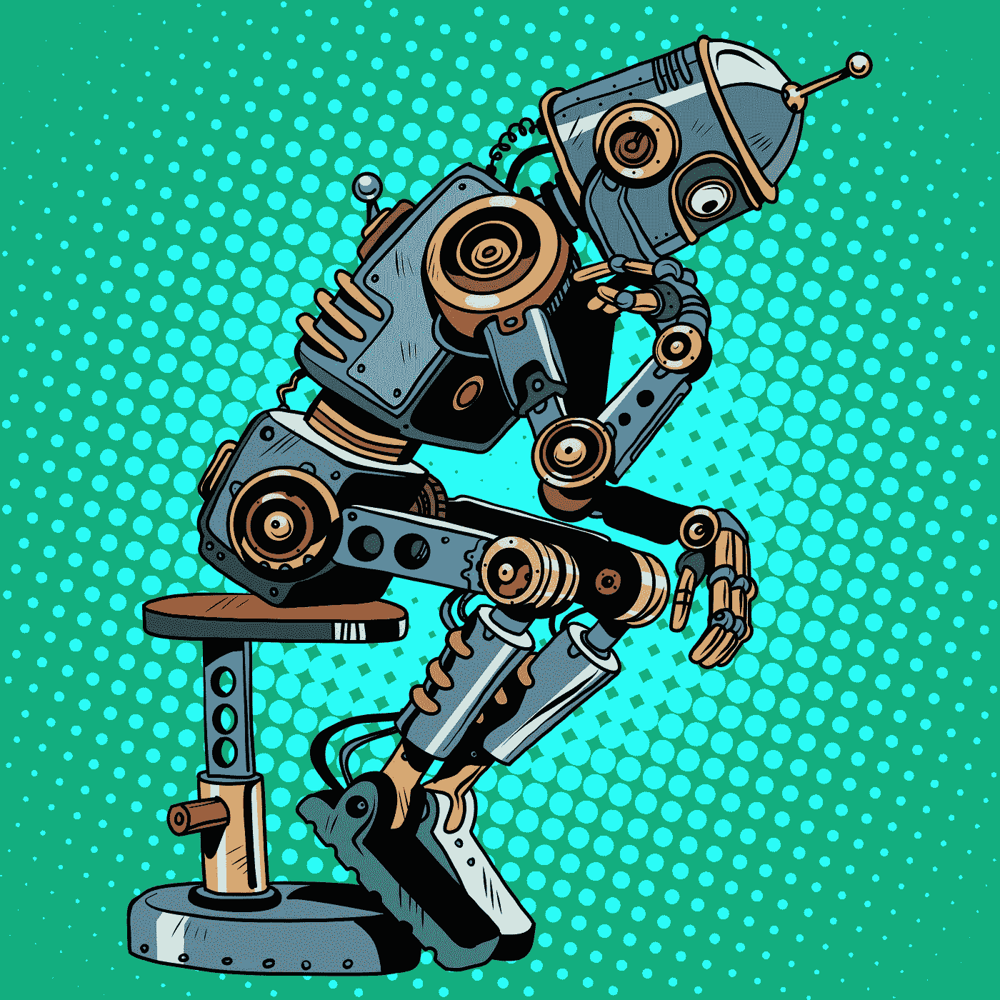
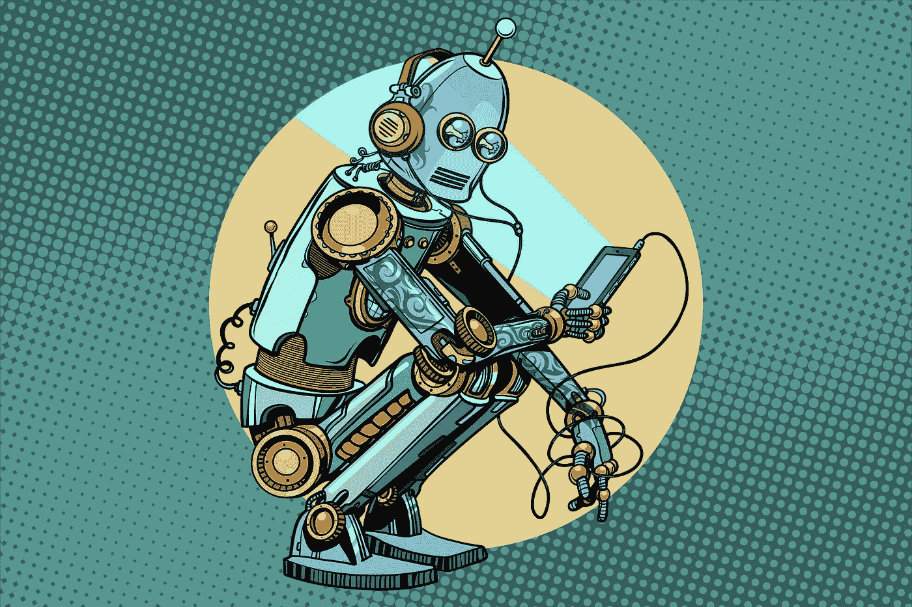

# 不炒作 AI

> 原文：<https://towardsdatascience.com/un-hyping-ai-bf87229b29ea?source=collection_archive---------40----------------------->

## [问我们任何事情](https://towardsdatascience.com/ask-us-anything/home)

## *让我们一劳永逸地揭开艾的神秘面纱。它的根源是什么？AI 真的在这里吗？如果不是，那么当前的现实是什么？*

我担任 TDS 的编辑助理已经有几年了，我很高兴看到的内容质量让我深受鼓舞，最重要的是，我从中学习。我还意识到，对于这个不断发展的学科中的所有技术专长，我们也需要回答一些关于人工智能的基本问题。我将在“[向我们提问](https://towardsdatascience.com/ask-us-anything/home)”中回答这些问题。欢迎大家的评论。尽情享受吧！

# 人工智能真的存在吗？

在最纯粹的定义里，人工智能还没有到来。

谷歌大脑的负责人杰弗里·辛顿认为，计算机可以像人类一样思考，使用直觉，而不是规则。表示[这个](https://cacm.acm.org/news/225209-mr-robot/fulltextcornerstones of):

> 我们是机器……我们只是被生物制造出来的。大多数做人工智能的人都不会怀疑我们是机器。我们只是极其奇特的机器。而我不应该说**只是。我们是特别的、奇妙的机器。**

顾名思义，这就是人工智能之父约翰·麦卡锡所说的:

> 人工智能是制造智能机器，尤其是智能计算机程序的科学和工程。

因此，计算机支持的系统将处理信息，以类似于人类在学习、决策和解决问题中的思维过程的方式产生结果。以下是人工智能的基石:

*   从经验中学习
*   它使用学习推理
*   它感知——意义，识别图像，声音等等。
*   解决复杂的问题
*   理解语言及其细微差别
*   创建透视图
*   随着时间的推移，它降低了错误率

事实上，人工智能是一个宽泛的术语，出现于 20 世纪 50 年代，当时人们试图让计算机执行人类任务。当我们朝着这个目标前进的时候，我们离这个现实要远得多。

我们今天对人工智能的大多数认同包括大规模的数字处理，它考虑了比人类可能更多的变量，以对输入的数据进行分类，并能够做出相当好的预测。

以下是人工智能的[阶段](https://www.em360tech.com/tech-news/tech-features/artificial-intelligence/):

*   **狭义 AI(ANI)——**专门协助或接管特定任务。
*   **通用 AI (AGI)** —机器有自我意识，有能力执行通用智能动作。AI 将军将会有效地处理你扔给它的任何问题。
*   **超级 AI**(ASI)——比人类聪明一个数量级的机器。
*   **奇点**——在这个阶段，关键词是*超越*和“*由 ASI 实现的指数发展道路可能导致人类能力的大规模扩展*

今天，机器被训练。人类编写代码是为了创造一个能够学习一件事的系统。我们正处在这样一个时代，我们正在教机器做一件或几件事情，做得和人类一样好，甚至比人类更好。

Robot Thinker — AI Progress via Deposit Photos

# **AI 的根源是什么？**

***生物神经元和人类如何处理信息***

为了理解人工智能如何进化，我们还需要理解人脑，一直到单个神经元——这是人工智能的心脏。*神经元是大脑和神经系统的特化细胞，在全身传递信号。他们的互动定义了我们是什么样的人。神经元会感知内部和外部刺激。神经元也将处理信息并在全身传递信号。它们会将这些信号以命令的形式发送到我们的肌肉，指导我们的行动。*

我们从内部和外部收到的每一个刺激都会将这些信号发送到我们系统中的其他神经元。考虑到普通人每分钟有 48.6 个想法，相当于每天 70，000 个想法。如果这些想法中有 10%在全身传递信号，那么超过 7000 个信号可以发出命令，促使身体肌肉执行诸如去商店、给朋友打电话、搜索信息等功能。因此，通过人工智能，这种方法是通过计算机复制生物神经元的行为:神经元中的每个节点都代表着向网络中的其他节点发出信号的信息。这些信号以难以想象的速度处理网络中的信息，并激活其他神经元的信号…等等…

人脑由大约 10 亿个神经元组成。每个神经元与其他神经元形成约 1000 个连接，总计超过 1 万亿个连接。

据《科学美国人》报道:

> 如果每个神经元只能存储一个单一的记忆，空间不足将是一个问题。你可能只有几千兆字节的存储空间，类似于 iPod 或 USB 闪存驱动器中的空间。然而，神经元结合在一起，每个神经元同时帮助许多记忆，以指数方式将大脑的记忆存储容量增加到大约 2.5 千兆字节(或 100 万千兆字节)。相比之下，2.5 兆字节相当于大约 300 万小时的电视节目。如果你的大脑像 PVR 一样工作，2.5 千兆字节将足以容纳 300 万小时的电视节目。你必须让电视连续运行 300 多年才能用完所有的存储空间。

# 计算机能思考到什么程度？

现实检验:计算机的表现和它们被训练的数据一样好。机器学习和深度学习都取得了重大进展。

[机器学习](https://en.wikipedia.org/wiki/Machine_learning) —可以定义为一种通过系统实现人工智能的方法，该系统可以从经验中学习，以在一组数据中找到模式。这意味着，通过例子教计算机识别模式，而不仅仅是用特定的规则给它编程。在常见的例子中，机器学习可以用来训练计算机识别图像，并通过计算机视觉进行分类，理解和分析人类语言，包括文本和语音(自然语言处理)。

理解神经元的功能对 Hinton 在深度学习实践中创建神经网络有着重要的贡献。根据[的定义](https://en.wikipedia.org/wiki/Deep_learning)，神经网络是一套*算法，大致模仿人脑，设计用来识别模式*一个神经网络通常包括大量并行运行的[处理器](https://whatis.techtarget.com/definition/processor)和分层排列的:

*   ***输入层*** —第一层接收原始输入信息——这类似于人类视觉处理中视神经的功能。
*   ***隐藏层*** —中间层是由神经元无止境的组合和连接而产生的。每一个连续的层接收来自它前面的层的输出。根据神经元连接的体积和组合，可能有许多隐藏层。隐藏层的作用是将输入转换成输出层可以使用的东西。
*   ***输出层*** —最后一层产生系统的输出，即输入层和隐藏层交互的结果(或动作)。通过[反向传播](https://en.wikipedia.org/wiki/Backpropagation)，输出层也将隐藏层激活转换为输出函数所需的比例。当他们学习和吸收更多关于世界的信息时，他们会改变自己。

我们试图用这种机械的方式来模仿人脑的功能。我们的大脑分布在一个巨大的细胞网络上，由无尽的神经元地图连接，沿着十亿条路径放电、连接和传输。”

要回答这个问题，计算机无法思考，至少在人类的水平上是如此。随着更多信息的获取，计算机能够在数据和表面见解中寻找模式。计算机做不到的是准确定义上下文。人类的认知很容易区分演员汤姆·克鲁斯和一艘游轮。随着时间的推移，计算机需要大量的数据输入才能始终如一地做出这些简单的区分。为了做到这一点，他们还需要时间来成熟，并被他们的前辈——是的，被辛顿视为人类的“*特殊奇妙的机器*”)抚养长大

感谢阅读。如果您有任何问题想问我们的团队，您可以在这里[提问](/ask-us-anything-70617fc7eccf)。