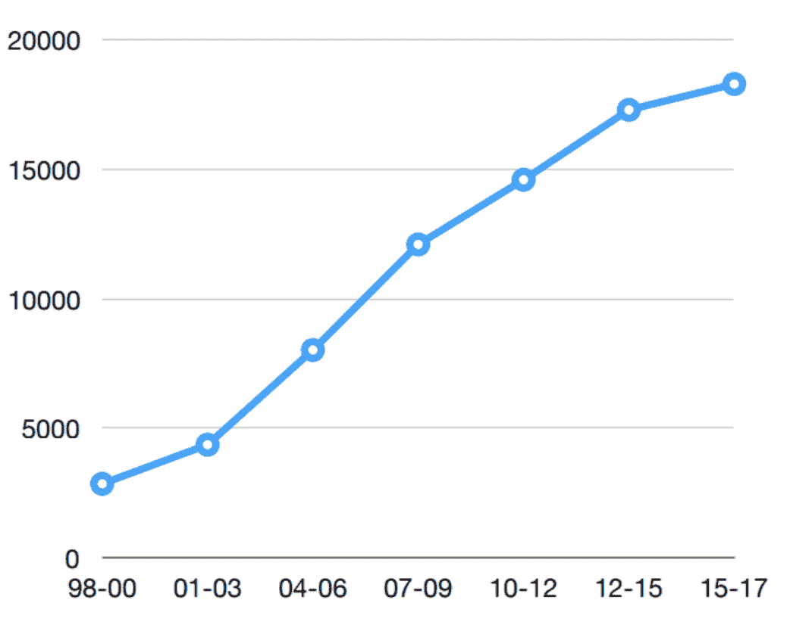
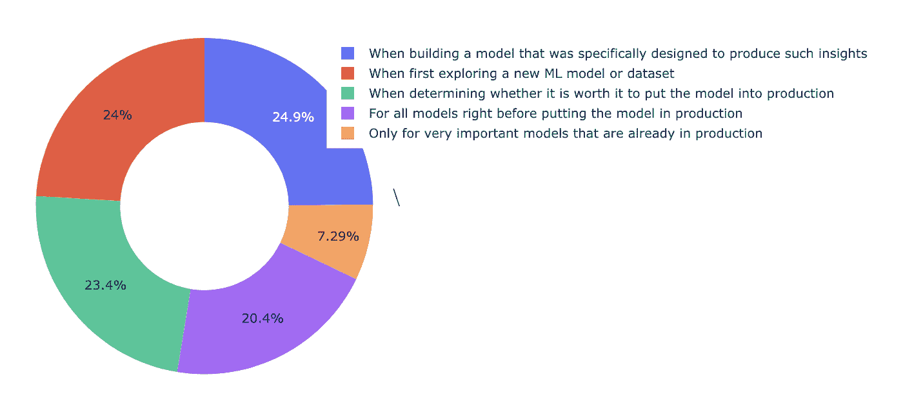

# 拆箱机器学习:黑盒模型的特征重要性

> 原文：<https://towardsdatascience.com/unboxing-machine-learning-feature-importance-for-black-box-models-ea12268ddb23?source=collection_archive---------28----------------------->


Source: unsplash — Free stock images

## 因为当我们理解事物时，生活会更美好

在之前的一篇文章中，讨论了在进行数据科学和机器学习时良好的绘图技巧的重要性，我写了一点关于我们应该如何认真对待可解释性和可解释性。正如我之前已经说过的:你可能是一个天才，但是如果你不能向第三方解释你是如何以及为什么得到那些美妙的预测，那么你可能什么都没有。想象一下，告诉某人她或他有超过 90%的可能性患有致命疾病，但却无法解释她/他你是如何得出这个结论的，或者是什么具体症状导致你得出这样的结论。

事实上，在我最近阅读的一本名为[《赤裸裸的统计数据》](https://www.goodreads.com/book/show/17986418-naked-statistics)的书中，作者 Charles Wheelon 花了很多时间讲述医疗费用的增加是如何给在卫生行业工作的数据科学家带来压力的。为什么？历史上，当谈到假阳性与假阴性的权衡时，这个行业是作为一个例子给出的。因为当然，如果我们必须选择，我们总是希望开发一个具有高召回率的模型——最大限度地减少假阴性(即人们患有疾病，但被归类为没有疾病)的数量，而不是一个具有高精确度的模型——最大限度地减少假阳性(即人们没有患病，但被归类为患有疾病)的数量。然而，Wheelon 解释了如今让某人进入医疗系统进行研究和治疗的成本也给尽可能实现更高的精确度带来了很大的压力。对于任何在卫生行业工作的人来说，实现“完美”模型的高压也意味着越来越多的内部和外部需求，以了解为什么机器学习模型会提出这样或那样的建议。在外部，这意味着越来越多的利益相关者要求解释，而在内部，对模型更好的理解通常会导致更好的建模本身。

事实上，在过去几年中，关于机器学习中可解释性主题的论文数量一直在稳步增长:



Source: [http://people.csail.mit.edu/beenkim/papers/BeenK_FinaleDV_ICML2017_tutorial.pdf](http://people.csail.mit.edu/beenkim/papers/BeenK_FinaleDV_ICML2017_tutorial.pdf)

现在，最大的问题是，今天机器学习世界中一些最准确的模型是我们所说的“黑盒”模型。这些模型缺乏可解释性和可解释性，因为它们通常的工作方式意味着除了一组规则或参数集之外，机器的一个或几个层在没有人类监督的情况下做出决策。并且通常，甚至该领域中最专业的专家也不能理解例如通过训练神经网络实际产生的功能。从这个意义上说，一些最经典的机器学习模型更好。

例如，线性/逻辑回归为我们提供了一个非常清晰的数学方程，当试图最小化损失函数时，每个特征对我们的预测有多大影响。决策树有一个非常清晰的方法来选择特征，根据它们在不同阈值下区分数据成员的有用程度。然而，考虑到 ML 材料的可解释性和可解释性通常与通过查看特征重要性和相关性来分析模型特征相关联，我们如何用简单的英语解释当使用这些复杂的模型之一，甚至是[集成工具](https://scikit-learn.org/stable/modules/ensemble.html)如 Bagging 或 Boosting 时，哪些特征在驱动我们的预测？

事实上，对于 [2018 年 Kaggle DS 和 ML 调查](https://www.kaggle.com/sudhirnl7/data-science-survey-2018/data)，数千名数据行业的专业人士表达了他们对在什么情况下探索模型洞察力和解释模型预测的看法，尽管原因可能不同，但他们都至少提到了一个对他们的业务很重要的场合:



Source: 2018 Kaggle DS and ML Survey

考虑到分析特征重要性的日益增长和共享的重要性，在这篇文章的剩余部分，我们将看到一个叫做“排列重要性”的工具。

置换重要性为我们提供了一种方法，通过测量当一个特性不可用时得分如何降低来计算任何黑盒估计器的特性重要性。这个想法是这样的:当一个特性不可用时，特性的重要性可以通过查看分数降低多少来衡量。为此，可以从数据集中移除一个特征，重新训练估计器并检查分数。但是这样做的计算量很大。相反，我们可以用随机噪声替换每个特征，并在每个特征的每次迭代中再次评分。这就是为什么这种了解特征重要性的方法也被称为“平均降低准确度(MDA)”。

正如你所想象的，从头开始这样做是完全可能的，但幸运的是，我们在你的机器学习项目中实现了排列重要性，你可以只导入下面的[库](https://eli5.readthedocs.io/en/latest/autodocs/sklearn.html#module-eli5.sklearn.permutation_importance):

```
from eli5.sklearn import PermutationImportance
```

使用它非常简单，一旦你训练了你的模型，你唯一要做的就是再次拟合你的数据，调用你的模型，如下所示:

```
permutation_importance = PermutationImportance(your_model, random_state=1).fit(X_train_data, y_train_data)
```

考虑到您将对数据集的多个版本进行重新评分，因此该算法将需要一段时间来运行。

一旦 PermutationImportance 完成了它的工作，您可以获得两个有趣的东西:

1.  当然，您可以通过调用以下命令来获得特性的重要性:

```
permutation_importance.feature_importances_
```

1.  您还可以通过调用以下命令来获取要素重要性的标准差:

```
permutation_importance.feature_importances_std_
```

正如你所看到的，这是一个简单而强大的工具。的确，在现实中，当使用高度复杂的模型时，它并没有解决与模型可解释性和可解释性相关的背景问题。然而，它让我们更接近理解我们的数据，以及我们的每个特征对我们的模型有什么贡献。这已经是一个开始了！

最后，别忘了看看我最近的一些文章，比如[提高你绘图技能的 10 个技巧](/10-tips-to-improve-your-plotting-f346fa468d18?source=friends_link&sk=b2f7a584a74badc44d09d5de04fe30d8)、[我在使用火车测试分割](/6-amateur-mistakes-ive-made-working-with-train-test-splits-916fabb421bb)或[5 分钟内抓取网页时犯的 6 个业余错误](/web-scraping-in-5-minutes-1caceca13b6c)。在[我的中等档案](https://medium.com/@g.ferreiro.volpi)中可以找到所有这些以及更多信息。另外，**如果你想直接在你的邮箱里收到我的最新文章，只需** [**订阅我的简讯**](https://gmail.us3.list-manage.com/subscribe?u=8190cded0d5e26657d9bc54d7&id=3e942158a2) **:)**

也可以通过…取得联系

*   领英:[https://www.linkedin.com/in/gferreirovolpi/](https://www.linkedin.com/in/gferreirovolpi/)
*   GitHub:[https://github.com/gonzaferreiro](https://github.com/gonzaferreiro)(那里有我所有的代码)

下一篇文章再见！