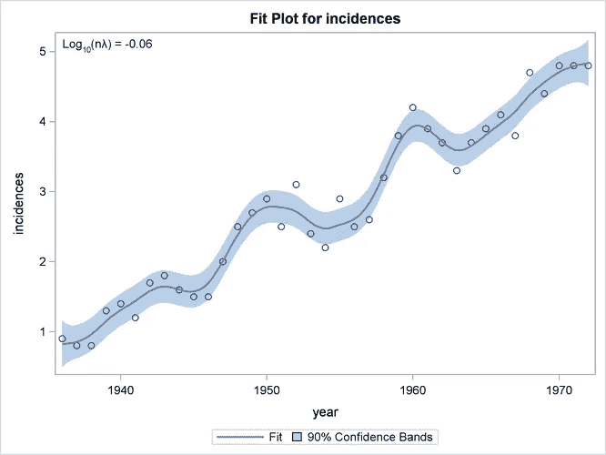
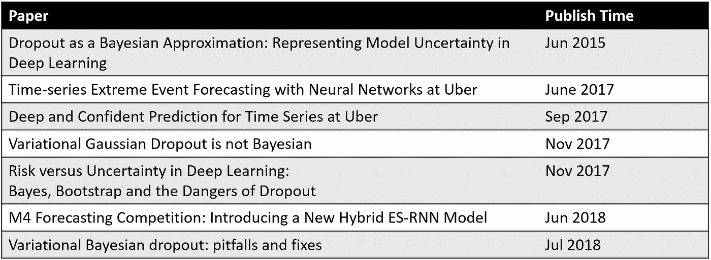
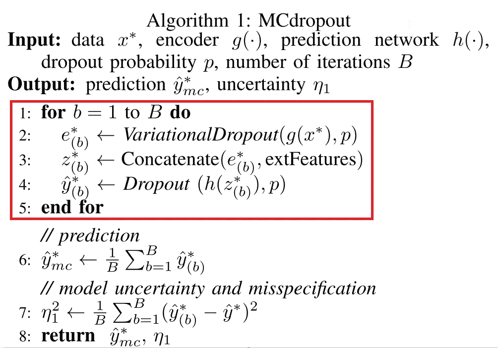
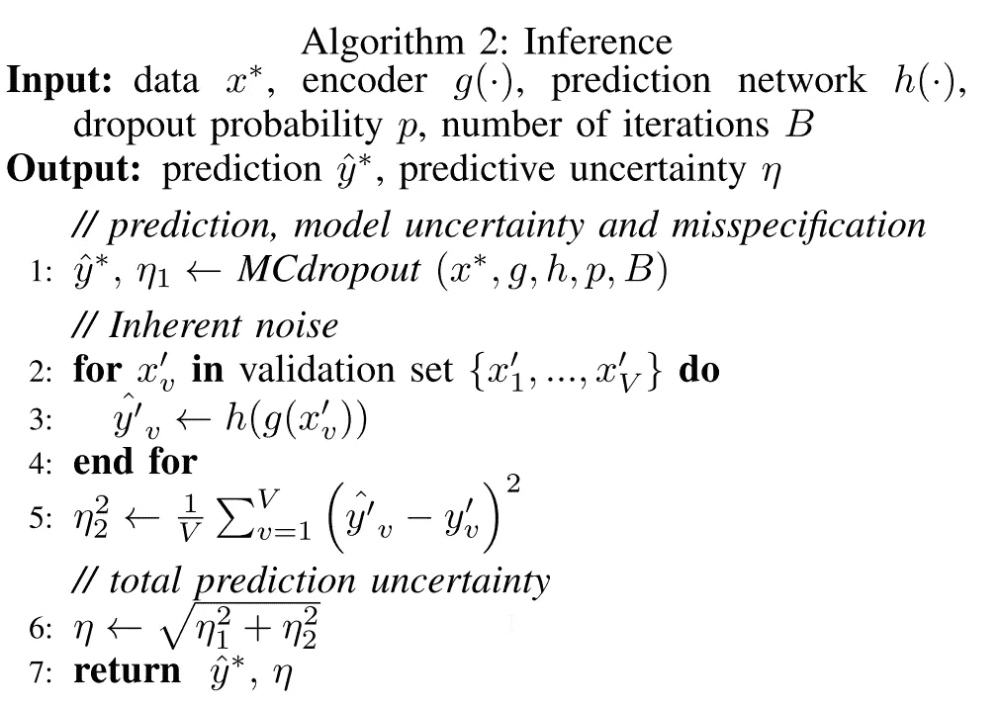

# 神经网络的不确定性估计——贝叶斯近似下的丢失

> 原文：<https://towardsdatascience.com/uncertainty-estimation-for-neural-network-dropout-as-bayesian-approximation-7d30fc7bc1f2?source=collection_archive---------6----------------------->

> **本文的主题是，你可以利用辍学来建立预测信心。**

这篇文章主要讲的是我如何从优步的论文*开始对优步的时间序列进行深刻而自信的预测。*使用神经网络解释模型并不是一件容易的事情，了解神经网络的可信度对企业来说非常重要。尽管这一系列论文中有许多复杂的证明，但它们都试图回答一个简单的问题

> **我的模型对某个特定的预测有多大把握？**

**目录**

*   [背景](https://medium.com/p/7d30fc7bc1f2#b529)
*   [优步时间序列深度自信预测](http://www.medium.com/p/7d30fc7bc1f2#2bb3)
*   [不确定性估计](https://medium.com/p/7d30fc7bc1f2#5188)
*   [MCDropout](https://medium.com/p/7d30fc7bc1f2#b600)
*   [固有噪音](https://medium.com/@nokkk/uncertainty-estimation-for-neural-network-dropout-as-bayesian-approximation-7d30fc7bc1f2#ef27)
*   [讨论](https://medium.com/p/7d30fc7bc1f2#0f5d)
*   [结论](https://medium.com/p/7d30fc7bc1f2#ab6a)
*   [附录](https://medium.com/p/7d30fc7bc1f2#492a)

# 背景

我们正在处理一些商业预测问题，因此我们正在研究预测的新方法，特别是神经网络的新方法。(我知道 LSTM/编码器-解码器/seq2seq，但我没有听到它的很多令人兴奋的性能)。我能找到的大公司关于**时间序列**的公开讨论不多**，**我能找到最接近的是脸书的 [**预言家**](https://github.com/facebook/prophet) ，这是一种纯粹的统计基数预测方法。

优步在优步 *有一篇论文 ***对时间序列进行了深刻而自信的预测，这篇论文*引起了我们的注意，因为他们是在概率编程上投入大量资源的行业参与者之一。经过一番研究，我发现[优步还赢得了](https://eng.uber.com/m4-forecasting-competition/)M4 竞赛(一个著名的时间序列竞赛)M4 竞赛不仅需要准确的预测，还需要预测的置信区间。他们也开放了源代码 [Pyro](http://pyro.ai/) ，这是一个概率编程库，所以结合这些事实，我有理由相信他们正在做一些有趣的(实际上有用的)工作。***

我没有很深的统计学背景,“贝叶斯”这个词对我来说几乎毫无意义，我只知道它与条件概率有关，仅此而已。我非常努力地回忆我关于贝叶斯和频率主义者的统计，这个奇妙的线索很好地解释了这一点。

# 优步时间序列的深度自信预测

优步已经写了一篇关于这项工作的[博文](https://eng.uber.com/neural-networks-uncertainty-estimation/)，我从第一篇论文开始，但最后又读了几篇论文(一些是早期的基础工作，一些是后续工作)。我不会花太多的话来解释这些文件，因为我不能理解每一个步骤。相反，我将只**强调**我的研究旅程中的重要部分，并鼓励你们通读这篇论文。

> 我们表明，在神经网络中使用脱落(及其变体)可以被解释为一个众所周知的概率模型的贝叶斯近似:高斯过程(GP)

我个人并不是 100%相信这项工作，但他们已经显示出巨大的实际效果，这是最重要的部分。(像 BatchNorm 一样，人们长期以来一直在思考为什么它会以错误的理由工作，但这并不能阻止任何人使用它，因为它**的确**提高了模型的收敛性)

**研究过的论文**:

1.  *优步时间序列深度自信预测*
2.  [*优步时间序列极端事件神经网络预测*](http://roseyu.com/time-series-workshop/submissions/TSW2017_paper_3.pdf)
3.  [*作为贝叶斯近似的漏失:表示深度学习中的模型不确定性*](https://arxiv.org/pdf/1506.02142.pdf)
4.  [*变分贝叶斯辍学:陷阱与修正*](https://arxiv.org/pdf/1807.01969.pdf)
5.  [*变分高斯漏失不是贝叶斯*](https://arxiv.org/pdf/1711.02989.pdf)
6.  [深度学习中的风险与不确定性:贝叶斯、自助和辍学的危险](https://pdfs.semanticscholar.org/dde4/b95be20a160253a6cc9ecd75492a13d60c10.pdf)

其他资源:

1.  [*M4 竞赛:结果、发现、结论和前进方向*](https://eng.uber.com/m4-forecasting-competition/)
2.  [*深度学习中的不确定性*](http://mlg.eng.cam.ac.uk/yarin/thesis/thesis.pdf) (亚林·加尔的论文)

在阅读一系列材料时，有一个时间线是很有用的。

Timeline

# **不确定性估计**

贝叶斯的一个关键区别是参数是分布而不是固定的权重。

> 误差=模型不确定性+模型错误设定+固有噪声

贝叶斯神经网络将不确定性分解为**模型不确定性**、**模型误设定**和**固有噪声**。

## **MCDropout**

MCDropout

贝叶斯的一个关键是一切都是概率分布，而不是点估计。这意味着你的体重也有不确定性。

他们使用 **MCDropout** 来处理模型不确定性和错误设定。基本上，他们已经声称在**推断**时间使用 Dropout 相当于做贝叶斯近似。这里的关键思想是让辍学者在**培训和测试时间做同样的事情。**在测试的时候，你会重复 B 次(如论文所说的几百次)，也就是把相同的输入以随机的丢包传递给网络。然后，利用您的预测，您可以使用这些# of B 预测生成一个预测间隔。MC 指的是蒙特卡罗，因为退出过程类似于对神经元进行采样。

## **固有噪音**

Inherent Noise

他们还引入了术语**固有噪声**，指的是不可减少的噪声。简而言之，他们使用一种非常常见的技术来模拟这种错误——拒绝验证。他们称之为自适应方法，谈论平滑和先验，但是我看不出与 ML 社区熟悉的标准训练/验证实践有任何区别。最后，你会把两个误差项合并，得到最终的不确定项。

# 讨论

你可以在 Reddit 上找到一个[有趣的讨论](https://www.reddit.com/r/MachineLearning/comments/7bm4b2/d_what_is_the_current_state_of_dropout_as/)，它从理论的角度提供了一些反驳。事实上，我并不完全相信优步的论文。然而，他们在国内的[和 M4 的比赛中都取得了不错的成绩。像深度学习中许多进步一样，理论晚于实际结果。如果您感兴趣，请随意尝试，实现应该相对容易，因为您只需要在推理时保持 dropout。](https://eng.uber.com/neural-networks-uncertainty-estimation/)

# 结论

要点是，不确定性不仅存在于你的模型中，也存在于你的体重中。贝叶斯神经网络试图将权重建模为分布。

MCDropout 提供了一种新的简便的方法来估计不确定性，在大多数现有的网络变化最小。在最简单的情况下，您只需要在测试时保持 dropout on，然后多次传递数据并存储所有预测。不利的一面是，这可能计算量很大，尽管优步声称这增加了不到 10 毫秒。他们没有讨论他们如何实现这一点，但我猜测他们会进行大量的并行计算，因为你可以想象数据的多次传递不会按顺序进行，所以这个过程很容易并行。

我非常渴望听到更多关于最新的时间序列预测和用神经网络估计不确定性的方法的讨论，如果你知道一些更好的方法，请告诉我！

# 附录

从哪里开始？google 的关键字名称:

*   Yarin Gal(他在论文中提出使用脱落进行贝叶斯近似)
*   slawek Smyl(M4 竞赛获奖者)

如果你只想了解申请。快速浏览一下[2]然后[1]，由于[1]是为[1]做铺垫，有些背景是重复的。

[4]很好地概述了使用辍学的一些陷阱

1.  *优步时间序列深度自信预测*
2.  [*优步时间序列极端事件神经网络预测*](http://roseyu.com/time-series-workshop/submissions/TSW2017_paper_3.pdf)
3.  [*作为贝叶斯近似的漏失:表示深度学习中的模型不确定性*](https://arxiv.org/pdf/1506.02142.pdf)
4.  [*变分贝叶斯辍学:陷阱与修正*](https://arxiv.org/pdf/1807.01969.pdf)
5.  [*变分高斯漏失不是贝叶斯*](https://arxiv.org/pdf/1711.02989.pdf)
6.  [深度学习中的风险与不确定性:贝叶斯、自助和辍学的危险](https://pdfs.semanticscholar.org/dde4/b95be20a160253a6cc9ecd75492a13d60c10.pdf)

[https://tensor chiefs . github . io/BBS/files/dropouts-brown bag . pdf](https://tensorchiefs.github.io/bbs/files/dropouts-brownbag.pdf)(亚林加尔)