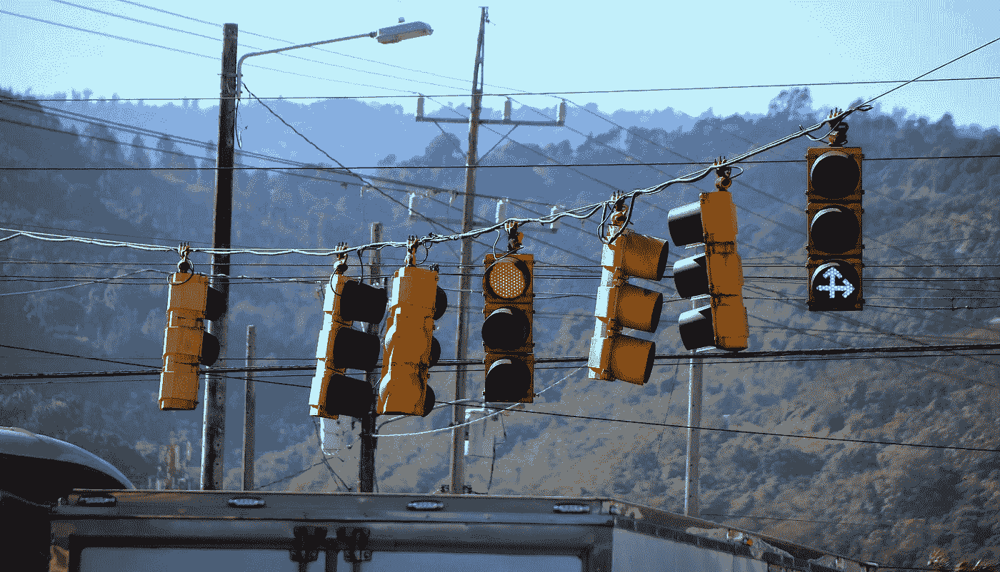
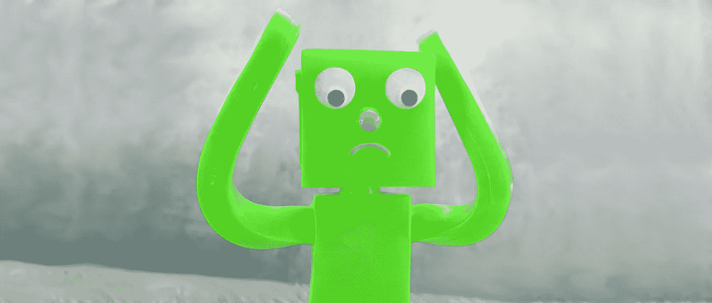
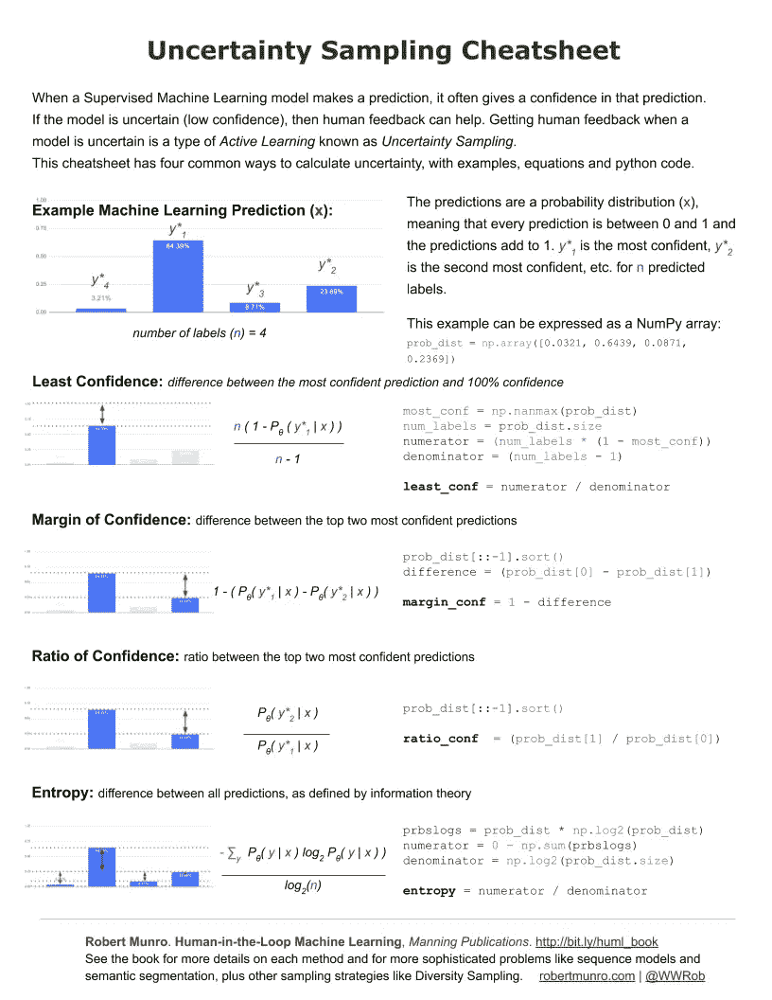

# 不确定性采样备忘单

> 原文：<https://towardsdatascience.com/uncertainty-sampling-cheatsheet-ec57bc067c0b?source=collection_archive---------12----------------------->

当有监督的机器学习模型做出预测时，它通常会给出该预测的置信度。如果模型是不确定的(低置信度)，那么人类的反馈可以有所帮助。当一个模型不确定时，获得人类的反馈是一种被称为*不确定性采样*的*主动学习*。

备忘单中涵盖的四种不确定性采样类型是:

1.  **最不自信:**最自信预测和 100%自信之间的差异
2.  **置信区间:**两个最有把握的预测之间的差异
3.  **置信度:**最有把握的两个预测之间的比率
4.  **熵:**所有预测之间的差异，由信息论定义

本文分享了这四种计算不确定性的常用方法的备忘单，包括示例、等式和 python 代码。下次你需要决定如何计算你的模型的置信度时，把它作为一个参考！

数据科学家通常使用不确定性采样来对项目进行采样，以便进行人工审查。例如，想象一下，你负责一个机器学习模型来帮助自动驾驶汽车理解交通。你可能有数百万张从汽车前部摄像头拍摄的未标记图像，但你只有时间或预算来标记 1000 张。如果你随机采样，你可能会得到大部分来自高速公路驾驶的图像，自动驾驶汽车已经很自信，不需要额外的训练。因此，您将使用不确定性采样来查找 1，000 个最“不确定”的图像，其中您的模型最混乱。

Confusing traffic lights

当您使用新标记的示例更新您的模型时，它应该会变得更智能、更快。

An uncertain robot

这篇备忘单摘自我的书《人在回路中的机器学习:[https://www . manning . com/books/人在回路中的机器学习](https://www.manning.com/books/human-in-the-loop-machine-learning#ref)

有关每种方法的更多细节和比标记更复杂的问题，如预测文本序列和图像的语义分割，请参见这本书。不确定度的原理是一样的，但是不确定度的计算会不一样。

这本书还涵盖了其他主动学习策略，如多样性抽样，以及解释你的模型概率分布的最佳方式(*提示:*你可能无法相信你的模型的可信度)。

# 下载代码和备忘单:

您可以从这里下载代码:

 [## RM unro/不确定性 _ 采样 _ 数字

### 针对不确定性的常见主动学习策略的 NumPy 实现对四种不确定性进行采样…

github.com](https://github.com/rmunro/uncertainty_sampling_numpy) 

您可以在此下载 PDF 版本的备忘单:

我还将在以后发布 PyTorch 中的代码，以及更多种类的算法。

*编辑:PyTorch 版本的备忘单现已发布:*[http://robertmunro . com/Uncertainty _ Sampling _ cheat sheet _ py torch . pdf](http://robertmunro.com/Uncertainty_Sampling_Cheatsheet_PyTorch.pdf)

# 进一步阅读

不确定性抽样已经存在很长时间了，有很多好的文献。一篇关于最不自信的优秀早期论文是:

阿伦·库洛塔和安德鲁·麦卡勒姆。2005.减少结构化预测任务的标记工作。 *AAAI* 。[https://people . cs . umass . edu/~ McCallum/papers/multi choice-aaai 05 . pdf](https://people.cs.umass.edu/~mccallum/papers/multichoice-aaai05.pdf)

一篇关于置信区间的优秀早期论文是:

托拜厄斯·谢弗，克里斯蒂安·德科曼和斯特凡·弗罗贝尔。2001.用于信息抽取的主动隐马尔可夫模型。*伊达*。[https://link . springer . com/content/pdf/10.1007/3-540-44816-0 _ 31 . pdf](https://link.springer.com/content/pdf/10.1007/3-540-44816-0_31.pdf)

将信息论用于基于熵的采样的一篇好的早期论文是:

伊多·达甘和肖恩·p·恩格尔森。1995.用于训练概率分类器的基于委员会的采样。*95 年的 ICML。*[http://citeseerx.ist.psu.edu/viewdoc/summary?doi=10.1.1.30.6148](http://citeseerx.ist.psu.edu/viewdoc/summary?doi=10.1.1.30.6148)

更一般地说，不确定性采样的基础文件是:

戴维·刘易斯和威廉·盖尔。1994.一种训练文本分类器的顺序算法。*94 年的 SIGIR。*[https://arxiv.org/pdf/cmp-lg/9407020.pdf](https://arxiv.org/pdf/cmp-lg/9407020.pdf)

要获得更多关于不确定性抽样的学术论文，请查找引用上述论文的被广泛引用的近期工作。

这些例子在我自己的文章中也有涉及:

罗伯特·芒罗。2020 年(预计)。人在回路中的机器学习。曼宁出版公司。https://www . manning . com/books/human-in-the-loop-machine-learning

我文本中的章节是按照他们所写的内容出版的——不确定性抽样章节现在已经出版，多样性抽样章节将是下一个。我会边走边分享摘录，就像我最近在机器学习知识象限中做的那样:

 [## 机器学习的知识象限

### 迁移学习、不确定性采样和多样性采样来改进您的机器学习模型。

towardsdatascience.com](/knowledge-quadrant-for-machine-learning-5f82ff979890) 

# 实施不确定性采样

备忘单中的所有方程返回[0，1]范围内的不确定性分数，其中 1 是最不确定的。许多学术论文没有对分数进行标准化，所以你可能会在上面的论文中看到不同的方程。但是，我建议您为任何用于非研究目的的代码实现规范化的[0–1]等式:[ 0–1]范围使下游处理、单元测试和抽查结果更容易。

本文和 GitHub 库中共享的代码都是开源的，所以请使用它来入门！

罗伯特·芒罗

2019 年 7 月