# 用于真实世界机器或深度学习项目的不寻常的数据清理器

> 原文：<https://towardsdatascience.com/uncommon-data-cleaners-for-your-real-world-machine-or-deep-learning-project-f926d8ecb258?source=collection_archive---------36----------------------->


Cleaning Tools

# 介绍

数据清理是您的实体课程或在线课程中简要涉及的一个主题。然而，在您作为数据工程师或数据科学家的工作中，您将花费大量时间准备(预处理)数据，以便可以将数据输入到您的模型中。

[](/what-70-of-data-science-learners-do-wrong-ac35326219e4) [## 70%的数据科学学习者做错了什么

### 在大学工程课程中，我的头反复撞在 2 米长的金属杆上，从中吸取了教训

towardsdatascience.com](/what-70-of-data-science-learners-do-wrong-ac35326219e4) 

> 企业数据科学仍然是一个新领域。许多学者还没有为真正的企业解决真正的问题。因此，他们以一种脱离数据和商业背景的方式教授教科书算法。这可能是智力上的乐趣。但是，如果学生认为这些课程为他们成为数据科学家做好了准备，那他们就错了。

**Paso** 将提供你清理数据所需的许多工具，但不是全部。

仅仅因为**帕索**提供了一个工具并不意味着你应该在你的数据集上使用它。例如，删除具有高密度 nan 的行将导致更差的损失度量或不希望的偏差，但并非总是如此。

不同清洗策略(管道)的迭代是 **Paso** 的基本目标。讨论分为以下几个主要部分:

1.  首先，我们用一个 **Paso** 输入器加载`boston`数据集。它具有相对少的行数，同时具有少于十个特征，以产生快速清洁。
2.  接下来，我通过管理相对干净的`boston`数据集来演示每一个清理器。
3.  最后，我们总结一下 **Paso''** 数据清理器以及我们对未来文章和 **Paso** 版本的计划。

[](https://medium.com/@dr.bruce.cottman/pasos-offering-of-logging-and-parameter-services-for-your-python-project-c3ae2fd6869a) [## paso 为您的 Python 项目提供日志记录和参数服务

### paso 为您的 Python 项目提供日志记录和参数服务

paso 为您的 Python Projectmedium.com 提供日志记录和参数服务](https://medium.com/@dr.bruce.cottman/pasos-offering-of-logging-and-parameter-services-for-your-python-project-c3ae2fd6869a) 

正如我们在上面标题为 [***的文章中看到的，paso 为您的 Python 项目***](https://medium.com/@dr.bruce.cottman/pasos-offering-of-logging-and-parameter-services-for-your-python-project-c3ae2fd6869a)*提供日志记录和参数服务，我们应该启动 **paso** 服务。*

```
*import pandas as pd
from paso.base import Paso,Log,PasoError
from loguru import logger
session = Paso(parameters_filepath='../parameters/default-lesson.2.yaml').startup()*
```

*我们将使用`Inputer,`,只是说明它是一个通用类，用于将数据输入到 **pandas** dataframe 中。描述文件描述的数据集:`city.yaml`。在下面的媒体文章中会更详细地讨论`Inputer`和描述文件:*

*[](https://medium.com/@dr.bruce.cottman/part-1-balancing-and-augmenting-structured-data-4ade0df38662) [## 第 1 部分:平衡和扩充结构化数据

### 数据扩充很重要，因为它从我们当前现有的数据集生成(准确地)人工数据。的…

medium.com](https://medium.com/@dr.bruce.cottman/part-1-balancing-and-augmenting-structured-data-4ade0df38662) 

```
from paso.pre.inputers import Inputers
dataset_name = 'boston'
inputer = Inputers(description_filepath='../descriptions/pre/inputers/'+dataset_name+'.yaml')
dataset = inputer.transform()
inputer.target'MEDV'
```

# 管理数据集

通常情况下，我们获取数据并必须清理它。这样的数据集是专有的。毕竟，没有人愿意向公众展示他们的肮脏数据(呻吟)。

为了展示这些数据清理器是如何工作的，我们可以找点乐子，整理一个干净的数据集。

# 清除程序:缺少值

检测和纠正缺失值和异常值(好的或坏的)是一个不断发展的研究领域。我们将在关于**Paso**scaler 的文章中讨论异常值。对于本文，我们将只关注丢失的值。

不同的值可以表示缺少一个值。举个例子，

*   `999`在某些功能中可能表示“未回答”。
*   `NA`可能表示不适用于此功能/记录。
*   `-1`可能意味着缺少此功能/记录。
*   诸如此类。

在这里你可以找到更多关于缺失数据的熊猫指南的细节。

对于第一个显示的 cleaner，我们添加了特性`asv`，它具有所有相同的值`999`。

```
from paso.pre.cleaners import Cleaners
c = Cleaners()
dataset['asv'] = 999.0
c.values_to_nan(dataset,values=[999.,11999.],inplace=True)
dataset.head()
```

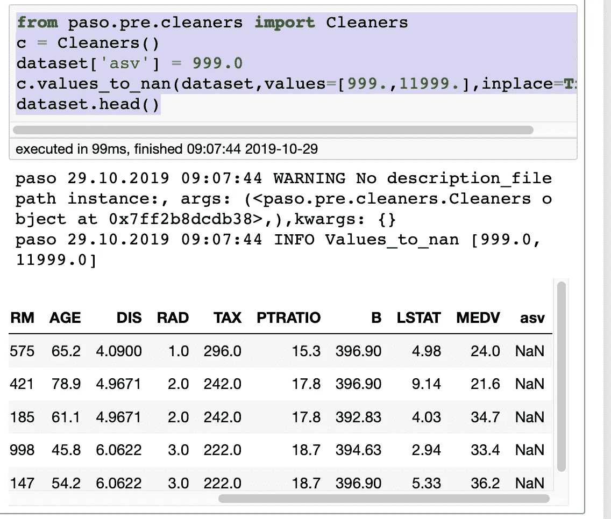

c.values_to_nan on dataset

该清洁剂，`c.values_to_nan`将所有`999`值更改为`NaN`。还要注意的是，作为`inplace=True`，数据集是自己改变的，通过避免复制`dataset`来节省内存。

# 清洁器:计算比率

缺失值(观察值)比率较大的行在统计上不相关。同样，您可能希望**估算**缺失值，即将缺失值更改为其他值。

每行缺失值的数量是信息，这本身表明它应该是该数据集的一个新特性。

使用此`Cleaner`，不删除带有`NaN`的行，而是为每一行计算 number _ of _ nulls/total _ row _ count，并将一个新特征`NaN_ratio`添加到返回的 **pandas** 数据帧中。

我们将再次使用同一个`Cleaner`实例`c`。同样，让我们通过将第一行的第一个和第二个特性设置为`NaN`来对`dataset`进行更多的修改。

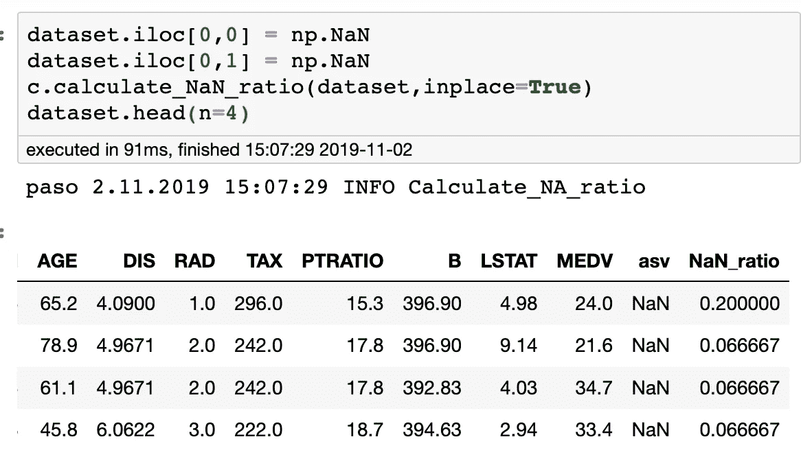

Cleaner calculate_NaN_ratio transforming dataset

注意这里有一个新的特性，`NaN_ratio`。正如我们所料，第一行的`NaN/total_row_count`比率不同于第二行和后面的行。

`Cleaner`属性`column_missing_value_ratio`包含每个特征的缺失值比率。提示:您可以在堆叠合奏中使用这些。我们将在另一篇文章中讨论这个问题。

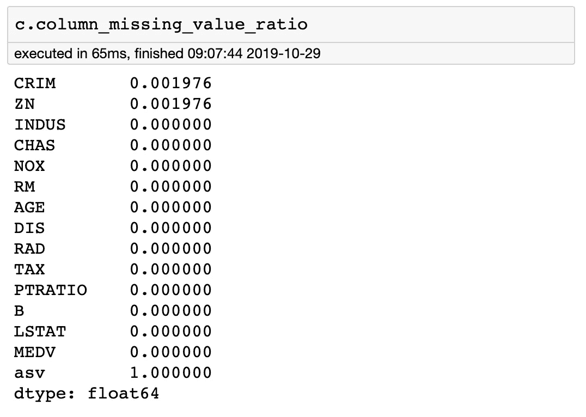

# 估算:将 NaN 更改为值

将`NaN`设置为最佳近似值是您数据清理工作的关键，并进一步降低您的预测准确性和能力。关于这个主题的一篇流行文章:

[](/6-different-ways-to-compensate-for-missing-values-data-imputation-with-examples-6022d9ca0779) [## 弥补缺失数据的 6 种不同方法(数据插补，附实例)

### 统计估算数据集中缺失值的常用策略。

towardsdatascience.com](/6-different-ways-to-compensate-for-missing-values-data-imputation-with-examples-6022d9ca0779) 

> 由于各种原因，许多现实世界的数据集可能包含缺失值。它们通常被编码为名词、空格或任何其他占位符。使用具有大量缺失值的数据集来训练模型会极大地影响机器学习模型的质量。一些算法，如 scikit-learn 估计器，假设所有的值都是数字的，并且拥有有意义的值。
> 处理这个问题的一个方法是去掉有缺失数据的观测值。但是，您可能会丢失包含有价值信息的数据点。更好的策略是**估算**缺失值。换句话说，我们需要从数据的现有部分推断出那些缺失的值

另一篇关于归因的文章:

[](https://medium.com/ibm-data-science-experience/missing-data-conundrum-exploration-and-imputation-techniques-9f40abe0fd87) [## 缺失数据难题:探索和插补技术

### 为什么缺少数据

medium.com](https://medium.com/ibm-data-science-experience/missing-data-conundrum-exploration-and-imputation-techniques-9f40abe0fd87) 

各国:

> 为了让我们充分理解缺失数据的重要性，我们需要全面地确定缺失数据发生的原因。第一步是了解你的数据，更重要的是了解数据收集过程。这可以导致减少数据收集错误的可能性。缺失数据的性质或机制可以分为三大类。
> 1)完全随机缺失(MCAR)
> 2)随机缺失(MAR)
> 3)非随机缺失(MNAR

我们提供了估算策略的大杂烩，如`Imputers().imputers()`所示。我建议您阅读这些和其他关于输入缺失值的文章，这样您就可以最好地使用这些工具。

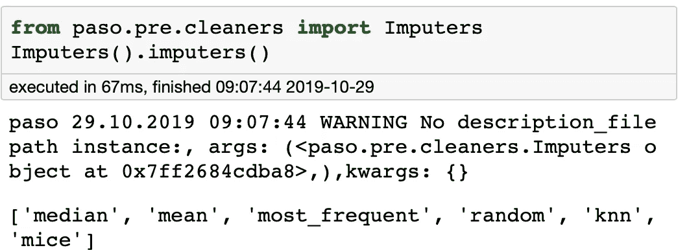

我们决定在给定的特性列表上进行转换，因为估算策略会随着特性子集的变化而变化。

注意，极端梯度推进(`xgboost`)将根据所用的训练损失函数，自动学习缺失数据的最佳(不能证明是最佳，但实际上*良好* *足够*)插补值。

作者在其名称中使用了`eXtreme` ,主要是因为这种能力。它是一个工作非常好的黑匣子，你可以通过研究源代码来打开它。

我建议你先试试`xgboost`,然后用这里显示的估算和其他数据清理器来提高你的预测。

这里，我将使用一个简单的`most_frequent`策略，因为它处理分类和连续特征类型。

```
imputer_file = “../descriptions/pre/cleaners/most_frequent_impute.yaml”
imp = Imputers(description_filepath = imputer_file)
imp.transform(dataset)
```

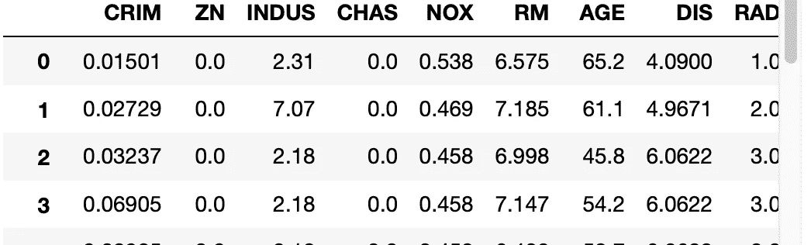

first 4 rows of dataset after imputation. Notice, fist row of CRIM and ZN havechanged from NAN

# 删除 _ 重复 _ 要素

在机器学习竞赛中，你很少会看到两个或更多具有相同值的特征。然而，您几乎总是会在拥有大型和/或多个数据库和/或 ot 数据仓库和/或数据湖的企业中看到它。

随着企业数据库或数据湖的老化，不同的人添加不同的数据源，重复的特性是相当标准的。

如果一个要素与另一个要素具有相同的索引值，则应删除其中一个要素。重复特征是多余的，并且没有预测能力。

`Cleaner delete_Duplicate_Features`将多余的特征减少为一个独特的特征。

注意，任何`NaNs`在被传递给这个方法之前都会被从数据集中删除，根据定义，Python 中的`NaN`不等于另一个`NaN`。早先，我们遇到了可以删除、替换或`Impute` `NaN`值的数据清理器。

我们将创建特征`CRIM1`和`CRIM2`，它们的值与`CRIM`相同。

```
dataset['CRIM1'] = dataset['CRIM12'] = dataset['CRIM']
dataset.head(n=2)
```

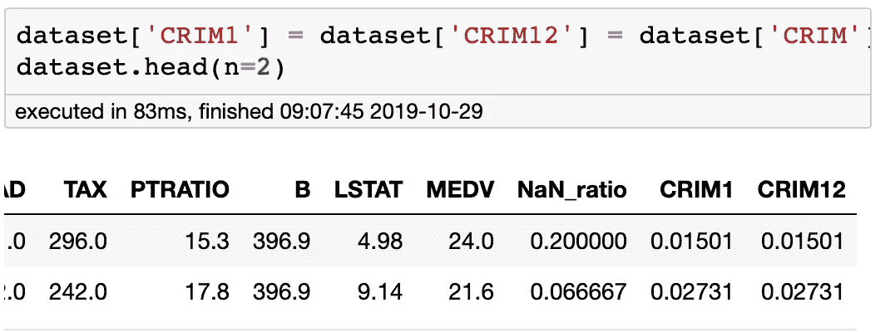

Added CRIM1 and CRIM2 features

```
c.delete_Duplicate_Features(dataset, inplace=True)
dataset.head(n=2)
```

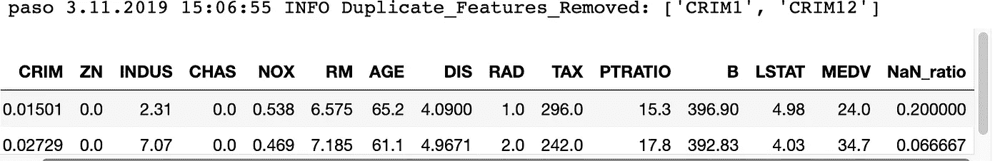

Deleted CRIM1 and CRIM2 features

不出所料，`delete_Duplicate_Features` 删除了功能`CRIM1` 和`CRIM2.`

# 删除具有单一唯一值的要素

将常数存储在数据中是常见的做法。常数显示为具有唯一值的特征/列。

`NaN`为空值，因此不是常量或值。

该方法查找所有只有一个唯一值的特征。值之间的变化为零。所有这些特征都从数据帧中删除，因为它们没有预测能力。

在这里，我将一个常量放入数据集中，并用`delete_Features_with_Single_Unique_Value.`删除它

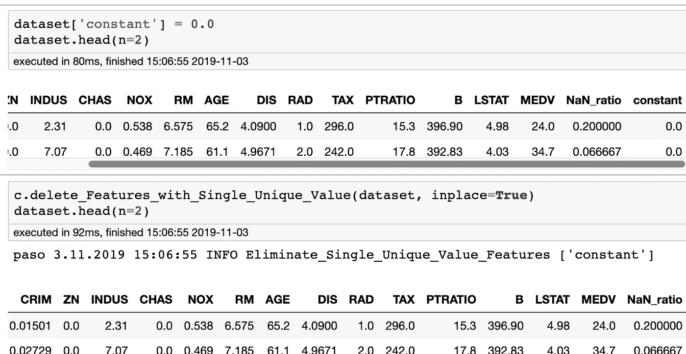

delete_Features_with_Single_Unique_Value

# 删除具有所有唯一值的要素

当一个要素的每个值都不相同时，它在回归任务中只具有预测值，并且这些值必须是浮点型或整数型。

商品的 SKU、id 或名称是字符串或对象类型，没有预测能力，只会拖学习者的后腿。应该从数据集中移除这些要素。

在这个例子中，我将索引变成一个 ID，这样我就可以删除它。

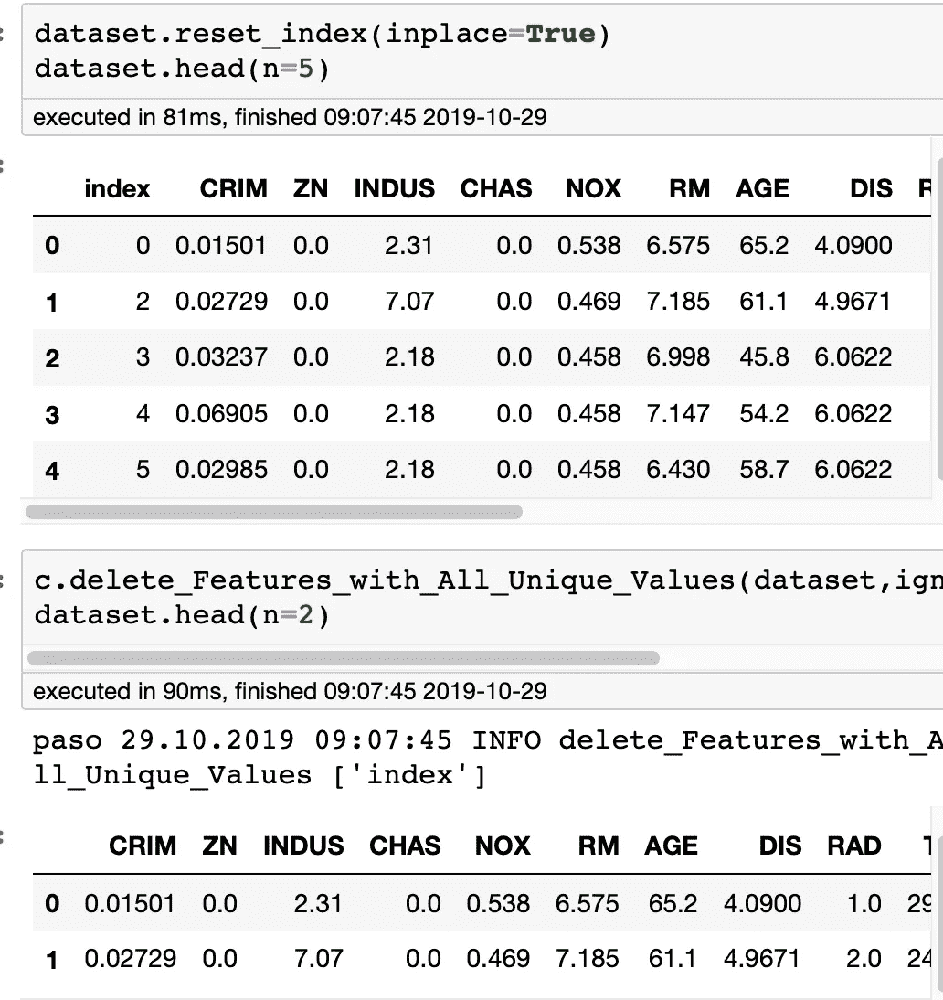

delete_Features_with_All_Unique_Values

# 特征 _ 统计

`Cleaner.feature_Statistics`将计算每个特征的一组预定统计数据，并返回一个数据帧。

这组统计数据如下所示:

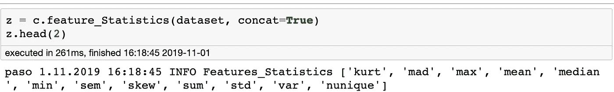

`Cleaner.feature_Statistics`

这种方法是一种诊断工具(`concat = False`)，用于确定标准偏差或任何其他统计数据是否太小，从而没有显著的预测能力。

它还可以添加到数据集(`concat=True`)，其中统计信息部分描述了行值的分布。特征必须是数字(整数或浮点数)。

您可能希望也可能不希望目标成为分布的一部分。由于**测试**没有目标，该目标不应该是**训练**数据集中分布的一部分，因为您正在将*目标泄露*到**训练**数据集中。

您可能希望移除目标要素，然后将其放回数据集中。


使用`Cleaner.column_stats`您可以获得每个特性的统计数据。如果您想与其他学员进行叠加(合奏),可以稍后使用此功能。现在不要担心组装；我们将在后面的文章中讨论这一点。

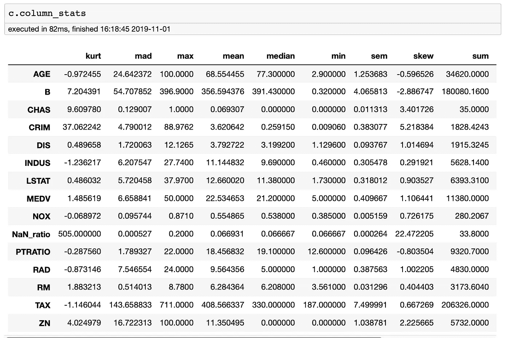

`Cleaner.column_stats`

注意:在传递给这个方法之前，任何`NaNs`都应该从数据集中删除，根据定义，Python 中的`NaN`不等于另一个`NaN`。

注意:我们已经介绍了可以删除、替换或`Impute` `NaN`值的数据清理器。

# 布尔型到整数型

学习者，除了树，还有其他函数，需要将`True/False`或`value_1/value_0`的布尔值(特性将只有 2 个值)转换成整数`1/0`才能正常工作..

类实例方法`boolean_to_integer`转换所有布尔特征。因为它不影响非布尔特征，所以它可以在任何数据集上运行。

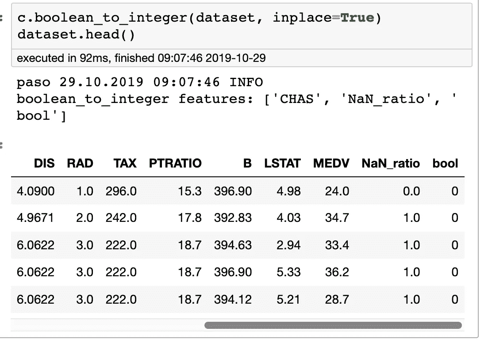

boolean_to_integer

# 特征 _ 特征 _ 相关性

通过使用`seaboard.pairplot(dataset).`在数据集中绘制成对关系，可以直观地看到线性和/或非线性行为。您也可以使用`dataset.profiling_report`来提供关于数据集的更多信息，这是开始 EDA 的好方法。

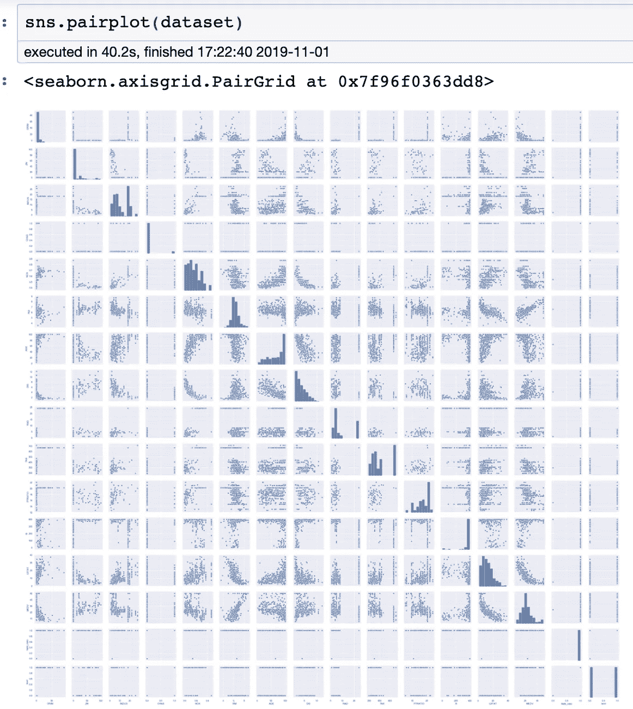

`seaboard.pairplot(dataset)`

我们可以用`feature_Feature_Correlation`来计算一个数据集的关联矩阵，关联矩阵是与所有其他特征相关的所有特征。根据计算，相关性是线性相关性，并不量化任何两个特征之间的非线性行为。

两个特征之间的相关性越高，相关系数越接近绝对值 1.0(开区间-1.0，1.0)。特征本身的值为 1.0，因为它与自身相关。如果它有负值，那么它是反相关的。反相关特征对意味着如果一个特征的值增加，那么另一个特征的值将减少

特征的线性预测强度是它与目标特征的相关程度。然而，特征对(非目标)的相关性越高，特征之一的预测值将降低。

通常，使用皮尔逊相关系数，其仅对两个特征之间的线性关系(或一阶)敏感。

皮尔逊相关系数-0.85 是强负相关，而相关系数 0.15 是弱正相关。此外，如果某个特征与目标的相关系数为|0.99|，那么它的预测值非常高，甚至可能太高。应检查该数据集，尤其是该特征是否有错误。

Spearman 的等级相关系数是衡量两个变量之间的关系能够被单调函数描述的程度。

肯德尔等级相关系数是用于测量两个测量特征之间的顺序关联的统计量。

Spearman 的等级相关系数是对单调函数如何描述两个变量之间关系的度量。

在大多数情况下，对 Kendall 和 Spearman 等级相关系数的解释与 Pearson 相关系数非常相似，因此通常会导致相同的诊断。feature_Feature_Correlation 类计算数据集所有要素对的皮尔逊、斯皮尔曼或肯德尔相关系数。

同样，这个类实例方法是一个诊断工具，它指示一个特征是具有低预测能力还是与另一个特征具有高冗余。

在移除任何特征之前，查看 **SHAP** 值、相对方差和相关系数，以决定移除特征。

阅读这篇文章可以很好地了解相关性:

[](https://medium.com/fintechexplained/did-you-know-the-importance-of-finding-correlations-in-data-science-1fa3943debc2) [## 了解数据科学项目中相关性的价值

### 探索数据科学的核心。理解计算相关性的重要性至关重要

medium.com](https://medium.com/fintechexplained/did-you-know-the-importance-of-finding-correlations-in-data-science-1fa3943debc2) 

您可以使用`feature_Feature_Correlation.`计算数据集的特征-特征相关矩阵

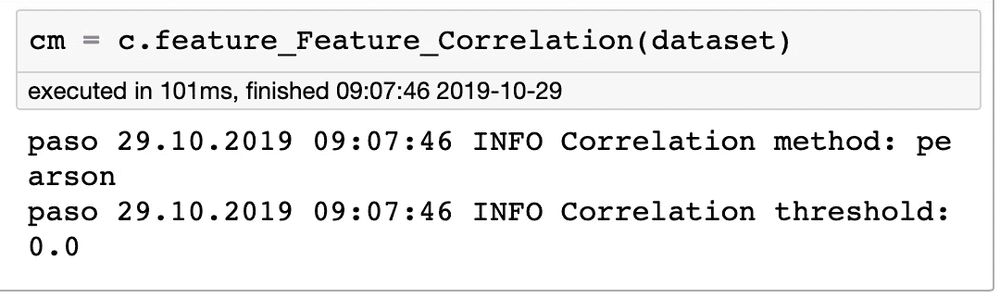

feature_Feature_Correlation

您可以使用 plot_corr `.`绘制数据集的要素-要素相关性矩阵

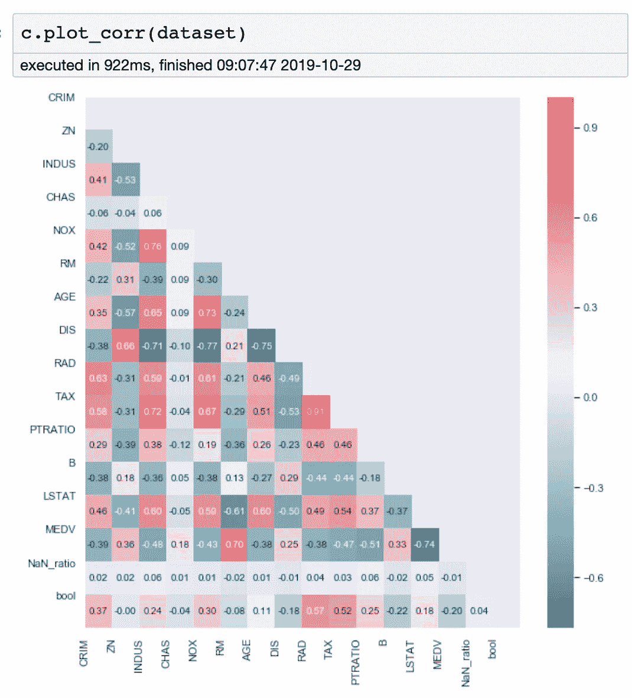

# 删除 _ 功能

我应该在这里提一下， **sklearn** 有一些不同的算法用于[特征选择](https://scikit-learn.org/stable/modules/generated/sklearn.feature_selection.SelectKBest.html#examples-using-sklearn-feature-selection-selectkbest)。在移除任何功能之前，您可能需要查看这些内容。

然而，我发现 **paso** 中给出的特征诊断工具可以处理非线性数据。 **SHAP** 在确定 2018 财年车型中某个特征的重要性方面是最先进的，而且据我所知仍然是最先进的

如果你有更好的了解，请告诉我们，我们可以添加到**帕索**。这个领域正在迅速发展。

根据您的分析，您现在可以从 **pandas** 数据框架中移除要素了。

我将创建一个特征`asv` ，然后用`delete_features.`移除它

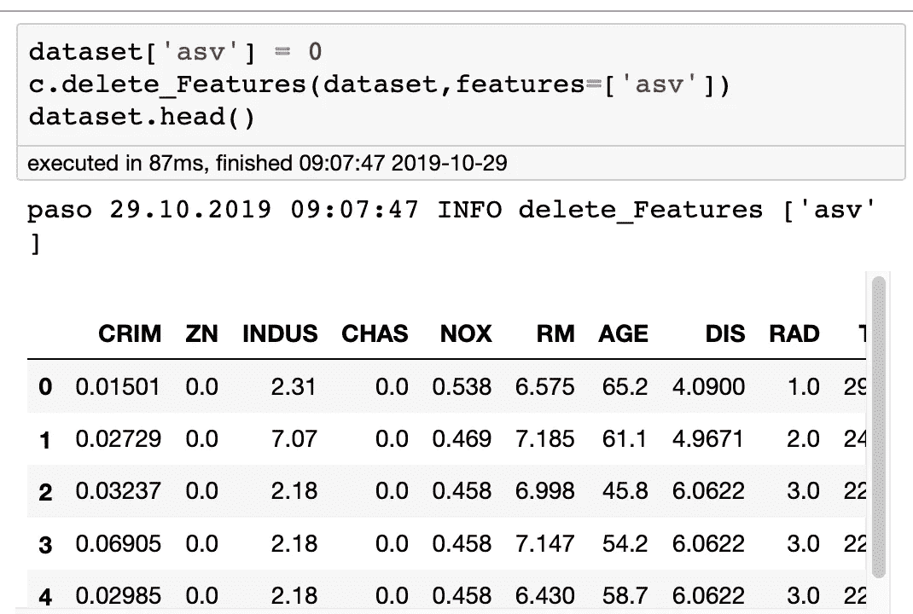

delete_Features

# 移除训练和测试中不常见的功能

如果训练或测试数据集具有特征，而另一个没有，则这些特征将没有预测能力，并从两个数据集中移除。例外情况是目标特征存在于**训练**数据集中，但不在监督问题的**测试**中。

一个数据集中的特征(**训练**或**测试**)而不是另一个数据集中的特征(**训练**或**测试**)可能指出这些数据集中的其他问题。您应该检查数据加载的步骤。

我最常看到的是来自上游服务(Kafka、Google PubSub、Amazon Kinesis Stream、PySpark 和 RabbitMQ 等)的测试数据集。测试数据集的特征被改变，而预训练模型(以及训练集)不具有这些新特征。根据您的错误处理，通常会发生无法预测的情况。

使用:

1.  移除了训练和测试数据集的特征差异。
2.  删除的特征将被记录下来，以便以后进行协调。
3.  预训练模型成功处理了来自输入测试数据集的预测。数据流的一个很好的概述在:

[](https://medium.com/analytics-vidhya/data-streams-and-online-machine-learning-in-python-a382e9e8d06a) [## Python 中的数据流和在线机器学习

### 数据已经不仅仅是一组二进制数字，而是每个人日常决策的必要组成部分…

medium.com](https://medium.com/analytics-vidhya/data-streams-and-online-machine-learning-in-python-a382e9e8d06a) 

为了创建测试和训练数据集，我们可以使用 30%的`City`作为测试，剩下 70%的`City`作为训练。

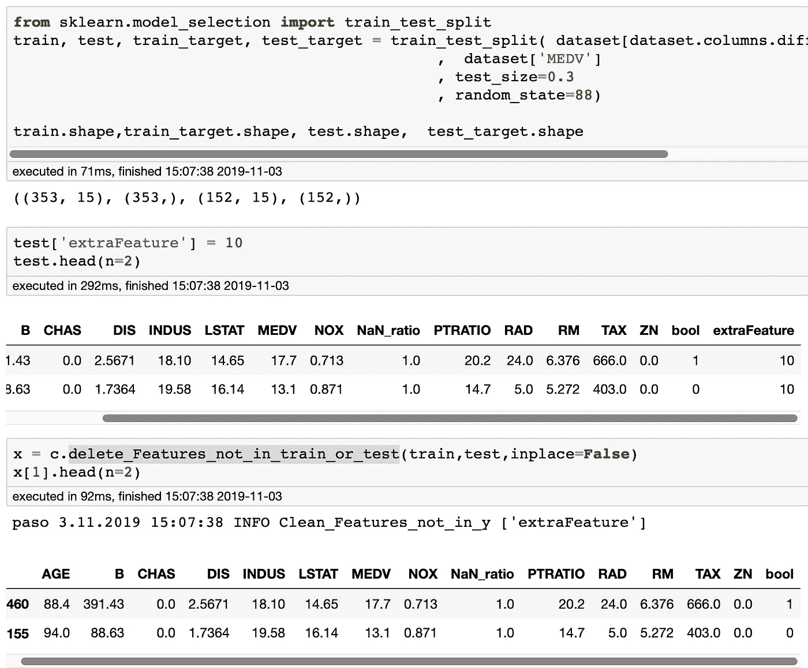

Clean extra feature in test

# 摘要

从 Python 3.6 ( [PEP 484](https://www.python.org/dev/peps/pep-0484/) )开始，引入了类型提示。类型提示(注意:*不是*强类型检查)使得对 Python 代码进行静态类型检查成为可能。

Python 语言解释器使用 ***而不是*** ***类型提示，除了检查正确的语法。类型提示更多地被下游工具使用，比如`PyCharm`和`Mypy.`***

更好的文档和在运行时发生类型错误之前将其捕获是您将从第一波工具中看到的一些好处。

你可以打赌，有人正在为 Python 开发编译器，以使它在运行时更快。接下来，您可以想象用类型化符号转换动态类型化 Python 的工具。

你可以打赌，有人正在为 Python 开发编译器，以使它在运行时更快。接下来，您可以想象用类型化符号转换动态类型化 Python 的工具。

真正美妙的是一种语言，它将输入放到下游工具中，使软件工程师能够专注于*为什么*而将很大一部分*如何*留给工具。

使用类型提示，`Cleaners`和`Imputers` 类方法调用签名被总结如下:

```
from paso.pre.cleaners import Cleaners
c = Cleaners()# 1
c.values_to_nan(self, X: pd.DataFrame, values: List[str]=[], inplace:bool=True, verbose:bool=True) ->  pd.DataFrame:#2
c.delete_NA_Features(self, X: pd.DataFrame, threshold:float =1.0, inplace:bool=True, verbose:bool=True) ->  pd.DataFrame:#3
c.calculate_NaN_ratio(self, X:pd.DataFrame, inplace:bool=True, verbose:bool=True) ->  pd.DataFrame:#4
c.delete_Duplicate_Features(self, X:pd.DataFrame, ignore:List[str], inplace:bool=True, verbose:bool=True) ->  pd.DataFrame:#5
c.delete_Features_with_Single_Unique_Value(self, X:pd.DataFrame, ignore:List[str], inplace:bool=True, verbose:bool=True) ->  pd.DataFrame:#6
c.delete_Features_with_All_Unique_Values(self, X:pd.DataFrame, ignore:List[str], inplace:bool=True, verbose:bool=True) ->  pd.DataFrame:#7
c.statistics() -> List[str]#8
c.feature_Statistics(self, X:pd.DataFrame, statistics:str="all", concat:bool=True, inplace:bool=True, verbose:bool=True
) -> pd.DataFrame:#9
c.boolean_to_integer(self, X:pd.DataFrame, inplace:bool=True, verbose:bool=True) -> pd.DataFrame:#10
c.feature_Feature_Correlation(self, X:pd.DataFrame, method:str="pearson", verbose:bool=True) -> pd.DataFrame#11
c.plot_corr(self, X: pd.DataFrame, kind:str="numeric", mirror:bool=False, xsize:float=10, ysize:float=10)-> None:#12
c.delete_Features(self, X:pd.DataFrame, features:List[str]=[], verbose:bool=True, inplace:bool=True) -> pd.DataFrame:#13
c.delete_Features_not_in_train_or_test(self):self, train:pd.DataFrame, test:pd.DataFrame, ignore:List[str]=[], verbose:bool=True, inplace:bool=True) -> pd.DataFrame:#14
imputer_file = "../descriptions/pre/cleaners/most_frequent_impute.yaml
**imp** = **Imputers**(description_filepath: str = imputer_file)**imp.imputers**() -> List[str]:#15 **imp.transform**(self, X: pd.DataFrame, verbose: bool = True, inplace: bool = True, features: List[str] = None, **kwargs) -> pd.DataFrame
```

本文的代码在`[.ipynb](https://github.com/bcottman/paso/blob/master/lessons/lesson-2.ipynb)` 和`.[p](https://github.com/bcottman/paso/blob/master/paso/pre/cleaners.py)y` 文件中给出。

您已经看到 **paso** 为生产数据工程师和研究数据科学家提供了数据清理方法。 **paso** 支持流数据以及批量提取数据清理。你可以期待 paso 继续为数据清理提供最先进的工具。

关于**帕索**的其他文章有:

[](https://medium.com/@dr.bruce.cottman/pasos-offering-of-logging-and-parameter-services-for-your-python-project-c3ae2fd6869a) [## paso 为您的 Python 项目提供日志记录和参数服务

### paso 为您的 Python 项目提供日志记录和参数服务

paso 为您的 Python Projectmedium.com 提供日志记录和参数服务](https://medium.com/@dr.bruce.cottman/pasos-offering-of-logging-and-parameter-services-for-your-python-project-c3ae2fd6869a) [](https://medium.com/@dr.bruce.cottman/part-1-balancing-and-augmenting-structured-data-4ade0df38662) [## 第 1 部分:平衡和扩充结构化数据

### 数据扩充很重要，因为它从我们当前现有的数据集生成(准确地)人工数据。的…

medium.com](https://medium.com/@dr.bruce.cottman/part-1-balancing-and-augmenting-structured-data-4ade0df38662) 

将来，我们将会发表更多关于 paso 功能的文章。

*   第 2 部分:结构化数据的高级扩充。
*   第二部分:深度学习输入。
*   还有更多…

如果你有一个服务或功能或看到一个错误，然后离开**帕索**项目一个[注意](https://github.com/bcottman/paso/issues)。*