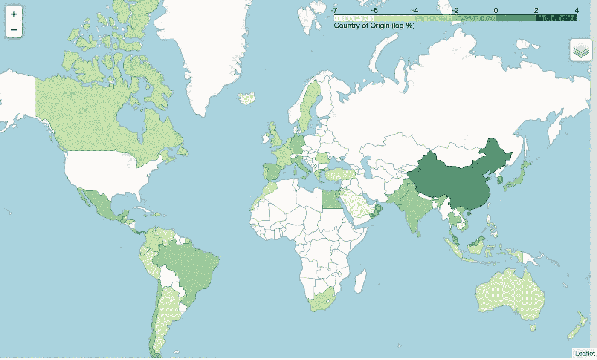
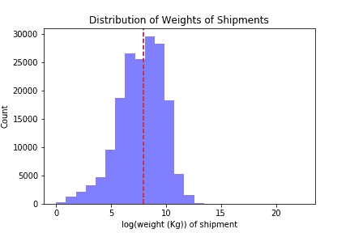
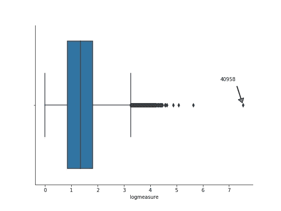
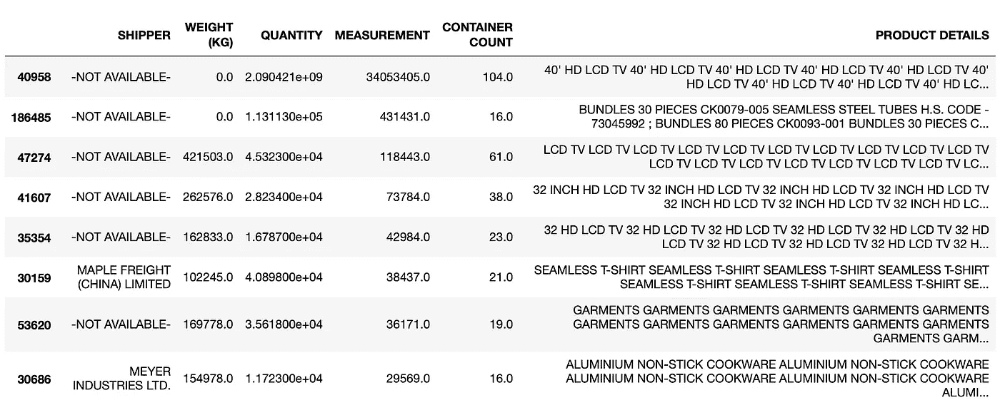

# 通过探索性数据分析发现隐藏的宝石

> 原文：<https://towardsdatascience.com/uncover-hidden-gems-with-exploratory-data-analysis-7a25332f9156?source=collection_archive---------18----------------------->

## 用熊猫、海鸟和树叶进行基本侦察


Photo by [Ilze Lucero](https://unsplash.com/@ilzelucero?utm_source=medium&utm_medium=referral) on [Unsplash](https://unsplash.com?utm_source=medium&utm_medium=referral)

数据科学家的关键特质之一是好奇。在本文中，我们将使用一些流行的 Python 工具探索一个有趣的数据集，但也会尝试用非常规的术语来思考数据。对于欺诈检测等领域，以意想不到的方式连接数据可以梳理出模式，即使数据可能看起来不完整。理想情况下，你会提出一些能打开新商机的见解。

在 Kaggle 寻找供应链数据集时，我发现了一个名为*供应链数据*，副标题为*进口和装运数据*。向下扫描页面，我看到数据源名为 *walmart-import-data.csv* 。嗯，可能会很有趣。啊哦，“关于这个文件”说“还没有描述”。这就是调查开始的地方——我们甚至没有数据字典。

通常当你在做探索性的数据分析时，这是因为你有一个特定的问题，你正试图使用数据来回答，例如*上个月有多少箱菠萝从巴哈马群岛运出*，但在这里我们将让我们的想象力天马行空，看看数据可能会揭示什么秘密。

为了保持这篇文章的可读性，下面只显示了一些关键的代码片段。Python Jupyter 笔记本在 GitHub [这里](https://github.com/jhurley13/kaggle-walmart-supplychain.git)，Kaggle 内核在[这里](https://www.kaggle.com/jhurley/walmart-supplychain-eda-kk)。为了清楚起见，我还将大量使用后见之明来简化我通过反复试验发现的一些事情，例如，我如何知道原始数据文件中大约 9%的行都是 NA。我最初发现某些列有很多 NaN 值，但是进一步检查后发现整行都是 NaN。

# 预赛

为了能够跟随 Jupyter 笔记本，您将需要从 GitHub [这里](https://github.com/jhurley13/kaggle-walmart-supplychain.git)克隆或下载资源库。或者，您可以为本文运行 [Kaggle 内核。](https://www.kaggle.com/jhurley/walmart-supplychain-eda-kk)

如果您走第一条路，在您克隆了存储库之后，您需要从这里的 Kaggle [下载数据文件，并将文件*Walmart-import-data-full . CSV*移动到存储库中的 *data/raw* 子目录。](https://www.kaggle.com/sunilp/walmart-supply-chain-data/downloads/supply-chain-data.zip/1)

# 第一步

目前还不清楚为什么会发布这个数据集，而且它也不是最近才发布的(最近一次发布是在 2013 年 9 月 9 日)。对于我们的目的来说，这很好，如果出现了更新的数据集，这些技术将适用。我们能得到什么样的见解？让我们从加载数据开始。

```
xdata = pd.read_csv(raw_data_path / 'walmart-import-data-full.csv', low_memory=False)
# About 9% of the rows are all NA; drop them
xdata.dropna(axis=0, how='all', inplace=True)
```

我们指定 *low_memory=False* 来避免关于包含混合类型数据的某些列的警告。如果我们超越探索性数据分析(EDA)阶段，我们可以花一些时间均匀化这些列，并为 read_csv 创建一个定制的 *dtypes* 参数。像往常一样，我们先看一下前几行，以便对数据集有一个大致的了解:

```
xdata.head(3)
```


The first few rows and 13/34 columns of the data

查看 xdata.shape 可以看到，数据集中有 175713 行和 34 列，其中 NA 行已被删除。从 xdata.columns 中，我们可以大致了解列中的内容，这些列的名称相当有意义。看看‘原产国’怎么样？看看 2013 年沃尔玛的商品来自哪里可能会很有趣。*描述*功能对 EDA 非常有用:

```
xdata['COUNTRY OF ORIGIN'].describe().to_dict(){'count': 174093, 'unique': 71, 'top': 'China', 'freq': 125366}
```

我们看到，最大的原产国是中国，占出货量的 72%(按数量计算)。然而，有 71 个独特的国家，那么还有谁在向沃尔玛销售呢？

# 沃尔玛全球供应商的可视化

我们可以看直方图，但在地图上看会更有视觉冲击力。

为了做到这一点，我们可以制作一个 choropleth 地图，用不同的颜色显示每个国家的发货百分比。我们将使用[leavy](https://pypi.org/project/folium/)，它使用 Python 和 Leaflet.js 库来创建用于数据可视化的交互式地图。

一个 follow Choropleth 地图需要一个数据框和两列:一列用于索引 JSON 映射数据，另一列包含一个值，该值用于选择地图上的阴影颜色。

虽然我确信有许多更有效的方法可以做到这一点，但由于这是一个探索性的数据分析，而且数据集并不是很大，我们可以使用 groupby、describe 和 xs 来快速制作一个数据框架，其中包含制作一个叶子地图所需的列。如果你很难理解我是如何得出下面这个表达式的，把它分成几个部分，然后显示每个部分。我现在并不真正关心“重量(KG)”列，只是我们可以使用它的“计数”字段。

```
countries_of_origin = xdata.groupby('COUNTRY OF ORIGIN').describe().xs('WEIGHT (KG)', axis=1).copy()
countries_of_origin.reset_index(level=0, inplace=True)coo_record_count = sum(countries_of_origin['count'])
countries_of_origin['pct'] = countries_of_origin['count'].apply(lambda cnt: 100*cnt/coo_record_count)
countries_of_origin['logpct'] = countries_of_origin['count'].apply(lambda cnt: np.log(100*cnt/coo_record_count))
# We will use the sorting later
countries_of_origin.sort_values(by==['count'])
```


The first three entries in countries_of_origin, by count

现在我们有了有用格式的数据，让我们用 let 制作一个地图:

```
# Initialize the map:
m = folium.Map(location=[30, 0], zoom_start=2, no_wrap=True)# geo_data is the map data# Add the color for the chloropleth:
_ = folium.Choropleth(
    geo_data=folium_world_data.as_posix(),
    name='Choropleth',
    data=countries_of_origin,
    columns=['COUNTRY OF ORIGIN', 'pct'],
    key_on='feature.properties.name',
    fill_color='YlGn',
    fill_opacity=0.7,
    line_opacity=0.2,
    nan_fill_color='white',
    legend_name='Country of Origin (%)'
).add_to(m)

# Save to html
map_path = reports_path / 'walmart_folium_chloropleth_pct.html'
m.save(map_path.as_posix())
m
```


Countries of origin for Walmart shipments, by count

这不是很有用，因为中国控制得如此彻底，其他一切都接近于零。白色区域是根本没有向沃尔玛发货的国家(至少在数据中是这样)。黄色区域向沃尔玛发货，但百分比为个位数。

我在上面的*原产国*中增加了两列是有原因的。让我们再次绘制地图，但这次使用装运百分比的记录。为了简洁起见，我将省略代码，但我只是用‘log pct’替换了*列*参数中的第二个元素。



Countries of origin for Walmart shipments, by log(count)

这更有指导意义，因为它显示了亚军之间的相对位置。看着这张地图，我对那些几乎为零但又不完全为零的国家感到好奇。从视觉上看，*沙特*对我来说是一个奇迹。

```
xdata[xdata['COUNTRY OF ORIGIN']=='Saudi Arabia']['PRODUCT DETAILS'].describe().to_dict(){'count': 3,
 'unique': 3,
 'top': '320 BAGS, 19,200 KG OF ETHIOPI A ARABICA COFFEE SIDAMO GRAD- 2 TOP QUALITY REF P2006A, PA CKAGE: JUTE BAGS OF 60 KGS EA CH DELIVERY TERMS: FOB DJIBOU TI NET SHIPPED WEIGHT FDA R EGISTRATION NO. 11826035706 S',
 'freq': 1}
```

啊哈，好像是从埃塞俄比亚转运过来的咖啡。看了一眼其他两件物品，显示花岗岩板和个人物品，而不是预期的 pertroleum 产品。另一件值得注意的事情是,“产品详细信息”条目有一些奇怪的断词问题(不限于此条目)。

看着分类数据框的尾端，我看到了*韩国*，考虑到它们在电子领域的规模，我想它们应该有不止一批货。

```
countries_of_origin.sort_values(by=['count'], axis=0, ascending=False).tail(4)
```


果然，*韩国*在数量上是第三名，如果我们用上面的头(3)替换尾(4)，我们会看到这一点，这意味着*韩国*的单独发货是一个数据输入错误。另请参见*中国台湾*和*台湾*。向这些数据的所有者提供的一些反馈是，在输入数据时需要标准的国家名称。

在我们离开映射部分之前，我想指出 leav 的一个奇怪之处，我花了一些时间才弄明白。为了正确设置 *choropleth* 函数的 *key_on* 参数，我查看了 leav 数据文件*leav/examples/data/world-countries . JSON*以查找数据结构中的名称，给出了*key _ on = ' feature . properties . name '。*

# 重要的事情

现在我们已经确定了哪些国家运送的物品数量最多，让我们来看看运送最重物品的国家。熊猫分组食谱对理解下面的表达很有帮助。

```
top_by_weight = countries_of_origin.sort_values(by=['max'], axis=0, 
  ascending=False)[0:10]['COUNTRY OF ORIGIN'].valuestw3 = xdata.groupby(['COUNTRY OF ORIGIN']).apply(
    lambda subf: 
        subf.sort_values('WEIGHT (KG)', 
                         ascending=False).head(3))cols_of_interest = ['COUNTRY OF ORIGIN', 'WEIGHT (KG)', 
     'PRODUCT DETAILS', 'ARRIVAL DATE']# [https://www.wolframalpha.com/input/?i=3e%2B07+kg](https://www.wolframalpha.com/input/?i=3e%2B07+kg)
#  ≈ (0.7 to 1) × mass of a Handy size cargo ship
mass_handy_size = 3.0e+07 #kgtw3.loc[(tw3['COUNTRY OF ORIGIN'].isin(top_by_weight)) & (tw3['WEIGHT (KG)']>mass_handy_size)][cols_of_interest]
```


回想一下*原产国*是用 groupby 和‘重量(KG)’构成的，所以这里的 *max* 指的是重量。我不得不承认，我对排名靠前的国家感到非常惊讶，但当我看到这些产品时，我感到更加惊讶。

来自委内瑞拉的装运量最大，高出两个数量级。因为 dataframe 显示截断了“产品详情”栏，所以我们要确保我们在这里谈论的不是橄榄油…

```
list(xdata[xdata['WEIGHT (KG)']>1e+09]['PRODUCT DETAILS'])[0]'5,550.023 METRIC TONS (49,849 BBLS) LIGHT VIRGIN NAPHTHA'
```

石油石脑油是一种源自原油精炼的中间烃液体流。通过查看产品详细信息，我们看到出货量最大的是石油产品(烷基化油、汽油、石脑油)、建筑材料(岩石和水泥)和颗粒尿素(！？).把我搞得屁滚尿流[他们用那个](https://www.cfindustries.com/products/urea)做了什么……

对我来说，这里隐藏的宝石是供应石油产品的各种意想不到的国家，以及一个预期的石油出口国(科威特)运送尿素。由 [Wolfram Alpha](https://www.wolframalpha.com/input/?i=5.550023e%2B09+kg) 提供的另一个有趣的事实是，从委内瑞拉运来的石脑油几乎和吉萨大金字塔一样重。

# 停止

因为我们有“重量(KG)”和“集装箱数量”字段，所以我们可以计算出标准集装箱中的装运百分比。

考虑到“重量(KG)”几乎涵盖了 10 个数量级，并且还包括一些零值，我们会发现添加一列“log_weight_kg”很有用。

```
xdata['log_weight_kg'] = xdata['WEIGHT (KG)'].apply(lambda x: np.log(max(1, x)))
```

用 *xdata['体重(公斤)']。describe()* 我们看到，一批货物的平均重量为 48815.86 千克，Wolfram Alpha 称这大约是一架波音 747–200 f 飞机载重量的一半。绘制“log_weight_kg”列的直方图可以得出:



其中红色虚线是中间值。

接下来，让我们来看看可能用标准 20 或 40 英尺集装箱装运的货物，按重量计算。这里我假设‘重量(千克)’是货物的净重*。*

向数据集中添加一个“kg_per_container ”,在这里我们对缺失值进行标准化，以便我们为每批货物至少准备一个集装箱。

```
xdata['kg_per_container'] = xdata.apply(calc_kg_per_container, axis = 1)
containerizable = xdata[xdata['kg_per_container'] <= NW_KG_DRY_CONTAINER_40FT]
```

如果它符合 40 英尺集装箱的重量要求，我们认为它是“可装箱的”,简单的计算表明 99.6%的装运都是如此。通过将我们的注意力缩小到这一大部分出货量，将大的异常值放在一边，我们可以对这些较小的出货量有一个更精细的了解。


每个集装箱的重量基本上稳步下降，除了在 19000 公斤/集装箱左右有一个小高峰。这可能是一个值得进一步研究的有趣领域。

# 另一个维度

为了强调为每个数据集创建数据字典的重要性，我们现在考虑“M.UNIT”列。我假设‘M . UNIT’是‘MEASUREMENT’列的单位(如果是这样，这种关系应该记录在数据字典中)。

```
xdata['M.UNIT'].value_counts().to_dict(){'CM': 93812,  'X': 47585,  'CF': 321,  'M': 128,  'F': 24,  'CC': 11,  'MM': 4,  'SS': 3,  'XX': 3,  'FF': 1}
```

我们可以猜测‘CM’的意思是立方米，‘CF’是立方英尺，但是其他的呢？重复我最初的观点，我们不应该去猜测；这些应该在数据字典中给出。既然看来我们必须猜测，让我们从不太常见的测量开始。

```
low_units = ['F', 'CC', 'MM', 'SS', 'XX', 'FF']
cols_of_interest = ['COUNTRY OF ORIGIN', 'WEIGHT (KG)', 'QUANTITY', 'CONTAINER COUNT',
                    'MEASUREMENT', 'M.UNIT', 'PRODUCT DETAILS'] # , 'ARRIVAL DATE'
pd.set_option('display.max_colwidth', 125)
pd.set_option('display.max_rows', 50)
xdata[xdata['M.UNIT'].isin(low_units)][cols_of_interest]
```


The first few entries of the less common M.UNIT collection

对于 low_units 中的六个不太常见的“M.UNIT”值，我可以容易地辨别的唯一模式是，如果“M.UNIT”是“F”、“FF”或“MM”，那么“MEASUREMENT”是零，所以这些可能是可忽略的。其他人将不得不保持神秘，直到我们可以与数据所有者交谈。

我们可以快速了解所有使用 seaborn 制造剥离场的单位的分布情况。我们将自己限制在一个 40 英尺集装箱的数据子集内。

```
xic = xdata[(xdata['CONTAINER COUNT']>0) & (xdata['WEIGHT (KG)']>0) & (xdata['kg_per_container']<=NW_KG_DRY_CONTAINER_40FT)]g = sns.stripplot(x='MEASUREMENT', y='M.UNIT', data=xic)
sns.despine() # remove the top and right line in graph
g.figure.set_size_inches(6,4)
plt_path = figures_path / 'measure_stripplot.png'
plt.savefig(plt_path.as_posix(), format='png'
```


Distribution of MEASUREMENT values by M.UNIT

我们将在下面更详细地观察“CM”的分布。

现在让我们来看看最常见的“公制单位”，“厘米”。使用 *describe()* ，我们知道如果‘M . UNIT’=‘CM’，那么‘MEASUREMENT’有非常大的值和零值，所以我们取一个子集:

```
xdata_cm = xdata[(xdata['M.UNIT'] == 'CM') & (xdata['MEASUREMENT'] > 0.0)].copy()
xdata_cm['logmeasure'] = xdata_cm['MEASUREMENT'].apply(lambda mm: np.log10(mm))
```

我们可以在这个子集上使用 [seaborn](https://seaborn.pydata.org) 包来给我们一个漂亮的箱线图，这是一个与我们在上面看到的 stripplot 不同的视图。

```
max_logmeasure = xdata_cm.logmeasure.max()
max_logmeasure_shipment_id = xdata_cm['logmeasure'].idxmax()g = sns.boxplot(x = xdata_cm['logmeasure'])
# remove the top and right line in graph
sns.despine()_ = plt.annotate(s = max_logmeasure_shipment_id,
             xy = (max_logmeasure,0),
             xytext=(0.85, 0.65), textcoords='axes fraction', # bottom, left
             # Shrink the arrow to avoid occlusion
             arrowprops = {'facecolor':'gray', 'width': 1, 'shrink': 0.09, 'headlength':9},
             backgroundcolor = 'white')g.figure.set_size_inches(6,4)
# plt.show()
plt_path = figures_path / 'logmeasure_box.png'
plt.savefig(plt_path.as_posix(), format='png')
```



我们添加的注释显示了这个极端异常值的行 id。我们还可以从该图和 *describe()* 中看到，四分位数范围是 58(从 7 到 65)，大约有 2000-50000 个异常值，然后还有几个高于这个值。

```
cols_of_interest = ['SHIPPER', 'WEIGHT (KG)', 'QUANTITY', 'MEASUREMENT', 'CONTAINER COUNT', 'PRODUCT DETAILS']
xdata_cm.sort_values(by='logmeasure', ascending=False)[cols_of_interest].head(10)
```



The largest values of log(MEASUREMENT)

最上面的条目，我们的极端异常值，看起来非常可疑。如果“测量”以立方米为单位，这将相当于每年全球石油装运量的 10%左右。更令人难以置信的是“数量”字段。如果消息属实，光是这批货物就能为地球上三分之一的人提供一台 40 英寸的高清液晶电视。我就是不信。

再看看“迈耶工业”，我们得出的单位重量为 13.2 千克，这对于一套铝制炊具来说似乎是合理的。然而，我仍然不能使“测量”字段工作。从重量的角度来看，这批货物可能只装在 6 个 40 英尺的集装箱里，少于报道的 16 个。然而，16 个 40 英尺的集装箱只有 1083 立方米的容积，远远小于“测量”区域的 29000 立方米。

“CM”的“M.UNIT”是立方米，我们的猜测有可能是正确的吗？让我们来看看第三个分位数的一些值。

```
xdata_cm_sm = xdata_cm[xdata_cm['MEASUREMENT'] < CAPACITY_CONTAINER_40FT]
xdata_cm_sm.sort_values(by='logmeasure', ascending=False)[cols_of_interest].head(10)
```


Measurement should indicate that it would fit in a 40ft container

纯属巧合的是，这份清单中的第一项也是炊具，每箱重量为 13.2 公斤，同上。快速检查亚马逊上的 18 件套炊具，我们得到的产品尺寸为 11.5 x 22.8 x 13 英寸(3409 英寸或 0.05586 米)，运输重量为 21.9 磅。这比这里装运的炊具要轻一点，如果我们按重量差异的比例放大体积，我们得到 0.074225 立方米。所有 942 套，完美包装，则需要大约 69.92 立方米的体积，这在“测量”值 67 的大致范围内(超出 4.3%)。

我们可以看更多的例子，但是有证据表明“CM”的意思是立方米。本节更重要的一点是，该数据集在用于预测之前似乎需要大量清理。

# 欺诈检查

在我们对最重的货物的探索中，来自巴哈马的物品让我惊讶——当我想到巴哈马时，我会想到蓝色的海水和沙滩，而不是石油出口。对巴哈马最大出口量的描述是“1 大堆 277328.140 桶烷基化油”。[烷基化油是车用汽油的高辛烷值调和成分](https://www.mcdermott.com/What-We-Do/Technology/Lummus/Refining/Propane-Butane-Upgrading/Alkylate-Production)。为了便于讨论，让我们假设审计团队想要检查这可能的欺诈。看起来似乎没有足够的有用数据，但让我们看看是否可以帮助审计团队将这些数据从黄色标志(可疑)变为红色标志(欺诈)或绿色标志(正常交易)。)

我们将把“发货人”和“收货人地址”这样的字段留给我们的私家侦探精英团队，同时我们来看看一些更深奥的东西。需要指出的重要一点是:我不是石油运输方面的专家，所以我在这里做了很多假设。

顺便提一下，当我查看每个集装箱的重量时，我对这个条目产生了兴趣；“容器计数”是 1，但重量很大，所以它弄乱了我漂亮的直方图。

从“产品详情”中，我们得到数量:277328.140 桶。烷基化物的密度[取决于温度](http://www.etc-cte.ec.gc.ca/databases/oilproperties/pdf/WEB_Gasoline_Blending_Stocks_(Alkylates).pdf)。如果我们假设密度在 15–38°C 范围内呈线性变化，我们可以推导出一个给定重量和密度的温度公式。


Photo by [Manki Kim](https://unsplash.com/@kimdonkey?utm_source=medium&utm_medium=referral) on [Unsplash](https://unsplash.com?utm_source=medium&utm_medium=referral)

我们有桶的数量，事实上一桶是 42 美国标准加仑，换算后我们得到升的数量。我们从“重量(千克)”栏中得到重量，除以重量得到密度。将它代入我们的线性公式，我们发现温度是 21.24 摄氏度(这些计算在 Jupyter 笔记本上有详细说明)。

“抵达日期”是 2013 年 1 月 31 日。一艘轻便的船以大约 14 节的速度行驶；使用[这个站点](http://ports.com/sea-route/)我们看到从巴哈马拿骚到纽约的旅行时间是 3.2 天，2013 年 1 月 27 日的[天气在拿骚最低 21°C，最高 27°C。所以重量和产品细节似乎是可信的。](https://www.timeanddate.com/weather/bahamas/nassau/historic?month=1&year=2013)

要最终确定这一点，必须看一下合同。我在 [SEC 档案](https://www.sec.gov/Archives/edgar/data/1420176/000119312508008894/dex105.htm)中找到的一份协议(不涉及沃尔玛)有这样一个条款:

```
“Barrel” — 42 U.S. standard gallons measured at 60 degrees Fahrenheit [15.556 °C].
```

如果我们假设同样的温度适用于这里，我们会有多远？简单的代数告诉我们，如果是这样的话，他们的出货量比必要的多出 0.7%。我想我们可以告诉审计员用绿旗做标记。

# 最后的想法

如果您将数据想象成一个多维的尖球:


Wolfram Mathematica Version 12 Spikey

您可以这样或那样转动它，看看哪些尖峰最突出(异常值)。之后，如果你去掉尖峰，你可以看看你的更典型的数据的形状。在本文中，我们已经通过观察计数和重量异常值做到了这一点。

如果您正在发布一个数据集，无论是内部的还是外部的，总是要包含一个数据字典，即使这些值看起来很明显。下面的参考资料部分有几个不错的资源。

令人惊讶的是，人们可以对许多数据集做些什么，即使它们似乎有不完整或有限的数据。通过使用来自不同列的数据，扫描一些文本字段，并使用外部来源，人们通常可以梳理出一些有趣的花絮。

感谢你和我一起踏上这个有趣的数据集的漫无边际的旅程。我希望我在这里概述的技术能够对您探索自己的数据集有所帮助。

# 参考资料和进一步阅读

源代码库中提供了一组完整的链接。这两个探索性数据分析参考都使用 R 语言，但是即使您只使用 Python，也值得一看。

1.  [如何制作数据字典](http://help.osf.io/m/bestpractices/l/618767-how-to-make-a-data-dictionary)，开放科学框架
2.  [数据字典:如何与最佳实践](https://medium.com/@leapingllamas/data-dictionary-a-how-to-and-best-practices-a09a685dcd61)，[卡尔·安德森](https://medium.com/u/49c5eedcb61b?source=post_page-----7a25332f9156--------------------------------)
3.  [数据字典](https://www.usgs.gov/products/data-and-tools/data-management/data-dictionaries)，美国地质调查局
4.  [探索性数据分析与 R](https://leanpub.com/exdata) ，罗杰·婷·彭
5.  [探索性数据分析](https://www.coursera.org/learn/exploratory-data-analysis)，约翰·霍普金斯大学 via Coursera
6.  [针对每个数据集的 3 种出色的可视化技术](/3-awesome-visualization-techniques-for-every-dataset-9737eecacbe8)、 [Rahul Agarwal](https://medium.com/u/e8cce06956c9?source=post_page-----7a25332f9156--------------------------------)
7.  GeoJSON 和 choropleth，Felipe，Frank Conengmo，Joshua Cano，FloChehab