# 机器学习中的奇异值分解:欠定最小二乘

> 原文：<https://towardsdatascience.com/underdetermined-least-squares-feea1ac16a9?source=collection_archive---------11----------------------->

## 理解 SVD 如何帮助导出超定和欠定线性系统的一致最小二乘权重向量

Source: Tim Hill on Pixabay

本文讨论了超定和欠定线性系统中最小二乘权重向量的差异，以及如何应用[奇异值分解](https://www.wikiwand.com/en/Singular_value_decomposition) (SVD)来导出一致的表达式。它在很大程度上基于 [Rebecca Willet](https://voices.uchicago.edu/willett/) 教授的课程[机器学习的数学基础](https://voices.uchicago.edu/willett/teaching/fall-2019-mathematical-foundations-of-machine-learning/)，并且假设了线性代数的基础知识。

# “典型”最小二乘法

**最小二乘**可以描述为:给定形状 *n × p* 的特征矩阵 ***X*** 和形状 *n ×* 1 的目标向量 ***y*** 我们要找到一个形状 *n ×* 1 的系数向量***w’*****直觉上**，最小二乘法试图通过最小化每个单个方程结果的残差平方和来近似线性系统的解。

在大多数情况下，我们假设 *n ≥ p* 并且 rank( *X* ) = *p.* 换句话说，观测值的数量不小于特征的数量并且没有一个特征是其他特征的线性组合(没有“冗余”特征)。一个线性系统 *y* = *Xw* 如果 *n ≥ p* 则**超定**。我们可以用 [**法方程**](http://mlwiki.org/index.php/Normal_Equation#Normal_Equation) 得到*w’*:

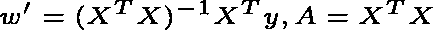

但是，如果 *n* < *p* 或者当 *X* 中的某些列是线性依赖时，矩阵 ***A*** 可能不可逆。当特征数大于观测数时，我们称线性系统 *y* = *Xw* **欠定**。

# 欠定最小二乘

当 *n* < *p* 、秩( *X* ) = *n* 时，系统 *y* = *Xw* 有无穷多个解。在这些解中，我们可以通过拉格朗日乘子法找到一个范数最小的解，并将其作为欠定线性系统的最小二乘权向量。

然而，**为什么最小范数解是可取的**？想象一个简单的例子，当你有下面的训练特征矩阵和目标向量时:

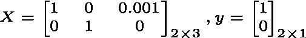

以下两个权重向量为训练数据提供了完美的拟合:

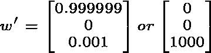

看这个的一种方式是:第三个特征是规模小。如果它容易受到测量误差的影响，并且我们对它赋予了很大的权重，那么我们对未知数据的预测可能会因为第三个特征而产生很大的偏差，从而远离真正的目标。所以第一种方案比较好。

下面展示了我们如何用拉格朗日乘数法导出最小范数解:我们想要在约束条件为 *y* = *Xw* 的情况下最小化∨*w*∨。介绍拉格朗日乘数 ***L*** :

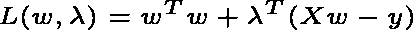

在最佳条件下:

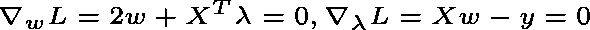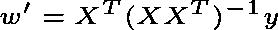

欠定最小二乘的权向量方程与超定最小二乘的权向量方程非常不同。

# 奇异值分解

本节提供了对 SVD 的基本介绍。考虑一个形状为*n*×p 的矩阵 *X* 。总是存在矩阵****【σ】******V***使得:*

*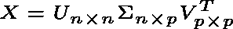*

*当 *U* 和 *V* 正交时:*

*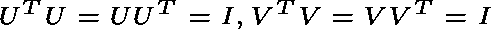*

**σ*是对角线:*

*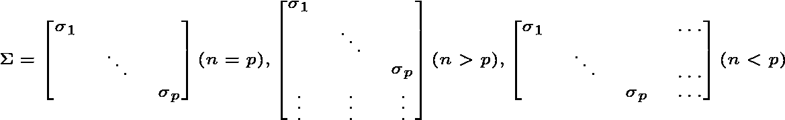*

**U* 的列是左奇异向量，它们构成了 *X* 列的正交基。*

**σ*的对角元素称为奇异值(*σ₁*≥*σ₂*≥…≥*σₚ*≥0)。非零奇异值的个数是矩阵 *X* 的秩，*σ*的列是 *X* 的行的基础。*

**V* 的行称为右奇异向量，它们是*uσ*列上的基系数，用来表示 *X* 的每一列。*

# *奇异值分解和最小二乘法*

*使用 SVD，我们可以重写最小二乘权重向量。以欠定最小二乘法为例:*

*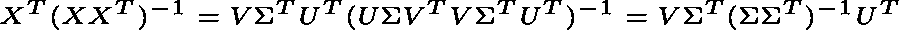*

*上面的表达式看起来有点吓人，但是如果我们仔细看看:*

*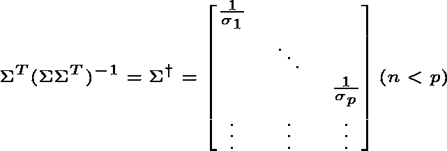*

*这里***σ⁺***是*σ*的伪逆，形状为 *p* × *n* 。我们可以通过转置*σ*并取其对角元素的倒数来得到它。那么欠定线性系统的最小二乘向量可以重写为:*

*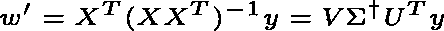*

*超定最小二乘法也是如此(随意验证)。有了 SVD，我们就有了权重向量的一致表达式。*

# *确认*

*为了验证我们的发现，我们将使用 [Jester 数据集](http://eigentaste.berkeley.edu/dataset/)的子样本。样本包含 100 个观察值和 7200 个特征，可在[这里](https://github.com/KunyuHe/SVD-in-Machine-Learning/blob/master/Underdetermined%20Least%20Squares/data/sample.mat)获得。每个观察都是一个笑话，每个特征都是现有用户对该笑话的已知评级，等级为-10 到 10。*

*假设我们为一家公司工作，该公司根据客户的已知评级向他们推荐笑话。对于评价了 25 个笑话的新客户 Joan，我们希望能够知道她喜欢剩下的 75 个笑话，并向她推荐预测评价最高的笑话。*

*要做到这一点，考虑一下我们已知的对 100 个笑话的评分的用户。他们代表了不同的品味。我们可以将 Joan 的评级看作这些客户评级的加权和。然后，我们将使用这些 *m* 客户的 25 个笑话评级作为特征，并将 Joan 的已知评级作为目标来训练回归变量。它应该能够推广到琼还没有预测好的其他笑话，以便我们可以推荐预测得分最高的笑话。琼的评分在这里可以找到。*

*加载数据，并使用以下块将其分为训练集和测试集。请注意，琼的未知评级表示为-99。*

*当 m = 20 时，为了简单起见，我们将使用前 20 个用户作为我们的代表用户。我们将根据琼对 25 个笑话的评价来计算权重，并将琼的评价作为目标。线性系统是超定的。当 *m* = 7200 时，线性系统欠定。使用以下代码准备数据。*

*使用 SVD 的 scikit-learn 型最小二乘估计器实现如下:*

*计算权重向量，并将其与从正规方程获得的权重向量进行比较:*

*对于 *m* = 20 和 *m* = 7200，我都得到“真”。你可以自己验证。*

*为了说明欠定最小二乘法如何提供对训练数据的完美拟合，我们可以在训练集和测试集上可视化预测值和真实目标。在这里有相应的代码[。](https://github.com/KunyuHe/SVD-in-Machine-Learning/blob/master/Underdetermined%20Least%20Squares/codes/viz.py)*

*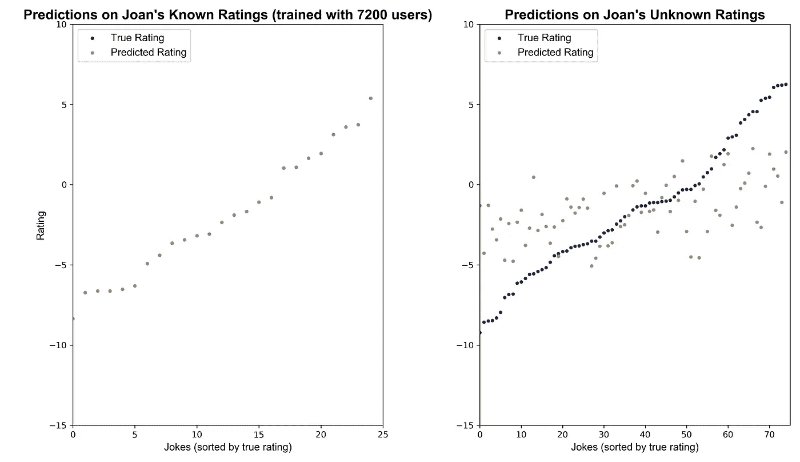*

*这篇文章是何坤宇写的。昆玉目前是芝加哥大学的硕士生。他发现理解统计建模和机器学习技术、将它们应用于真实世界的数据并帮助创建金融服务行业的端到端解决方案是一件有趣的事情。在 LinkedIn 上联系昆玉！🐷*

* [## 昆玉何-即将上任的全球量化策略非周期分析师-美银美林…

### 芝加哥大学正在接受理学硕士计算分析项目培训的数据科学家。对…充满热情

www.linkedin.com](https://www.linkedin.com/in/kunyuhe/)*