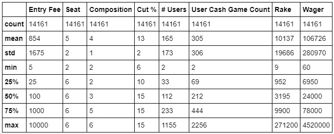

# 理解使用时间序列数据的数据分析和可视化。

> 原文：<https://towardsdatascience.com/understand-data-analysis-visualisation-using-time-series-data-ee27827dab25?source=collection_archive---------13----------------------->

## *《让数据和时间说话》*


Photo by Dylan Clifton on [Unsplash](https://unsplash.com/)

H 人类有幸拥有人工智能和数据科学，因为它帮助我们解决日常问题。我们经常会遇到大量的时间序列数据，这些数据与我们的日常活动非常相似。

在本帖中，我们将学习如何使用数据分析来洞察数据，并了解数据的行为。

我们使用了*【Junglee Rummy business】*[**时间序列数据集，在这里下载**](https://github.com/shamim-io/Junglee-Rummy-Data-Visualisation) 。数据集归***【Junglee Games】***所有。访问 [**链接**](https://github.com/shamim-io/Junglee-Rummy-Data-Visualisation/blob/master/README.md) 以获得数据集的概述。你也可以 [**玩**](https://www.jungleerummy.com/) 游戏。

我们必须了解与数据集相关的术语。让我们来看看:-

*   入场费:这是玩家以卢比支付的入场费。
*   *座位:可以坐在桌子上的最大玩家数量，即数据集的 2，6 人。*
*   *组成:实际加入牌桌的玩家数量。*
*   *日期:2018 年 7 月 1 日至 2018 年 9 月 30 日的数据集，给出了每个表配置的每日数据。*
*   *配置:定义为入场费—席位—构成的组合。*
*   *Cut % %:从每个用户的每场游戏中扣除的年龄金额。*
*   *'#Users ':当天至少玩了一场牌桌配置游戏的玩家(唯一玩家)的不同计数。*
*   *用户现金游戏计数:当日用户在牌桌配置上玩的游戏总数。如果用户 A、B、C 一起玩一个游戏，那么值将是 3。*
*   *Rake:该日期从表配置中生成的收入总额。*
*   *赌注:用户根据参加游戏的费用支付的总金额。*

我们开始吧！

我们会加载重要的库，让我们来看一看数据。

```
***import******pandas******as******pd******import******seaborn******as******sns******import******matplotlib.pyplot******as******plt******import******numpy******as******np****# reading the data using pandas*
df = pd.read_excel('BI Skill Test - Data Set.xlsx')
df.head()
```


数据集非常直观。如果不能理解，请阅读上面的专栏描述。我们将把`Cut%`乘以 100，使其计算简单。

```
*# Multiplying cut% with 100 to make it easy for computation*
df['Cut %'] = df['Cut %'] * 100
```

## 基本统计

现在我们对数据有了一个简单的了解。分析数据集的基本统计数据是非常必要的。

```
*# Basic statistics of tha data*
pd.options.display.float_format = '**{:.0f}**'.format
df.describe()
```



在数据科学中，这些统计数据对于深入了解数据起着至关重要的作用。通过上表中的数字后，观察到的一些情况如下:

1.  ***入场费:*** *用户玩一个游戏平均支付的入场费为 854 卢比，最低入场费为 5 卢比，最高入场费为 10000 卢比。大多数时候，用户支付 100 卢比作为入场费来玩游戏。*
2.  ***坐席:*** *坐在一起的玩家平均人数是 5 人，其中，平均 4 人上场。而最多有 6 名玩家。*
3.  ***削减%****平均削减%为 13%。大多数玩家支付 15%作为提成。*
4.  ***【用户数量:*** *平均每天至少玩一个游戏的用户数量为 165，而每天至少玩一个游戏的用户数量最多为 1155。*
5.  ***Rake:*** *公司平均每天赚的钱数是 10137 卢比。公司一天赚的最多的钱是 271200 卢比。公司大部分时间赚 3195 卢比。*
6.  ***赌注:*** *玩家投入游戏的最高金额是 4520000 卢比，而大多数时候用户支付 24000 卢比。*

仅仅一行代码就包含了大量的信息。感谢熊猫。

将一些信息进一步可视化会很有趣。我们将使用`matplotlib` python 库来执行同样的操作。

> 让我们从用户支付的作为游戏入门费的总金额开始。

```
plt.figure(figsize=(9, 8))
sns.distplot(df['Wager'], color='g', bins=100, hist_kws={'alpha': 0.4})
plt.title("Total amount paid by the users in terms of Entry Fees to play the game")
```


根据上面的图表，我们观察到大部分时间用户在某一天支付大约 25000 卢比。

> 现在，让我们来看看该日期从表配置中产生的总收入。

```
plt.figure(figsize=(9, 8))
sns.distplot(df['Rake'], color='b', bins=100, hist_kws={'alpha': 0.4})
plt.title("Total amount generated in revenue from a table configuration for the date")
```


通过上面的图表和基本的统计数据，可以认识到公司每天大部分时间的收入在 3000 卢比左右。

> B 用户支付卢比进入游戏

```
num_bins = 60
plt.hist(df['Entry Fee'], num_bins, facecolor='blue', alpha=0.5)
plt.title("Buy-in (money user pays) in rupees to enter the game")
plt.show()
```


我们观察到，大多数人购买票价低于 1000 卢比的门票。有一些用户花 10000 卢比作为入门费来玩这个游戏。

# 时间序列分析

数据分析和可视化让我们深入了解数据，在某些情况下，我们可能会遇到奇迹。因此，让我们深入数据集，执行时间序列分析。

> 我们主要关注的是数据的行为。

我们会将日期(按字母顺序书写)转换为对应的数字，并为日期、月份和年份创建单独的列。使用数字数据很容易进行数据分析。

我们将使用`datetime` python 类将日期转换为`datetime`格式。让我们看看它是如何工作的。

```
*# introducing datetime*
**from** **datetime** **import** datetime, date, time
datetime.strptime('July 1, 2018', '%B **%d**, %Y')
```

输出:

```
datetime.datetime(2018, 7, 1, 0, 0)
```

现在，我们将对整个日期列执行相同的操作。

```
*# converting date to datetime format*
date = []
**for** d **in** df['Date']:
    x = datetime.strptime(d, '%B **%d**, %Y')
    date.append(x)
df['my_date'] = date
```


```
print(df['my_date'][0].month)
print(df['my_date'][0].day)
print(df['my_date'][0].year)Output:7
1
2018
```

> 将日期时间转换为单独的列

```
*# converting datetime to individual columns*
day = []
month = []
year = []
**for** i **in** df['my_date']:
    day.append(i.day)
    month.append(i.month)
    year.append(i.year)df['day'] = day
df['month'] = month
df['year'] = yeardf.head(2)
```


现在，我们已经将日期转换为日期、月份和年份的个人列。让我们进行时间序列分析。

## 按月销售

```
*#sale by month*
sales_by_month = df.groupby('month').size()
print(sales_by_month)*#Plotting the Graph*
plot_by_month = sales_by_month.plot(title='Monthly Sales',xticks=(1,2,3,4,5,6,7,8,9,10,11,12))
plot_by_month.set_xlabel('Months')
plot_by_month.set_ylabel('Total Sales')
plt.title("Monthly sales analysis")
```


据观察，与其他月份相比，一月份的销售数量较高。随着时间的推移，销售额下降了。

## 白天销售

```
*#Sale by Day*

sales_by_day = df.groupby('day').size()
plot_by_day = sales_by_day.plot(title='Daily Sales',xticks=(range(1,31)),rot=55)
plot_by_day.set_xlabel('Day')
plot_by_day.set_ylabel('Total Sales')
plt.title("Daily sales analysis")
```


我们观察到，与其他月份相比，本月前五天的销售额较高。

> 如果我们能够获得每小时的数据，我们可以更好地分析销售行为。

## 每月玩家人数

观察每个月参与游戏的用户数量是个好主意。我们将使用`boxplot`来可视化相同的内容。

```
*# number of users played per month*
sns.boxplot(x='month', y='# Users', data=df)
plt.title("Number of users played per month")
plt.show()
```


随着时间的推移，每月的用户数量逐渐增加。如果我们关注分位数，一月份平均每天大约有 100 人。但最多也就 400 人左右。在 9 月份，平均每天大约有 220 个用户，而每天大约有 1200 个用户。其他月份也是如此。

## 每月在桌面配置中玩的用户数

```
*# Number of users played in table configuration per month.*

sns.boxplot(x='month', y='User Cash Game Count', data=df)
plt.title("Number of users played in table configuration per month")
plt.show()
```


同样，如果我们关注一张桌子上每个月玩的游戏数量。一月份一天大约有 100 人玩，而一天最多有 800 人玩。我们注意到在四月份玩的游戏数量有轻微的下降。在九月份，平均有 500 人在桌上玩，而最多有 3000 人在桌上玩，75%的时间有 900 人在桌上玩游戏。

## 公司每月赚取的利润

```
*# Profit earned by company every month*

sns.boxplot(x='month', y='Rake', data=df)
plt.title("Profit earned by company every month")
plt.show()
```


如果我们观察箱线图，公司在 9 月份平均获得了大部分利润。我们还看到，5 月份一次赚取的最大利润约为 300000 英镑。在二月份，公司收入最少。

## *用户每月支付的作为玩游戏入门费的总金额。*

```
*# total amount payed by users as entry fee to play games per month.*

sns.boxplot(x='month', y='Wager', data=df)
plt.title("Total amount payed by users as entry fee to play games per month")
plt.show()
```


我们观察到与上述 RAGE 图相同的情况。在 5 月份，用户玩游戏花费的金额最大。平均而言，9 月份的记录不错。

> 现在让我们进行日间分析，看看我们是否能得到任何进一步的重要信息。

```
*# number of cash games played by users per day.* 
plt.figure(figsize=(20,18))
df.plot(kind='scatter', x='day', y='User Cash Game Count');
plt.title("Number of cash games played by users per day")
plt.show()
```


```
*# Revenue earned by users in days of month*

df.plot(kind='scatter', x='day', y='Rake');
plt.title("Revenue earned by users in days of month")
plt.show()
```


```
*# Amount spent by user every day of the month.*

df.plot(kind='scatter', x='day', y='Wager');
plt.title("Amount spent by user every day of the month")
plt.show()
```


我们对时间序列数据进行了基本的数据分析，可以从中获得很多信息。这只是操纵数据和灌输思想的游戏。

# 结论和意见

*   入场费:首先，最高人数花费 100 卢比进入游戏。
*   座位:一张桌子最多可以坐 6 个玩家，其中 3 个玩家大部分时间都在玩。
*   Cut%:在大多数情况下，每个用户要扣除 15%的金额。
*   用户数量:每天至少有 112 名玩家玩桌上游戏。
*   用户现金游戏:在大多数情况下，一天有 212 名玩家玩桌上游戏。
*   Rake:公司平均每天赚 3195 卢比。
*   赌注:每天用户平均花费 24000 卢比。
*   我们观察到，大多数用户花不到 1000 卢比玩游戏。
*   据观察，与其他月份相比，一月份的销售数量较高。随着时间的推移，销售额下降了。
*   我们观察到，与其他月份相比，本月前五天的销售额较高。
*   我们观察到，随着时间的推移，用户的数量逐渐增加。但 5 月份的用户参与度比前几个月高得多。
*   我们看到，公司在五月份创造了非常高的收入。
*   我们已经观察到，该月的每一天都显示出公司的统一收入生成。
*   总的来说，我们发现 5 月份是公司盈利能力最好的月份。它在这方面显示出显著的增长。而就盈利能力而言，二月份对公司来说有点奇怪。

源代码可以在我的 [**Github repo**](https://github.com/shamim-io/Junglee-Rummy-Data-Visualisation) 上找到。我期待听到任何反馈或问题。感谢您阅读这篇文章。

在 [LinkedIn](https://www.linkedin.com/in/shamimio/) 上关注我。