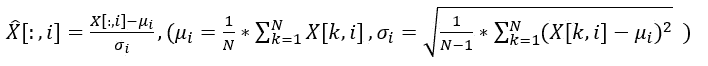
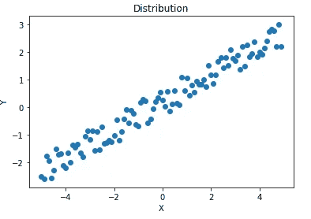

# 理解机器学习中的数据规范化

> 原文：<https://towardsdatascience.com/understand-data-normalization-in-machine-learning-8ff3062101f0?source=collection_archive---------2----------------------->

如果你是数据科学/机器学习的新手，你可能很想知道“特征规范化”这个时髦词的本质和效果。如果您阅读过任何 Kaggle 内核，很可能在数据预处理部分找到了特性规范化。那么，什么是数据规范化，为什么数据从业者如此重视它？

# 1.定义

有不同类型的数据规范化。假设您有一个数据集 *X* ，它有 *N* 行(条目)和 *D* 列(特征)。 *X[:，i]* 表示特征 *i* ，X[j，:]表示条目 *j。我们有:*

**Z 规范化(标准化)**:



我曾经错误地认为这种方法会产生标准的高斯结果。事实上，标准化并没有改变分销的类型:


pdf of standardized data

此转换将数据的平均值设置为 0，标准差设置为 1。在大多数情况下，标准化是按功能使用的

**最小-最大归一化:**


该方法将数据的范围重新调整为[0，1]。在大多数情况下，标准化也是按功能使用的

**单位矢量归一化:**


缩放到单位长度将一个向量(一行数据可以看作一个 *D* 维向量)收缩/拉伸到一个单位球体。当在整个数据集上使用时，转换后的数据可以被可视化为在 *D* 维单位球上具有不同方向的一束向量。

哇，正常化确实是一个宽泛的术语，它们各有利弊！在本文中，我将只关注标准化，否则这篇文章会太长。

# 2.效果

## **回归**

理论上，回归对标准化不敏感，因为输入数据的任何线性变换都可以通过调整模型参数来抵消。假设我们有一个带有参数 *W* 和 *B* 的线性模型:


W is D by 1, B is N by 1

通过减去矩阵 *M* 并乘以对角矩阵 *T* 可以实现列方式的改变


很容易证明，我们可以通过调整 *W* 和 *B* 来抵消这种转换


因此，输入数据的标准化不应影响输出或准确性。好吧，如果数学上说标准化在回归中起不了什么作用，为什么它仍然如此受欢迎？

**答。标准化提高了模型的数值稳定性**

如果我们有一个简单的一维数据 X，并使用 MSE 作为损失函数，使用梯度下降的梯度更新是:


Y’ is the prediction

X 在梯度下降公式中，意味着 X 的值决定了更新速率。所以更大的 X 会导致渐变景观更大的飞跃。同时，给定 Y，较大的 X 导致较小的 W:


当 X 很大时，初始 W(随机选取的)和全局最小值之间的距离很可能很小。因此，当 X 较大时(学习率是固定的)，该算法更可能失败，因为该算法朝着非常接近的目标 W 进行了巨大的跳跃，而需要小步前进。这种超调会让你的亏损振荡或爆发。

实验:

我使用以下代码人工创建了一个数据集:

```
X = np.arange(-5,5,0.1)
w = 0.5
b = 0.2
Y = X*w+b+(np.random.rand(X.shape[0],)-0.5)#add some noise to Y
X.reshape(100,1)
Y.reshape(100,1)
```



我在实验中使用了一个简单的线性回归代码:

```
class linear_regression:
    def fit(self, X,Y, lr=0.00001):
        epoch = 0
        loss_log = []
        while (epoch<8000):
            pred = self.predict(X)
            l = self.loss(pred,Y)# get loss
            loss_log.append(l)
            delta_w = 2*np.matmul((Y-pred).T, X) # gradient of w
            delta_b = sum(2*(Y-pred))
            self.w = self.w + lr*delta_w
            self.b = self.b + lr*delta_b
            epoch = epoch+1
        plt.plot(loss_log)
        plt.ylim([0.07,0.1])
        print (loss_log[-5:-1])
    def loss(self, pred,Y):
        error = Y-pred
        return sum(error**2)/error.shape[0] # MSE
    def predict(self, X):
        return X*self.w+self.b# n by 1
    def __init__(self):# initial parameters
        self.w=0.5# fixed initialization for comparison convenience
        self.b=0.5
```

下表显示了不同学习率和特征范围的最终 MSE。


final loss (MSE) after 8000 iterations

当 X 具有较大的系数(因此范围较大)时，模型需要较小的学习速率来保持稳定性。

**b)。标准化可能会加快培训过程**

第一个“定理”的推论是，如果不同的特征具有完全不同的范围，则学习率由具有最大范围的特征决定。这带来了标准化的另一个好处:加快了培训过程。

假设我们有两个特征:


由 *X2* 确定的学习率对于 *X1* 来说并不“伟大”，因为 *X1* 对于大得多的学习率来说是可以的。我们正在慢慢地走，而大的跳跃本可以被用来代替，这导致了更长的训练时间。我们可以通过标准化这两个特性来减少训练时间。

实验:

我使用以下代码人工创建了一个包含两个要素的数据集:

```
X1 = np.arange(-5,5,0.1)
X2 = np.arange(-5,5,0.1)
X = np.column_stack((X1,X2))
W = np.array([[0.1],[0.2]])
b = 0.1
Y = np.matmul(X,W)+b+(np.random.rand(X.shape[0],1) -0.5)
# add some noise to labels
```

使用稍微修改的线性回归代码:

```
class linear_regression:
    def fit(self, X,Y, lr=1e-4):
        epoch = 0
        loss_log = []
        while (epoch<80000):
            pred = self.predict(X)
            l = self.loss(pred,Y)# get loss
            loss_log.append(l)
            if l < 0.0792:
                print (epoch)
                break
            delta_w = 2*np.matmul((Y-pred).T, X) # gradient of w
            delta_b = sum(2*(Y-pred))
            self.w = self.w + lr*delta_w.T
            self.b = self.b + lr*delta_b
            epoch = epoch+1
        plt.plot(loss_log)
        plt.ylim([0.07,0.1])
        print (loss_log[-5:-1])
    def loss(self, pred,Y):
        error = Y-pred
        return sum(error**2)/error.shape[0] # MSE
    def predict(self, X):
        return np.matmul(X,self.w)+self.b# n by 1
    def __init__(self):
        self.w=np.array([[0.5],[0.5]])# for comparison convenience
        self.b=0.3
```

下表显示了对于给定的系数和学习率，达到全局最小值所需的迭代次数:


iterations to reach the global minimum

我们可以看到，当数据没有标准化时，模型需要更多的迭代(训练时间)才能完成。

## **基于距离的算法**

K-mean 和 K-NN 等基于距离的聚类算法很有可能受到标准化的影响。聚类算法需要计算条目之间的距离。最常用的距离是欧几里德距离:


distance between i and j

很明显，特征缩放将改变节点之间的数值距离。

实验:

使用以下代码创建数据集:

```
def random_2D_data(x,y,size):
    x = (np.random.randn(size)/3.5)+x
    y = (np.random.randn(size)*3.5)+y
    return x,y
x1,y1 = random_2D_data(2,20,50)
x2,y2 = random_2D_data(2,-20,50)
x3,y3 = random_2D_data(-2,20,50)
x4,y4 = random_2D_data(-2,-20,50)
x = np.concatenate((x1,x2,x3,x4))
y = np.concatenate((y1,y2,y3,y4))
```


使用 K 均值对数据进行聚类:


clustering without any feature scaling

然而，对标准化数据做同样的事情会产生完全不同的结果:


affected result

太好了，我们有互相矛盾的结果。我应该选择哪个结果？

**标准化为每个功能提供了“平等”的考虑。**

例如，X 具有两个特征 x1 和 x2


如果直接计算欧氏距离，节点 1 和 2 会比节点 1 和 3 离得更远。然而，节点 3 完全不同于 1，而节点 2 和 1 仅在特征 1 (6%)上不同，并且共享相同的特征 2。这是因为特征 1 是“VIP”特征，以其大数值控制结果。

因此，如果我们不知道哪些特征是“钻石”特征，哪些是“珊瑚”特征，那么使用标准化来平等地考虑它们是一种很好的做法。

## **基于树的决策算法**

决策树或随机森林等基于树的决策算法会在每个特征中寻找最佳分割点。分割点由使用特征正确分类的标注的百分比决定，该百分比对特征缩放具有弹性。因此，标准化对这种类型的 ML 模型没有任何重大影响。

## **神经网络**

神经网络可以像回归一样抵消标准化。因此，理论上，数据标准化不应该影响神经网络的性能。然而，经验证据表明，数据标准化在准确性方面是有益的[1]。目前，我还没有看到原因，但可能与梯度下降有关。

很容易理解为什么标准化会提高训练时间。大输入值使激活函数饱和，如 sigmoid 或 ReLu(负输入)。这些类型的激活函数在饱和区域反馈很小的梯度或者根本没有梯度，因此减慢了训练。


large input kills backward gradient flow

# 3.摘要

标准化在许多情况下是有益的。它提高了模型的数值稳定性，并且通常减少了训练时间。然而，标准化并不总是好的。假设特征的重要性相等会损害基于距离的聚类算法的性能。如果特性之间存在固有的重要性差异，那么进行标准化通常不是一个好主意。

参考:

[1]: Shanker M，Hu MY，Hung MS，*数据标准化对神经网络训练的影响，*[https://www . science direct . com/science/article/pii/0305048396000102](https://www.sciencedirect.com/science/article/pii/0305048396000102)