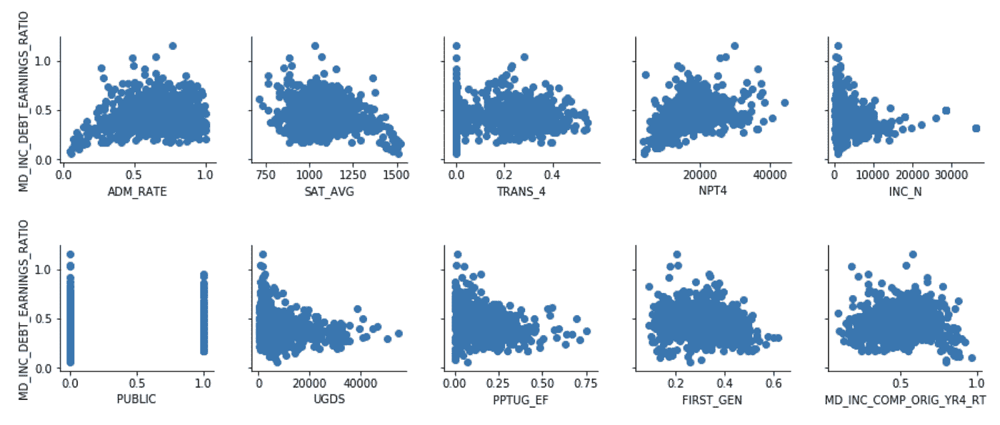
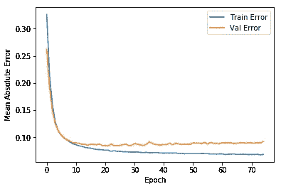
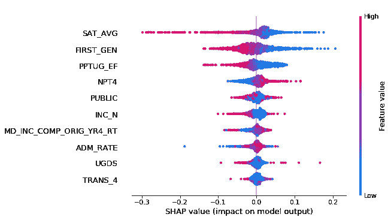
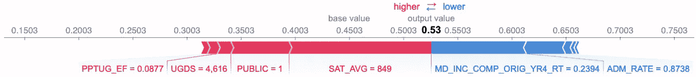
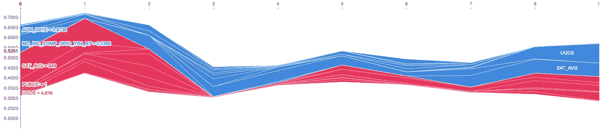
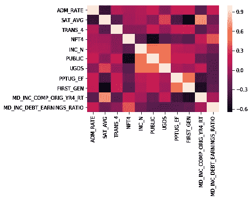
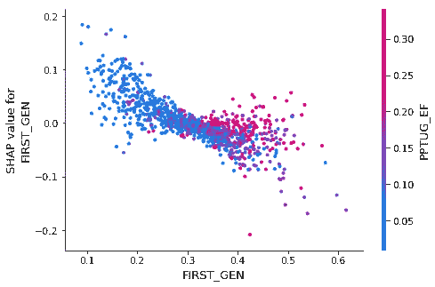

# 了解你的张量流模型是如何进行预测的

> 原文：<https://towardsdatascience.com/understand-how-your-tensorflow-model-is-making-predictions-d0b3c7e88500?source=collection_archive---------10----------------------->

## 与 SHAP 一起探索学生贷款数据

# 介绍

机器学习可以比以往更快更准确地回答问题。随着机器学习在更多任务关键型应用中的使用，理解这些预测是如何得出的变得越来越重要。

在这篇博文中，我们将使用来自 [TensorFlow](https://www.tensorflow.org/) 的 Keras API 构建一个神经网络模型，这是一个开源的机器学习框架。一旦我们的模型被训练，我们将把它与可解释性库 [SHAP](https://github.com/slundberg/shap) 集成。我们将使用 SHAP 来了解哪些因素与模型预测相关。


# 关于模型

我们的模型将预测大学毕业生相对于他们未来收入的毕业债务。这一债务收益比旨在作为一所大学投资回报(ROI)的粗略指标。这些数据来自美国教育部的[大学记分卡](https://collegescorecard.ed.gov/)，这是一个公开其数据的互动网站。

下表列出了模型中的功能。关于数据集的更多细节可以在[数据文档](https://collegescorecard.ed.gov/data/documentation/)中找到。

```
+-------------------------+--------------------------------------+
|         Feature         |             Description              |
+-------------------------+--------------------------------------+
| ADM_RATE                | Admission rate                       |
| SAT_AVG                 | SAT average                          |
| TRANS_4                 | Transfer rate                        |
| NPT4                    | Net price (list price - average aid) |
| INC_N                   | Family income                        |
| PUBLIC                  | Public institution                   |
| UGDS                    | Number of undergraduate students     |
| PPTUG_EF                | % part-time students                 |
| FIRST_GEN               | % first-generation students          |
| MD_INC_COMP_ORIG_YR4_RT | % completed within 4 years           |
+-------------------------+--------------------------------------+
```

我们从数据集中可用的债务和收益数据中推导出目标变量(债务收益比)。具体来说，就是毕业时积累的债务中位数(`MD_INC_DEBT_MDN`)，除以毕业后 6 年的平均收入(`MN_EARN_WNE_INC2_P6`)。

创建散点图是为了可视化每个特征与我们的目标变量的相关性。下面的每张图表在 X 轴上显示特征，在 Y 轴上显示债务/收益比率。



我们将使用一个`Sequential`模型，有两个密集连接的隐藏层和一个 ReLU 激活函数:

```
model = keras.Sequential([
    layers.Dense(16, activation=tf.nn.relu, input_shape=[len(df.keys())]),
    layers.Dense(16, activation=tf.nn.relu),
    layers.Dense(1)
```

下面我们看到一个训练过程的图表。训练误差和验证误差之间的差距越来越大，这表明有些过度拟合。过度拟合很可能是由于数据集中具有所有所需特征的样本数量有限(1，117 个)。尽管如此，考虑到平均债务收益比大约为 0.45，0.1 的平均绝对误差证明了一个有意义的预测。



要在浏览器中直接运行笔记本，您可以使用 [Colab](https://colab.research.google.com/github/kweinmeister/notebooks/blob/master/tensorflow-shap-college-debt.ipynb) 。在 [Github](https://github.com/kweinmeister/notebooks/blob/master/tensorflow-shap-college-debt.ipynb) 中也有。

# 关于 ML 公平的一句话

我们在这篇博文中调查的大学债务问题与更广泛的社会经济问题有着密切的联系。应该仔细评估任何模型及其训练数据，以确保它公平地服务于所有用户。例如，如果我们的训练数据主要包括来自高收入家庭的学生就读的学校，那么模型的预测将会歪曲那些学生通常有许多学生贷款的学校。

在可能的情况下，对中等收入学生的数据值进行了过滤，以便对不同家庭收入水平的学生进行一致的分析。大学记分卡数据将中等收入阶层定义为家庭收入在 3 万美元至 7.5 万美元之间的学生。并非所有可用的数据都提供此过滤器，但它可用于净价、收益、债务和完成率等关键功能。

记住这个思考过程，分析可以进一步扩展到数据集中的其他方面。同样值得注意的是，可解释性揭示了哪些特征对模型的预测贡献最大。它并不表明特征和预测之间是否存在因果关系。

# SHAP 简介

可解释性本质上是理解模型中正在发生的事情的能力。通常在模型的准确性和可解释性之间有一个折衷。简单的线性模型易于理解，因为它们直接暴露了变量和系数。非线性模型，包括由神经网络或梯度增强树导出的模型，可能更难以解释。

进入 SHAP。SHAP，或 SHapley Additive exPlanations，是由 Scott Lundberg 创建的 Python 库，可以解释许多机器学习框架的输出。它有助于解释单个预测或汇总更大人群的预测。

SHAP 通过干扰输入数据来评估每个特征的影响。每个特征的贡献在所有可能的特征交互中被平均。这种方法是基于博弈论中 Shapley 值的概念。它提供了一种稳健的近似，相对于 LIME 等其他方法，这种近似在计算上可能更昂贵。关于 SHAP 理论的更多细节可以在图书馆作者的 [2017 NeurIPS 论文](http://papers.nips.cc/paper/7062-a-unified-approach-to-interpreting-model-predictions)中找到。

# 将 SHAP 与张量流 Keras 模型结合使用

SHAP 提供了几个解释器类，它们使用不同的实现，但都利用了基于 Shapley 值的方法。在这篇博文中，我们将演示如何使用 KernelExplainer 和 DeepExplainer 类。KernelExplainer 与模型无关，因为它将模型预测和训练数据作为输入。DeepExplainer 针对深度学习框架(TensorFlow / Keras)进行了优化。

SHAP DeepExplainer 目前不支持急切执行模式或 TensorFlow 2.0。然而，KernelExplainer 将工作得很好，尽管它明显慢了很多。

让我们从使用 KernelExplainer 绘制模型的概要图开始。我们将首先把训练数据总结成 *n* 个集群。这是一个可选但有用的步骤，因为生成 Shapley 值的时间会随着数据集的大小呈指数增长。

```
# Summarize the training set to accelerate analysis
df_train_normed_summary = shap.kmeans(df_train_normed.values, 25)# Instantiate an explainer with the model predictions and training data summary
explainer = shap.KernelExplainer(model.predict, df_train_normed_summary)# Extract Shapley values from the explainer
shap_values = explainer.shap_values(df_train_normed.values)# Summarize the Shapley values in a plot
shap.summary_plot(shap_values[0], df_train_normed)
```

摘要图显示了每个要素的 Shapley 值分布。每个点的颜色在光谱上，该特征的最高值是红色，最低值是蓝色。通过 Shapley 值的绝对值之和对特征进行排序。

我们从剧情来看一些关系。贡献度最高的前三个特征分别是**SAT 平均分**、 **%第一代学生**、 **%非全日制招生**。请注意，这些特征中的每一个都在右侧有显著的蓝点(低特征值),这里有正 SHAP 值。这告诉我们，这些特征的低值导致我们的模型预测高 DTE 比率。列表中的第四个特性**净价**具有相反的关系，其中净价越高，DTE 比率越高。



也可以使用`force_plot()`函数解释一个特定的实例:

```
# Plot the SHAP values for one instance
INSTANCE_NUM = 0shap.force_plot(explainer.expected_value[0], shap_values[0][INSTANCE_NUM], df_train.iloc[INSTANCE_NUM,:])
```



在这个特殊的例子中，大学的 SAT 平均分对其 0.53 的 DTE 预测贡献最大，推动其值更高。完成率(`MD_INC_COMP_ORIG_YR4_RT`)是第二重要的特征，将预测值推低。还可以查看整个数据集或一部分 *n* 实例中显示的一系列 SHAP 值，如下所示:

```
# Plot the SHAP values for multiple instances
NUM_ROWS = 10
shap.force_plot(explainer.expected_value[0], shap_values[0][0:NUM_ROWS], df_train.iloc[0:NUM_ROWS])
```



# 注意相关的特征

SHAP 将在相关变量间分割特征贡献。在为模型选择特征和分析特征重要性时，记住这一点很重要。让我们计算相关矩阵，看看我们会发现什么:

```
corr = df.corr()
sns.heatmap(corr)
```



让我们用相关矩阵交叉引用总结图中的前三个特征，看看哪些特征可能会被拆分:

*   **SAT 平均分**与**完成率**呈正相关，与**录取率**和**一代比呈负相关。**
*   **一代比**与**兼职比**相关，与**完成率**负相关。

几个相关的特征被分组在摘要图列表的顶部。值得关注的是榜单中排名靠后的**完成率**和**录取率**。

SHAP 有一个`dependence_plot()`功能，可以帮助揭示更多细节。比如我们来看看**一代比**和**兼职比**的相互作用。正如我们在汇总图中观察到的，我们可以看到**第一代**比率与其 Shapley 值呈负相关。依赖图还向我们显示，当大学的兼职学生比例较低时，相关性更强。

```
shap.dependence_plot('FIRST_GEN', shap_values[0], df_train, interaction_index='PPTUG_EF')
```



# 结论

在这篇博文中，我们展示了如何用 SHAP 解释 tf.keras 模型。我们还回顾了如何使用 SHAP API 和几个 SHAP 绘图类型。最后，为了完整和准确的描述，我们讨论了关于公平性和相关变量的考虑。现在，您拥有了更好地了解 TensorFlow Keras 模型中发生的事情的工具！

要了解我在这里介绍的更多信息，请查看以下资源:

*   [Colab 笔记本](https://colab.research.google.com/github/kweinmeister/notebooks/blob/master/tensorflow-shap-college-debt.ipynb)从浏览器运行模型
*   [GitHub 储存库](https://github.com/kweinmeister/notebooks/blob/master/tensorflow-shap-college-debt.ipynb)带笔记本
*   【tf.keras 入门
*   [SHAP GitHub 库](https://github.com/slundberg/shap)

在[推特](https://twitter.com/kweinmeister)上让我知道你的想法！