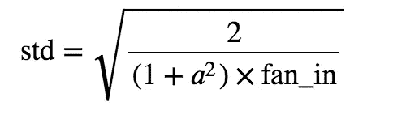

# 理解 PyTorch 中明凯初始化和实现的细节

> 原文：<https://towardsdatascience.com/understand-kaiming-initialization-and-implementation-detail-in-pytorch-f7aa967e9138?source=collection_archive---------4----------------------->

## 初始化很重要！知道如何用明凯均匀函数设置扇入和扇出模式


Photo by [Jukan Tateisi](https://unsplash.com/@tateisimikito?utm_source=unsplash&utm_medium=referral&utm_content=creditCopyText) on [Unsplash](https://unsplash.com/search/photos/challenge?utm_source=unsplash&utm_medium=referral&utm_content=creditCopyText)

# TL；速度三角形定位法(dead reckoning)

如果你**通过创建一个线性层**来隐式地创建权重，你应该设置`modle='fan_in'`。

```
linear = torch.nn.Linear(node_in, node_out)
init.kaiming_normal_(linear.weight, mode=’fan_in’)
t = relu(linear(x_valid))
```

如果你**通过创建一个随机矩阵**显式地创建权重，你应该设置`modle='fan_out'`。

```
w1 = torch.randn(node_in, node_out)
init.kaiming_normal_(w1, mode=’fan_out’)
b1 = torch.randn(node_out)
t = relu(linear(x_valid, w1, b1))
```

内容结构如下。

1.  重量初始化很重要！
2.  什么是明凯初始化？
3.  为什么明凯初始化有效？
4.  理解 Pytorch 实现中的扇入和扇出模式

# 重量初始化很重要！

初始化是一个创建权重的过程。在下面的代码片段中，我们随机创建了一个大小为`(784, 50)`的权重`w1`。

> `*torhc.randn(*sizes)*`从均值为 0、方差为 1 的**正态分布**返回一个填充了随机数的张量(也称为**标准正态分布**)。张量的形状由变量 argument `*sizes*`定义。

并且该权重将在训练阶段被更新。

```
*# random init*
w1 = torch.randn(784, 50) 
b1 = torch.randn(50)

**def** linear(x, w, b):
    **return** x@w + b

t1 = linear(x_valid, w1, b1)print(t1.mean(), t1.std())############# output ##############
tensor(3.5744) tensor(28.4110)
```

你可能想知道如果权重可以在训练阶段更新，为什么我们需要关心初始化。无论如何初始化权重，最终都会被“很好地”更新。

但现实并不那么甜蜜。如果我们随机初始化权重，就会引起两个问题，即 ***消失渐变问题*** 和 ***爆炸渐变问题*** 。

***消失渐变问题*** 表示权重消失为 0。因为这些权重在反向传播阶段与层一起被相乘。如果我们将权重初始化得很小(< 1)，在反向传播过程中，当我们使用隐藏层进行反向传播时，梯度会变得越来越小。前几层的神经元比后几层的神经元学习慢得多。这导致轻微的重量更新。

***爆炸渐变问题*** 表示权重爆炸到无穷大(NaN)。因为这些权重在反向传播阶段与层一起被相乘。如果我们将权重初始化得很大(> 1)，当我们在反向传播过程中使用隐藏层时，梯度会变得越来越大。早期层中的神经元以巨大的步长更新，`W = W — ⍺ * dW`，并且向下的力矩将增加。

# 什么是明凯初始化？

[明凯等人](https://arxiv.org/pdf/1502.01852.pdf)通过对 ReLUs 的非线性进行谨慎建模，推导出一种合理的初始化方法，使得极深模型(> 30 层)收敛。下面是明凯初始化函数。



*   a:该层之后使用的整流器的负斜率(默认情况下，ReLU 为 0)
*   fan_in:输入维数。如果我们创建一个`(784, 50)`，扇入是 784。`fan_in`用于前馈阶段的**。如果我们将其设置为`fan_out`，则扇出为 50。`fan_out`用于**反向传播阶段**。后面我会详细解释两种模式。**

# 为什么明凯初始化有效？

我们通过比较随机初始化和明凯初始化来说明明凯初始化的有效性。

**随机初始化**

```
# random init
w1 = torch.randn(784, 50) 
b1 = torch.randn(50)
w2 = torch.randn(50, 10) 
b2 = torch.randn(10)
w3 = torch.randn(10, 1) 
b3 = torch.randn(1)def linear(x, w, b):
    return x@w + bdef relu(x):
    return x.clamp_min(0.)t1 = relu(linear(x_valid, w1, b1))
t2 = relu(linear(t1, w2, b2))
t3 = relu(linear(t2, w3, b3))print(t1.mean(), t1.std())
print(t2.mean(), t2.std())
print(t3.mean(), t3.std())############# output ##############
tensor(13.0542) tensor(17.9457)
tensor(93.5488) tensor(113.1659)
tensor(336.6660) tensor(208.7496)
```

我们用均值为 0、方差为 1 的正态分布来初始化权重，ReLU 后的理想权重分布应该是**逐层略微递增的均值**和接近 1 的**方差**。但是在前馈阶段，经过一些层之后，分布变化很大。

**为什么权重的均值要逐层小幅递增？**

因为我们使用 ReLU 作为激活函数。如果输入值大于 0，ReLU 将返回提供的值，如果输入值小于 0，将返回 0。


```
if input < 0:
    return 0
else:
    return input
```

ReLU 之后，所有负值都变成 0。当层变得更深时，平均值将变得更大。

**明凯初始化**

```
# kaiming init
node_in = 784
node_out = 50# random init
w1 = torch.randn(784, 50) * math.sqrt(2/784)
b1 = torch.randn(50)
w2 = torch.randn(50, 10) * math.sqrt(2/50)
b2 = torch.randn(10)
w3 = torch.randn(10, 1) * math.sqrt(2/10)
b3 = torch.randn(1)def linear(x, w, b):
    return x@w + bdef relu(x):
    return x.clamp_min(0.)t1 = relu(linear(x_valid, w1, b1))
t2 = relu(linear(t1, w2, b2))
t3 = relu(linear(t2, w3, b3))print(t1.mean(), t1.std())
print(t2.mean(), t2.std())
print(t3.mean(), t3.std())############# output ##############
tensor(0.7418) tensor(1.0053)
tensor(1.3356) tensor(1.4079)
tensor(3.2972) tensor(1.1409)
```

我们用均值为 0、方差为 `**std**`的正态分布**初始化权重，relu 后的理想权重分布应该是均值逐层略微递增，方差接近 1。我们可以看到输出接近我们的预期。**在前馈阶段，平均增量缓慢，std 接近 1** 。并且这种稳定性将**避免在**反向传播阶段中的消失梯度问题和爆炸梯度问题。**

明凯初始化显示出比随机初始化更好的稳定性。

# **了解 Pytorch 实现中的 fan_in 和 fan_out 模式**

`[nn.init.kaiming_normal_()](https://pytorch.org/docs/stable/nn.html#torch.nn.init.kaiming_normal_)`将返回具有从均值 0 和方差`std`中采样的值的张量。有两种方法可以做到。

一种方法是**通过创建线性层**来隐式创建权重。我们设置`mode='fan_in'`来表示使用`node_in`计算 std

```
from torch.nn import init# linear layer implementation
node_in, node_out = 784, 50**layer = torch.nn.Linear(node_in, node_out)
init.kaiming_normal_(layer.weight, mode='*fan_in*')
t = relu(layer(x_valid))**print(t.mean(), t.std())############# output ##############
tensor(0.4974, grad_fn=<MeanBackward0>) tensor(0.8027, grad_fn=<StdBackward0>)
```

另一种方法是**通过创建随机矩阵**来显式创建权重，你应该设置`mode='fan_out'`。

```
def linear(x, w, b):
    return x@w + b# weight matrix implementation
node_in, node_out = 784, 50**w1 = torch.randn(node_in, node_out)
init.kaiming_normal_(w1, mode='*fan_out*')** b1 = torch.randn(node_out)
**t = relu(linear(x_valid, w1, b1))**print(t.mean(), t.std())############# output ##############
tensor(0.6424) tensor(0.9772)
```

两种实现方法都是对的。平均值接近 0.5，标准差接近 1。但是等一下，你有没有发现一些奇怪的事情？

**为什么模式不同？**

根据[文件](https://pytorch.org/docs/stable/nn.html#torch.nn.init.kaiming_normal_)，选择`'fan_in'`保留了正向传递中权重**的方差大小。选择`'fan_out'`保留反向过程中的幅度。我们可以这样写。**

```
node_in, node_out = 784, 50# fan_in mode
W = torch.randn(node_in, node_out) * math.sqrt(2 / node_in)# fan_out mode
W = np.random.randn(node_in, node_out) * math.sqrt(2/ node_out)
```

在线性层实现中，我们设置`mode='fan_in'`。是的，这是前馈阶段，我们应该设置`mode='fan_in'`。没什么问题。

**但是为什么我们在权重矩阵实现中设置模式为** `**fan_out**` **？**

`[nn.init.kaiming_normal_()](https://pytorch.org/docs/stable/nn.html#torch.nn.init.kaiming_normal_)`的[源代码](https://github.com/pytorch/pytorch/blob/d58059bc6fa9b5a0c9a3186631029e4578ca2bbd/torch/nn/init.py#L202)背后的原因

```
def _calculate_fan_in_and_fan_out(tensor):
    dimensions = tensor.dim()
    if dimensions < 2:
        raise ValueError("Fan in and fan out can not be computed for tensor with fewer than 2 dimensions")if dimensions == 2:  # Linear
        **fan_in = tensor.size(1)
        fan_out = tensor.size(0)**
    else:
        num_input_fmaps = tensor.size(1)
        num_output_fmaps = tensor.size(0)
        receptive_field_size = 1
        if tensor.dim() > 2:
            receptive_field_size = tensor[0][0].numel()
        fan_in = num_input_fmaps * receptive_field_size
        fan_out = num_output_fmaps * receptive_field_sizereturn fan_in, fan_out
```

这是获得正确模式的源代码。`tensor`是尺寸为(784，50)的`w1`。所以`fan_in = 50, fan_out=784`。当我们在权重矩阵实现中将模式设置为`fan_out`时。`init.kaiming_normal_()`实际计算如下。

```
node_in, node_out = 784, 50W = np.random.randn(node_in, node_out)
**init.kaiming_normal_(W, mode='*fan_out*')**# what init.kaiming_normal_() actually does
    # fan_in = 50
    # fan_out = 784W = W * torch.sqrt(784 / 2)
```

好吧，有道理。**但是如何解释在线性层实现中使用** `**fan_in**` **？**

当我们使用线性隐式创建权重时，权重被隐式转置。下面是[torch . nn . functional . linear](https://github.com/pytorch/pytorch/blob/master/torch/nn/functional.py#L1354)的源代码。

```
def linear(input, weight, bias=None):
    # type: (Tensor, Tensor, Optional[Tensor]) -> Tensor
    r"""
    Applies a linear transformation to the incoming data: :math:`y = xA^T + b`.
    Shape:
        - Input: :math:`(N, *, in\_features)` where `*` means any number of
          additional dimensions
        - **Weight: :math:`(out\_features, in\_features)`**
        - Bias: :math:`(out\_features)`
        - Output: :math:`(N, *, out\_features)`
    """
    if input.dim() == 2 and bias is not None:
        # fused op is marginally faster
        ret = torch.addmm(bias, input, **weight.t()**)
    else:
        **output = input.matmul(weight.t())**
        if bias is not None:
            output += bias
        ret = output
    return ret
```

权重初始化为`(out_features, in_features)`的大小。例如，如果我们输入尺寸`(784, 50)`，重量的大小实际上是`(50, 784)`。

```
torch.nn.Linear(784, 50).weight.shape############# output ##############
torch.Size([50, 784])
```

这就是为什么 linear 需要先转置权重，再做 matmul 运算的原因。

```
 if input.dim() == 2 and bias is not None:
        # fused op is marginally faster
        ret = torch.addmm(bias, input, **weight.t()**)
    else:
        output = input.matmul(**weight.t()**)
```

因为线性层中的权重大小为`(50, 784)`，所以`init.kaiming_normal_()`实际计算如下。

```
node_in, node_out = 784, 50**layer = torch.nn.Linear(node_in, node_out)**
**init.kaiming_normal_(layer.weight, mode='*fan_out*')**# the size of layer.weightis (50, 784)# what init.kaiming_normal_() actually does
    # fan_in = 784
    # fan_out = 50W = W * torch.sqrt(784 / 2)
```

# 摘要

在这篇文章中，我首先谈到了为什么初始化很重要，什么是明凯初始化。我将分解如何使用 PyTorch 来实现它。希望这个帖子对你有帮助。有什么建议就留言吧。

这个[片段中的完整代码](https://gist.github.com/BrambleXu/feb892476202ecc55d03f1f377869755)。

> ***查看我的其他帖子*** [***中等***](https://medium.com/@bramblexu) ***同*** [***分类查看***](https://bramblexu.com/posts/eb7bd472/) ***！
> GitHub:***[***bramble Xu***](https://github.com/BrambleXu) ***LinkedIn:***[***徐亮***](https://www.linkedin.com/in/xu-liang-99356891/) ***博客:***[*bramble Xu*](https://bramblexu.com)

# **参考**

*   [为什么谨慎初始化深度神经网络很重要？](/what-is-weight-initialization-in-neural-nets-and-why-it-matters-ec45398f99fa)
*   [深度学习最佳实践(1) —权重初始化](https://medium.com/usf-msds/deep-learning-best-practices-1-weight-initialization-14e5c0295b94)
*   明凯初始化论文:[深入研究整流器:在 ImageNet 分类上超越人类水平的性能](https://arxiv.org/pdf/1502.01852.pdf)
*   [整流线性单元(ReLU)简介](https://machinelearningmastery.com/rectified-linear-activation-function-for-deep-learning-neural-networks/)
*   [Fast.ai 的《程序员深度学习》课程第八课](https://course.fast.ai/videos/?lesson=8)