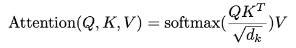
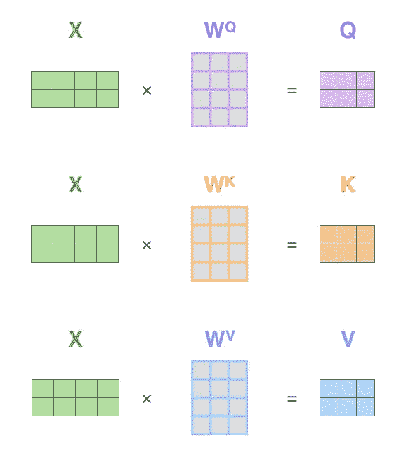
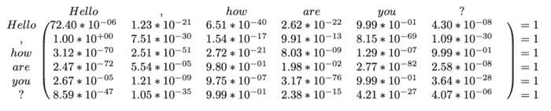
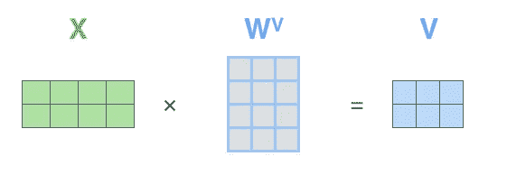
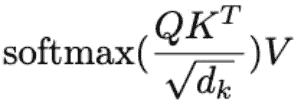
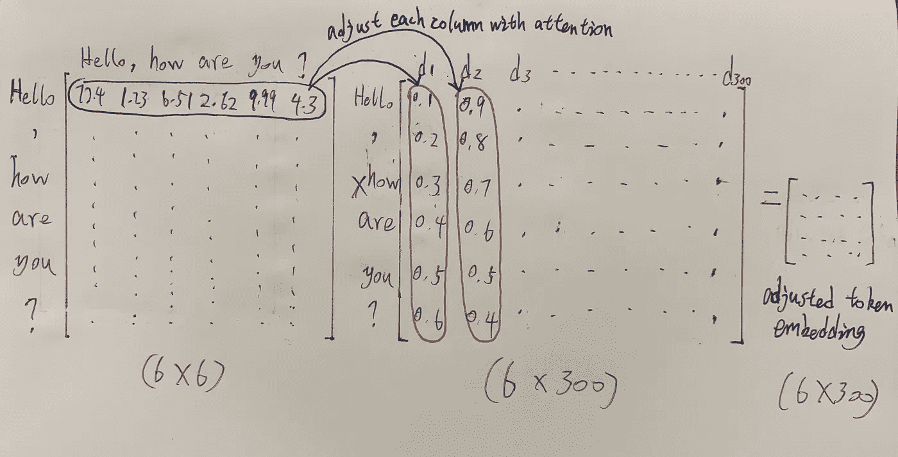

# 直观地理解伯特的自我关注

> 原文：<https://towardsdatascience.com/understand-self-attention-in-bert-intuitively-cd480cbff30b?source=collection_archive---------8----------------------->

## 解释什么是自我关注中的查询向量、关键向量和价值向量，以及它们是如何工作的

Photo by [Stefan Cosma](https://unsplash.com/@stefanbc?utm_source=unsplash&utm_medium=referral&utm_content=creditCopyText) on [Unsplash](https://unsplash.com/search/photos/attention?utm_source=unsplash&utm_medium=referral&utm_content=creditCopyText)

# 先决条件

本文的目标是进一步解释什么是自我关注中的查询向量、关键向量和价值向量。如果你忘记了一些概念，你可以通过阅读[插图变压器](http://jalammar.github.io/illustrated-transformer/)和[解剖伯特第一部分:编码器](https://medium.com/dissecting-bert/dissecting-bert-part-1-d3c3d495cdb3)来回忆。

# 什么是自我关注

在插图变压器的[中的“高层次的自我关注”部分，它在跳到代码之前给出了一个非常清晰的概念。](http://jalammar.github.io/illustrated-transformer/)

> 当模型处理每个单词(输入序列中的每个位置)时，自我注意允许它查看输入序列中的其他位置，以寻找有助于更好地编码该单词的线索。

让我重新措辞一下我的话。当模型处理一个句子时，**自我注意允许句子中的每个单词查看其他单词，以更好地知道哪个单词对当前单词有贡献。**更直观地说，我们可以认为**“自我关注”**是指句子会**审视自身，以确定如何表示每个标记。**

[The Illustrated Transformer](http://jalammar.github.io/illustrated-transformer/)

例如，当模型处理上图右栏中的单词`it`时，自我注意查看其他单词以便更好地编码(理解*)当前单词`it`。这就是伯特如何根据上下文(句子)理解每个单词的神奇之处。**一个单词在不同的句子(上下文)中可以有不同的含义，自我关注可以基于上下文单词为当前单词编码(理解)每个单词。***

# 直观理解自我关注中的 Q，K，V

我将用上面两篇文章中的例子和图表来解释什么是 Q，K，v。

taken from [Attention Is All You Need](https://arxiv.org/pdf/1706.03762.pdf)

我们更简单地改写上述自我注意功能。

Q、K、V 分别称为查询、键、值。不要被他们的名字搞糊涂了。唯一的区别是三个代表的权重不同。你可以在下图中看到。

但是直观上，我们可以认为查询(Q)代表我们在寻找什么样的信息，键(K)代表与查询的相关性，值(V)代表输入的实际内容。因为它们在模型中扮演不同的角色。

这里 X 矩阵中的每一行表示一个记号的嵌入向量，所以这个 X 矩阵有 2 个记号。我们使用三个权重`W^Q, W^K, W^V`乘以相同的输入 X 得到 Q，K，v

# 为什么要计算查询(Q)和键(K)的点积

首先，点积的物理意义可以表示两个向量之间的相似性。所以你可以认为 Q 和 K 的点积是为了得到不同 tokens 之间的**相似度(注意力得分)**。比如我们有一个句子，`Hello, how are you?`。句子长度为 6，嵌入维数为 300。所以 Q，K，V 的大小都是`(6, 300)`。

Q 和 K 的矩阵相乘如下图(softmax 之后)。矩阵乘法是点生成的快速版本。但是基本思想是相同的，计算任意两个标记对之间的注意力分数。

注意力得分的大小是(6，6)。您可能已经注意到，关注分数的大小只与序列长度有关。

每条线代表一个记号和其他记号之间的相似性。当当前令牌是`Hello`时，我们只需查看关注度矩阵中的第一行，就可以知道从`Hello`到其他令牌的相似度。比如`Hello`和`how`的相似度是`6.51*10e-40`。我们添加 softmax 来标准化数据。

# 为什么我们需要值(V)？

注意力得分矩阵可以表示任意两个标记对之间的相似性，但是由于缺少嵌入向量，我们不能用它来表示原句。这就是为什么我们需要 V，这里 V 还是代表原句。

我们用注意力得分(6x6)乘以 V(6300)，得到一个加权求和结果。

直观上，我们用嵌入向量来表示每个记号，并且我们假设它们彼此不相关。但是在与关注分数相乘之后，在 V 中嵌入向量的每个令牌(“Hello”)将根据从当前(“Hello”)到其他令牌的关注来调整其在每个维度(列)中的值。

我们可以认为关注度矩阵是一个**过滤矩阵**，可以让价值矩阵**更加关注那些重要的词，而对不重要的词**关注很少。

# 为什么我们用不同的权重来得到 K 和 Q？

一些读者可能想知道为什么我们必须使用不同的权重来得到 K 和 Q？换句话说，我们可以通过 K 和 K 或者 Q 和 Q 的矩阵相乘来计算注意力得分，一个原因是两种计算不会有太大的差别，后一种也可以减少训练时的参数。

我觉得用不同的权重来得到 K 和 Q 是为了提高模型的泛化能力。因为有两个权重 W_K 和 W_Q，把同一个 X 投影到不同的空间。

如果我们用 K 和 K 之间的矩阵乘法，你会发现关注度得分矩阵会变成一个[对称矩阵](https://www.wikiwand.com/en/Symmetric_matrix)。因为它用了一个权重 W_K，把 X 投影到同一个空间。所以泛化能力会下降。在这种情况下，注意力分数过滤效果对于 value (V)来说不会很好。

> ***查看我的其他帖子*** [***中等***](https://medium.com/@bramblexu) ***同*** [***一分类查看***](https://bramblexu.com/posts/eb7bd472/) ***！
> GitHub:***[***bramble Xu***](https://github.com/BrambleXu) ***LinkedIn:***[***徐亮***](https://www.linkedin.com/in/xu-liang-99356891/) ***博客:***[***bramble Xu***](https://bramblexu.com)

# 参考

 [## 图示的变压器

### 讨论:黑客新闻(65 分，4 条评论)，Reddit r/MachineLearning (29 分，3 条评论)翻译…

jalammar.github.io](http://jalammar.github.io/illustrated-transformer/)  [## 剖析 BERT 第 1 部分:编码器

### 这是由米盖尔·罗梅罗和弗朗西斯科·英厄姆共同撰写的《理解伯特》的 1/2 部分。如果你已经明白了…

medium.com](https://medium.com/dissecting-bert/dissecting-bert-part-1-d3c3d495cdb3)  [## 自然语言处理中的自我注意机制

### 在过去的几年里，注意机制在各种自然语言处理中得到了广泛的应用

medium.com](https://medium.com/@Alibaba_Cloud/self-attention-mechanisms-in-natural-language-processing-9f28315ff905)  [## 《Attention is All You Need》浅读（简介+代码） — 科学空间|Scientific Spaces

### 2017 年中，有两篇类似同时也是笔者非常欣赏的论文，分别是 FaceBook 的《Convolutional Sequence to Sequence Learning》和 Google 的《Atten…

科学. fm](https://kexue.fm/archives/4765)