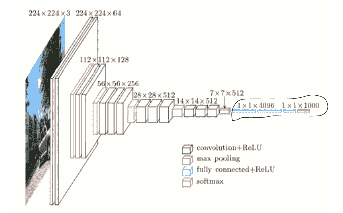
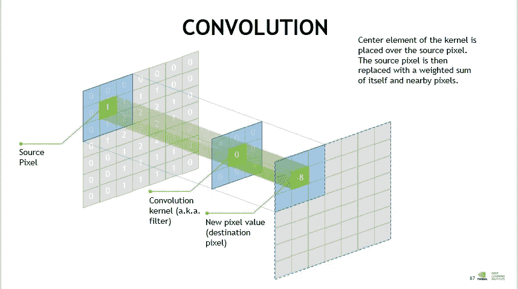
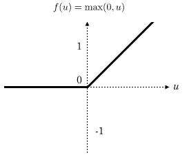
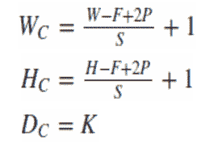
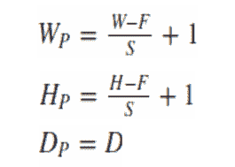

# 了解 CNN 的架构

> 原文：<https://towardsdatascience.com/understand-the-architecture-of-cnn-90a25e244c7?source=collection_archive---------0----------------------->

Architecture of VGG16 (a CNN model)

2012 年，一场革命发生了:在一年一度的 ILSVRC 计算机视觉比赛期间，一种新的深度学习算法打破了记录！这是一个名为 **Alexnet** 的卷积神经网络。

卷积神经网络的方法论类似于传统的监督学习方法:它们接收输入图像，检测每个图像的特征，然后在其上拖动一个分类器。

但是，功能是自动学习的！CNN 自己执行提取和描述特征的所有繁琐工作:在训练阶段，分类误差被最小化以优化分类器的参数**和**特征！

# 什么是 CNN？

卷积神经网络是指神经网络的一个子类:因此，它们具有神经网络的所有特征。然而，CNN 是专门为处理输入图像而设计的。他们的架构更加具体:它由两个主要模块组成。

**第一个模块**使这种类型的神经网络具有特殊性，因为它起着特征提取器的作用。为此，它通过应用卷积过滤操作来执行模板匹配。第一层使用几个卷积核对图像进行滤波，并返回“**特征图**，然后对其进行归一化(使用激活函数)和/或调整大小。

这个过程可以重复几次:我们过滤用新内核获得的特征图，这给了我们新的特征图来归一化和调整大小，我们可以再次过滤，等等。最后，最后的特征映射的值被连接成一个向量。这个向量定义了第一个模块的输出和第二个模块的输入。

The first block is encircled in black

**第二块**不是 CNN 的特征:事实上，它位于所有用于分类的神经网络的末端。输入向量值被转换(使用几个线性组合和激活函数)以向输出返回一个新的向量。这最后一个向量包含与类别一样多的元素:元素 I 表示图像属于类别 I 的概率。因此，每个元素在 0 和 1 之间，并且所有元素的总和等于 1。这些概率由该块的最后一层(因此也是网络的最后一层)计算，该层使用一个**逻辑函数**(二元分类)或一个 **softmax 函数**(多类分类)作为激活函数。

与普通神经网络一样，层的参数由梯度反向传播确定:在训练阶段，**交叉熵**被最小化。但是在 CNN 的情况下，这些参数特别指的是图像特征。

The second block is encircled in black

# 有线电视新闻网的不同层次

卷积神经网络有四种类型的层:卷积层、**汇集**层、 **ReLU 校正**层和**全连接**层。

## 卷积层

卷积层是卷积神经网络的关键组成部分，并且总是至少是它们的第一层。

其目的是检测作为输入接收的图像中一组特征的存在。这是通过卷积滤波来实现的:原理是在图像上“拖动”一个表示特征的窗口，并计算该特征与扫描图像各部分之间的卷积积。**一个特征被视为一个过滤器**:这两个术语在上下文中是等价的。

因此，卷积层接收几个图像作为输入，并用每个滤波器计算每个图像的卷积。过滤器与我们想要在图像中找到的特征完全对应。

我们为每一对(图像，过滤器)获得一个**特征图**，它告诉我们特征在图像中的位置:值越高，图像中相应的位置就越像特征。

**Convolutional layer** (source: [https://www.embedded-vision.com](https://www.embedded-vision.com/industry-analysis/blog/what%E2%80%99s-difference-between-cnn-and-rnn))

与传统方法不同，特征不是根据特定的形式(例如 SIFT)预先定义的，而是由网络在训练阶段学习的！滤波器核指的是卷积层权重。**它们被初始化，然后使用梯度下降通过反向传播进行更新**。

## 汇集层

这种类型的图层通常位于两个卷积图层之间:它接收多个要素地图，并对每个要素地图应用汇集操作。

汇集操作包括**减小图像的尺寸**，同时**保留它们的重要特征**。

为此，我们将图像切割成规则的单元格，然后在每个单元格内保留最大值。在实践中，经常使用小正方形单元格来避免丢失太多信息。最常见的选择是**不与**重叠的 **2x2 相邻单元格**，或 **3x3 单元格**，彼此相隔 2 个像素的步长(因此**与**重叠)。

我们在输出中得到与输入相同数量的特征地图，但是这些要小得多。

池层**减少了网络**中的参数和计算的数量。这提高了网络的效率，避免了过度学习。

与输入中接收到的最大值相比，合并后获得的最大值在要素地图中的定位不太准确，这是一个很大的优势！例如，当你想识别一只狗时，它的耳朵不需要尽可能精确地定位:知道它们几乎位于头部旁边就足够了！

## ReLU 校正层

ReLU(整流线性单位)是指由 *ReLU(x)=max(0，x)* 定义的实非线性函数。从视觉上看，它如下所示:

ReLU 校正层用零替换作为输入接收的所有负值。它作为一个**激活功能**。

## 全连接层

无论是否卷积，全连接层总是神经网络的最后一层，因此它不是 CNN 的特征。

这种类型的层接收输入向量并产生新的输出向量。为此，它对接收到的输入值应用一个**线性组合**和**，然后可能应用一个激活函数**。

最后一个全连接层将图像分类为网络的输入:它返回大小为 N 的向量，其中 N 是我们的图像分类问题中的类的数量。向量的每个元素指示输入图像属于一个类别的概率。

因此，为了计算概率，全连接层将每个输入元素乘以权重，进行求和，然后应用激活函数(如果 N=2，则为逻辑，如果 N>2，则为 softmax)。这相当于将输入向量乘以包含权重的矩阵。每个输入值都与所有输出值相连接，这一事实解释了术语“完全连接”的含义。

卷积神经网络学习权重值的方式与其学习卷积层滤波器的方式相同:在训练阶段，通过**梯度**的反向传播。

完全连接的图层决定了影像中要素的位置与类之间的关系。实际上，输入表是前一层的结果，它对应于给定特征的特征图:**高值指示图像**中该特征的位置(根据汇集的不同，更精确或更不精确)**。如果图像中某一点的特征位置是某一类别的特征，则表中的相应值被赋予显著的权重。**

# 各层的参数化

卷积神经网络与其他网络的不同之处在于层的堆叠方式，以及参数化。

卷积层和池层确实有超参数，也就是说您必须首先定义其值的参数。

卷积图层和池图层的输出要素地图的大小取决于超参数。

每个图像(或特征图)都是 W×H×D，其中 W 是其宽度(以像素为单位), H 是其高度(以像素为单位), D 是通道数(黑白图像为 1，彩色图像为 3)。

## 卷积层有四个超参数:

1.过滤器的数量 K

2.过滤器的尺寸:每个过滤器的尺寸为 F×F×D 像素。

3.拖动与图像上的滤镜相对应的窗口的步骤。例如，步长为 1 意味着一次移动窗口一个像素。

4.零填充 P:给图层的输入图像添加一个 P 像素厚的黑色轮廓。没有该轮廓，出口尺寸更小。因此，P=0 的卷积层叠得越多，网络的输入图像就越小。我们很快丢失了大量信息，这使得提取特征的任务变得困难。

对于每个尺寸为 W×H×D 的输入图像，池层返回一个尺寸为 Wc×Hc×Dc 的矩阵，其中:

选择 **P=F-1/2 和 S=1** 给出与输入中接收到的相同宽度和高度的特征地图。

## 池层有两个超参数:

1.单元格的大小 F:图像被分成大小为 F×F 像素的正方形单元格。

2.步骤 S:单元格之间相隔 S 个像素。

对于每个尺寸为 W×H×D 的输入图像，池层返回一个尺寸为 Wp×Hp×Dp 的矩阵，其中:

就像叠加一样，超参数的选择是根据一个经典方案进行的:

*   对于卷积层，滤镜很小，每次在图像上拖动一个像素。选择零填充值，以便输入音量的宽度和高度在输出时不会改变。一般来说，我们然后选择 F=3，P=1，S=1 或者 F=5，P=2，S=1
*   对于池层， **F=2，S=2** 是明智的选择。这个**消除了 75%的输入像素**。我们也可以选择 F=3，S=2:在这种情况下，单元格重叠。选择较大的小区会导致太多的信息丢失，并且在实践中导致不太好的结果

在这里，你有建立自己的 CNN 的基础！但是不要厌倦这样做:已经有许多适合大多数应用程序的体系结构。

在实践中，我强烈建议你不要从零开始创建一个卷积神经网络来解决你的问题:最有效的策略是采用一个现有的对大量图像进行良好分类的网络(如 ImageNet)并应用**迁移学习**。