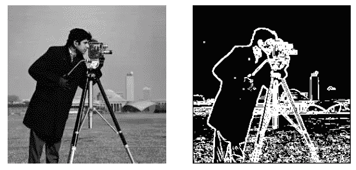

# 2019 年底前了解计算机视觉格局

> 原文：<https://towardsdatascience.com/understand-the-computer-vision-landscape-before-the-end-of-2019-fa866c03db53?source=collection_archive---------40----------------------->

## 简要概述计算机视觉在过去 50 年中的发展，并了解像*‘AI Winter’*这样的流行语及其含义。

2019 年即将结束，但在此之前，了解一下我们十年来在机器学习方面的一个流行语不是很好吗？这篇文章将帮助你对计算机视觉有一个简单的了解，足够的知识让你在圣诞晚宴上看起来聪明。

看完这篇文章，你会对计算机视觉、深度学习、机器学习、AI Winter、天网……这些好东西变得熟悉。

## 我一直听说的计算机视觉是什么？

当有人问你这个问题时，你可以用“计算机视觉就是计算机如何看东西”来回答他们嗯，不完全是，试试下面的解释，肯定会让一些人惊讶。

计算机视觉是机器或系统通过调用一种或多种作用于所提供信息的算法来生成对视觉信息的理解的过程。这种理解被转化为决策、分类、模式观察等等。现在你又回头了。

**让我们快速上一堂历史课，看看计算机视觉领域是如何发展的。**

当我们开始模仿人体内的感知和视觉系统时，对计算机视觉的需求就出现了。因此，这一旅程始于 20 世纪 60 年代，当时学术界研究了人类的感知，并试图在计算机系统上复制其基本功能。我们的先驱学者旨在为机器人提供看到并描述机器人所观察到的东西的能力。这是天网的第一步(*是的，就像电影一样，但这是在那之前)。*

Edge Detection. (2019). [image] Available at mathwork.com

让天网看起来像人类并不容易，所以我们期待数字图像处理技术来理解呈现给计算机视觉系统的图像内容。我所说的*理解*就是从图像中提取边缘信息、轮廓、线条、形状。70 年代都是关于从数字图像中提取信息的算法。

有一点要注意的是**第一个** [***艾冬***](https://en.wikipedia.org/wiki/AI_winter) **发生在 20 世纪 70 年代**。对于那些不熟悉术语“*人工智能冬天”、*的人来说，它可以被描述为一个对人工智能相关领域(如计算机视觉、机器学习等)的兴趣、资金、士气(炒作)和正在进行的研究越来越缺乏的时期。

80 年代和 90 年代的计算机视觉专注于数学和统计学。研究人员和学者开始将计算机视觉技术与数学算法结合起来。描绘数学在计算机视觉和图像处理技术中的应用的一个很好的例子是边缘检测算法。

[边缘检测](https://en.wikipedia.org/wiki/Edge_detection)是大多数计算机视觉课程中教授的主要图像处理技术之一。1986 年，约翰·f·卡尼研制出一种奇特而有用的边缘检测器。它被称为 [**狡猾的边缘探测器**](https://homepages.inf.ed.ac.uk/rbf/HIPR2/canny.htm) 。通过利用数学概念，如微积分、微分和函数优化，John F. Canny 开发了一个非常受欢迎的边缘检测器，它仍然在硕士课程中讲授。

快进到之前的十年；对计算机视觉来说，2000 年是一个颇具革命性的时代。深度学习出现了，计算机视觉再次成为媒体、研究人员和学者的热门话题。

另一个关键定义即将出现。

深度学习是机器学习的一个分支，其中算法利用几层神经网络从输入数据中提取更丰富的特征。深度学习技术的例子有[深度卷积神经网络(CNN)](https://en.wikipedia.org/wiki/Convolutional_neural_network) 和[递归神经网络(RNN)](https://en.wikipedia.org/wiki/Recurrent_neural_network) 。

*这么多术语，在我们继续之前，下面是一些与机器学习相关的术语的链接。*

 [## 机器学习初学者的 30 个袖珍术语

### 你在数据科学或机器学习职业生涯中会遇到的有用的机器学习术语列表。

towardsdatascience.com](/30-pocket-sized-terms-for-machine-learning-beginners-5e381ed93055) 

2012 年是计算机视觉领域的关键一年。你可能已经知道我要在这里提到什么(*嘘，不要破坏了别人的*)。有一个名为“ImageNet 大规模视觉识别挑战赛”的比赛，这个比赛每年举行一次，主要是学者，研究人员和爱好者的聚会，比较对图像中的对象进行分类和检测的软件算法。在 2012 年的比赛中，引入了一种[深度卷积神经网络(AlexNet)](https://papers.nips.cc/paper/4824-imagenet-classification-with-deep-convolutional-neural-networks.pdf) ，其错误率超过了当年和之前几年的其他比赛。

我不会深究 AlexNet 是如何设计的太多细节，网上有很多这方面的资源。但我会提到 AlexNet 给景观带来的两个显著好处。

首先，GPU。AlexNet 令人惊叹的性能是使用图形处理单元(GPU)实现的。虽然 GPU 之前已经在比赛中使用过，但 AlexNet 对 GPU 的利用引起了计算机视觉社区的注意。

其次，CNN 成为标准。AlexNet 展示 CNN 有效性的能力意味着 CNN 变得普及。从那年开始到现在，在大多数计算机视觉应用和研究中都发现了 CNN 的实现。

我将不得不在这里暂停，也许在将来的另一篇文章中继续这个主题。有很多主题和领域我还没有涉及到，但是下面是一些中型文章，它们详细解释了本文中提到的关键术语以及更多内容。

现在你可以去 2020 年，了解计算机视觉及其自 20 世纪 60 年代以来的发展。

> 如果你喜欢这篇文章，并且想要更多这样的文章，那么就给我一个关注，让我扩展你在机器学习方面的知识。

查看来自 [Dhruv Parthasarathy](https://medium.com/u/aee4aaf6b79a?source=post_page-----fa866c03db53--------------------------------) 、[西达尔特 Das](https://medium.com/u/1daf56ef07aa?source=post_page-----fa866c03db53--------------------------------) 和[詹姆斯勒](https://medium.com/u/52aa38cb8e25?source=post_page-----fa866c03db53--------------------------------)的关于计算机视觉和一些技术的文章。

 [## CNN 在图像分割中的简史:从 R-CNN 到掩模 R-CNN

### 在 Athelas，我们使用卷积神经网络(CNN)不仅仅是为了分类！在本帖中，我们将看到…

blog.athelas.com](https://blog.athelas.com/a-brief-history-of-cnns-in-image-segmentation-from-r-cnn-to-mask-r-cnn-34ea83205de4)  [## CNN 架构:LeNet、AlexNet、VGG、GoogLeNet、ResNet 等等

### ILSVRC 中开创性的 CNN 模型以及卷积神经网络的历史

medium.com](https://medium.com/analytics-vidhya/cnns-architectures-lenet-alexnet-vgg-googlenet-resnet-and-more-666091488df5)  [## 将改变你看待世界方式的 5 种计算机视觉技术

heartbeat.fritz.ai](https://heartbeat.fritz.ai/the-5-computer-vision-techniques-that-will-change-how-you-see-the-world-1ee19334354b)