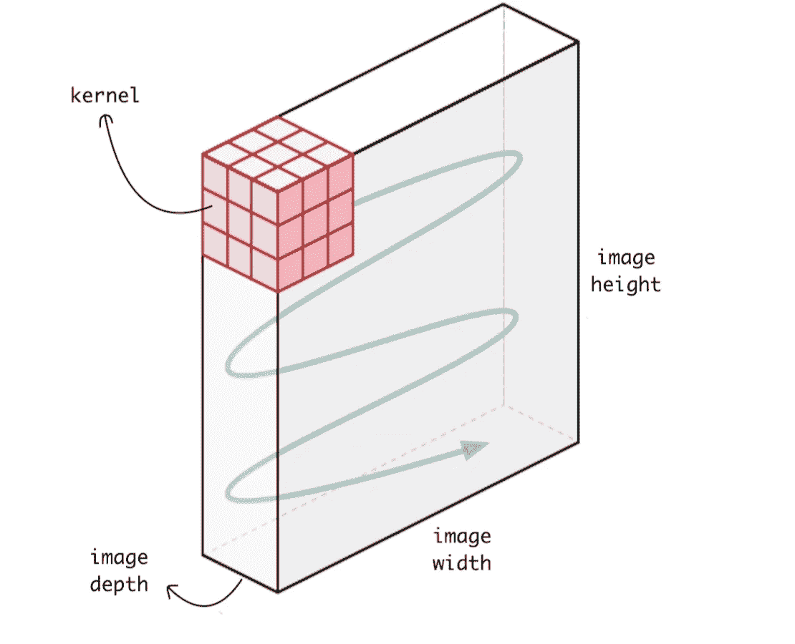
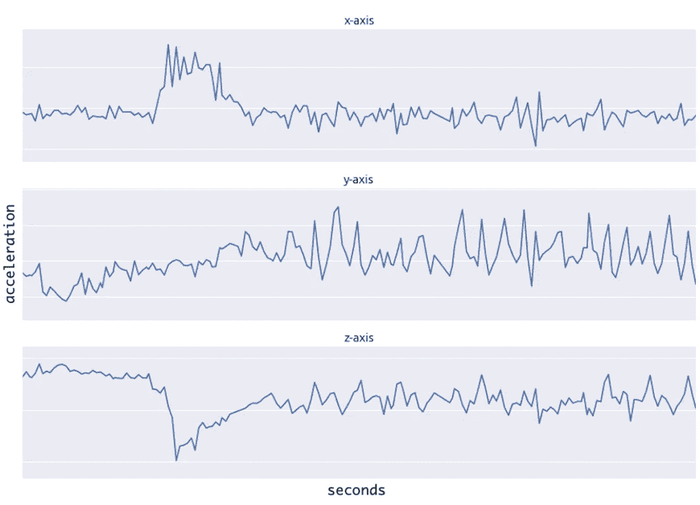
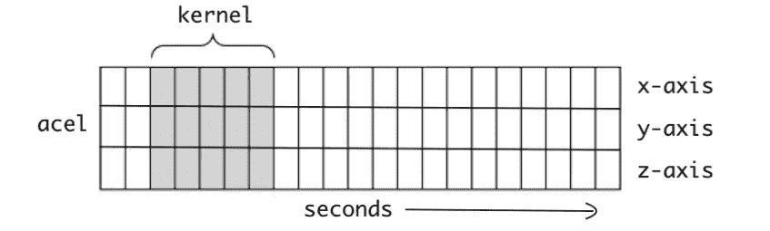
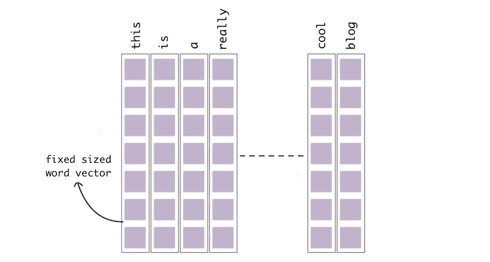
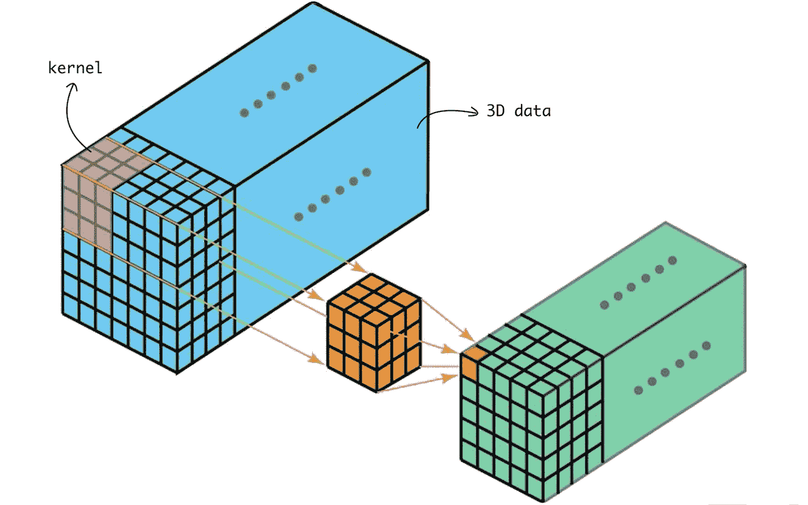
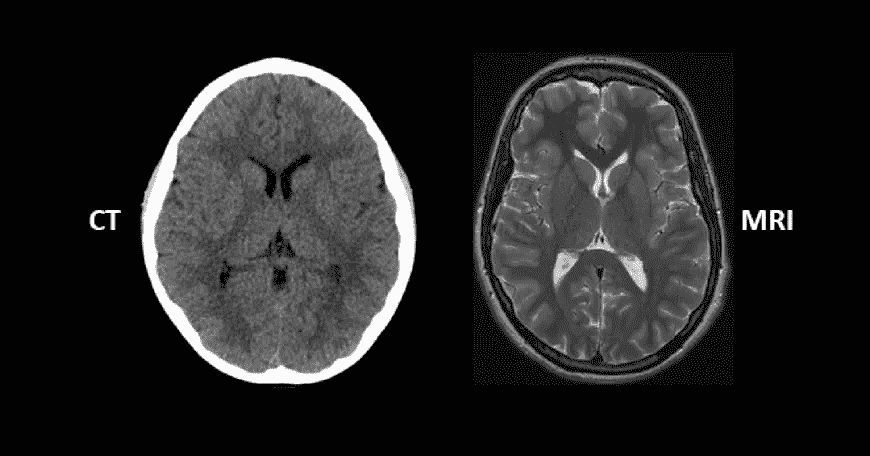

# 了解 1D 和 3D 卷积神经网络| Keras

> 原文：<https://towardsdatascience.com/understanding-1d-and-3d-convolution-neural-network-keras-9d8f76e29610?source=collection_archive---------0----------------------->

Image by [WallpeperSafari](https://wallpapersafari.com/w/d4KBN6)

当我们说**卷积神经网络** (CNN)时，通常我们指的是用于图像分类的二维 CNN。但是在现实世界中使用了两种其他类型的卷积神经网络，它们是 1 维和 3 维 CNN。在本指南中，我们将介绍 **1D** 和**3D**CNN 及其在现实世界中的应用。我假设你已经熟悉卷积网络的一般概念。

# 二维 CNN | Conv2D

这是在 **Lenet-5** 架构中首次引入的标准**卷积神经网络**。 **Conv2D** 一般用于图像数据。它被称为二维 CNN，因为**内核**在数据上沿二维滑动，如下图所示。

Kernal sliding over the Image

使用 CNN 的整体优势在于，它可以使用其内核从数据中提取空间特征，这是其他网络无法做到的。例如，CNN 可以检测图像中的边缘、颜色分布等，这使得这些网络在图像分类和包含空间属性的其他类似数据中非常健壮。

以下是在 keras 中添加一个 **Conv2D** 层的代码。

Conv2D Layer in Keras

参数 **input_shape** (128，128，3)表示图像的(高度，宽度，深度)。参数 **kernel_size** (3，3)表示内核的(高度，宽度)，内核深度将与图像的深度相同。

# 一维 CNN | Conv1D

在看完《T21》之前，让我给你一个提示。在 Conv1D 中，**内核**沿一维滑动。现在让我们在这里暂停博客，想一想哪种类型的数据只需要在一维上进行内核滑动，并且具有空间属性？

答案是时间序列数据。我们来看下面的数据。

Time series data from an accelerometer

这个数据是从一个人戴在手臂上的加速度计收集的。数据代表所有 3 个轴上的加速度。1D CNN 可以从加速度计数据中执行活动识别任务，例如人是否站立、行走、跳跃等。这个数据有两个维度。第一维是时间步长，另一维是 3 个轴上的加速度值。

下面的图说明了内核将如何处理加速度计数据。每行代表某个轴的时间序列加速度。内核只能沿着时间轴在一维上移动。

Kernel sliding over accelerometer data

下面是在 keras 中添加一个 **Conv1D** 层的代码。

Conv1D Layer in Keras

自变量 **input_shape** (120，3)，表示 120 个时间步长，每个时间步长中有 3 个数据点。这 3 个数据点是 x、y 和 z 轴的加速度。参数 **kernel_size** 为 5，代表内核的宽度，内核高度将与每个时间步的数据点数相同。

类似地，1D CNN 也用于音频和文本数据，因为我们也可以将声音和文本表示为时间序列数据。请参考下面的图片。

Text data as Time Series

Conv1D 广泛应用于传感数据，加速度计数据就是其中之一。

# 三维 CNN | Conv3D

在 **Conv3D** 中，**内核**在三维空间滑动，如下图所示。让我们再想想哪种数据类型需要内核在三维空间中移动？

Kernel sliding on 3D data

Conv3D 主要用于 3D 图像数据。如**磁共振成像** (MRI)数据。MRI 数据被广泛用于检查大脑、脊髓、内部器官等。**计算机断层扫描** (CT)也是 3D 数据的一个例子，它是通过组合从身体周围不同角度拍摄的一系列 X 射线图像而创建的。我们可以使用 Conv3D 对这些医疗数据进行分类，或者从中提取特征。

Cross Section of 3D Image of CT Scan and MRI

3D 数据的另一个例子是**视频**。视频只不过是一系列图像帧的组合。我们也可以在视频上应用 Conv3D，因为它具有空间特征。

以下是在 keras 中添加 **Conv3D** 层的代码。

Conv3D Layer in Keras

这里参数**输入形状** (128，128，128，3)有 4 个维度。3D 图像是四维数据，其中第四维表示**颜色通道**的数量。就像平面 2D 图像具有三维，其中第三维表示颜色通道。参数 **kernel_size** (3，3，3)表示内核的(高度，宽度，深度)，内核的第四维将与颜色通道相同。

# 摘要

*   在 **1D CNN** 中，内核向 **1** 方向移动。1D CNN 的输入输出数据是 **2** 维的。主要用于**时间序列**数据。
*   在 **2D CNN** 中，内核向 **2** 方向移动。2D CNN 的输入输出数据是 **3** 维的。主要用于**图像**数据。
*   在 **3D CNN** 中，内核在 **3** 方向移动。3D CNN 的输入输出数据为 **4** 维。主要用于 **3D** 图像**数据**(MRI、CT 扫描、视频)。

**接下来是**

 [## 理解自我监督学习，并举例说明

### 迈向艾将军的一步？

shiva-verma.medium.com](https://shiva-verma.medium.com/understanding-self-supervised-learning-with-examples-d6c92768fafb)