# 理解演员评论方法和 A2C

> 原文：<https://towardsdatascience.com/understanding-actor-critic-methods-931b97b6df3f?source=collection_archive---------0----------------------->

## 深度强化学习中的重要概念

# 预赛

在[我之前的文章](https://medium.com/@thechrisyoon/deriving-policy-gradients-and-implementing-reinforce-f887949bd63)中，我们导出了策略梯度并实现了加强算法(也称为蒙特卡罗策略梯度)。然而，普通的政策梯度有一些突出的问题:嘈杂的梯度和高方差。

***但是为什么会这样呢？***

回想一下政策梯度:

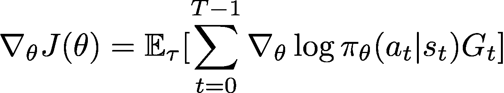

如同在增强算法中一样，我们通过蒙特卡罗更新(即随机取样)来更新策略参数。这在对数概率(策略分布的对数)和累积奖励值中引入了固有的高可变性，因为训练期间的每个轨迹可以彼此偏离很大程度。

因此，对数概率和累积奖励值的高度可变性将产生有噪声的梯度，并导致不稳定的学习和/或向非最佳方向倾斜的策略分布。

除了梯度的高方差之外，策略梯度的另一个问题是轨迹的累积报酬为 0。政策梯度的实质是在政策分布中增加“好”行为的概率，减少“坏”行为的概率；如果累积奖励为 0，则不会学习“好”和“坏”行为。

总的来说，这些问题导致了普通政策梯度方法的不稳定性和缓慢收敛。

## 改善政策梯度:用基线减少差异

减少方差和增加稳定性的一种方法是用基线减去累积奖励:

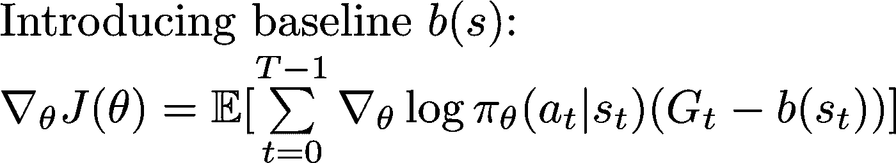

直觉上，通过用基线减去累积奖励来使累积奖励变小，将产生更小的梯度，从而产生更小且更稳定的更新。

下面是一个很有说明性的解释，摘自 [Jerry Liu 的帖子“为什么政策梯度法有很高的方差”](https://www.quora.com/Why-does-the-policy-gradient-method-have-a-high-variance):

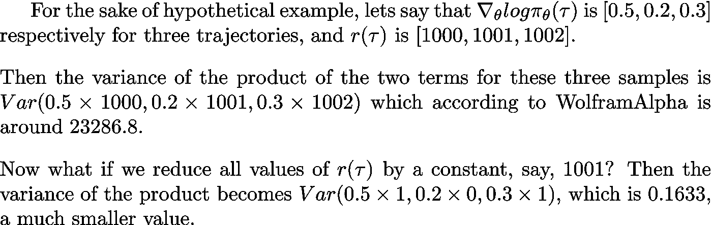

[Taken from Jerry Liu’s post “Why does the policy gradient method have high variance”]

## 常见基线功能概述

基线可以采用不同的值。下面的方程组说明了演员评论家方法的经典变体(关于加强)。在本帖中，我们将看看 Q 演员评论家和优势演员评论家。

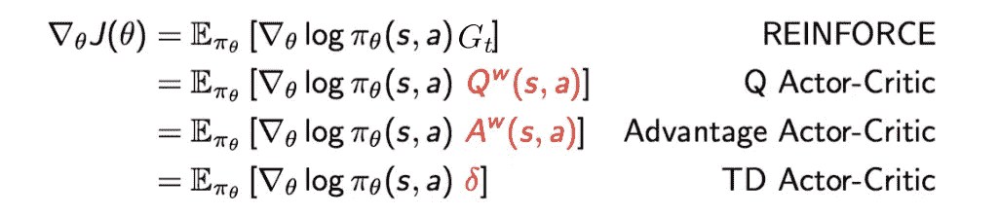

Image taken from CMU CS10703 lecture slides

# 演员评论方法

在我们回到基线之前，让我们首先再次看一看普通的政策梯度，看看演员批评家架构是如何进来的(以及实际上是什么)。回想一下:

然后，我们可以将期望值分解为:

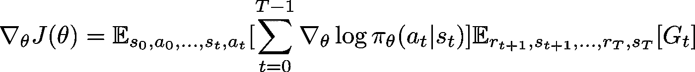

第二个期望项应该很熟悉；就是 Q 值！(如果你还不知道这一点，我建议你阅读一下价值迭代和 Q 学习)。

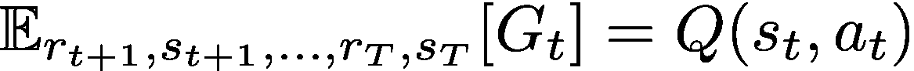

将它代入，我们可以将更新等式改写如下:

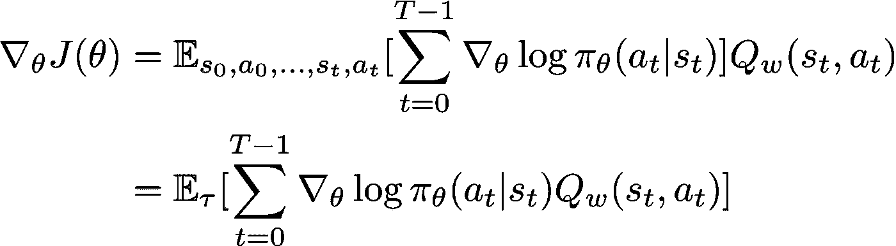

正如我们所知，Q 值可以通过用神经网络(上面用下标`w`表示)参数化 Q 函数来学习。

这就引出了 ***演员的评论家方法，*** 的地方:

1.  “评论家”估计价值函数。这可以是动作值( *Q 值*)或状态值( *V 值*)。
2.  “行动者”按照批评者建议的方向更新策略分布(例如使用策略梯度)。

评论家和演员函数都用神经网络参数化。在上面的推导中，Critic 神经网络将 Q 值参数化—因此，它被称为 ***Q Actor Critic。***

以下是 Q-Actor-Critic 的伪代码:

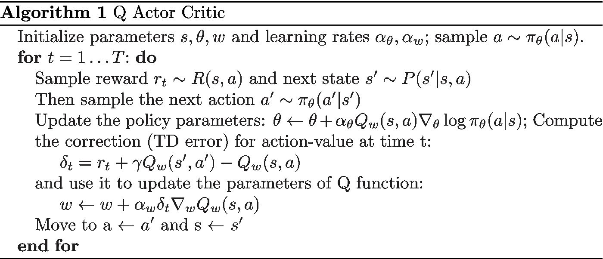

Adapted from Lilian Weng’s post “Policy Gradient algorithms”

如图所示，我们在每个更新步骤更新评论家网络和价值网络。

## 回到基线

从权威的角度来说(因为我找不到原因)，状态值函数是一个最佳的基线函数。这在卡内基梅隆大学 CS10703 和 Berekely CS294 讲座幻灯片中有所陈述，但没有提供任何理由。

因此，使用 V 函数作为基线函数，我们用 V 值减去 Q 值项。直观地说，这意味着*在给定的状态下，采取特定的行动比一般的一般行动好多少*。我们将这个值称为 ***优势值*** *:*

这是否意味着我们必须为 Q 值和 V 值构建两个神经网络(除了策略网络之外)？不行。那样效率会很低。相反，我们可以使用贝尔曼最优方程中 Q 和 V 之间的关系:

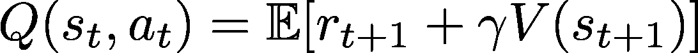

所以，我们可以把优势改写为:

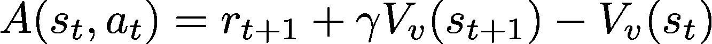

然后，我们只需要对 V 函数使用一个神经网络(由上面的`v`参数化)。因此，我们可以将更新等式改写为:

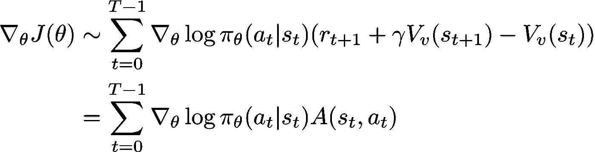

这是 ***优势演员评论家。***

## 优势行动者评论家(A2C)对异步优势行动者评论家(A3C)

***优势行动者批评家*** 有两个主要变体:**异步优势行动者批评家(A3C)** 和**优势行动者批评家(A2C)。**

**A3C** 是在 [Deepmind 的论文《深度强化学习的异步方法》(Mnih et al，2016)](https://arxiv.org/abs/1602.01783) 中引入的。本质上，A3C 实现了*并行训练*，其中*并行环境**中的多个工人独立更新*全局*值函数——因此是“异步的”拥有异步参与者的一个主要好处是有效且高效地探索状态空间。*

*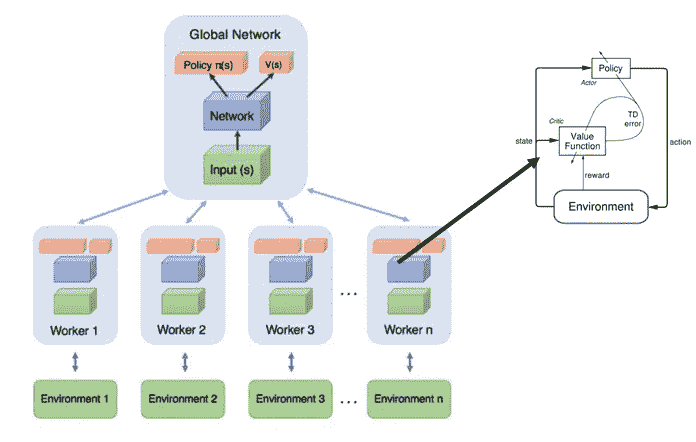*

*High Level Architecture of A3C (image taken from [GroundAI blog post](https://www.groundai.com/project/a-brandom-ian-view-of-reinforcement-learning-towards-strong-ai/))*

***A2C** 类似 A3C 但没有异步部分；这意味着 A3C 的单工人变体。经验表明，A2C 的性能与 A3C 相当，但效率更高。根据这篇 OpenAI 博客文章，研究人员并不完全确定异步是否或者如何有益于学习:*

> *在阅读了这篇论文之后，人工智能研究人员想知道异步是否会导致性能的提高(例如，“也许添加的噪声会提供一些正则化或探索？”)，或者它只是一个实现细节，允许使用基于 CPU 的实现进行更快的训练…*
> 
> *我们的同步 A2C 实现比异步实现性能更好——我们没有看到任何证据表明异步引入的噪声提供了任何性能优势。当使用单 GPU 机器时，这种 A2C 实现比 A3C 更具成本效益，并且当使用更大的策略时，比仅使用 CPU 的 A3C 实现更快。*

*无论如何，我们将在本帖中实现 **A2C** ，因为它实现起来更简单。(这很容易扩展到 A3C)*

# *实施 A2C*

*因此，回想一下新的更新公式，用优势函数替换普通保单梯度中的折扣累积奖励:*

*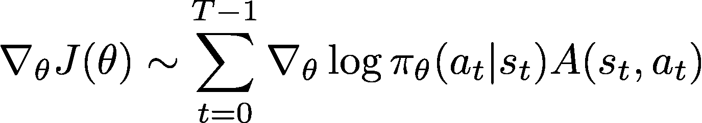*

*在每个学习步骤中，我们更新 Actor 参数(用策略梯度和优势值)和 Critic 参数(用 Bellman 更新方程最小化均方误差)。让我们看看这在代码中是什么样子的:*

*以下是包含和超参数:*

*首先，让我们从实现 Actor Critic 网络开始，配置如下:*

*主循环和更新循环，如上所述:*

*运行代码，我们可以看到 OpenAI Gym CartPole-v0 环境的性能如何提高:*

*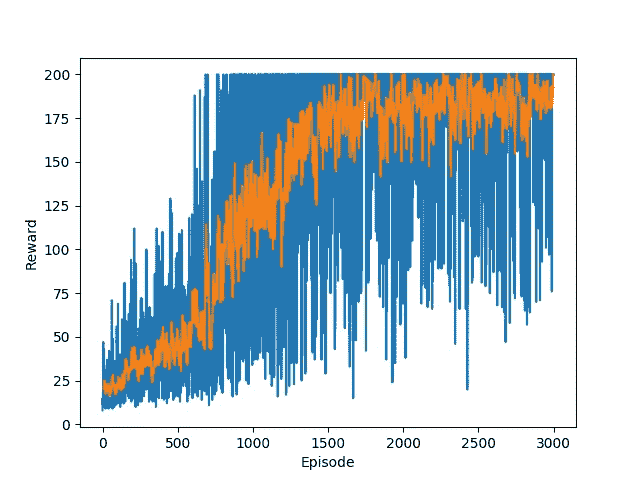*

*Blue: Raw rewards; Orange: Smoothed rewards*

*在此找到完整的实现:*

*[https://github.com/thechrisyoon08/Reinforcement-Learning](https://github.com/thechrisyoon08/Reinforcement-Learning)/*

# *参考资料:*

1.  *加州大学柏克莱分校 CS294 讲座幻灯片*
2.  *[卡内基梅隆大学 CS10703 讲座幻灯片](http://www.cs.cmu.edu/~rsalakhu/10703/Lecture_PG2.pdf)*
3.  *[Lilian Weng 关于政策梯度算法的帖子](https://lilianweng.github.io/lil-log/2018/04/08/policy-gradient-algorithms.html)*
4.  *[Jerry Liu 在 Quora Post 上回答“为什么政策梯度法有很高的方差”](https://www.quora.com/Why-does-the-policy-gradient-method-have-a-high-variance)*
5.  *[Naver D2 RLCode 讲座视频](https://www.youtube.com/watch?v=gINks-YCTBs&t=2362s)*
6.  *[OpenAI 关于 A2C 和 ACKTR 的博文](https://blog.openai.com/baselines-acktr-a2c/)*
7.  *图表来自 [GroundAI 的博客文章](http://Figure 4: Schematic representation of Asynchronous Advantage Actor Critic algorithm (A3C) algorithm.)“图 4:异步优势行动者评价算法(A3C)算法的示意图。”*

## *其他职位:*

*查看我关于强化学习的其他帖子:*

*   *[导出政策梯度并实施强化](https://medium.com/@thechrisyoon/deriving-policy-gradients-and-implementing-reinforce-f887949bd63)*
*   *[了解演员评论家的方法](/understanding-actor-critic-methods-931b97b6df3f)*
*   *[深度确定性政策梯度解释](/deep-deterministic-policy-gradients-explained-2d94655a9b7b)*

*感谢阅读！*