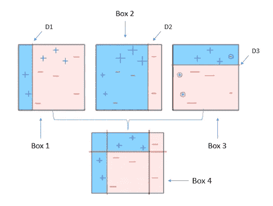
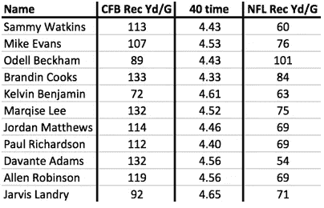
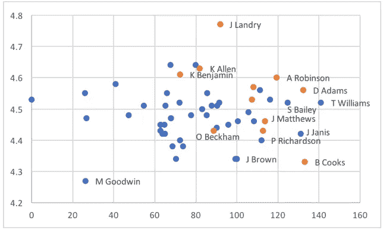
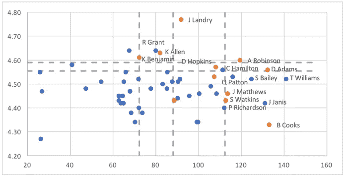
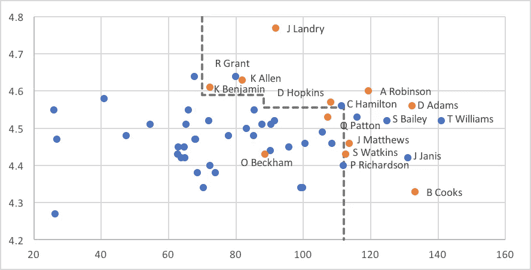
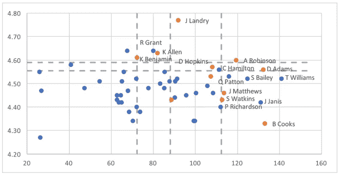
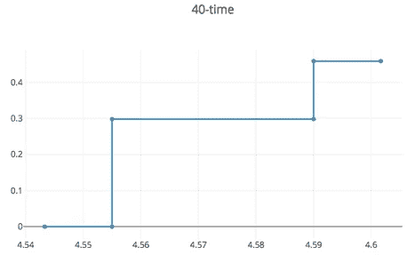
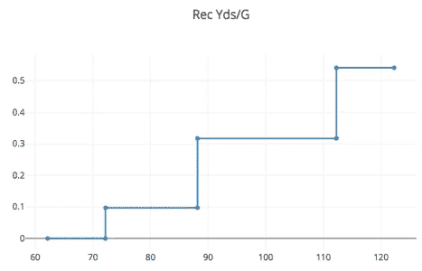

# 了解 AdaBoost

> 原文：<https://towardsdatascience.com/understanding-adaboost-2f94f22d5bfe?source=collection_archive---------1----------------------->

## 任何开始学习增强技术的人都应该首先从 AdaBoost 或自适应增强开始。这里我试着从概念上解释一下。

当一切都不起作用时，助推会起作用。现在许多人使用 XGBoost 或 LightGBM 或 CatBoost 来赢得 Kaggle 或黑客马拉松比赛。AdaBoost 是 Boosting 世界的第一块敲门砖。

AdaBoost 是第一个用于解决实际问题的 boosting 算法。Adaboost 帮助您**将多个“弱分类器”组合成一个“强分类器”**。这里有一些关于 Adaboost 的(有趣)事实！

AdaBoost 中的弱学习器是单分裂的决策树，称为决策树桩。

→ AdaBoost 的工作原理是对难以分类的实例给予更多的权重，而对已经处理得很好的实例给予较少的权重。

→ AdaBoost 算法可用于分类和回归问题。

# 第 1 部分:使用决策树桩理解 AdaBoost

集合的力量是这样的，即使集合中的单个模型非常简单，我们仍然可以构建强大的集合模型。

D 决策树桩是我们可以构建的最简单的模型，它会为每个新的例子猜测相同的标签，不管它看起来像什么。如果我们猜测数据中最常见的答案是 1 还是 0，那么这种模型的准确性将是最好的。如果，比方说，60%的例子是 1，那么我们只要每次猜 1 就能得到 60%的准确率。

决策桩通过基于一个特征的值将例子分成两个子集来改进这一点。每个树桩选择一个特征，比如说 X2，和一个**阈值** T，然后将样本分成阈值两边的两组。

为了找到最适合这些例子的决策树桩，我们可以尝试输入的每个特征以及每个可能的阈值，看看哪一个给出了最好的准确性。虽然这看起来很天真，似乎阈值有无限多的选择，但两个不同的阈值只有在它们将一些例子放在分裂的不同侧时才有意义上的不同。为了尝试每一种可能性，我们可以根据所讨论的特征对示例进行分类，并尝试在每对相邻的示例之间设置一个阈值。

刚刚描述的算法可以进一步改进，但是与其他 ML 算法(例如，训练神经网络)相比，即使这个简单的版本也非常快。

到看看这个算法的运行，让我们考虑一个 NFL 总经理需要解决的问题:预测大学的外接球手在 NFL 中的表现。我们可以通过使用过去的玩家作为例子，将这作为监督学习问题来处理。以下是 2014 年起草的接收器示例。每一个都包括一些当时已知的关于他们的信息，以及他们在 2014 年至 2016 年在 NFL 每场比赛中的平均接收码数:

任何将这些技术应用于外接球员的方法都会试图从许多因素中预测 NFL 的表现，这些因素至少包括对球员运动能力的一些测量和对他们大学表现的一些测量。在这里，我已经简化为每种只有一个:他们在 40 码短跑中的时间(运动能力的一个衡量标准)和他们在大学每场比赛中的接收码数。

我们可以把这作为一个回归问题来解决，如上表所示，或者我们可以把它重新表述为分类，根据他们的 NFL 产量，把每个例子标记为成功(1，橙色)或失败(0，蓝色)。以下是后者在将我们的例子扩展到包括 2015 年选秀的球员后的样子:

The X-axis shows each player’s college receiving yards per game and the Y-axis shows their 40-time.

回到我们的 boosting 算法，回想一下，集合中的每个单个模型都是基于一个示例高于还是低于该模型的特征阈值来对该示例进行投票的。当我们应用 **AdaBoost** 并在这些数据上构建一个决策树桩集合时，这些分裂看起来是这样的:

1st iteration of AdaBoosting

整个系综包括五个树桩，其阈值显示为虚线。两个树桩看着 40 码的虚线(垂直轴)，在 4.55 和 4.60 之间的值分裂。其他三个树桩看的是大学每场比赛的接发球码数。在这里，阈值落在 70、90 和 110 左右。

在分裂的每一边，树桩将与那一边的大多数例子一起投票。对于水平线，线以上的成功比失败多，线以下的失败比成功多，所以 40 码冲刺时间落在这些线以上的例子会得到那些树桩的赞成票，而线以下的得不到任何选票。对于垂直线来说，线右边的成功比失败多，线左边的失败比成功多，所以例子对线右边的树桩投赞成票。

虽然集合模型对这些投票进行加权平均，但如果我们想象树桩具有相同的重量，这种情况就不会太离谱。在这种情况下，我们至少需要获得 5 票中的 3 票，才能获得全体投票成功所需的多数票。更具体地说，对于至少 3 行以上或右边的例子，集合预测成功。结果看起来像这样:

如您所见，这个简单的模型捕捉到了成功出现的大致形状(以非线性的方式)。它有一些假阳性，而唯一的假阴性是小奥德尔·贝克汉姆，一个明显的异常值。正如我们将在本文后面的一些投资示例中看到的那样，针对特征和结果之间的非线性关系进行调整的能力，可能是优于许多投资因素模型中使用的传统线性(& logistic)回归的一个关键优势。

# 第 2 部分:可视化决策树桩集合

如果我们有两个以上的特征，那么就很难像上图中那样看到完整的系综。(有时有人说，如果人类可以在高维空间中看到东西，那么 ML 就没有必要了。)然而，即使当有许多特征时，我们仍然可以通过分析它如何看待每一个单独的特征来理解决策树桩的集合。

为了说明这一点，让我们再来看一下该合集中所有树桩的图片:

正如我们在这里看到的，有两个基于 40 码冲刺时间决定的树桩。如果一个例子的 40 码冲刺时间超过了 4.59，那么它就会从这两个树桩那里得到一个成功的投票。如果它的时间低于 4.555，那么它会收到双方的反对票。最后，如果它在 4.55 和 4.59 之间失败，那么它会收到一个树桩的成功投票，而不是另一个树桩。整体画面看起来如下。

这幅图说明了这样一个事实，即全体是树桩的加权平均值，而不是简单的多数票。那些 40 码冲刺时间超过 4.55 的例子从第一个树桩获得了成功票，但该票的权重为 0.30。那些时间超过 4.59 的人也可以从第二个树桩获得成功投票，但该树桩的权重仅为 0.16，使赞成票的总权重达到 0.46。当你看到这张图片和下一张图片时，请记住，为了让模型预测一个新的外接球手的“成功”，该球员需要累积至少 0.5 的总权重。

另一个功能“大学每场比赛接收码数”的图片如下所示:

有三个树桩关注这个特性。第一个权重为 0.10，在每场比赛接发球码数至少为 72 码(约 72 码)的所有例子中，它都是成功的。下一个 stump，权重为 0.22，在所有高于 88(或左右)的例子中投票成功。码数高于 88 的例子从两个树桩获得成功票，给出至少 0.32 的权重(0.10 加 0.22)。第三个树桩增加了一个额外的成功投票，对于每场比赛接发球码数在 112 码以上(左右)的例子，权重约为 0.22。这使得该范围内的成功投票的总权重达到约 0.54。

这些图片中的每一张都显示了一个示例将从使用该特定特征的集合子集中获得的成功投票的总权重。如果我们基于它们检查的特征将单个模型分组到子集成中，那么整个模型就很容易描述为:一个例子的成功投票的总权重是来自每个子集成的权重的总和，同样，如果该总和超过 0.5，那么集成预测该例子是成功的。

> 在训练一个任意级别的分类器后，ada-boost 为每个训练项目分配权重。错误分类的项目被赋予较高的权重，以便它以较高的概率出现在下一个分类器的训练子集中。在每个分类器被训练之后，权重也被基于准确度分配给分类器。越准确的分类器被赋予越大的权重，从而对最终结果产生更大的影响。准确度为 50%的分类器被赋予零权重，准确度低于 50%的分类器被赋予负权重。
> 
> 相比之下，线性模型*迫使我们*做出在每个参数中线性缩放的预测。如果某个特征的权重是正的，那么增加该特征预示着更高的成功几率，不管它有多高。不受该限制约束的树桩集合不会建立该形状的模型，除非它可以在数据中找到足够的证据证明这是真的。决策树桩的集合概括了线性模型，增加了查看标注和单个要素之间的非线性关系的能力。

# 第 3 部分(奖金):比较线性(&逻辑)回归与 AdaBoosting

> 如果你愿意，你可以跳过这一步，但我坚持要你读。

为了看到应用这些技术的更现实的例子，我们将扩展上面考虑的例子。实际上，我们希望包含更多信息以提高准确性。

我们将增加年龄，垂直跳跃，重量和每场比赛的绝对接球次数，码数和得分，以及球队在这些方面的市场份额。我们将包括他们大学最后一季的数据以及职业生涯的总成绩。总之，这给我们带来了总共 16 个功能。

> 上面，我们只看了两年的数据。无论用什么标准来衡量，这仍然是一个很小的数据集，这给了线性模型更多的优势，因为过度拟合的风险比通常情况下更大。

在以 8:2 的比例随机分割数据后，逻辑回归仅错误标记了 13.7%的训练样本。这相当于相当可观的 0.29 的“伪 R2”(R2 回归的分类类似物)。然而，在测试集上，它错误标记了 23.8%的例子。这表明，即使使用标准统计技术，样本内误差率也不是样本外误差的良好预测指标。

由逻辑回归产生的模型有一些预期的参数值:如果接球者更年轻、更快、更重，并且接住更多的触地得分，他们就更有可能成功。它不会给垂直跳跃带来任何重量。另一方面还是包含了一些挠头参数值。比如球队接码的市场份额较大是好事，但场均接码的绝对数量较大就是坏事。(也许可解释性问题并不是机器学习模型独有的！)

树桩集成模型将错误率从 23.8%降低到 22.6%。虽然这种下降在理论上看起来很小，但请记住，每年都有值得注意的选秀失利，即使是由全职研究这些球员的 NFL 总经理做出决定。我的猜测是，在这种情况下，20%左右的错误率可能是我们可以预期的绝对最小值，所以提高到 22.6%是一个不小的成就。

像逻辑回归模型一样，树桩群喜欢更重更快的宽接收器。

通过对大学产出的最重要的测量，我们看到了一些明显的非线性，而逻辑回归肯定漏掉了这一点。

# 结论

正如这些例子所展示的，真实世界的数据包括一些线性模式，但也包括许多非线性模式。从线性回归转换到决策树桩集成(又名 AdaBoost)使我们能够捕捉许多非线性关系，这转化为对感兴趣的问题的更好的预测准确性，无论是找到最佳的广泛接收器来起草还是购买最佳的股票。

如果你想了解背后的数学，这里有一个很好的来源

 [## 升压算法:AdaBoost

### 作为一名消费行业的数据科学家，我通常的感觉是，提升算法对于大多数情况来说已经足够了…

towardsdatascience.com](/boosting-algorithm-adaboost-b6737a9ee60c)