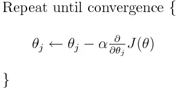
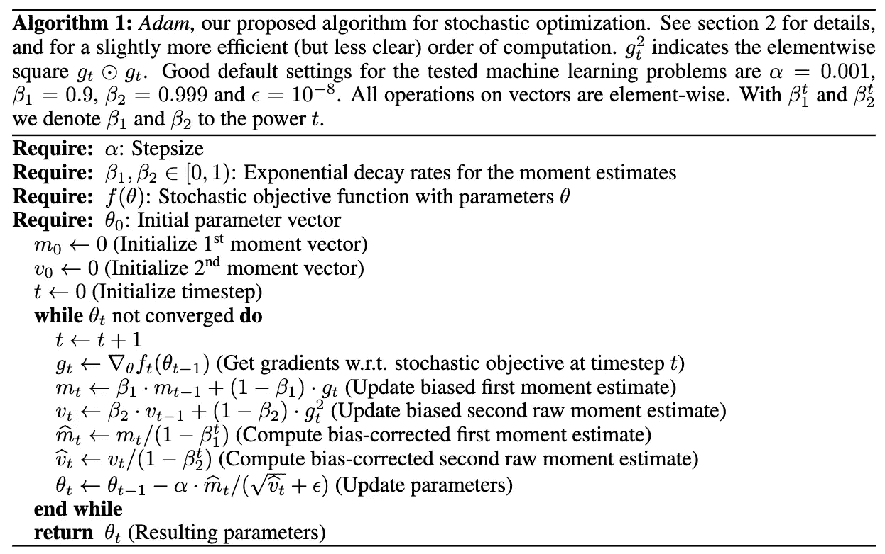
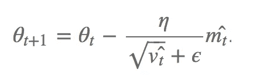
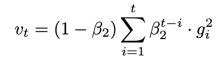
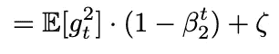
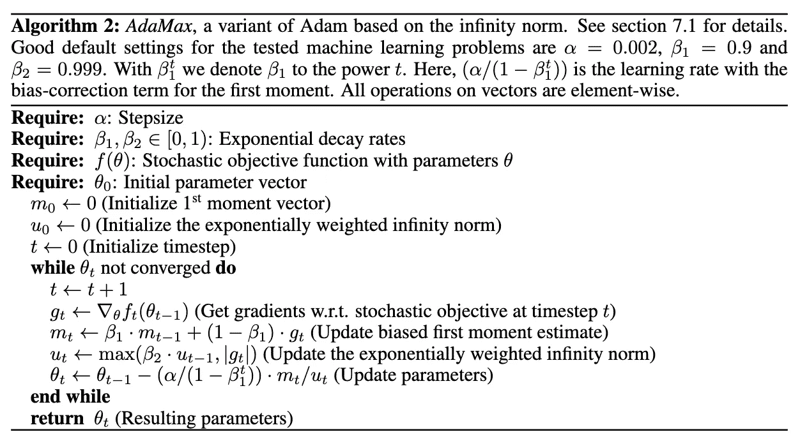
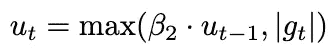
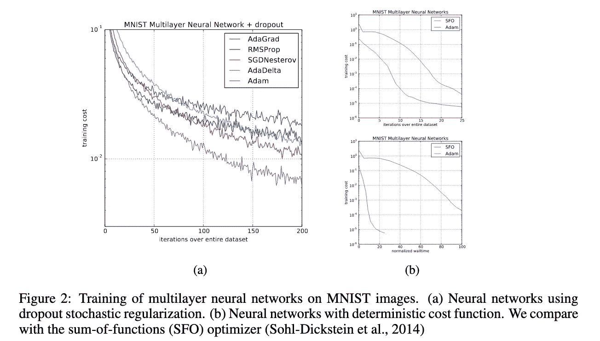

# 理解亚当:损失函数如何最小化？

> 原文：<https://towardsdatascience.com/understanding-adam-how-loss-functions-are-minimized-3a75d36ebdfc?source=collection_archive---------15----------------------->

## Adam:一种随机优化方法

# **简介**

W 在使用基于 PyTorch 构建的 fast.ai 库时，我意识到迄今为止我从未与优化器进行过交互。由于 fast.ai 在调用 fit_one_cycle 方法时已经处理了它，所以我不需要参数化优化器，也不需要了解它是如何工作的。

由于其简单性和速度，Adam 可能是机器学习中使用最多的优化器。它是由**迪德里克·金玛**和**吉米·巴雷**在 2015 年开发的，并在一篇名为[亚当:随机优化方法](https://arxiv.org/abs/1412.6980)的论文中介绍。

和往常一样，这篇博文是我写的一张备忘单，用来检查我对一个概念的理解。如果你发现一些不清楚或不正确的地方，不要犹豫，写在评论区。

# 算法

首先，Adam 指的是**自适应矩估计。**Adam 背后的基本原理是提出一种优化目标函数的高效算法。该研究论文主要研究高维参数空间中随机目标的**优化。**

Adam 是随机梯度下降的修改版，这里就不解释了。对于 memo，随机梯度下降更新规则为:

The SGD’s update rule : here J is a cost function

Adam 算法的伪代码如下:

Adam algorithm pseudo-code

每一步我都会讲清楚，但首先我需要介绍一些量。

由于 Adam 是一个迭代过程，我们需要一个索引 **t** ，它在每一步都增加 1。

**α** 是步长，相当于随机梯度下降的学习速率。

**G(t)** 是目标函数 **f** 在步骤 **t** 相对于参数向量 **θ的梯度。**

**M(t)** 是梯度 **G(t)** 的一阶矩的指数移动平均线(EMA)。因此 **β1** 均线的指数衰减率。

**V(t)** 是梯度 **G(t)** 的二阶矩的指数移动平均。因此 **β2** 均线的指数衰减率。

最后， **ε** 是一个非常小的超参数，防止算法被零除。

***为什么亚当用渐变 EMA 而不用渐变？***

当计算梯度时，一些小批量可能具有异常值，这可能产生大的信息梯度，因此通过计算每个小批量的梯度的 EMA，无信息梯度的影响被最小化。此外，均线是新旧梯度的加权平均值。如果 Adam 使用算术平均值，所有梯度(第 1 步和第 t 步之间)将具有相同的权重。

让我们注意到，**均线作为梯度**的估计，我们将在后面看到。

***亚当的更新法则***

如上所述，亚当的更新规则只不过是梯度下降的更新规则的修改版本。在 Adam 中，梯度**的第一个矩的 EMA 被矩的第二个矩的平方根缩放，减去参数向量θ。**

Adam’s update rule

在论文中，作者将其定义为 **SNR** (信噪比)。

SNR 是将**期望信号**(这里是梯度，即目标函数曲线的方向)**的水平与背景噪声**(二阶梯度，即该方向周围的噪声)的水平进行比较的度量。

平方根缩放来自 RMSProp (RMS 表示均方根)算法。这个想法是，由于梯度是在多个小批量上累积的，我们需要在每一步的梯度保持稳定。由于一个小批量可以具有与另一个小批量完全不同的数据样本，为了限制梯度的变化，梯度的一阶矩的 EMA 被二阶矩的 RMS 缩放。**人们可以将这种技术视为一种标准化，即梯度除以一种标准偏差。**

***自动退火***

SNR 越小，有效步长越接近于零，这意味着与实际信号相比存在大量噪声，因此一阶梯度的方向是否对应于最优方向的不确定性越大。这是一个理想的特性，因为步长较小，从而限制了偏离局部最优值。

SNR 通常变得更接近于 0，趋向于最佳值，导致参数空间中的小有效步长。这使得**能够更稳健、更快速地收敛**到最优。

***初始化偏置-校正***

由于 EMA 向量被初始化为 0 的向量，所以矩估计偏向于 0，尤其是在初始时间步长期间，尤其是当衰减率很小时(β接近于 1)。

为了抵消这一点，力矩估计值被**偏差修正**。

使用 **v(t)** 和 **v(t-1)** 之间的递归关系，可以得出:

在通过将它与期望值组合来使用这个等式之后，很快就可以得出， **E[v(t)]等于**

Zeta is a residual parameter to adjust the equation

这就是为什么在每一步初始化权重时，**e【v(t)】**除以 **(1-β2^t)** 。

对于第一梯度矩，遵循同样的推理。

# adamax:Adam 扩展

Adamax 是 Adam 的扩展。它用一个加权无穷范数代替梯度的二阶矩。

Adamax pseudo-code

使用这种变体是因为当特征矩阵稀疏时，作者已经提出了一种令人惊讶的稳定解决方案(像在嵌入中一样，考虑一下一键编码)。事实上，由于用于 **u(t)** 的更新规则不仅仅依赖于梯度，所以该解决方案是健壮的。

当 **g(t)** 变得非常小时，由于 max 函数，更新规则选择 **β2*u(t-1)** 。

# 结果

比较 MNIST 数据集上的结果，我们观察到 Adam 比 Adagrad、RMSProp 或 AdaDelta 收敛得更快且更接近最优。