# 理解 AlphaGo:人工智能如何思考和学习(基础)

> 原文：<https://towardsdatascience.com/understanding-alphago-how-ai-think-and-learn-1-2-da07d3ec5278?source=collection_archive---------5----------------------->

## 本文将教你游戏人工智能的基础…

> “我想象有一天，我们对机器人的重要性就像狗对人类的重要性一样，我支持机器人。”
> 
> —克劳德·香农

由 DeepMind 开发的 AlphaGo 在 2016 年[的一场围棋比赛中击败了世界顶级人类选手后，获得了全世界的关注。更强大的版本名为 AlphaZero，继续在围棋和国际象棋等游戏中蓬勃发展。一个名为 AlphaStar 的变种在与职业玩家的实时战略游戏中表现越来越好。我们正处于机器接管我们工作的时代，在某些特定领域，机器比我们人类做得更好。](https://www.forbes.com/sites/cognitiveworld/2019/02/24/ai-plays-games/#27fe5ce94a49)

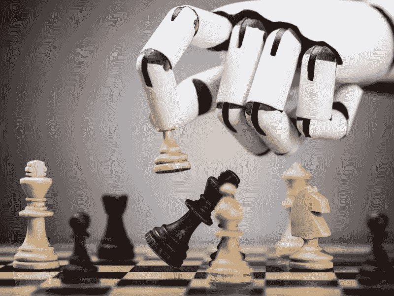

Robot Playing a Game of Chess, Image from [Smithsonian.com](https://www.smithsonianmag.com/innovation/google-ai-deepminds-alphazero-games-chess-and-go-180970981/)

但是那些人工智能到底是怎么工作的呢？在这篇文章中，我们将从基础开始讲述这些游戏人工智能是如何工作的。我们将从老式的对抗性搜索和状态机开始。然后，我们将在机器学习领域进行一些探索，从强化学习到蒙特卡罗树搜索，我们将了解现代人工智能如何自我学习(以神奇宝贝ϟϟ(๑⚈․̫⚈๑)∩为例)。

然后我们将进入第 2 部分，在那里我们将更深入地研究深度学习，主要关注人工神经网络和卷积神经网络。在此之后，我们应该能够理解 AlphaGo 的政策网络和价值网络。

不要被这些术语吓跑，因为在本文结束时，你会像专家一样理解它们。我希望这篇文章可以消除对人工智能的一些误解，解答疑问，并鼓励对这一研究领域的更多兴趣。如果你准备好了，让我们的旅程开始吧！

# 人工智能、历史和基础

> “我们的智力是我们成为人类的原因，而人工智能是这种素质的延伸。”
> 
> ——扬·勒昆

人工智能的第一个概念可以追溯到古希腊神话。赫菲斯托斯是希腊的铁匠、金工、木匠、工匠、工匠、雕刻家、冶金、火和火山之神，他应父亲宙斯的请求，制作了一个青铜机器人塔洛斯，以保护宙斯的配偶欧罗巴不被绑架。赫菲斯托斯还被认为是潘多拉的创造者——一个作为礼物送给人类的完美女人，手里拿着*“潘多拉的盒子”*——一个邪恶的罐子，它向人类释放了所有邪恶的罪恶，同时在罐子的唇边有*【希望】*。

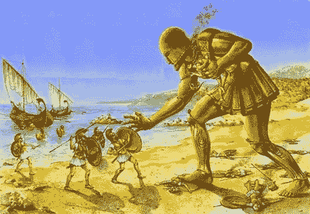

Talos, a bronze automaton, Image from [FANDOM](http://greekmythology.wikia.com/wiki/Talos)

早在公元前 350 年左右，伟大的哲学家亚里士多德描述了一种通过演绎推理进行正式、机械思考的方法，称为*“三段论”*。在 1206 年，Ismail al-Jazari 创造了一个可编程的机器人，被称为*、【音乐机器人乐队】*。几个世纪以来，许多其他杰出的人都受到了启发。一个著名的例子是艾伦·图灵，他在 1950 年发明了一种算法，可以在计算机发明之前和他的朋友下棋。(顺便说一下，他输掉了那场比赛)当然，图灵也因他的“图灵测试”而闻名，我们稍后会更详细地讨论这个测试。

Al-Jazari’s musical robot band, Image from [Wikipedia](https://en.wikipedia.org/wiki/Ismail_al-Jazari)

1956 年夏天，人工智能研究领域在新罕布什尔州汉诺威达特茅斯学院的一个车间里正式启动。术语*“人工智能”*描述了人类发明的具有认知能力的机器。这项研究有许多子领域，如计算机视觉、自然语言处理、机器学习、专家系统，以及我们今天将要讨论的主题——游戏人工智能。

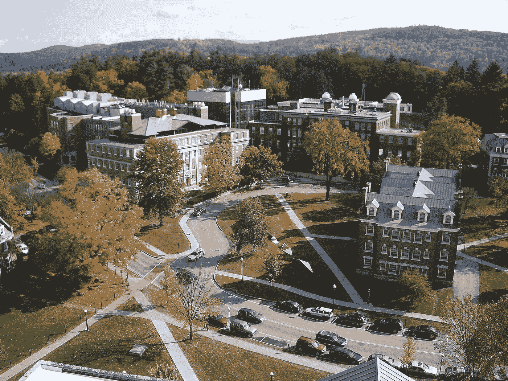

A view of East Campus from Baker Tower of Dartmouth College, Image from [Wikipedia](https://en.wikipedia.org/wiki/Dartmouth_College)

我们将从游戏中人工智能使用的两个基本算法开始——对抗性搜索和状态机。从这些构件开始，我们可以更深入地研究更高级的算法。

## 对抗性搜索

敌对搜索，有时被称为极小极大搜索，是一种经常在涉及玩家之间敌对关系的游戏中使用的算法。游戏通常可以通过 alpha-beta 剪枝进行优化，这将在本节稍后介绍。

该算法可以应用于井字游戏或 Nim 游戏，我在下面附上了游戏规则。你可以试试在游戏里玩电脑——提示:你永远不会赢，一会儿我们就知道为什么了。

**井字游戏**

井字游戏是一种游戏，双方玩家都试图将他们的*【X】*或*【O】*符号放入一个 3x 3 的棋盘中。玩家通过使他们的符号形成长度为 3 的连接而获胜。连接可以是水平的、垂直的或对角的。

**尼姆**

Nim 是一种游戏，玩家试图从一组筹码中抽取一定数量的筹码，玩家每回合至少要抽取 1 个筹码。从游戏中拿走最后筹码的玩家赢得游戏。

**对抗性搜索**

现在让我们进入今天的严肃话题——对抗性搜索。对抗性搜索创建了一个所有可能的游戏状态的树，由可用的选择分支。例如，在一个最多拿 3 个筹码的 Nim 游戏中，每个玩家可以拿 1、2 或 3 个筹码，这样每个树节点就有 3 个分支，如下所示。

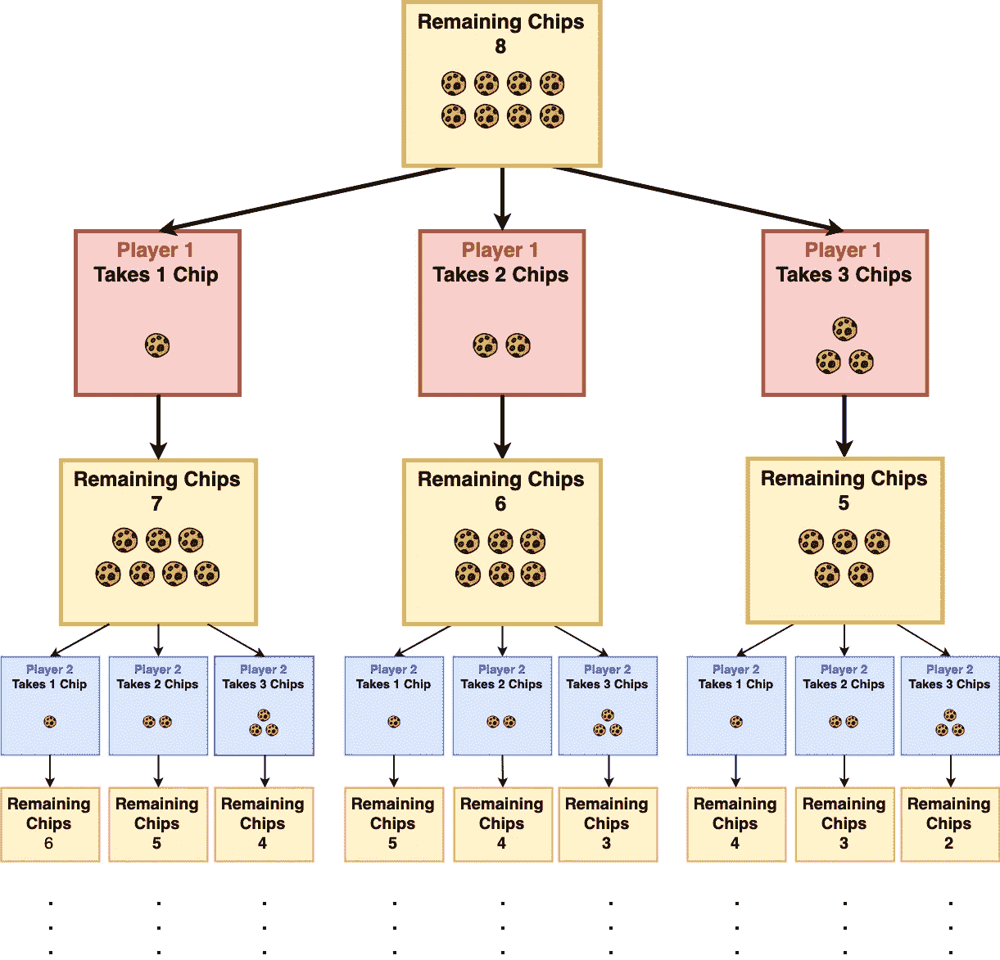

Adversarial Search Illustrated with Nim, Part 1

当没有更多的芯片剩余时，树结束。拿到最后一个筹码的玩家赢得游戏。

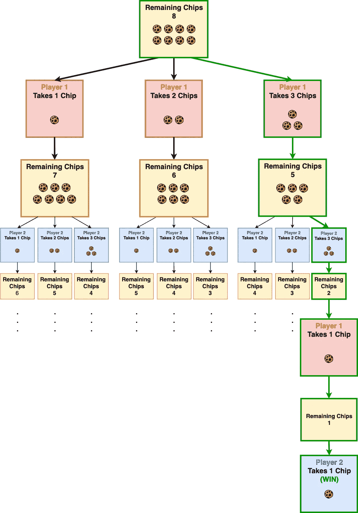

Adversarial Search Illustrated with Nim, Part 2

该树包含所有可能的游戏状态，在这种情况下， [177](https://oeis.org/A008937) 个状态。通过搜索所有的游戏状态，计算机将在采取任何行动之前知道游戏的结果。

> 🤖机器人 A:“143 移动中的伴侣。”
> 
> 🤖机器人 B:“哦维尼，你又赢了。”
> 
> ——Futurama 第二季第二集 Brannigan，重新开始

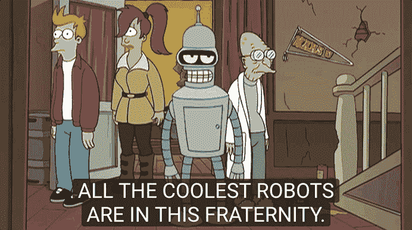

Robots Playing Chess, [Futurama S2E02](https://www.youtube.com/watch?v=XtgZKwK6C3U) Brannigan, Begin Again

在计算机科学领域，我们也重视算法的效率。更少的计算量和存储器消耗意味着更轻的硬件负载和电力消耗，导致运行算法的成本降低。因此，有许多方法可以简化问题，而不是遍历所有可能的状态。

例如，下面显示的井字游戏的 8 种状态是旋转等价的，因此我们可以将它们视为 2 种状态。这些类型的平移和旋转等效将在我们在后面的章节深入研究卷积神经网络时进行更详细的讨论。

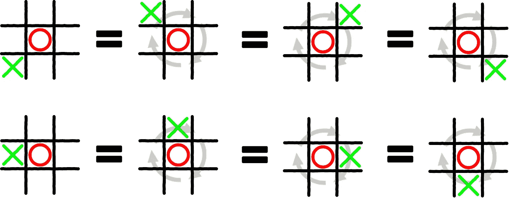

The Tic-Tac-Toe States are Rotationally Equivalent

通过消除额外的状态，搜索树的大小可以大大减小。如果不应用这种缩减，在搜索树的前 4 层中有超过 3500 个状态。对于现代计算机来说，搜索 3500 个状态并不是一项很大的任务，但这个数字呈指数增长，当它进入更大的棋盘(如国际象棋)时，可以达到我们宇宙年龄的微秒级。

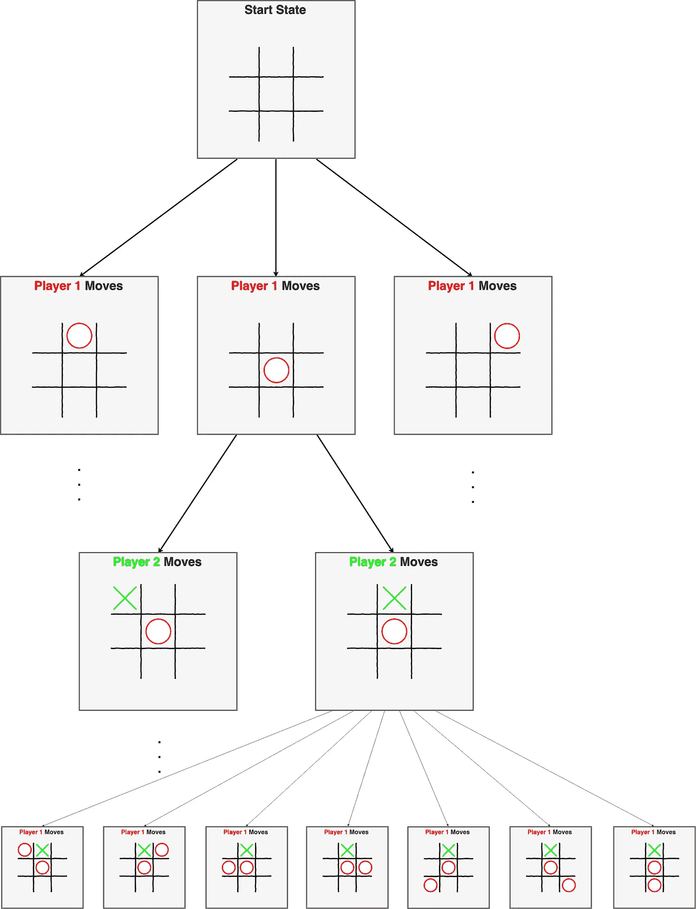

Reduced Search Tree for Tic-Tac-Toe

消除第一层中的相同状态可以减少 2/3 的额外状态，但是我们能做得更好吗？有一个叫做 alpha-beta 修剪的小技巧，我们将在下一节讨论。

**阿尔法-贝塔剪枝**

> “我从不低估对手，但也从不低估自己的天赋。”
> 
> —黑尔·欧文

想象一下，当你在玩井字游戏时，当你的对手已经有两个相连的棋子时，你总是想在另一端挡住他。为什么？因为你可以假设如果你不赢他下一轮会赢。这就是阿尔法-贝塔修剪的思想，你总是期望你的对手尽最大努力去赢。

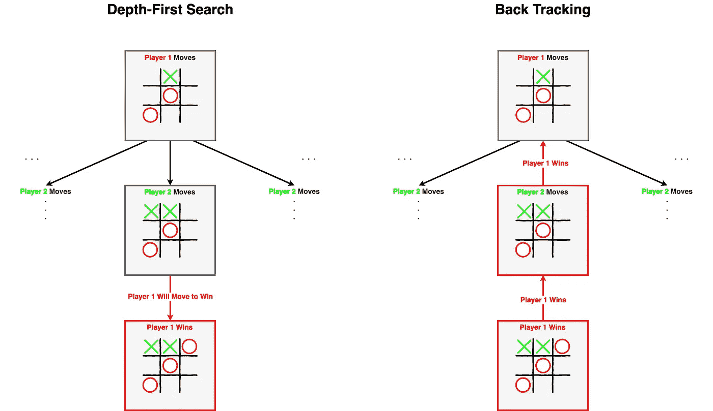

Illustration of Alpha-Beta Pruning, Player 1 will always choose the winning move

对于井字游戏，结果通常被评估为二进制。然而，对于一些更复杂的游戏，如国际象棋，棋盘可以用分数来评估。例如，白色棋子的得分之和减去黑色棋子的得分之和。这就是 alpha-beta 修剪有助于消除分支的时候。下面有一个视频解释了用象棋进行 alpha-beta 剪枝。

算法解释—极大极小和阿尔法-贝塔剪枝

至于 Nim 游戏，人工智能使用一个简单得多的规则库。我们看了搜索树，只是因为用 Nim 解释搜索树更容易。AI 会将筹码分成大小比最大允许拾取量大 1 个筹码的卡盘，并确保每次通过拾取大块大小和玩家拾取量之间的差异来拾取整个大块。如果卡盘是不可分的，AI 将首先移动并选择余数。这样，玩家就没有办法赢了。

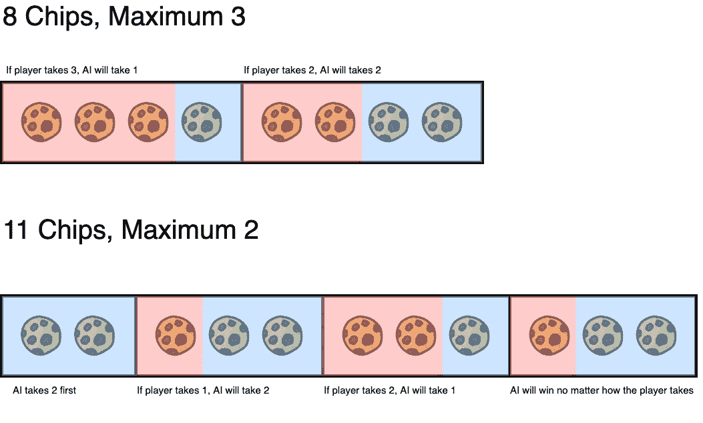

Illustration of Nim AI

对于像国际象棋这样的游戏来说，所有可能的状态都不能像井字游戏或 nim 游戏那样容易地被搜索到。但是一台可以搜索超过 30 层深度的计算机已经很难被击败，因为大多数玩家无法预见那么多的移动。

## 状态机

> “简单可能比复杂更难:你必须努力让自己的思维变得清晰，才能变得简单。”
> 
> —史蒂夫·乔布斯

状态机，通常指的是有限状态机，是当今游戏 AI 中经常被低估的概念，尤其是在机器学习多年来获得巨大普及之后。然而，在与其他使用机器学习的星际争霸 AI 进行的 [SSCAIT 2018](https://sscaitournament.com/index.php?action=botDetails&bot=SAIDA) 挑战赛中，这种老派设计以 96.15%的胜率占据了主导地位。

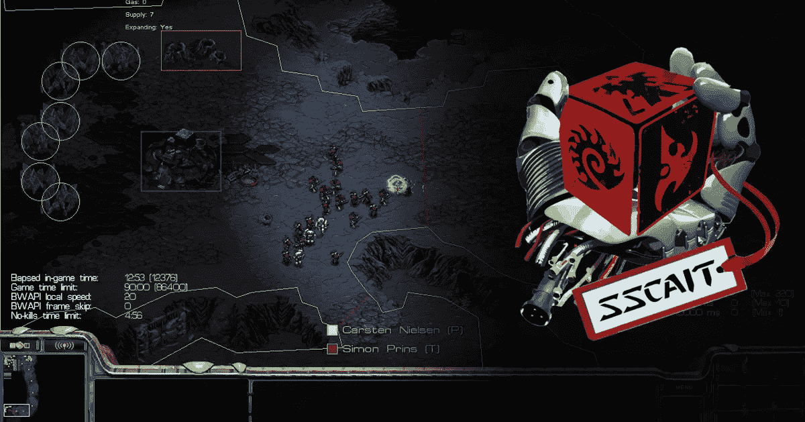

Image of [SSCAIT](https://sscaitournament.com/) and StarCraft, a Real-Time Strategy (RTS) game that requires high skill to play

在游戏人工智能领域之外，状态机也广泛应用于其他领域，比如谷歌的这款很酷的手机助手人工智能。在这一节中，我们将探究所有这些奇迹背后的理论。

谷歌人工智能助手演示

有限状态机，有时称为有限状态自动机，通常由一组连接的节点表示，正式名称为*“图”*。下面的*图*展示了典型读者如何与我的文章互动。

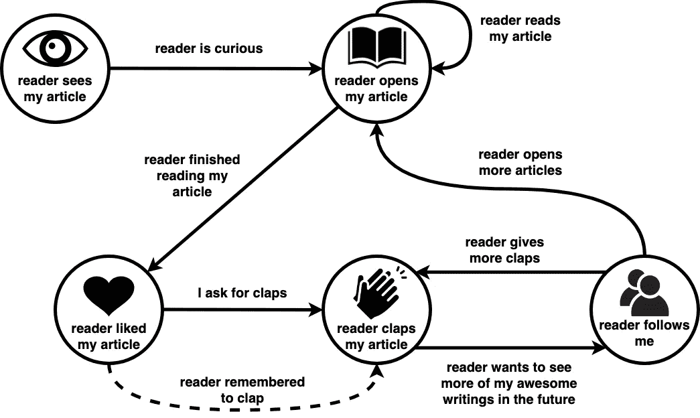

Despite Medium asks to not ask for claps, I realize people who ask for claps get more claps

圆圈内是我们称之为*“状态”*，箭头称为*“状态转换函数”*。状态转移函数通常由一个条件来描述。例如，当我的读者处于*“读者喜欢我的文章”*状态时，如果*“我请求鼓掌”*或*“读者记得鼓掌”*，他们可能会转换到*“读者为我的文章鼓掌”*状态。有限状态机的更正式的数学定义可以在[这里](https://en.wikipedia.org/wiki/Finite-state_machine#Mathematical_model)找到。

围绕它发展了许多有趣的理论，最终导致了计算机科学中的两大主题，NP 与 P 问题和图灵机。马尔可夫链等机器学习算法也分享了状态机中的一些概念。我们将在下一节学习强化学习时讨论马尔可夫决策过程。

# 机器如何学习，强化学习介绍(带神奇宝贝)

> 如果一个计算机程序在某类任务 T 和性能测量 P 上的性能(由 P 测量)随着经验 E 而提高，则称该程序从经验 E 中学习
> 
> 汤姆·米切尔

[Tom M. Mitchell](http://www.cs.cmu.edu/~tom/), Machine Learning professor at Carnegie Mellon University

作为一个被广泛使用的引用，Tom M. Mitchell 将机器学习的概念正式定义为一个计算机程序，它通过积累经验来逐步提高性能。在机器学习算法的驱动下，这些机器将利用它们接收到的新信息不断前进。相关算法被广泛应用于许多正在改变我们生活的领域，如检测我们面部的 Snapchat 过滤器，或帮助我们理解其他说外语的人的谷歌翻译。如果你对其中的一些应用感兴趣，我也写了一个关于面部检测的教程，可以在这里找到。

在这一部分，我们将了解游戏人工智能的机器学习的一个热门领域——强化学习。流行的神经网络将在随后的深度学习部分讨论。

## 强化学习

> "失败只是重新开始的机会，这次会更聪明."
> 
> —亨利·福特

> “强化学习(RL)是机器学习的一个领域，涉及软件代理应该如何在一个环境中采取行动，以便最大化某种累积回报的概念。”
> 
> —维基百科

为了便于理解，下图是一个说明强化学习基本概念的例子。

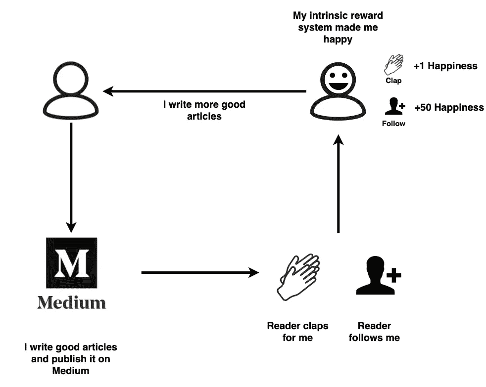

The truth is, asking for claps also generates more claps.

强化学习有几个概念，我们可以从上面的例子中理解，掌声鼓励作者写更好的文章(并要求更多的掌声)。

*   **环境:**环境是智能体相互作用的地方，在这种情况下，媒介社区就是环境。
*   **代理人:**代理人就是与他人和环境相互作用的东西，在这里，作家就是代理人。读取器也是代理，可以用前面提到的状态机来描述。
*   **状态:**状态包括环境和代理的可能状态。例如，一个作家可能睡着了或者很忙，不能写作。媒体期刊可能会引入合作项目的变化或策划一篇文章，这会影响可见性。
*   **动作:**动作是代理可以做的与环境和其他代理交互的事情。例如，作者可以选择写一个有吸引力的标题，这有机会增加浏览量和潜在的掌声。
*   **解释器:**解释器是一套为代理评估结果的规则，比如每次拍手让我开心 1 个单位，每次关注让我开心 50 个单位。

代理将尝试优化解释器评估的结果，有几种方法。在这一节中，我们将介绍游戏中人工智能使用的两种流行方法——Q 学习和蒙特卡罗树搜索。一旦我们理解了这两点，我们就应该能够理解后面章节中的深度 Q 学习。

## q 学习

Q-Learning 是强化学习的最简单形式。Q-Learning 的目标是学习一个优化代理评估结果的策略。下面的流程图解释了玩家如何找到最好的神奇宝贝。

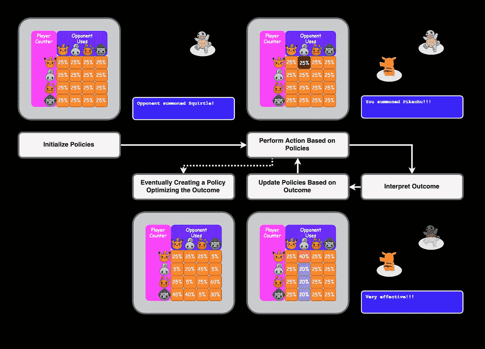

Flow-Diagram Explaining Q-Learning with Pokémon

策略通常由记录每个状态下每个动作的机会的矩阵来定义。代理将根据策略执行操作，然后根据操作的结果更新策略。例如，如果对手召唤了杰尼龟，代理将随机挑选一个神奇宝贝。如果代理商选择了皮卡丘，并发现对杰尼龟非常有效，代理商将更新政策，因此它更有可能在未来用皮卡丘对抗杰尼龟。还有另外两个值得注意的概念，学习率和马尔可夫决策过程。

**1。学习率**

学习描述了模型学习的速度。例如，对于*“非常有效”*的相同结果，低学习率的百分比可以增加 1%，高学习率的百分比可以增加 15%。

**2。马尔可夫决策过程**

马尔可夫决策过程是描述主体和环境的状态和行为的状态图。它还描述了每个状态之间的转移概率和每个状态的奖励。

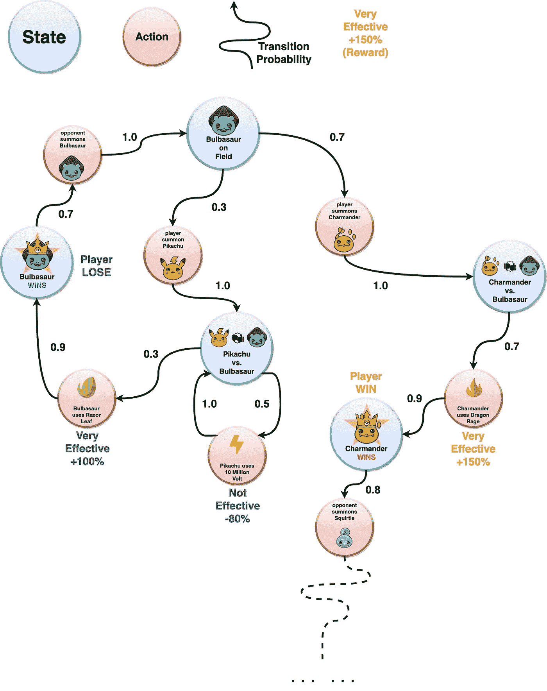

Markov Decision Process Illustrated with Pokémon

关于 Q-learning 收敛的严肃数学定义和证明的更多信息，你可以在这里阅读它们[。](http://www.gatsby.ucl.ac.uk/~dayan/papers/cjch.pdf)

## 蒙特卡罗树搜索

蒙特卡洛树搜索(MCTS)的工作方式类似于上一节中介绍的对抗性搜索。主要区别是 MCTS 随机选择一个分支，而不是试图遍历所有的分支。然后，该算法根据该分支的结果建立一个配置文件。

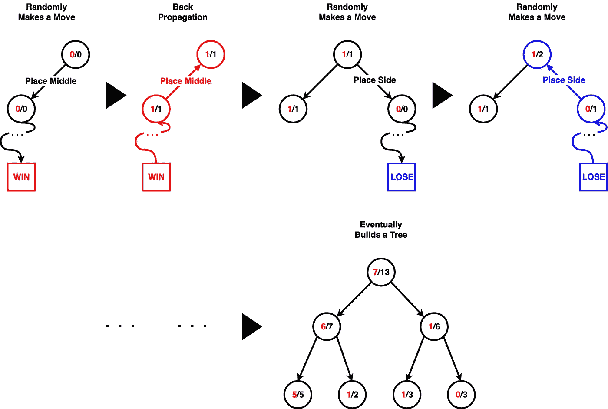

Illustration of Monte Carlo Tree Search

形式上，蒙特卡洛树搜索具有以下 4 种状态:

**1。选择**

*   通常通过选择具有最高胜率的节点来进行选择，但是具有一些随机性，因此可以探索新的策略。

**2。扩展**

*   扩展是算法扩展到未探索的状态。该算法选择随机的未探索的新状态来探索。

**3。模拟**

*   模拟是资料片后模拟随机玩法的时候，所以可以评估状态。

**4。反向传播**

*   反向传播是用从模拟中获得的新信息更新状态值的过程。

这种算法在状态数量很大的游戏中特别有用，因为要遍历所有的状态几乎是不可能的。通过学习从以前的游戏中获得的经验，将来可以做出更明智的决策。更多关于决定勘探和开发之间的节点的阅读可以在[这里](https://en.wikipedia.org/wiki/Monte_Carlo_tree_search#Exploration_and_exploitation)找到。

下面是一个关于人工智能如何用算法玩超级马里奥的视频。

人工智能用蒙特卡罗树搜索玩马里奥

强化学习是一个有趣的研究领域，有许多不同的分支。我们在本节中讨论的两个问题肯定会帮助我们理解后面章节中更高级的内容。

# 未完待续…

祝贺你走到这一步，我们已经在理解现代游戏人工智能如何思考和学习的旅程中走了一半。在本文的[第二部分](/understanding-alphago-how-ai-thinks-and-learns-advanced-d70780744dae)中，我们将回顾深度学习和神经网络，然后我们最终可以进入那些 DeepMind AI 的架构。

还有，让我知道你最喜欢哪种写作风格，我可以做经典的纪录片，严肃的论文，或者那些华而不实的神奇宝贝例子。您的反馈让我能够了解最佳政策矩阵🤖。