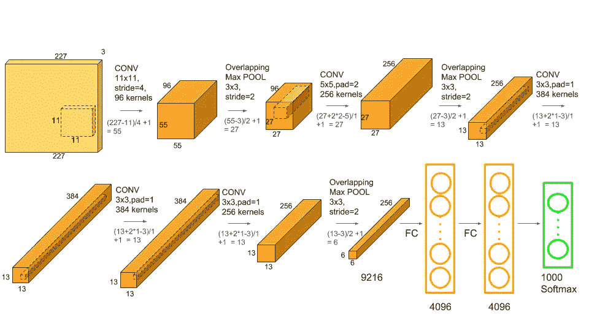
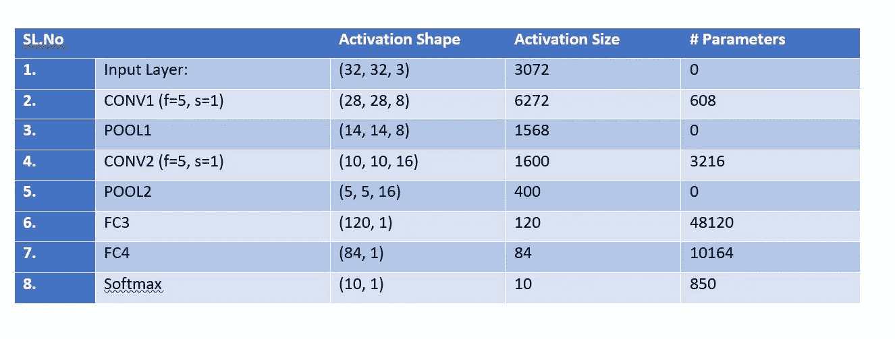

# 理解和计算卷积神经网络中的参数个数

> 原文：<https://towardsdatascience.com/understanding-and-calculating-the-number-of-parameters-in-convolution-neural-networks-cnns-fc88790d530d?source=collection_archive---------1----------------------->

[https://www.learnopencv.com/wp-content/uploads/2018/05/AlexNet-1.png](https://www.learnopencv.com/wp-content/uploads/2018/05/AlexNet-1.png)

Example taken from coursera: [https://www.coursera.org/learn/convolutional-neural-networks/lecture/uRYL1/cnn-example](https://www.coursera.org/learn/convolutional-neural-networks/lecture/uRYL1/cnn-example)

**仅供参考:上图并不代表正确的参数数量。请参考标题为“更正”的部分。如果你只想要数字，你可以跳到那一部分。**

如果你一直在玩 CNN，经常会看到上图中的参数摘要。我们都知道计算激活尺寸很容易，因为它仅仅是宽度、高度和该层中通道数量的乘积。

例如，如 coursera 的上图所示，输入层的形状为(32，32，3)，该层的激活大小为 32 * 32 * 3 = 3072。如果你想计算任何其他层的激活形状，同样适用。比方说，我们想计算 CONV2 的激活大小。我们所要做的只是乘以(10，10，16)，即 10*10*16 = 1600，你就完成了激活大小的计算。

然而，有时可能变得棘手的是计算给定层中参数数量的方法。也就是说，这里有一些简单的想法可以让我记住。

# **一些上下文(如果你知道术语“参数”在我们上下文中的意思，跳过这个):**

**让我问你这个问题:CNN 是如何学习的？**

这又回到了理解我们用卷积神经网络做什么的想法，卷积神经网络基本上是试图使用反向传播来学习滤波器的值。换句话说，如果一个层有权重矩阵，那就是一个“可学习的”层。

基本上，给定层中的参数数量是过滤器的“可学习的”(假设这样的词存在)元素的计数，也称为该层的过滤器的参数。

参数通常是在训练期间学习的重量。它们是有助于模型预测能力权重矩阵，在反向传播过程中会发生变化。谁来管理变革？嗯，你选择的训练算法，尤其是优化策略，会让它们改变自己的值。

现在你知道什么是“参数”,让我们开始计算我们上面看到的示例图像中的参数数量。但是，我想在这里再次包含该图像，以避免您的滚动努力和时间。

Example taken from Coursera: [https://www.coursera.org/learn/convolutional-neural-networks/lecture/uRYL1/cnn-example](https://www.coursera.org/learn/convolutional-neural-networks/lecture/uRYL1/cnn-example)

1.  输入层:输入层不需要学习什么，它的核心是提供输入图像的形状。所以这里没有可学习的参数。因此**参数的数量= 0** 。
2.  CONV 层:这是 CNN 学习的地方，所以我们肯定会有权重矩阵。为了计算这里的可学习参数，我们所要做的只是将乘以形状的**宽度 m** 、**高度 n** 、**前一层的过滤器** **d** ，并考虑当前层中所有这样的过滤器 **k。不要忘记每个滤波器的偏置项。CONV 层中的参数数量将是: **((m * n * d)+1)* k)** ，由于每个滤波器的偏置项而增加 1。同样的表达式可以写成:**((滤镜宽度的形状*滤镜高度的形状*上一层滤镜数+1)*滤镜数)。**其中术语“过滤器”指当前层中过滤器的数量。**
3.  **池层:**它没有可学习的参数，因为它所做的只是计算一个特定的数字，不涉及反向传播学习！因此**参数的数量= 0** 。
4.  **全连接层(FC):** 这当然有可学习的参数，事实上，与其他层相比，这类层有最多的参数，为什么？因为，每一个神经元都与其他神经元相连！那么，如何计算这里的参数个数呢？你可能知道，它是当前层的神经元数量 **c** 和前一层的神经元数量 **p** 的乘积，而且一如既往，不要忘记偏置项。因此这里的参数数量为:**((当前层神经元 c *前一层神经元 p)+1*c)** 。

现在让我们跟着这些指针计算参数的个数，好吗？

# 还记得这个练习吗？我们不想滚动，是吗？

Example taken from coursera [https://www.coursera.org/learn/convolutional-neural-networks/lecture/uRYL1/cnn-example](https://www.coursera.org/learn/convolutional-neural-networks/lecture/uRYL1/cnn-example)

1.  第一个**输入层**没有参数。你知道为什么。
2.  第二个 **CONV1(滤镜形状=5*5，步距=1)层中的参数为:** **((滤镜宽度形状*滤镜高度形状*上一层滤镜数量+1)*滤镜数量)= (((5*5*3)+1)*8) = 608。**
3.  第三个 **POOL1 层**没有参数。你知道为什么。
4.  第四个 **CONV2(滤镜形状=5*5，步距=1)层中的参数为** : **((滤镜宽度形状*滤镜高度形状*上一层滤镜数量+1) *滤镜数量)= (((5*5*8)+1)*16) = 3216。**

5.第五个 **POOL2 层**没有参数。你知道为什么。

6.中的参数第六个 **FC3 层为((当前层 c *上一层 p)+1*c) = 120*400+1*120= 48120。**

7.**T5 里的参数第七个 **FC4 层是:((当前层 c *上一层 p)+1*c) = 84*120+1* 84 = 10164。****

8.第八个 **Softmax 层有((当前层 c *上一层 p)+1*c)参数= 10*84+1*10 = 850。**

# 更新 V2:

感谢观察力敏锐的读者的评论。感谢指正。为了更好的理解改变了图像。

**参考消息**:

1.  我已经非常宽松地使用了术语“层”来解释分离。理想情况下，CONV +池被称为一个层。

2.仅仅因为池层中没有参数，并不意味着池在 backprop 中没有作用。池层负责分别在向前和向后传播期间将值传递给下一层和上一层。

在这篇文章中，我们看到了参数的含义，我们看到了如何计算激活大小，我们也了解了如何计算 CNN 中的参数数量。

如果你有足够的带宽，我会推荐你使用下面链接的安德鲁博士的 coursera 课程。

来源:

 [## 卷积神经网络的参数个数如何计算？

### 我用千层面为 MNIST 数据集创建了一个 CNN。我正在密切关注这个例子:卷积神经…

stackoverflow.com](https://stackoverflow.com/questions/42786717/how-to-calculate-the-number-of-parameters-for-convolutional-neural-network)  [## 卷积神经网络| Coursera

### 本课程将教你如何建立卷积神经网络…

www.coursera.org](https://www.coursera.org/learn/convolutional-neural-networks) 

如果你喜欢这篇文章，那就鼓掌吧！:)也许一个跟随？

在 Linkedin 上与我联系:

[https://www.linkedin.com/in/rakshith-vasudev/](https://www.linkedin.com/in/rakshith-vasudev/)