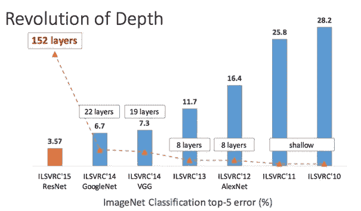
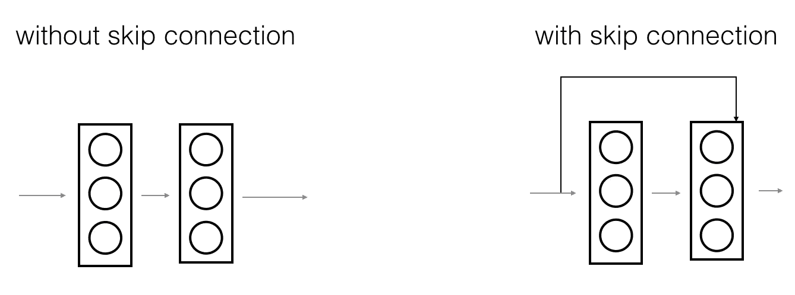
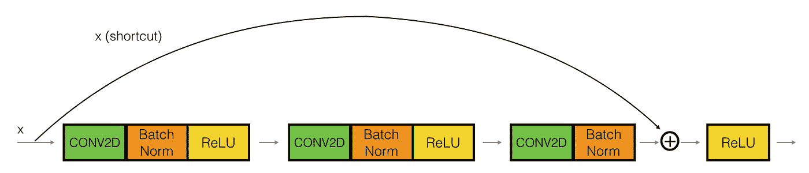
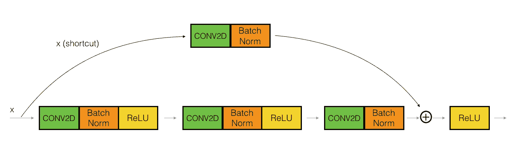
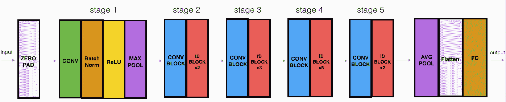
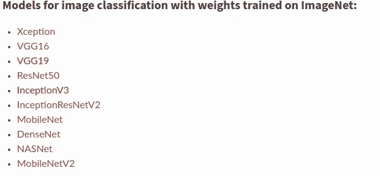

# 在 Keras 中理解和编码 ResNet

> 原文：<https://towardsdatascience.com/understanding-and-coding-a-resnet-in-keras-446d7ff84d33?source=collection_archive---------0----------------------->

## 用数据做很酷的事情！

ResNet 是残差网络的缩写，是一种经典的神经网络，用作许多计算机视觉任务的主干。这款车型是 2015 年 ImageNet 挑战赛的冠军。ResNet 的根本突破是它允许我们成功地训练具有 150+层的非常深的神经网络。在 ResNet 训练之前，由于梯度消失的问题，非常深的神经网络是困难的。

AlexNet 是 2012 年 ImageNet 的获胜者，也是显然启动了对深度学习的关注的模型，它只有 8 层卷积层，VGG 网络有 19 层，Inception 或 GoogleNet 有 22 层，ResNet 152 有 152 层。在这篇博客中，我们将编写一个 ResNet-50，它是 ResNet 152 的一个较小版本，经常被用作迁移学习的起点。



Revolution of Depth

然而，通过简单地将层堆叠在一起，增加网络深度是不起作用的。由于众所周知的梯度消失问题，深层网络很难训练，因为梯度会反向传播到更早的层，重复乘法可能会使梯度变得非常小。因此，随着网络越来越深入，其性能会饱和，甚至开始迅速下降。

我从 [DeepLearning 了解到编码 ResNets。AI](https://www.deeplearning.ai/) 课程由吴恩达主讲。我强烈推荐这道菜。

在我的 [Github repo](https://github.com/priya-dwivedi/Deep-Learning/tree/master/resnet_keras) 上，我分享了两个笔记本，其中一个按照深度学习中的解释从头开始编写 ResNet。AI 和另一个使用 Keras 中的预训练模型。希望你拉代码自己试试。

## 跳过连接 ResNet 的优势

ResNet 首先引入了跳过连接的概念。下图说明了跳过连接。左图是一个接一个地将卷积层堆叠在一起。在右边，我们仍然像以前一样堆叠卷积层，但我们现在也将原始输入添加到卷积块的输出。这被称为跳过连接



Skip Connection Image from DeepLearning.AI

它可以写成两行代码:

```
X_shortcut = X # Store the initial value of X in a variable
## Perform convolution + batch norm operations on XX = Add()([X, X_shortcut]) # SKIP Connection
```

编码非常简单，但有一个重要的考虑因素——因为上面的 X，X_shortcut 是两个矩阵，只有当它们具有相同的形状时，才能将它们相加。因此，如果卷积+批量范数运算以输出形状相同的方式进行，那么我们可以简单地将它们相加，如下所示。



When x and x_shortcut are the same shape

否则，x_shortcut 会经过一个卷积层，该卷积层的输出与卷积块的输出具有相同的维度，如下所示:



X_shortcut goes through convolution block

在 Github 上的[笔记本](https://github.com/priya-dwivedi/Deep-Learning/blob/master/resnet_keras/Residual_Networks_yourself.ipynb)中，上面实现了两个函数 identity_block 和 convolution_block。这些函数使用 Keras 实现带有 ReLU 激活的卷积和批范数层。跳过连接技术上是一条线`X = Add()([X, X_shortcut])`。

这里需要注意的一点是，如上图所示，跳过连接是在 RELU 激活之前应用的。研究发现这有最好的效果。

## 为什么跳过连接有效？

这是一个有趣的问题。我认为跳过连接在这里起作用有两个原因:

1.  它们通过允许渐变流过这种替代的快捷路径来缓解渐变消失的问题
2.  它们允许模型学习一个标识函数，该函数确保较高层的性能至少与较低层一样好，而不是更差

事实上，因为 ResNet skip 连接被用于更多的模型架构，如[全卷积网络(FCN)](https://people.eecs.berkeley.edu/~jonlong/long_shelhamer_fcn.pdf) 和 [U-Net](https://arxiv.org/abs/1505.04597) 。它们用于将信息从模型中的早期层传递到后期层。在这些架构中，它们用于将信息从下采样层传递到上采样层。

## 测试我们构建的 ResNet 模型

然后将[笔记本](https://github.com/priya-dwivedi/Deep-Learning/blob/master/resnet_keras/Residual_Networks_yourself.ipynb)中编码的单位和卷积块组合起来，创建一个 ResNet-50 模型，其架构如下所示:



ResNet-50 Model

ResNet-50 模型由 5 个阶段组成，每个阶段都有一个卷积和标识块。每个卷积块有 3 个卷积层，每个单位块也有 3 个卷积层。ResNet-50 拥有超过 2300 万个可训练参数。

我在 signs 数据集上测试了这个模型，这个数据集也包含在我的 Github repo 中。该数据集具有对应于 6 个类别的手部图像。我们有 1080 张训练图像和 120 张测试图像。


Signs Data Set

我们的 ResNet-50 在 25 个训练周期中达到 86%的测试准确率。还不错！

## 使用预训练库在 Keras 中构建 ResNet

我喜欢自己编写 ResNet 模型，因为它让我更好地理解我在许多与图像分类、对象定位、分割等相关的迁移学习任务中经常使用的网络。

然而，对于更经常的使用，在 Keras 中使用预训练的 ResNet-50 更快。Keras 的[库](https://keras.io/applications/)中有许多这样的骨干模型及其 Imagenet 权重。



Keras Pretrained Model

我已经在我的 Github 上上传了一个[笔记本](https://github.com/priya-dwivedi/Deep-Learning/blob/master/resnet_keras/Residual_Network_Keras.ipynb)，它使用 Keras 加载预训练的 ResNet-50。您可以用一行代码加载模型:

```
base_model = applications.resnet50.ResNet50(weights= **None**, include_top=**False**, input_shape= (img_height,img_width,3))
```

这里 weights=None，因为我想用随机权重初始化模型，就像我在 ResNet-50 上编码的那样。否则，我也可以加载预训练的 ImageNet 权重。我将 include_top=False 设置为不包括原始模型中的最终池化和完全连接层。我在 ResNet-50 模型中添加了全局平均池和密集输出层。

```
x = base_model.output
x = GlobalAveragePooling2D()(x)
x = Dropout(0.7)(x)
predictions = Dense(num_classes, activation= 'softmax')(x)
model = Model(inputs = base_model.input, outputs = predictions)
```

如上所示，Keras 提供了一个非常方便的接口来加载预训练的模型，但重要的是至少自己编写一次 ResNet，这样您就可以理解这个概念，并可能将这种学习应用到您正在创建的另一个新架构中。

Keras ResNet 在使用 Adam optimizer 和 0.0001 的学习率对 100 个时期进行训练后，达到了 75%的准确率。精确度比我们自己的编码模型稍低，我猜这与权重初始化有关。

Keras 还为数据扩充提供了一个简单的接口，所以如果你有机会的话，试着扩充这个数据集，看看这是否会带来更好的性能。

## 结论

*   ResNet 是一个强大的主干模型，在许多计算机视觉任务中经常使用
*   ResNet 使用跳过连接将早期层的输出添加到后期层。这有助于缓解渐变消失的问题
*   你可以用 Keras 加载他们预训练的 ResNet 50 或者用我分享的代码自己编写 ResNet。

我有自己的深度学习咨询公司，喜欢研究有趣的问题。我已经帮助许多初创公司部署了基于人工智能的创新解决方案。在 http://deeplearninganalytics.org/的[入住我们的酒店。](http://deeplearninganalytics.org/)

你也可以在[https://medium.com/@priya.dwivedi](https://medium.com/@priya.dwivedi)看到我的其他作品

如果你有一个我们可以合作的项目，请通过我的网站或 info@deeplearninganalytics.org 联系我

## 参考

*   [深度学习。艾](https://www.deeplearning.ai/)
*   [Keras](https://keras.io/applications/)
*   [ReNet Paper](https://arxiv.org/abs/1512.03385)