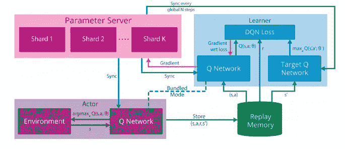
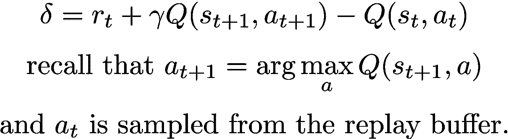
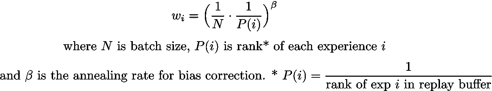

# 了解和实施分布式优先体验回放(Horgan 等人，2018 年)

> 原文：<https://towardsdatascience.com/understanding-and-implementing-distributed-prioritized-experience-replay-horgan-et-al-2018-d2c1640e0520?source=collection_archive---------20----------------------->

## 利用分布式架构加速深度强化学习

在当前的技术水平下，许多强化学习算法利用了积极的并行化和分布。在本文中，我们将审查和实施 ApeX 框架(Horgan 等人，2018 年)，也称为分布式优先化体验重放。特别是，我们将实现顶点 DQN 算法。

在这篇文章中，我试图做到以下几点:

*   讨论分布式强化学习的动机，介绍分布式框架的前身(*gorilla*)。然后，介绍 ApeX 框架。
*   简要回顾优先化的经验重放，并让读者参考这篇论文和其他博客文章进行深入讨论。
*   简要介绍 Ray，这是一个前沿的并行/分布式计算库，我将使用它来实现 ApeX。
*   运行我的(简化的)ApeX DQN 实现。

# 分布式 RL 是从哪里开始的，为什么？

第一个推广分布式强化学习架构的工作是 *Gorila(通用强化学习框架；我也在某处看到过“Google 强化学习框架”，但论文写的是“通用”)*在 Google 的 Nair et al. (2015)上提出。

*Gorila framework from “Massively Parallel Methods in Deep Reinforcement Learning” (Nair et al, 2015)*

在 *Gorila* 中，我们有一个分离的参与者(数据生成/收集)和学习者(参数优化)过程。然后，我们有一个参数服务器和一个中央重放缓冲区，由每个学习者和参与者进程共享。参与者执行轨迹展开，并将其发送到集中重放缓冲区，学习者从该缓冲区采样体验并更新其参数。在学习器更新其参数后，它将新的神经网络权重发送到参数服务器，参与者同步其自己的神经网络权重。所有这些过程都是异步发生的，彼此独立。

*Gorila* 框架似乎是现代分布式强化学习架构的底层结构——比如 *ApeX* 。特别地， *ApeX* 通过使用优先化重放缓冲器(优先化经验重放，由 Schaul 等人(2015)提出)来修改上述结构；我们将在下一节对此进行简要讨论)。

这种架构的动机来自于这样一个事实，即 RL 的大部分计算时间都花在生成数据上，而不是更新神经网络。**因此，如果我们使这些过程彼此异步，我们可以执行更多的更新。**

除了来自异步结构的加速之外，这种**分布式架构具有改进探索的概念优势**；我们可以在不同的种子环境中运行每个 actor 流程，以允许收集不同的数据集。例如，A3C (Mnih 等人，2016 年)将其相对于同步版本 A2C 的显著改进归功于改进的探索。因此，算法的分布式实现也受益于这种效果。

# 优先体验重放的简要回顾

在强化学习中，并不是所有的经验数据都是相等的:直觉上，有些经验比其他经验更能对主体的学习做出贡献。Schaul 等人(2015 年)建议我们根据时间差(TD)误差对体验进行优先排序:

回忆一下规范的 q 学习算法；我们正试图最小化我们的 Q 值的当前预测和我们的引导目标 Q 值之间的距离(即，时间差异误差)。也就是说，该误差越高，神经网络权重的更新程度就越大。因此，我们可以通过采样具有较高 TD 误差的经验来获得更快的学习。

然而，纯粹基于 TD 误差的采样会给学习带来偏差。例如，具有低 TD 误差的经历可能在很长一段时间内不会被重放，减少了重放记忆的限制，并使模型易于过度拟合。为了补救这一点，Schaul 等人(2015)使用重要性采样权重进行偏差校正。也就是说，对于每个更新步骤，我们将梯度乘以体验的重要性采样权重，计算如下:

当实现优先重放缓冲区时，我们希望有两个独立的数据结构来存储经验数据及其各自的优先级值。为了提高采样效率，Schaul 等人(2015 年)建议使用段树(或总和树)来存储优先级值。我们将使用 OpenAI 基线实现来实现 ApeX，但是请查看[的这篇博客文章](https://pemami4911.github.io/paper-summaries/deep-rl/2016/01/26/prioritizing-experience-replay.html)和[的实际论文](https://arxiv.org/pdf/1511.05952.pdf)，以获得关于优先体验重放的更详细的讨论。

# 雷简介

下面是使用 Ray 的一个极其简短的介绍:

Click the jupyter notebook file to get a clearer view!

这应该足以完成代码。我建议查看他们的教程和文档，特别是如果您想用 Ray 实现自己的并行/分布式程序。

# 履行

我们将使用 *Ray* 进行多处理，而不是内置的 python-多处理模块——从我个人的经验来看，我在调试多处理队列时遇到了很多麻烦，并且用 Ray 实现 ApeX 更容易。

虽然实现运行正常，但我目前正在修复可能的瓶颈和内存泄漏。为此，我的实现仍在进行中——我建议不要用它们大量并行化任务。一旦内存使用问题得到解决，我会更新这篇文章。

我们将这样分解实现过程:我们将把 actor 和 replay buffer 组合在一起，然后是学习器和参数服务器。下面的 jupyter 笔记本文件是我的完整实现的简化版本，只是为了展示如何实现 ApeX 如果您对完整的实现细节感兴趣，并且希望在您的设备上运行它，请查看我的 GitHub 资源库！

## 演员和重播缓冲区

每次推出后，参与者都将它们的转换数据异步发送到集中式重放缓冲区。集中式缓冲区为体验分配优先级(如优先体验重放中所述)，并将成批的采样体验发送给学习者。

我们将实现下面的 actor 过程，并使用优先重放缓冲区的 OpenAI 基线实现。我们必须修改重放缓冲区的基线实现，使其与 Ray 兼容:

**演员**

Click the jupyter notebook file to get a cleaner view!

我们可以让参与者保留一个本地缓冲区，并定期将所有内容发送到中央缓冲区，从而使参与者进程的内存效率更高——我将很快更新代码。

**优先重放缓冲区**

Click the jupyter notebook file to get a clearer view!

## 学习者和参数服务器

利用从中央重放缓冲器发送的经验批次，学习者更新其参数。由于我们使用优先体验重放，学习者还必须更新所用体验的优先级值，并将该信息发送到缓冲区。

一旦学习器参数被更新，它就将其神经网络权重发送到参数服务器。Ray 的一个优点是它支持零成本读取 numpy 数组；也就是说，我们希望学习者发送其网络权重的 numpy 数组，而不是 PyTorch 对象。然后，行动者周期性地用存储的参数拉和同步他们的 q 网络。

我们将从参数服务器开始，并实现学习者流程:

**参数服务器:**

Click the jupyter notebook file to get a clearer view!

**学员:**

Click the jupyter notebook file to get a clearer view!

# 全面实施

要查找 ApeX DQN 和 ApeX DDPG 的运行实现，请在下面的链接中查看我的 GitHub 库:

 [## cyoon 1729/分布式强化学习

### 分布式强化学习算法的单机实现。请看下面的…

github.com](https://github.com/cyoon1729/Distributed-Reinforcement-Learning) 

# 参考

1.  [深度强化学习的大规模并行方法(Nair 等人，2015)](https://arxiv.org/pdf/1507.04296.pdf)
2.  [优先体验回放(Schaul 等人，2015)](https://arxiv.org/pdf/1511.05952.pdf)
3.  [分布式优先体验回放(Horgan 等人，2015)](https://arxiv.org/pdf/1803.00933.pdf)