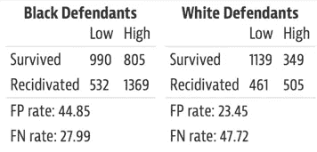
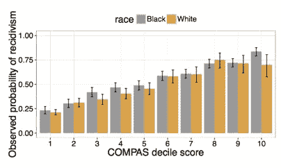
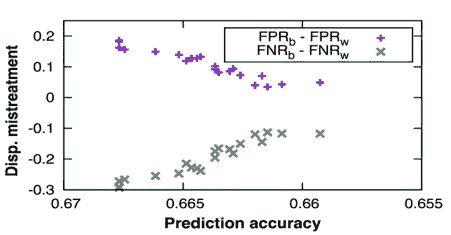

# 理解和减少机器学习中的偏差

> 原文：<https://towardsdatascience.com/understanding-and-reducing-bias-in-machine-learning-6565e23900ac?source=collection_archive---------5----------------------->

*'..“即使在观察了对象的频繁或持续的联系之后，我们也没有理由得出关于任何超出我们经验的对象的任何推论”——休谟，一篇关于人性的论文*

米蕾尤·希尔德布兰特是一名从事法律和技术交叉领域工作的律师和哲学家，他就机器学习算法中的偏见和公平问题发表了大量的文章和演讲。在即将发表的一篇关于不可知论者和无偏见机器学习的论文中(Hildebrandt，2019 年)，她认为无偏见机器学习不存在，生产性偏见是算法能够对数据建模并做出相关预测的必要条件。预测系统中可能出现的三种主要偏差类型如下:

任何行动感知系统固有的偏差(生产性偏差)

一些人认为不公平的偏见

基于被禁止的法律理由进行歧视的偏见

机器学习的性能是通过最小化成本函数来实现的。选择一个成本函数，从而选择搜索空间和最小值的可能值，将我们所说的生产偏差引入到系统中。生产偏差的其他来源来自上下文、目的、足够的训练和测试数据的可用性、使用的优化方法以及速度、准确性、过度拟合和过度概括之间的权衡，每个选择都与相应的成本相关联。因此，机器学习没有偏见的假设是错误的，偏见是归纳学习系统的一个基本属性。此外，训练数据也必然有偏差，研究设计的功能是将接近我们要发现的数据模式的偏差与有区别的偏差或只是计算假象的偏差分开。

机器学习中的偏见被定义为观察结果由于错误的假设而受到系统性偏见的现象。然而，如果没有假设，一个算法在一项任务中不会比随机选择结果有更好的表现，这是一个由 Wolpert 在 1996 年正式形成的原则，我们称之为没有免费的午餐定理。

根据“没有免费的午餐定理”(Macready，1997)，当对所有可能的数据生成分布进行平均时，所有分类器都具有相同的错误率。因此，某个分类器必须对某些分布和函数有一定的偏好，才能更好地对这些分布进行建模，这同时会使它在对其他类型的分布进行建模时变得更差。

Figure 1: Depiction of the No Free Lunch theorem, where better performance at a certain type of problem comes with the loss of generality (Fedden, 2017)

还应该始终记住，用于训练算法的数据是有限的，因此不能反映现实。这也导致了由训练和测试数据的选择以及它们对真实总体的表示而产生的偏差。我们做出的另一个假设是，假设有限的训练数据能够对测试数据进行建模和准确分类。

“[……]大多数当前的机器学习理论都基于一个重要假设，即训练样本的分布与测试样本的分布相同。尽管我们需要做出这种假设以获得理论结果，但重要的是要记住，这种假设在实践中必须经常被违反。”
——蒂姆·米切尔

即使我们成功地让我们的系统摆脱了上述偏见，随着时间的推移，偏见仍有可能蔓延:一旦算法经过训练，表现良好，并投入生产，算法是如何更新的，谁来决定系统两年后是否仍然表现良好，谁来决定系统表现良好意味着什么？

意识到这些系统中存在的不同偏见需要解释和诠释它们如何工作的能力，这呼应了阿德里安·韦勒(Adrian Weller)演讲的透明度主题:如果你无法测试它，你就无法质疑它。我们需要清楚确保这些系统功能的生产偏差，并找出训练集或算法中剩余的不公平性。这将使我们能够推断第三种也是最严重的偏见，即基于被禁止的法律理由的歧视。

Krishna Gummadi 是 Max Planck Institute for Software Systems 网络系统研究小组的负责人，他在减少分类器中的歧视性偏见方面做了大量工作，他在该领域的研究从计算的角度处理歧视，并开发了算法技术来最小化歧视。

随着机器学习系统在自动化决策中变得越来越普遍，我们使这些系统对导致歧视的偏见类型敏感是至关重要的，特别是基于非法理由的歧视。机器学习已经被用于在以下领域做出或辅助决策:招聘(筛选求职者)、银行(信用评级/贷款审批)、司法(累犯风险评估)、福利(福利津贴资格)、新闻(新闻推荐系统)等。鉴于这些行业的规模和影响，我们必须采取措施，通过法律和技术手段来防止这些行业中的不公平歧视。

为了说明他的技术，Krishna Gummadi 重点介绍了 Northpointe 公司开发的有争议的累犯预测工具 COMPAS，该工具的输出结果在美国各地被法官用于审前和判决。该算法基于对一份 137 项问卷的回答，其中包括关于他们的家族史、居住环境、学校表现等问题。来预测他们未来犯罪的风险。

算法的结果被法官用来决定量刑的长度和类型，同时将投入产出关系视为一个黑箱。虽然一些研究表明，COMPAS(替代制裁的矫正罪犯管理概况)在预测累犯风险方面并不比随机招募的互联网陌生人更好，但其他研究更侧重于测试不同突出社会群体的算法处理。

Figure 2: Study by Propublica that finds discrimination in the rate at which the algorithm misclassifies non-reoffending defenders at different rates for blacks and whites

ProPublica (Jeff Larson，2016 年)的一项研究表明，与白人辩护人相比，该算法将最终没有再次犯罪的黑人辩护人标记为高风险的可能性是两倍。这是由于黑人被告的假阳性率(FP 率)为 44.85(即 44.85%被归类为再次犯罪的黑人被告没有再次犯罪)，而白人被告的假阳性率为 23.45。然而，Northpointe 反驳说，根据他们使用的方法，黑人和白人捍卫者的错误分类率是一样的。

Figure 3: Northpointe’s rebuttal that their scoring on a 10-point scaled classified blacks or whites correctly at similar rates

事实证明，双方都是正确的，这是因为他们使用不同的公平措施。如果黑人和白人的基础累犯率不同，那么没有算法可以在这两种公平性度量上表现得一样好。这两种公平性度量都代表了内在的权衡。

我们需要能够理解这些公平性度量的权衡，以便对它们的区分能力做出明智的决定。这就是为什么我们需要计算视角。因此，让我们先从这个角度来理解什么是歧视。

使用的规范定义是:

**将* ***相对劣势*** *强加于人* ***基于*** *他们隶属于某个***显著的社会群体例如种族或性别***

**我们如何操作这个定义，并在算法中实现它？上面的表述包含了几个模糊的概念，需要正式化，“相对劣势”，“错误强加”，“突出的社会群体”等。如果我们只关注“相对劣势”部分，我们将恢复算法中可能出现的第一种歧视，即完全不同的待遇。**

****

**Figure 4: Example of a binary classification problem where the algorithm learns whether a loan will be repaid based on m+1 features, of which z is a sensitive feature**

**克里希纳用上面的二元分类问题来更好地理解不同类型的歧视。问题是基于 m+1 个特征来预测贷款是否会被偿还，其中一个特征是敏感特征，例如客户的种族。**

****完全不同的待遇:****

**如果用户的预测结果随着敏感特征的改变而改变，则可以检测到这种类型的相对区分。在上面的例子中，这意味着算法预测白人的还贷标签为正，黑人的还贷标签为负，即使所有其他特征都完全相同。为了防止对种族的任何依赖，我们需要从数据集中移除敏感特征**

**我们可以将其形式化为:**

****

**即输出的概率 P 不应依赖于输出或随输出而变化**

****完全不同的影响:****

**如果不同敏感组的阳性(阴性)结果的比例存在差异，则可以检测到这种类型的相对歧视。在上述情况下，如果与白人相比，更多的黑人被归类为违约者，就会发生这种情况。**

**我们将这一要求正式化为:**

****

**即 z=1(白人客户)的正标签(归还贷款)的概率与 z=0(黑人客户)的正标签的概率相同。**

**完全不同的影响衡量对一个群体的间接歧视程度，也经常出现在人类决策中。即使我们通过删除敏感特征来消除完全不同的待遇，通过其他相关特征(如邮政编码)仍然会发生歧视。衡量和纠正不同的影响可以确保这种情况得到纠正。当训练数据集有偏差时，应该使用此要求。同时被许多人认为是一个有争议的措施，特别是批评家，他们认为一些情况不能摆脱不相称的结果。**

****完全不同的虐待:****

**当我们测量不同敏感群体的准确结果的差异时，这种类型的相对歧视是可检测的。这是 Propublica 在 Northpointe 算法中发现的歧视类型，该算法将无辜的黑人捍卫者错误地归类为重新犯罪的比率是白人的两倍。我们可以通过要求所有相关的敏感群体获得相同比例的准确结果来纠正这种不公平。**

**我们将这一要求正式化为:**

****

**其中 z=0，1 代表不同的敏感基团。**

# ****非歧视性机器学习的机制:****

**在正式确定纠正算法中的歧视的机制之前，我们需要考虑这样一个事实，即算法并不像流行的叙述那样是无偏见的。与人类相比，算法是客观的，但这并不使它们公平，只是使它们客观上具有歧视性。算法的工作是优化一个成本函数，以达到产生我们想要预测的输出的实际函数的最佳近似。如果最佳函数是将弱势群体的所有成员分类为重新犯罪或无力支付贷款的函数，那么这就是算法将要选择的函数。因此，客观的决定可能是不公平和歧视性的。**

**简而言之，算法通过逼近以要素为输入并逼近输出的函数来学习输出的模型。它根据最小化函数输出和实际结果之间差异的参数来决定该函数的最佳参数。这被称为优化问题。我们可以通过要求近似函数也必须服从上述公式化要求中的一个或全部来避免歧视，从而对此问题添加进一步的约束。那就是:**

****

**这要求模型以所有敏感组的准确率相同的方式近似。然而，添加约束会导致折衷，这是一种相对公平的算法，但代价是一些精度。克里希纳将这一约束应用于累犯预测算法，并以一点准确性为代价，设法获得了一种对黑人和白人被告具有类似错误率的算法。他对假阳性率(FPR)和假阴性率(FNR)进行了限制，假阳性率是无辜被告被归类为累犯的概率，假阴性率是未来再次犯罪的被告被归类为非再次犯罪的概率。正如我们在图 8 中看到的，随着约束条件的收紧，黑人和白人被告的 FPR 和 FNR 的差异接近于 0，而准确性只有很小的损失(约 66.7%至约 65.8%)。**

****

**Figure 5: Correcting Disparate mistreatment for Recidivism prediction dataset.**

**简而言之，尽管担心算法只会进一步巩固和传播人类的偏见，但人工智能社区仍在努力避免和纠正算法中的歧视性偏见，同时使它们更加透明。此外，GDPR 的出现使这些努力正式化和结构化，以确保各行业在存储和处理大量公民个人数据时有动力遵循最佳实践，并以牺牲一些准确性为代价优先考虑公平。最终，算法系统将是它们试图模拟和近似的社会的反映，这将需要政府和私营部门的积极努力，以确保它不仅能够巩固和进一步加剧我们结构中固有的不平等，而且能够通过采取严厉的惩罚措施和约束来纠正它们。这让我们可以设想这样一个社会，在这个社会中，决策可以通过用客观的算法决策来取代人类偏见的主观性，即使不能完全消除偏见，也能意识到自己的偏见。**

**如果你喜欢阅读这样的故事，并想支持我的写作，请考虑注册成为一名媒体会员。每月 5 美元，你可以无限制地阅读媒体上的所有报道。如果你使用 [*我的链接*](https://medium.com/@Jaconda/membership) *注册，我会收到一点佣金。***

# **引用的作品**

**安萨罗。(2017 年 10 月 12 日)。检索自[https://medium . com/ansaro-blog/interpreting-machine-learning-models-1234d 735 d6c 9](https://medium.com/ansaro-blog/interpreting-machine-learning-models-1234d735d6c9)**

**费登大学(2017 年)。检索自 Medium Inc .:[https://Medium . com/@ LeonFedden/the-no-free-lunch-theory-62 AE 2c 3 ed 10 c](https://medium.com/@LeonFedden/the-no-free-lunch-theorem-62ae2c3ed10c)**

**希尔德布兰特，M. (2019)。隐私作为不可计算自我的保护:从不可知论者到竞争机器学习。(第 19 (1)页)。即将出版的法律理论研究。**

**杰夫·拉森，S. M. (2016 年 5 月)。检索自 ProPublica:[https://www . ProPublica . org/article/how-we-analyzed-the-compas-recidivis-algorithm](https://www.propublica.org/article/how-we-analyzed-the-compas-recidivism-algorithm)**

**凯文·艾克霍尔特，即(2018)。对深度学习视觉分类的鲁棒物理世界攻击。 *CVPR。***

**兰格(1978)。表面上深思熟虑的行动的盲目:人际互动中“地点”信息的作用。*《人格与社会心理学杂志》，36 卷 6 期*，635–642 页。**

**麦克瑞德博士(1997 年)。最优化没有免费的午餐定理。IEEE 进化计算汇刊，第 1 卷，№1。**

**马尔科·图利奥·里贝罗(2016 年)。“我为什么要相信你？”:解释任何分类器的预测。第 22 届 ACM SIGKDD 知识发现和数据挖掘国际会议论文集(第 1135-1144 页)。ACM。**

**麻省理工新闻。(2018 年 2 月 11 日)。检索自[http://news . MIT . edu/2018/study-finds-gender-skin-type-bias-artificial-intelligence-systems-0212](http://news.mit.edu/2018/study-finds-gender-skin-type-bias-artificial-intelligence-systems-0212)**

**打开 AI 博客。(2017 年 2 月 24 日)。从 https://blog.openai.com/adversarial-example-research/[取回](https://blog.openai.com/adversarial-example-research/)**

**Rich Caruana 等人(未注明)。医疗保健的可理解模型:预测肺炎风险和住院 30 天再入院。第 21 届 ACM SIGKDD 知识发现和数据挖掘国际会议论文集(第 1721-1730 页)。美国纽约。**

**连线公司(2018 年 3 月 29 日)。*编码员如何对抗面部识别软件中的偏见*。检索自[https://www . wired . com/story/how-coders-are-fighting-bias-in-face-recognition-software/](https://www.wired.com/story/how-coders-are-fighting-bias-in-facial-recognition-software/)**