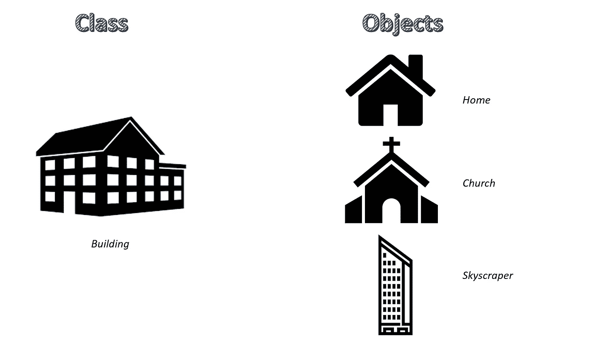

# 理解和使用 Python 类

> 原文：<https://towardsdatascience.com/understanding-and-using-python-classes-3f7e8d1ef2d8?source=collection_archive---------5----------------------->



Python 是一种解释的、面向对象的、具有动态语义的高级编程语言。后者是官方网站[python.org](https://www.python.org/)给出的正式定义。让我们打破它，试着理解它:

*   解释型:与编译型编程语言(源代码必须转换成机器可读的代码)不同，解释型语言不直接由目标机器执行。取而代之的是，它们被称为解释器的其他计算机程序读取和执行；
*   面向对象:这意味着 python 像任何其他面向对象编程(OOP)语言一样，是围绕对象组织的。python 中的一切(列表、字典、类等等)都是对象；
*   高级:这意味着代码的语法更容易被人类理解。也就是说，如果你必须在屏幕上显示一些东西，这个内置函数叫做*print；*
*   动态语义:动态对象是包含在代码结构中的值的实例，它们存在于运行时级别。此外，我们可以给一个对象分配多个值，因为它会自我更新，这与静态语义语言不同。也就是说，如果我们设置 *a=2* ，然后*a =‘hello’*，那么一旦执行了该行，字符串值将替换整数 1。

在本文中，我想更深入地研究类的概念。类是一种特殊类型的对象。更具体地说，它们是对象构造器，能够构建数据表示和我们可以用来与该对象交互的过程(因此是方法、函数等等)。

要在 Python 中创建一个类，我们需要给这个类一个名称和一些属性。让我们从下面的例子开始:

```
class Actor:
    def __init__(self, name, surname, age, years_on_stage):
        self.name=name
        self.surname=surname
        self.age=age
        self.years_on_stage=years_on_stage
```

于是我们创建了一个名为 Actor 的类，它定义了一些特征(名字、姓氏、年龄、登台年数)。有两个要素需要关注:

*   *__init__()* :用于初始化数据属性的特殊方法。我们可以把它看作一个初始化器。
*   *self* :这是一个标准符号，用来指向参数。

现在，我们可以使用我们的类并创建一个类 Actor 的对象:

```
mario=Actor(
    'Mario',
    'Rossi',
    40,
    13
)
```

现在，我们可以访问 mario 的所有属性(我们在 *__init__()* 中定义的):

```
mario.name"mario"mario.age40
```

现在，假设我们想知道 mario 的具体信息，而这些信息并没有存储在它的属性中。更具体地说，我们想知道出道的年份，但只提供给我们在舞台上的年份。所以我们想要的是一个从当前日期减去舞台上的年份的函数，这样它就返回出道的年份。

我们可以这样直接进入我们的演员类:

```
class Actor:
    def __init__(self, name, surname, age, years_on_stage):
        self.name=name
        self.surname=surname
        self.age=age
        self.years_on_stage=years_on_stage
    def year_of_debut(self, current_year):
        self.current_year=current_year
        year_of_debut=self.current_year-self.years_on_stage
        return year_of_debut
```

现在让我们在我们的对象 mario 上测试它:

```
mario.year_of_debut(2019)2006
```

最后我要讲的是 python 类的一个非常有趣且有用的属性，叫做*类继承*。其思想是，如果您必须创建一个类(称为子类),它是您已经创建的类(称为父类)的子集，您可以很容易地将其属性导入子类。

让我们通过下面的例子来看看如何做到这一点。假设您想要创建一个名为 Comedian 的子类，它与父类 Actor 有一些共同的属性:

```
class Comedian(Actor):
    def __init__(self, n_shows, field, shows_schedule, name, surname, age, years_on_stage):
        self.n_shows=n_shows
        self.field=field
        self.shows_schedule=shows_schedule
        super().__init__(name,surname,age,years_on_stage)
```

可以看到，我们没有为*的名字、姓氏、年龄*和 *years_on_stage* 指定 *self.attribute=attribute* ，而是通过函数 *super()* 直接由父类继承。现在，我们可以创建一个子类的对象，并像在父类示例中一样访问它的属性:

```
a_comedian=Comedian(
           21,
          'politics',
          'late night', 
          'amelia', 
          'smith', 
          '33', 
          '10'
)a_comedian.name'amelia'a_comedian.field'politics'
```

Python 类的优势显而易见。特别是，它们使得 Python 语言非常具有可定制性:不仅可以创建个性化的函数(除了那些内置的函数)，还可以创建能够完美满足您需求的对象生成器。