# 理解反向传播算法

> 原文：<https://towardsdatascience.com/understanding-backpropagation-algorithm-7bb3aa2f95fd?source=collection_archive---------0----------------------->

## 了解神经网络最重要组成部分的具体细节

“A man is running on a highway” — photo by [Andrea Leopardi](https://unsplash.com/@whatyouhide?utm_source=unsplash&utm_medium=referral&utm_content=creditCopyText) on [Unsplash](https://unsplash.com/search/photos/running?utm_source=unsplash&utm_medium=referral&utm_content=creditCopyText)

**反向传播算法**可能是神经网络中最基本的构建模块。它最早于 20 世纪 60 年代提出，近 30 年后(1989 年)由 Rumelhart、Hinton 和 Williams 在一篇名为*[*的论文中推广开来。*](https://www.nature.com/articles/323533a0)*

***该算法用于通过一种称为链规则的方法有效地训练神经网络。**简单来说，在网络的每次正向传递之后，反向传播在调整模型参数(权重和偏差)的同时执行反向传递。*

*在本文中，我想回顾一下训练和优化一个简单的 4 层神经网络的数学过程。我相信这将帮助读者理解反向传播是如何工作的，并意识到它的重要性。*

# *定义神经网络模型*

*4 层神经网络由 4 个用于**输入层**的神经元、4 个用于**隐含层**的神经元和 1 个用于**输出层**的神经元组成。*

*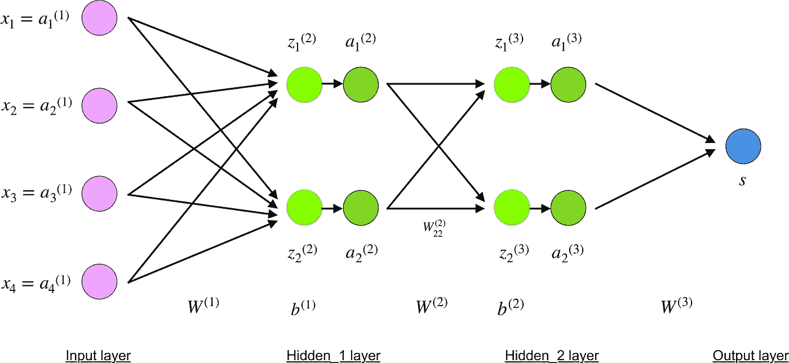*

*Simple 4-layer neural network illustration*

## *输入层*

*紫色的神经元代表输入数据。这些可以像标量一样简单，也可以像向量或多维矩阵一样复杂。*

*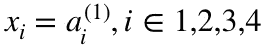*

*Equation for input x_i*

*第一组激活( *a* )等于输入值。*注意:“激活”是应用激活函数后神经元的值。见下文。**

## *隐藏层*

*使用*z^l*-层 *l* 中的加权输入，以及*a^l*-层 *l* 中的激活，计算隐藏神经元的最终值，以**绿色**、**t29】表示。对于第 2 层和第 3 层，等式为:***

*   **l = 2**

*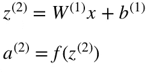*

*Equations for z² and a²*

*   **l = 3**

*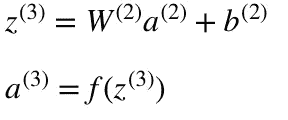*

*Equations for z³ and a³*

**W* 和 *W* 是层 2 和层 3 中的权重，而 b 和 b 是这些层中的偏差。*

*使用激活函数 *f* 计算激活 *a* 和 *a* 。典型地，这个**函数 *f* 是非线性的**(例如 [sigmoid](https://en.wikipedia.org/wiki/Sigmoid_function) 、 [ReLU](https://en.wikipedia.org/wiki/Rectifier_(neural_networks)) 、 [tanh](https://en.wikipedia.org/wiki/Hyperbolic_function) )，并且允许网络学习数据中的复杂模式。我们不会详细讨论激活函数是如何工作的，但是，如果感兴趣，我强烈推荐阅读[这篇伟大的文章](https://medium.com/the-theory-of-everything/understanding-activation-functions-in-neural-networks-9491262884e0)。*

*仔细观察，您会发现所有的 *x、z、a、z、a、W、W、b* 和 *b* 都缺少上面 4 层网络图中的下标。**原因是我们已经将矩阵中的所有参数值组合起来，按层分组。这是使用神经网络的标准方式，人们应该对计算感到舒适。不过，我会检查一下方程式，以消除任何混淆。***

*让我们挑选第 2 层及其参数作为例子。相同的操作可以应用于网络中的任何层。*

*   **W* 是形状为 *(n，m)* 的权重矩阵，其中 *n* 是输出神经元(下一层神经元)的数量， *m* 是输入神经元(上一层神经元)的数量。对于我们来说， *n = 2* 和 *m = 4* 。*

*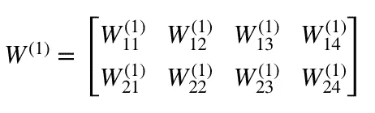*

*Equation for W¹*

***NB:任何权重下标中的第一个数字匹配下一层**中神经元的索引(在我们的例子中，这是 *Hidden_2 层* ) **，第二个数字匹配上一层**中神经元的索引(在我们的例子中，这是*输入层*)。*

*   **x* 是形状 *(m，1)* 的输入向量，其中 *m* 是输入神经元的数量。对于我们来说， *m = 4* 。*

*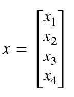*

*Equation for x*

*   **b* 是形状 *(n，1)* 的偏置向量，其中 *n* 是当前层中神经元的数量。对于我们来说， *n = 2* 。*

*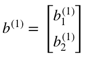*

*Equation for b¹*

*根据 *z、*的等式，我们可以使用上述 *W、x* 和 *b* 的定义来推导出“*z 的等式”*:*

*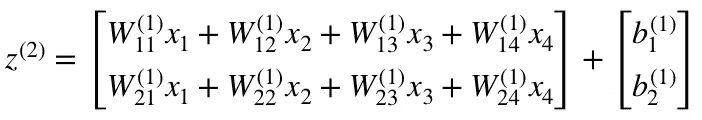*

**Equation for z²**

*现在仔细观察上面的神经网络图。*

*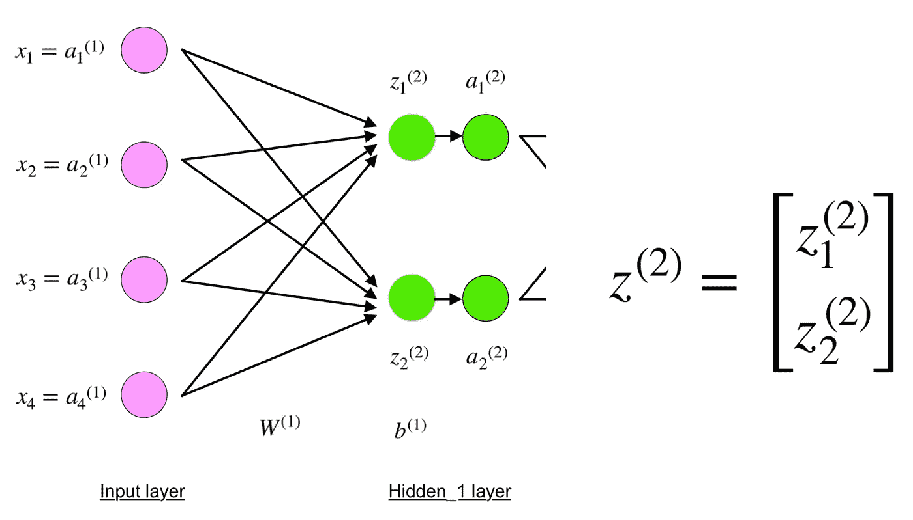*

*Input and Hidden_1 layers*

*你会看到 *z* 可以用( *z_1)* 和( *z_2)* 来表示，其中( *z_1)* 和( *z_2)* 是每个输入 *x_i* 与相应权重( *W_ij)相乘的和。**

*这导致 z 的相同的“T14”方程，并证明 z、a、z 和 a 的矩阵表示是正确的。*

## *输出层*

*神经网络的最后一部分是产生预测值的输出层。在我们的简单示例中，它被表示为单个神经元，以**蓝色**和**着色，评估如下:***

*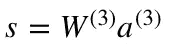*

*Equation for output s*

*同样，我们使用矩阵表示来简化方程。人们可以使用上述技术来理解底层逻辑。如果你发现自己迷失在方程式中，请在下面留下你的评论——我很乐意帮助你！*

# *正向传播和评估*

*上述方程构成了网络的前向传播。下面是一个简短的概述:*

*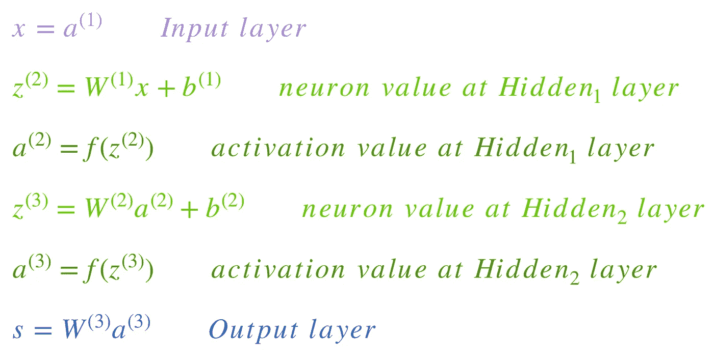*

*Overview of forward propagation equations colored by layer*

*正向传递的最后一步是相对于**预期输出 *y*** 评估**预测输出 *s*** 。*

*输出 *y* 是训练数据集 *(x，y)* 的一部分，其中 *x* 是输入(正如我们在上一节中看到的)。*

**s* 和 *y* 之间的评估通过**成本函数**进行。这可以像 [MSE](https://en.wikipedia.org/wiki/Mean_squared_error) (均方误差)一样简单，也可以像[交叉熵](http://neuralnetworksanddeeplearning.com/chap3.html)一样复杂。*

*我们将这个成本函数命名为 *C* ，并表示如下:*

*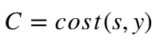*

*Equation for cost function C*

*如果*成本*可以等于 MSE、交叉熵或者[任何其他成本函数](https://stats.stackexchange.com/questions/154879/a-list-of-cost-functions-used-in-neural-networks-alongside-applications)。*

*基于 *C* 的值，模型“知道”调整其参数多少，以便更接近预期输出 *y* 。这是使用反向传播算法实现的。*

# *反向传播和计算梯度*

*根据 1989 年的论文，反向传播:*

> *重复地调整网络中连接的权重，以便最小化网络的实际输出向量和期望输出向量之间的差的度量。*

*和*

> *创建有用的新功能的能力将反向传播与早期更简单的方法区分开来…*

*换句话说，反向传播旨在通过调整网络的权重和偏差来最小化成本函数。调整水平由成本函数相对于这些参数的梯度决定。*

*可能会出现一个问题——**为什么要计算梯度**？*

*要回答这个问题，我们首先需要重温一些微积分术语:*

*   **函数 C(x1，x2，…，x_m)在 x 点的梯度是 C 在 x 点的* [*偏导数*](https://en.wikipedia.org/wiki/Partial_derivative) *的向量**

*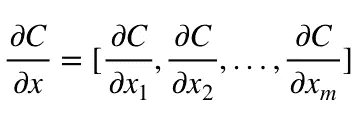*

*Equation for derivative of C in x*

*   *[*函数 C 的导数测量函数值(输出值)相对于其自变量 x(输入值)变化的敏感度*](https://en.wikipedia.org/wiki/Derivative) *。换句话说，导数告诉我们 C 的方向。**
*   **梯度显示了参数 x 需要改变多少(正向或负向)以最小化 c。**

*使用一种叫做[链式法则](https://en.wikipedia.org/wiki/Chain_rule)的技术来计算这些梯度。*

*对于单个重量 *(w_jk)^l，*的梯度为:*

*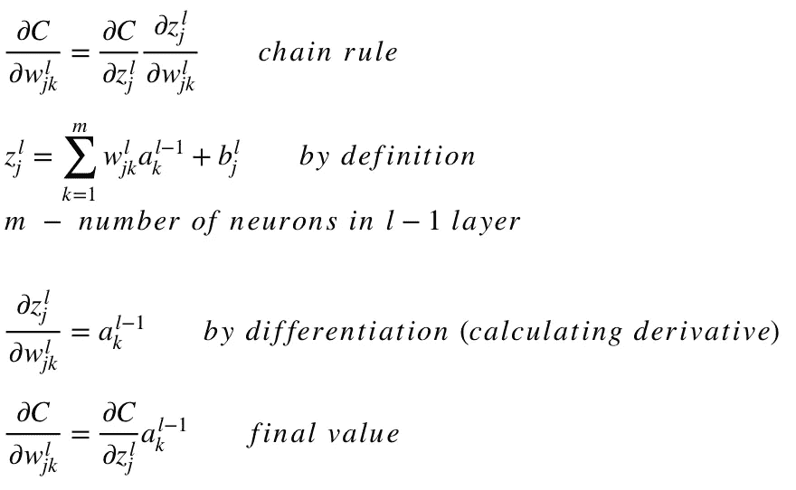*

*Equations for derivative of C in a single weight *(w_jk)^l**

*类似的方程组可以应用于 *(b_j)^l* ):*

*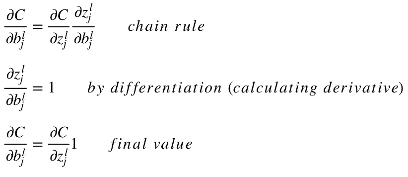*

*Equations for derivative of C in a single bias *(b_j)^l**

*两个方程中的公共部分通常被称为*“局部梯度”*，并表示如下:*

*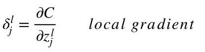*

*Equation for local gradient*

*使用链式法则可以很容易地确定*“局部梯度”*。我现在不会重复这个过程，但是如果你有任何问题，请在下面评论。*

*梯度允许我们优化模型的参数:*

*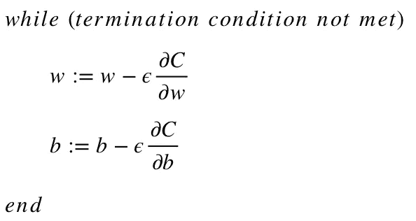*

*Algorithm for optimizing weights and biases (also called “Gradient descent”)*

*   *随机选择 *w* 和 *b* 的初始值。*
*   *ε(*e*)是[学习率](https://machinelearningmastery.com/understand-the-dynamics-of-learning-rate-on-deep-learning-neural-networks/)。它决定了渐变的影响。*
*   **w* 和 *b* 是权重和偏差的矩阵表示。 *w* 或 *b* 中的 *C* 的导数可以使用各个权重或偏差中的 *C* 的偏导数来计算。*
*   *一旦成本函数最小化，就满足终止条件。*

*我想把这一节的最后部分献给一个简单的例子，在这个例子中，我们将计算 *C* 相对于单个重量 *(w_22)* 的梯度。*

*让我们放大上面神经网络的底部:*

*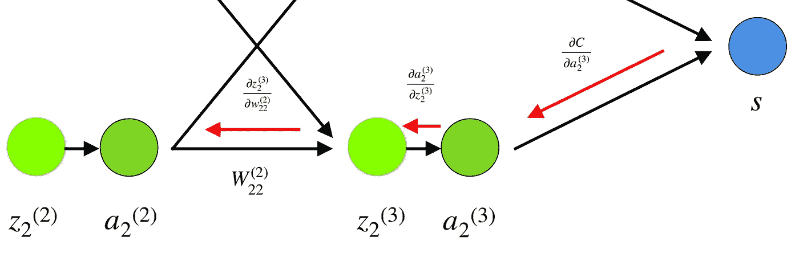*

*Visual representation of backpropagation in a neural network*

*权重 *(w_22)* 连接*(a _ 2)**(z _ 2)*，因此计算梯度需要通过*(z _ 2)**(a _ 2)*应用链式法则*

*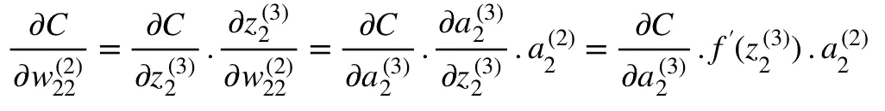*

*Equation for derivative of C in *(w_22)²**

*计算 *(a_2)* 中 *C* 的导数的最终值需要了解函数 *C* 。由于 *C* 依赖于 *(a_2)* ，计算导数应该相当简单。*

*我希望这个例子能够揭示计算梯度背后的数学原理。为了进一步提高你的技能，我强烈推荐观看斯坦福大学的 NLP 系列，其中理查德·索彻对反向传播给出了 4 个很好的解释。*

# *结束语*

*在这篇文章中，我详细解释了反向传播是如何使用计算梯度、链式法则等数学技术进行工作的。了解这种算法的具体细节将巩固你的神经网络知识，并让你对更复杂的模型感到舒适。享受你的深度学习之旅！*

# *谢谢你的阅读。希望你喜欢这篇文章🤩我祝你今天过得愉快！*