# 理解量子计算中测量的基础

> 原文：<https://towardsdatascience.com/understanding-basics-of-measurements-in-quantum-computation-4c885879eba0?source=collection_archive---------4----------------------->

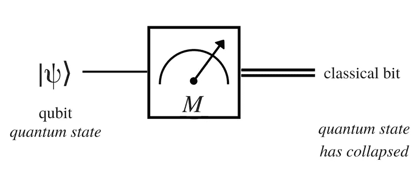

Measuring a Quantum bit

如果你对量子计算理论有更深入的了解，你可能会遇到这个叫做*测量的术语。*在顶层，*测量*本质上就是上图所描绘的:*对一个量子位的某种*操作(基向量|0 >和|1 >的某种叠加状态)以获得一个经典位(其过程是完全随机的)。

开始之前。如果你在理解量子位、叠加、基本向量等术语时遇到困难，我会建议你阅读这篇文章作为[介绍](/the-need-promise-and-reality-of-quantum-computing-4264ce15c6c0)、 [bra 和 ket 符号](https://en.wikipedia.org/wiki/Bra–ket_notation#Vectors_vs_kets)以及这篇[线性代数评论](http://cs229.stanford.edu/section/cs229-linalg.pdf)(并且**不要**省略特征向量和特征空间、正交性)。另外，参考其他关于(复)向量空间、内积、线性组合和相关概念的资料。

好吧，前提条件完成了。言归正传！

# 为什么是这篇文章？

当我开始学习量子测量的时候，事情并不是很顺利。数学没有那么难，但是基本的直觉*为什么以他们的方式做事情*却不见了，至少在我的消息来源里。当我最终将不同的部分组合在一起时，我认为这将有助于开辟一种不同的方法来理解量子测量(一种自上而下的方法— *，这意味着将数学保留到最后，同时首先理解更广泛的含义*)并首先理解**为什么**我们需要区分我将在这里讨论的两种测量—*一般*和*投影*和 *POVM。*

等等！我没说*的两种*的*和*的三围和命名。别担心。把我的陈述解释成一种带有一定程度不确定性的量子陈述。通过这种方式，你会提出问题并更好地理解(整篇文章都是如此)。

我将从量子力学的前提假设开始:

## 假设 1

简单来说，如果你有一个**孤立的**量子系统，有一个内积定义的复向量空间附着在那个系统上，叫做*态*空间。

直观地，这样的空间被描述为将欧几里得(或主要是 2 维空间)微积分和线性代数的概念结合到多维空间。这允许像测量长度和角度的几个操作。

[点击此处了解更多关于希尔伯特空间的信息](https://en.wikipedia.org/wiki/Hilbert_space)

## 假设 2

给定一个**封闭的**量子系统，系统的演化用一个*幺正变换来描述。*

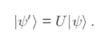

Unitary transformation of a quantum state

在上面的等式中，U 是一个酉矩阵(或者一个与其伴随矩阵的乘积产生单位矩阵的矩阵)。更一般地，对于连续时间，这种幺正变换可以写成:

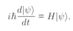

You just got introduced to the Schrodinger’s equation!

这也是一个酉变换，尽管它需要一点理解。这里， *H* 称为*哈密顿*算符，是厄米算符。简单来说，厄米特的伴随就是算子本身，即 *adj(H) = H.* 求解上面关于时间的微分方程，得出下面的方程:

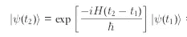

*exp* 部分中的术语需要更多解释。这里，H 是厄米算符。一个厄米算符乘以一个标量(本质上是时间和 Dirac-h 的差的比值)保持了厄米性质。无需深入数学，任何形式为 *exp(-i.K)* 的东西都会产生酉算子，其中 K 是厄米算子。

## 回到测量

我将避免在这里直接发起关于度量的正式讨论。我更愿意讨论一个更大的图片，并希望它能使*普通*和*投影*测量之间的区别更加清晰。

到目前为止，我们意识到了一件重要的事情:

> 这些假设适用于**封闭、隔离的系统。**

简单地说，这在现实世界中很难发生。这意味着你关于单一进化的正式观点(公设 2)不是很正确。你的哈密尔顿函数没有给你一个清晰的酉算符，可以完美地描述被观察系统的力学。两个非常简单的例子可以说明这一点:

1.  在大多数情况下，测量会破坏量子态。
2.  能量进入和离开系统。

如果你有一些 QM 的正式背景，你可能知道 1 本质上是正确的。一个系统保持在叠加状态，除非它被测量。*举例？考虑一下这篇文章的顶部图片。*

我们有一个由|0 >和|1 >的某种*线性组合*形成的量子位(叠加量子态)。测量后，它成为一个经典位(0 或 1)。

现在是时候介绍一下*常规、POVM* 和*投影*测量了。现在把这些测量系统看作是一种黑箱，所以我们可以着眼于更大的图景而不会被细节所困扰。

长话短说，系统是**封闭的**，并且由一个哈密顿量通过酉时间演化来描述，可以通过*投影*测量来测量。很明显，系统在现实中不是封闭的，因此使用投影测量是不可测量的。为了测量这样的系统，我们有两个选择:

1.  将**较小的开放**系统视为**较大系统**的子部分，该系统**关闭。**在这种情况下，**更大系统**的演化可以用酉演化来描述，我们可以用*射影测量*到把东西测量出来。这将需要将关于完整的较大系统(姑且称之为*环境*)的**完整细节**添加到被观察的**较小开放**系统的哈密顿量中。但是这里有一个固有的缺陷。*你知道* ***关于环境的一切*** *为了让它成为一个完全封闭的系统吗？这个很难确定。这个问题把我们引向第二种选择。*
2.  让系统**打开**，并从已知的*投影测量中开发一些其他测量技术。*

原来 POVM ( *正算子值度量*)是对*投影度量*的*限制*，因此它包含除了*环境之外的一切。简而言之，如果你采取了 POVM，你就不需要再关心环境了。或者换句话说，*

> 我们可以从 *POVMs* 中得到*投影测量*，如果我们将环境因素考虑在内，使其成为*酉时演化，即投影= POVMs +环境*

这不正是我们要找的吗？一种不用关心环境就能测量系统的方法。而 *POVM* 就是答案。还有另外一个微妙的区别——尽管 *POVMs* 和*一般测量*在数学上看起来是一样的(事实上， *POVMs* 是通过将一个变量代入*一般测量方程*中获得的)，但两者之间有一个重要的区别。然而，为了说明这一点，我需要引入关于这些测量的数学方程。

## *一般测量值*

在量子测量场景中，测量算符本质上是一个矩阵(而不是一个精心选择的矩阵)，它以数学方式操纵系统的初始状态。

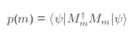

Probability of the measurement to be *m*

上式给出了测量值与输出值的概率 *m.* 如果您熟悉 bra 和 ket 符号，最左边的符号表示原始系统状态的**转置、复共轭**行向量(原始系统状态是最右边的列向量)。中间是左边算符 M 乘以原算符 M 的伴随。

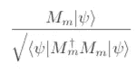

Post-measurement state

这个等式简单地是操作符对当前状态的应用，除以状态发生的概率。**务必理解这一重要等式，因为这将被证明是*常规*和 *POVM 测量之间的本质区别。***

描述我们选择的操作符的性质的几个其他等式(基本上是对所有可能输出的求和，如果我们取伴随矩阵和原始矩阵的乘积，我们最终得到单位矩阵)。第二个方程是概率的基本假设，所有概率的总和本质上是一。

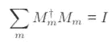

The ‘completeness equation’

我会休息一下，展示一个这些方程的例子。在这里更好地表示方程有点困难，因此我将把它写在纸上，并在这里贴一个屏幕。我已经展示了量子位前三个方程的必要计算。

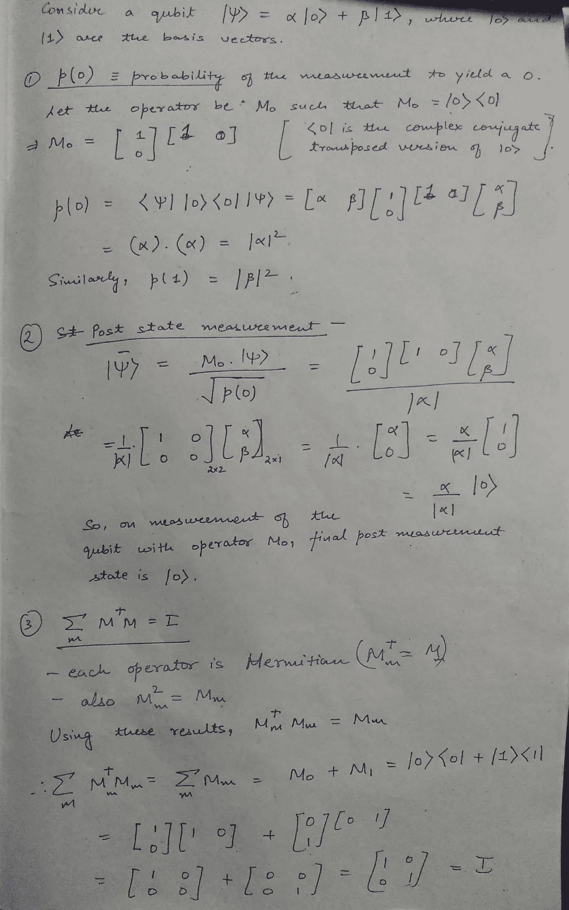

需要注意的是这两个红色的简单计算语句。

1.  每个操作员都是*隐士*
2.  算符的平方就是算符本身。

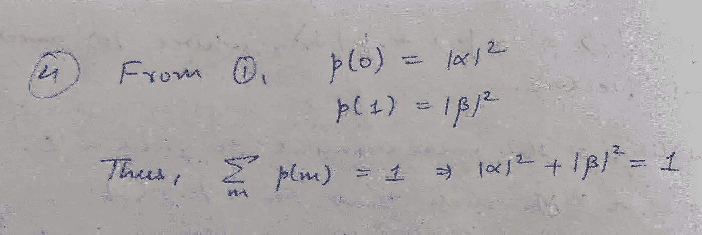

An important result!!!

## *投影测量*

记住这些是对经历酉进化的**封闭系统的测量，**，因此利用了最基本的直觉之一- *特征值和特征向量。*

简单来说，特征向量的作用是*将*算子的操作分解成几个*独立的*向量方向。因此，现在可以在不同的方向上独立地和单独地观察操作者的动作。此外，算子在这些方向上的动作仅仅涉及特征向量的*拉伸、压缩、翻转(*或数学上的*标量乘法)*。

可能需要一段时间才能理解，但这是一个可以充分利用的非常强大的属性。

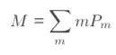

上面的等式是可观测 M 的**谱分解**，它只是将 M 分解成几个*投影*到 M 的*本征空间*，乘以 M 的本征值*别担心，我会演示如何做。*

*其余所有来自*一般测量值*的方程得到相当简化:*

*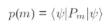*

*Probability of the measurement yielding output as the eigenvalue m*

*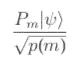*

*The post-measurement state calculation equation*

*任何满足*一般度量、*要求的算子，如果遵循一个附加限制，就成为*射影度量算子。**

*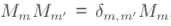*

*Additional restriction for being projective!*

*不难将这些点联系起来，这里要注意的是，这个*附加限制*仅在**封闭系统中得到满足，**或者更具体地说，在这些系统中，测量是**非破坏性测量，**，即它们在测量时不会使量子态崩溃。为什么这样让我给出数学解:*

*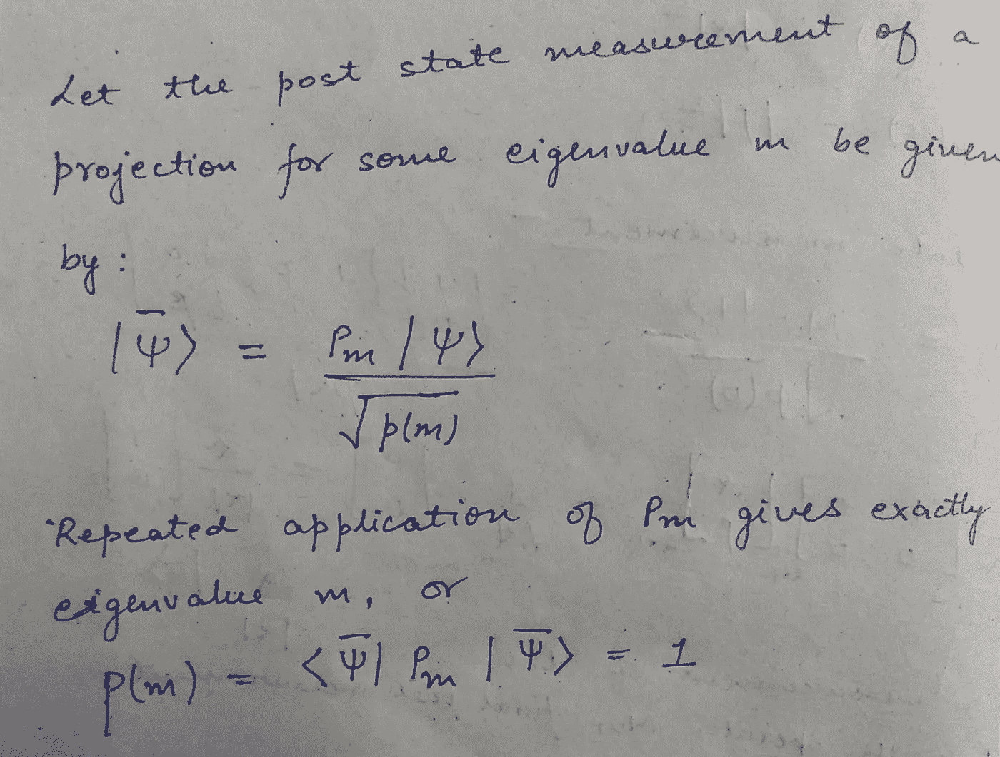*

*可以看出，重复使用*投影*不会改变输出。一次又一次得到相同测量值的概率是 1。因此，投影不是我们在现实世界中可以使用的东西。*

*现在让我用一个例子演示一下*投影*计算的所有数学方面:*

*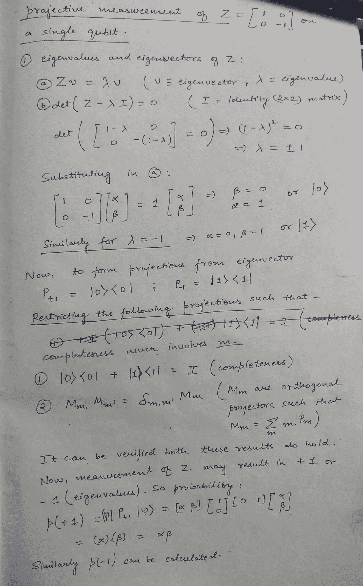*

*Note: The bottommost calculation wrongly computes using [0 1] instead of the previously assumed [1 0]. Thanks to [Brian Droncheff](https://medium.com/u/a6f763533e89?source=post_page-----4c885879eba0--------------------------------) for pointing this out in the comments.*

*上面的例子显示了一旦一个运算符 Z 被分解成一组向量，它的应用变得多么简单。这也展示了特征向量是如何相互独立地被分析和处理的，从而使事情变得简单得多。*

## **POVM 测量**

*数学上，POVMs 由给定的*一般测量概率分布:*形成*

**

*Probability distribution of a general measurement*

*只需进行以下替换:*

*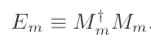*

*得到下面的等式:*

*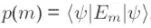*

*Probability distribution*

*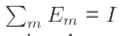*

*Completeness relation*

*我们结束了吗？好吧。号码*

*乍一看似乎很容易，但这里隐藏着一些东西。幸运的是，你已经知道我要求你记住的关于*一般测量*和 *POVMs 之间区别的关系。**

*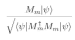*

*The post measurement state*

*现在，如果你从最初的运算符 M 开始，你就可以开始了。但是如果从关于 E 的初始知识开始呢？在这种情况下，将 E 分解成另一个矩阵 M 及其伴随矩阵是完全不可能的。因此，我们失去了 M，并因此失去了测量测量后状态的能力。在我们不需要知道任何关于测量后状态的情况下，POVMs 是惊人的。此外，这也是大多数标准文本倾向于仅从*通用*测量关系开发 POVMs 的原因。*

*另一个要联系的点是*投影= POVM +环境，*或者 POVM 是对不考虑环境的投影的限制。为此，请看下面的等式:*

*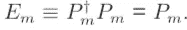*

*POVMs = projections. The extreme right P(m) comes from the middle expression utilising the fact that the operator P is Hermitian and square of the operator is the operator itself (statements in red ink in my handwritten example above in general measurements)*

*当且仅当:*

*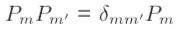*

*The additional restriction for projections*

*这意味着关于*POVM+environment = Projections*的讨论仅仅意味着让操作者遵守上面描述的附加限制。此外，这也意味着同样的等式导致*投影*依赖于系统的单一时间演化和隔离，或者换句话说，给予系统对其环境足够的响应性。*

## *结论*

*我希望这篇文章能帮助你抓住这些测量背后的基本直觉，以及它们在更大范围内是如何相互关联的。了解这些基础知识是理解量子力学公设 3 的关键。*

*祝你今天开心！玩的开心！*