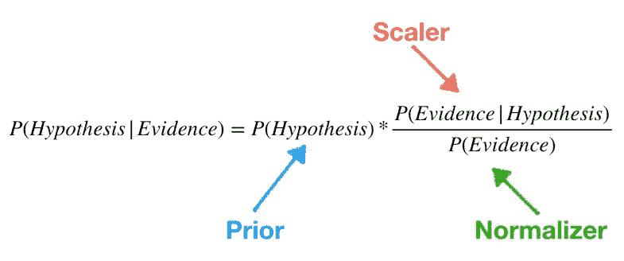
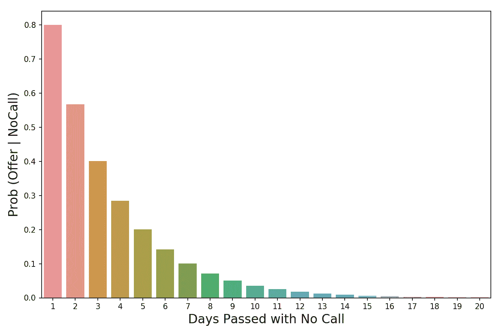
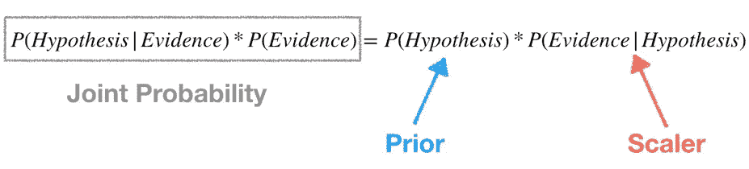

# 理解贝叶斯定理

> 原文：<https://towardsdatascience.com/understanding-bayes-theorem-7e31b8434d4b?source=collection_archive---------7----------------------->

Photo by [Antoine Dautry](https://unsplash.com/@antoine1003?utm_source=unsplash&utm_medium=referral&utm_content=creditCopyText) on [Unsplash](https://unsplash.com/s/photos/math?utm_source=unsplash&utm_medium=referral&utm_content=creditCopyText)

## 理解著名定理背后的基本原理

这是统计和概率世界中最著名的方程式之一。即使你不从事定量领域的工作，你也可能不得不在某个时候为了考试而记忆它。

> P(A|B) = P(B|A) * P(A)/P(B)

但这意味着什么，为什么会起作用？在今天的帖子中找出我们深入探索贝叶斯定理的地方。

# 更新我们信念的框架

不管怎样，概率(和统计学)的意义是什么？**它最重要的应用之一是不确定情况下的决策。**当你决定采取一项行动时(假设你是一个理性的人)，**你在打赌**完成这项行动会让你比没做时过得更好。但是赌注本身是不确定的，所以你如何决定是否继续？

含蓄地或明确地，你估计成功的概率——如果概率高于某个阈值，你就勇往直前。

**因此，能够准确估计这一成功概率对于做出好的决策至关重要。虽然机会总是在结果中发挥作用，但如果你能持续地积累对你有利的机会，那么随着时间的推移，你会做得很好。**

**这就是贝叶斯定理的用武之地——它为我们提供了一个量化框架，当我们周围的事实发生变化时，我们可以更新我们的信念**,这反过来允许我们随着时间的推移改进我们的决策。

# 让我们试试这个公式

让我们再看一下公式:

> P(A|B) = P(B|A) * P(A)/P(B)

*   **P(A|B)** —是给定 B 已经发生的概率。
*   **P(B|A)** —是给定 A 已经发生的情况下，B 的概率。它现在看起来是循环的和任意的，但是我们很快就会明白为什么它会起作用。
*   P(A)—A 发生的无条件概率。
*   **P(B)** —是 B 发生的无条件概率。

P(A|B)是条件概率的一个例子——只测量世界上某些状态(B 出现的状态)的概率。P(A)是一个无条件概率的例子，在世界上所有的州都可以测量。

让我们通过一个例子来看看贝叶斯定理。假设你是一名刚刚毕业的数据科学训练营的学生。你还没有收到一些你面试过的公司的回复，你开始紧张了。因此，你决定计算一家特定公司向你发出要约的概率，因为已经过去 3 天了，他们仍然没有给你打电话。

让我们根据我们的例子重写公式。在这里，结果 A 是“收到一个提议”(**编辑**:这篇文章的早期版本错误地将 A 标识为“没有提议”——现在已经被更正为“收到一个提议”)，结果 B 是“3 天没有电话”。所以我们可以把公式写成:

> P(Offer | NoCall)= P(NoCall | Offer)* P(Offer)/P(NoCall)

P(Offer|NoCall)的值，即 3 天没有电话的情况下收到 Offer 的概率，很难估计。

但是反过来，P(NoCall|Offer)，或者说如果你收到了公司的邀请，3 天内没有电话的可能性，更像是我们可以合理确定价值的东西。从与朋友、招聘人员和工作顾问的交谈中，你了解到，如果一家公司打算给你一份工作，它不太可能保持沉默长达 3 天，但这并不罕见。所以你估计:

> p(无呼叫|报价)= 40%

40%还不错，好像还有希望！但是我们还没完。现在我们需要估计 P(Offer)，即在一段时间内获得工作机会的概率。每个人都知道找工作是一个漫长而艰难的过程，在得到那份工作之前，你可能至少需要面试几次，所以你估计:

> p(报价)= 20%

现在我们只需要估算 P(NoCall)，3 天没有接到公司回电的概率。一家公司可能三天不给你打电话有很多原因——他们可能决定放弃你，或者他们可能还在面试其他候选人，或者招聘经理可能感冒了。哇，他们可能没有打电话的原因有很多，所以你估计的最后一个可能性是:

> P(NoCall) = 90%

现在把它们全部插入，我们可以计算 P(Offer|NoCall):

> p(Offer | NoCall)= 40% * 20%/90% = 8.9%

这相当低——所以不幸的是，我们不应该抱太大希望(我们绝对应该继续投简历)。如果这看起来有点武断，不要担心。当我第一次学习贝叶斯定理时，我也有同样的感觉。现在让我们来解释一下我们是如何以及为什么会达到 8.9%(记住你最初估计的 20%已经很低了)。

# 公式背后的直觉

还记得我们说过贝叶斯定理是更新我们信念的框架吗？**那么我们的信仰从何而来？他们通过先验的** P(A)进来，在我们的例子中是 P(Offer)——这是我们关于有多大可能收到要约的先验信念。在我们的例子中，你可以认为先验是我们对你在走出面试室的那一刻收到工作机会的可能性的信念。

现在，新的信息来了——3 天过去了，公司还没有给你打电话。所以我们用等式的其他部分来调整我们对已经发生的新事件的先验。

让我们检查 P(B|A)，在我们的例子中是 P(NoCall|Offer)。当你第一次学习贝叶斯定理时，很自然会想知道 P(B|A)项的意义是什么。如果我不知道 P(A|B ),那么我怎么能神奇地知道 P(B|A)是什么呢？这让我想起了查理·孟格曾经说过的话:

> “反转，一直反转！”—查理·孟格

他的意思是，当试图解决一个具有挑战性的问题时，更容易把问题反过来看——这正是贝叶斯定理正在做的。让我们用统计术语重新定义贝叶斯定理，使它更容易解释(我首先[在这里](https://stats.stackexchange.com/questions/239014/bayes-theorem-intuition)读到这个):

Bayes’ Theorem reframed so that it is more intuitive

对我来说，这是一种更直观的思考公式的方式。我们有一个假设(我们得到了这份工作)，一个先验，并观察到一些证据(3 天没有电话)。现在我们想知道在给定证据的情况下，我们的假设为真的概率。正如我们上面讨论的，我们已经有了 20%的优先权。

反转时间到了！**我们用 P(证据|假设)来反过来问这个问题:“在我们的假设为真的世界里，观察到这个证据的概率是多少？”因此，在我们的例子中，我们想知道在一个公司已经明确决定向你发出邀请的世界里，3 天没有电话的可能性有多大。**在上面公式的注释图中，**我称 P(证据|假设)为缩放器**，因为这正是它的作用。**当我们将它与先验相乘时，定标器会根据证据是有助于还是有损于我们的假设来放大或缩小先验——在我们的例子中，定标器会缩小先验，因为没有电话的日子越来越多，这将是一个越来越糟糕的迹象。3 天的无线电沉默已经不好了(它减少了我们 60%的先验)，但 20 天的沉默会彻底摧毁我们得到这份工作的任何希望。因此，我们积累的证据越多(没有打电话的天数越多)，缩放器就越能减少我们的先验。**定标器是贝叶斯定理用来调整我们先验信念的机制。****

编辑:在这篇文章的最初版本中，我有些纠结的一件事是阐明为什么 P(证据|假设)比 P(假设|证据)更容易估计。这是因为 p(证据|假设)是一种更受约束的思考世界的方式——通过缩小范围，我们简化了我们的问题。一个简单的方法是用流行的火和烟的例子，火是我们的假设，观察烟是证据。p(火|烟)更难估计，因为很多东西都可能引起烟——汽车尾气、工厂、有人在炭火上烤汉堡。 **P(烟|火)更容易估计——在一个有火的世界里，几乎肯定会有烟。**

The value of the scaler decreases as more days pass with no call — the lower the scaler, the more it reduces the prior as they are multiplied together

**我们公式的最后一部分，P(B)，又名 P(证据)是规格化器。顾名思义，它的目的是归一化先验和定标器的乘积。**如果我们不除以规格化器，我们将得到以下等式:

**注意，prior 和 scaler 的乘积等于一个联合概率。因为其中一个术语是 P(证据)，联合概率会受到证据稀有性的影响。**

**这是有问题的，因为联合概率是一个考虑了世界上所有状态的值。但是我们不关心所有的州——我们只关心证据出现的州。**换句话说，我们生活在一个证据已经发生的世界，我们证据的丰富或稀缺不再相关(所以我们根本不希望它影响我们的计算)。**将 prior 和 scaler 的乘积除以 P(Evidence)使其从联合概率变为条件概率——条件概率是只考虑证据发生的世界状态的概率，这正是我们所希望的。**

**编辑:**考虑**为什么我们用规格化器除定标器的另一种方式是，它们回答了两个不同的重要问题——它们的比值以一种有用的方式组合了信息。**让我们用我关于朴素贝叶斯的新帖中的一个例子[。比方说，我们试图根据单一特征敏捷性来判断被观察的动物是否是猫。我们只知道这种动物很敏捷。](/understanding-the-naive-bayes-classifier-16b6ee03ff7b)

1.  标度告诉我们猫敏捷的比例——这应该很高，比如说 0.90。
2.  标准化器告诉我们总体上有多少比例的动物是敏捷的——这应该是中等的，比如 0.50。
3.  比率 0.90/0.50 = 1.8 告诉我们扩大我们的先验——它说无论你以前相信什么，现在是时候修改它了，因为看起来你可能在和一只猫打交道。之所以这么说，是因为我们观察到一些证据表明这种动物很敏捷。然后我们发现猫的敏捷比例大于所有动物的敏捷比例。鉴于我们目前只知道这一条证据，其他一无所知，合理的做法是修正我们的信念，即我们正在与一只猫打交道。

# 把所有的放在一起

现在我们知道了如何考虑公式的各个部分，让我们最后一次从头到尾回顾一下我们的例子:

*   面试结束后，我们从先前开始——有 20%的机会你会得到你刚刚面试的工作。
*   随着时间的推移，我们使用缩放器来缩小我们的先验。例如，三天过去了，我们估计在你得到这份工作的世界里，只有 40%的机会公司会等这么久才给你打电话。将 scaler 和 prior 相乘，我们得到 20% * 40% = 8%。
*   最后，我们认识到 8%是对世界上所有国家进行计算的。但是我们只关心你面试后 3 天没有接到公司电话的情况。为了只捕捉这些状态，我们估计 3 天没有接到电话的无条件概率为 90% —这是我们的标准。我们将之前计算的 8%除以规格化器，8% / 90% = 8.9%，得到最终答案。**因此，在世界上那些你已经三天没有收到公司回复的州，你有 8.9%的几率会收到一份工作邀请。**

希望这是有帮助的，干杯！

***更多数据科学与分析相关帖子由我:***

[*数据科学家是做什么的？*](/what-do-data-scientists-do-13526f678129)

[*数据科学家面临自动化的风险吗*](/is-the-data-science-profession-at-risk-of-automation-ae162b5f052f)

[*二项分布*](/fun-with-the-binomial-distribution-96a5ecabf65b)

[*了解 PCA*](/understanding-pca-fae3e243731d?source=post_page---------------------------)

[*维度的诅咒*](/the-curse-of-dimensionality-50dc6e49aa1e)

[*理解神经网络*](/understanding-neural-networks-19020b758230?source=post_page---------------------------)