# 理解伯努利分布和二项式分布

> 原文：<https://towardsdatascience.com/understanding-bernoulli-and-binomial-distributions-a1eef4e0da8f?source=collection_archive---------2----------------------->

每当你处理随机变量时，识别与它们相关的概率函数是很重要的。后者是一个函数，它给随机变量 X 的每个可能结果分配一个 0 到 1 之间的数。这个数字是与结果相关的概率，它描述了结果发生的可能性。

在离散随机变量中(也就是说，随机变量的支持是可计数的值)，可能最重要的概率分布是伯努利分布和二项式分布。

在这篇文章中，我将通过证据和例子来解释每个分布背后的思想，它们的相关值(期望值和方差)。

## 二项分布

伯努利分布是随机变量的离散概率分布，采用二进制布尔输出:1 表示概率 p，0 表示概率(1-p)。这个想法是，每当你在进行一个可能导致成功或失败的实验时，你可以将你的成功(标为 1)与概率 p 联系起来，而你的不成功(标为 0)将具有概率(1-p)。

与伯努利变量相关的概率函数如下:

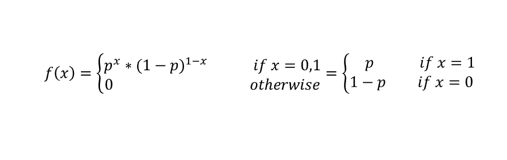

成功概率 p 是伯努利分布的参数，如果离散随机变量 X 遵循该分布，我们写为:

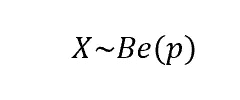

想象一下，你的实验由抛硬币组成，如果输出是尾巴，你就赢了。再者，既然硬币是公平的，你就知道有尾巴的概率是 p=1/2。因此，一旦设置 tail=1，head=0，就可以按如下方式计算成功的概率:

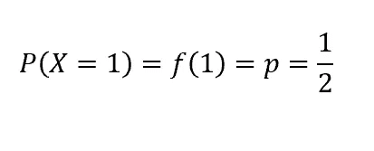

再一次，假设你要掷骰子，你把钱押在数字 1 上:因此，数字 1 将是你的成功(标为 1)，而任何其他数字都将是失败的(标为 0)。成功的概率是 1/6。如果你想计算失败的概率，你会这样做:

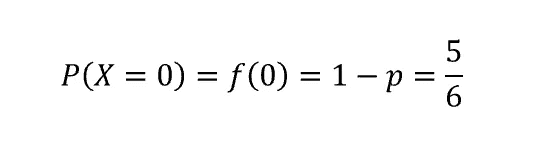

最后，让我们计算期望值(EV)和方差。已知离散随机变量的 EV 和 V 由下式给出:

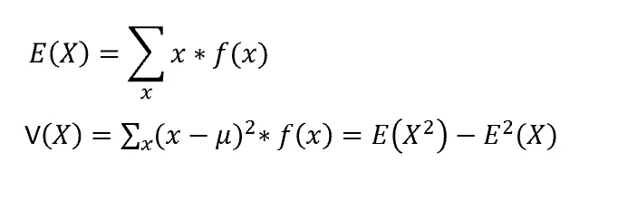

接下来，对于伯努利随机变量 *X* :

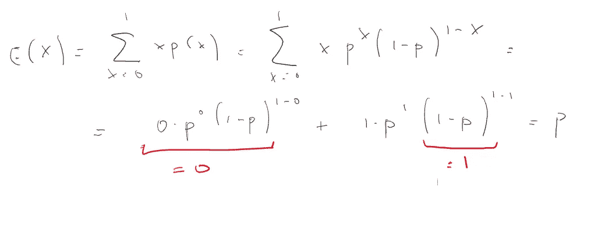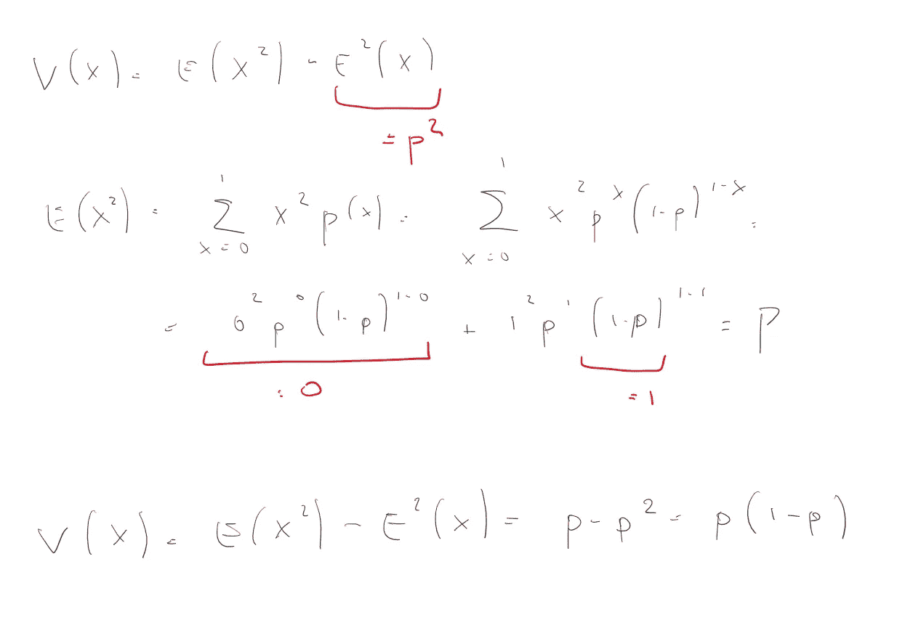

现在，伯努利分布背后的想法是，实验只重复一次。但是如果我们运行不止一个试验，假设试验是相互独立的，会发生什么呢？

## 二项分布

这个问题的答案是二项分布。这个分布描述了 *n* 个随机实验的输出行为，每个实验都有一个概率为 *p* 的伯努利分布。

让我们回忆一下之前抛公平硬币的例子。我们说过我们的实验包括抛一次硬币。现在让我们稍微修改一下，假设我们将掷硬币 5 次。在这些试验中，我们会有一些成功(尾部，标为 1)和一些失败(头部，标为 0)。每次试验都有 1/2 的成功概率和 1/2 的失败概率。我们可能有兴趣知道获得给定数量的成功的概率是多少。我们将如何进行？

让我们想象一下这个实验:

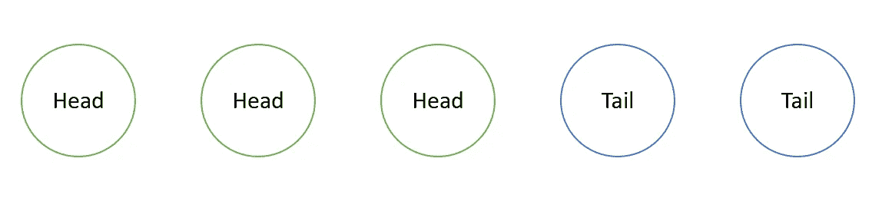

所以我们掷了 5 次硬币，前 3 次我们输了，后 2 次我们赢了。既然我们说成功=尾部=1，失败=头部=0，我们可以重新架构如下:

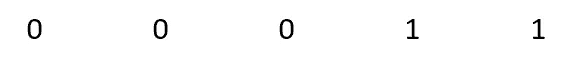

现在，每个试验都是一个伯努利随机变量，因此如果它等于 1，它的发生概率就是 p，否则就是 0。因此，如果我们想计算发生上述情况(3 次失败和 2 次成功)的概率*事前*，我们会得到这样的结果:

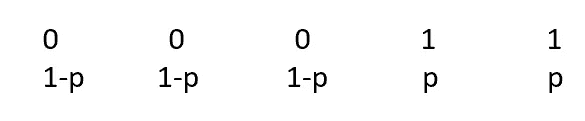

由于试验是相互独立的:

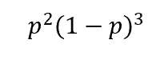

概括这一推理，如果我们已经进行了 *n* 次试验并取得了 *x* 次成功:

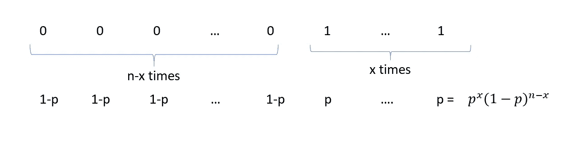

现在需要引入一个进一步的概念。实际上，到目前为止，我们已经计算了按照上面显示的顺序成功两次的概率。然而，由于我们对给定数量的成功感兴趣，而不考虑它们给我们的顺序，我们需要考虑所有可能的 x 次成功的组合。

也就是说，假设我们掷硬币三次，我们想计算三次试验中有一次出现尾巴的概率。因此，我们将在以下情况中胜出:

如你所见，有三种不同的结果组合会导致成功。我们如何将这一概念纳入我们的概率函数？答案是二项式系数，由下式给出:

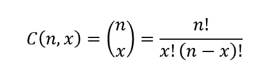

其中 *n* 是试验的次数，而 *x* 是我们想要知道发生概率的成功次数。

因此，当我们运行 *n 个*独立实验时，每个实验都有一个参数为 *p、*的伯努利分布，我们想知道有 x 个成功的概率，概率函数将是:

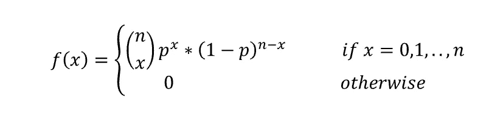

这样一个随机变量是这样表达的:

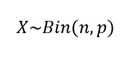

现在让我们计算 EV 和 v，首先回想一下，对于二项式定理:

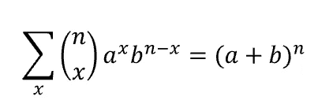

因此:

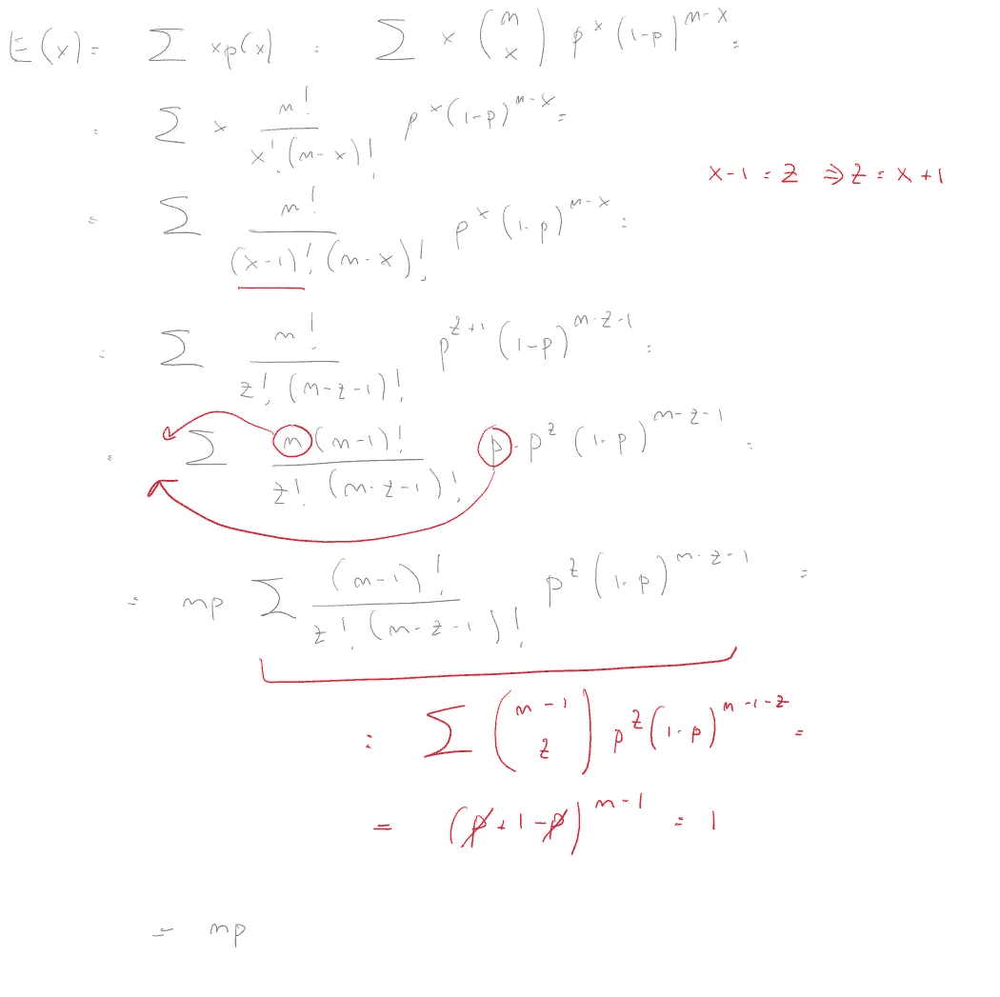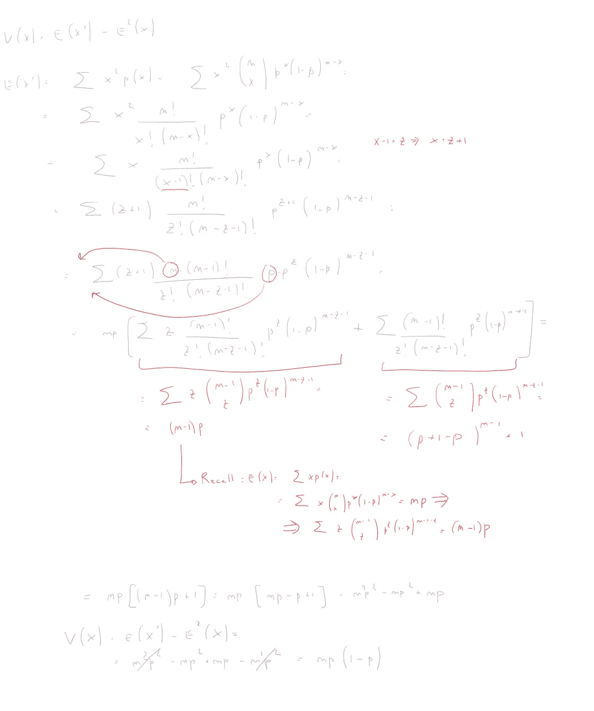

注意，如果二项式分布的 n=1(只进行试验)，那么它就变成了一个简单的伯努利分布。此外，二项式分布也很重要，因为如果 n 趋于无穷大，并且 p 和(1-p)都不是无限小的，那么它很接近高斯分布。因此，后者是二项分布的一种极限形式。

您可以很容易地将其形象化，如下所示:

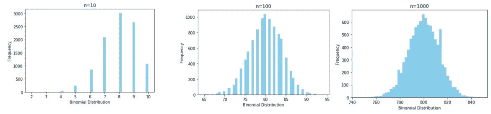

正如你所看到的，试验次数 n 越高，我们的二项随机变量的形状就越能回忆起众所周知的高斯分布的钟形曲线。

如果你对伯努利分布和二项式分布的所谓“对应物”感兴趣，它们是几何和逆二项式分布，请查看我的下一篇文章[这里](https://medium.com/@valentinaalto/understanding-geometric-and-inverse-binomial-distribution-ff30722e8bd1)！