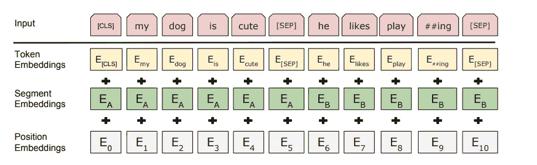
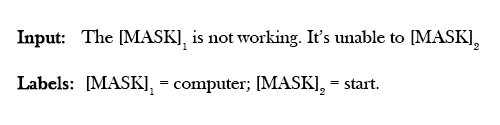
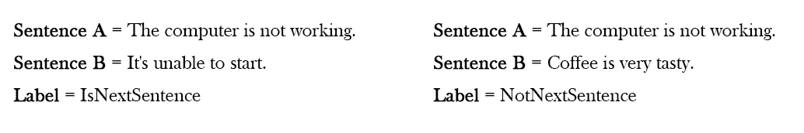
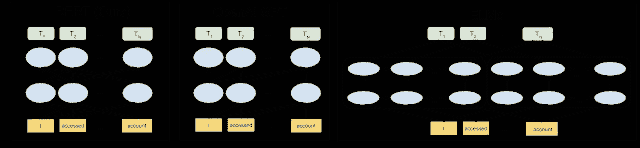
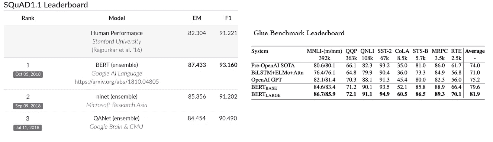

# 理解 BERT:它是 NLP 中的游戏改变者吗？

> 原文：<https://towardsdatascience.com/understanding-bert-is-it-a-game-changer-in-nlp-7cca943cf3ad?source=collection_archive---------1----------------------->

自然语言处理领域最具突破性的发展之一是由[伯特](https://ai.googleblog.com/2018/11/open-sourcing-bert-state-of-art-pre.html)的发布(*被认为是自然语言处理*的 ImageNet 时刻)，这是一个革命性的自然语言处理模型，与传统的自然语言处理模型相比是最棒的。它还启发了许多最近的 NLP 架构、训练方法和语言模型，如 Google 的 TransformerXL、OpenAI 的 GPT-2、ERNIE2.0、XLNet、RoBERTa 等。

让我们深入了解 BERT 及其转变 NLP 的潜力。

# **伯特是什么？**

**BERT(来自变压器的双向编码器表示)**是谷歌的研究人员在 2018 年开发的开源 NLP 预训练模型。作为 GPT(广义语言模型)的直接后裔，BERT 在 NLP 中的表现超过了几个模型，并在问答(SQuAD v1.1)、自然语言推理(MNLI)和其他框架中提供了顶级结果。

它建立在预训练上下文表示的基础上，包括[半监督序列学习(由 Andrew Dai 和 Quoc Le 完成)](https://arxiv.org/abs/1511.01432)、 [ELMo(由 Matthew Peters 和来自和 CSE 的研究人员完成)](https://arxiv.org/abs/1802.05365)、 [ULMFiT(由 fast.ai 创始人和 Sebastian Ruder 完成)](https://arxiv.org/abs/1801.06146)、[OpenAI Transformer(由 open ai 研究人员、Narasimhan、Salimans 和 Sutskever 完成)](https://s3-us-west-2.amazonaws.com/openai-assets/research-covers/language-unsupervised/language_understanding_paper.pdf)以及 Transformer ( [Vaswani](https://arxiv.org/pdf/1706.03762.pdf)

它与其他模型的独特之处在于，它是第一个深度双向、无监督的语言表示，仅使用纯文本语料库进行预训练。由于它是开源的，任何具有机器学习知识的人都可以很容易地建立 NLP 模型，而不需要为训练模型寻找大量数据集，从而节省时间、精力、知识和资源。

最后，BERT 在一个大型未标记文本语料库上接受预训练，其中包括整个**维基百科**(大约 25 亿字)和一本书语料库(8 亿字)。

# 它是如何工作的？

传统的上下文无关模型(如 word2vec 或 GloVe)为词汇表中的每个单词生成单个单词嵌入表示，这意味着单词**“右”**在“*我确定我是对的*”和“*向右转”中将具有相同的上下文无关表示。*“然而，BERT 将基于上一个和下一个上下文进行表示，使其成为双向的。虽然双向的概念已经存在很长时间了，但 BERT 是第一个在深度神经网络中成功预训练双向的。

## 他们是如何做到这一点的？

Source: [BERT](https://arxiv.org/abs/1810.04805) [Devlin et al., 2018]

他们使用两种策略——**屏蔽语言模型(MLM)**——通过屏蔽掉输入中的一些单词，然后双向调节每个单词来预测被屏蔽的单词。在将单词序列输入 BERT 之前，每个序列中 15%的单词被替换为一个[MASK]标记。然后，该模型尝试根据序列中其他未屏蔽单词提供的上下文来预测屏蔽单词的原始值。

第二种技术是**下一个句子预测(NSP)** ，在这里 BERT 学习对句子之间的关系进行建模。在训练过程中，模型接收句子对作为输入，并学习预测句子对中的第二个句子是否是原始文档中的后续句子。让我们考虑两个句子 A 和 B，B 是语料库中 A 后面的实际下一个句子，还是只是一个随机的句子？例如:

当训练 BERT 模型时，两种技术被一起训练，从而最小化两种策略的组合损失函数。

## **架构**

BERT is deeply bidirectional, OpenAI GPT is unidirectional, and ELMo is shallowly bidirectional. Image Source: Google AI Blog

BERT 架构建立在 Transformer 之上。有两种变型可供选择:

伯特基础:12 层(变压器块)，12 个注意头，和 1.1 亿个参数

BERT Large: 24 层(变压器块)，16 个注意头，3.4 亿个参数

## **结果**

在 [SQuAD v1.1](https://rajpurkar.github.io/SQuAD-explorer/) 上，BERT 获得了 93.2%的 F1 分数(一种准确性衡量标准)，超过了之前 91.6%的最高分数和 91.2%的人类水平分数:在极具挑战性的 GLUE benchmark(一组 9 个不同的自然语言理解(NLU)任务)上，BERT 还将最高分数提高了 7.6%。

# 伯特来了——但他准备好面对现实世界了吗？

BERT 无疑是机器学习用于自然语言处理的一个里程碑。但是我们需要反思如何在各种 NLP 场景中使用 BERT。

文本分类是自然语言处理的主要应用之一。例如，该概念已在票证工具中使用，以根据简短描述/电子邮件对票证进行分类，并将票证分类/发送给正确的团队进行解决。同样，它也可以用于分类电子邮件是否是垃圾邮件。

你可以在日常生活中找到它的一些应用。

Gmail’s Suggested Replies, Smart Compose & Google Search Autocomplete

聊天机器人凭借其回答用户查询和处理各种任务的能力，正在颠覆信息产业。然而，最大的限制之一是意图识别和从句子中捕获实体。

问答模型是自然语言处理的基本系统之一。在 QnA 中，基于机器学习的系统从知识库或文本段落中为作为输入提出的问题生成答案。BERT 可以用在聊天机器人中吗？当然可以。BERT 现在被用在许多对话式人工智能应用中。所以，你的聊天机器人应该变得更聪明。

然而，BERT 只能用于回答非常短的段落中的问题，并且需要解决许多关键问题。作为一项常规任务，NLP 太复杂了，有更多的含义和微妙之处。BERT 只解决了一部分问题，但肯定会很快改变实体识别模型。

今天的伯特只能解决有限的一类问题。然而，还有许多其他任务，如情感检测，分类，机器翻译，命名实体识别，摘要和问题回答需要建立。现在一个常见的批评是，这种任务是基于对表示的操纵，没有任何理解，添加简单的对抗性内容来修改原始内容会使其混淆。

只有在运营中得到更广泛的采用，现场场景得到改善，从而支持跨组织和用户的广泛应用时，才能实现 BERT 在 NLP 中的真正优势。

然而，随着一波基于变压器的方法(GPT-2，罗伯塔，XLNet)的出现，事情正在迅速变化，这些方法通过展示更好的性能或更容易的训练或其他一些特定的好处来不断提高标准。

让我们看看在伯特的介绍之后出现的其他一些发展

## **罗伯塔**

RoBERTa 由脸书开发，基于 BERT 的语言掩蔽策略，并修改了 BERT 中的一些关键超参数。为了改进训练过程，RoBERTa 从 BERT 的预训练中移除了下一句预测(NSP)任务，并引入了动态屏蔽，使得屏蔽的令牌在训练时期期间改变。它还在比 BERT 多一个数量级的数据上接受了更长时间的训练。

## **蒸馏酒**

由 HuggingFace 开发的 DistilBERT 学习了 BERT 的一个蒸馏(近似)版本，在 GLUE 上保留了 95%的性能，但只使用了一半数量的参数(只有 6600 万个参数，而不是 1.1 亿个)。这个概念是，一旦一个大的神经网络被训练，它的全部输出分布可以用一个较小的网络来近似(像后验近似)。

## **XLM/姆伯特**

由脸书开发的 XLM 使用已知的预处理技术(BPE)和双语言训练机制与 BERT 一起学习不同语言中单词之间的关系。在多语言分类任务中，该模型优于其他模型，并且当预训练的模型用于翻译模型的初始化时，显著提高了机器翻译。

## **艾伯特**

由谷歌研究院和丰田技术研究所联合开发的 **ALBERT(一个用于自我监督语言表示学习的 Lite BERT)**将成为 BERT 的继任者，它比 BERT 小得多，轻得多，也更智能。两个关键的架构变化使得 ALBERT 不仅表现出色，而且显著减小了模型的大小。第一个是参数的数量。它通过跨所有层共享所有参数来提高参数效率。这意味着前馈网络参数和注意力参数都是共享的。

研究人员还从词汇嵌入的大小中分离出隐藏层的大小。这是通过将一个热点向量投影到低维嵌入空间，然后投影到隐藏空间来实现的，这使得在不显著增加词汇嵌入的参数大小的情况下增加隐藏层大小变得更加容易。

谈到预训练，艾伯特有自己的训练方法，叫做**句序预测(SOP)** ，与 NSP 相反。作者提出的 NSP 理论的问题是，它将*主题*预测与*连贯性*预测混为一谈。

ALBERT 代表了 NLP 在几个基准上的新水平，以及参数效率的新水平。这是一个惊人的突破，它建立在 BERT 一年前所做的伟大工作的基础上，并在多个方面推进了 NLP。

伯特和像它这样的模型肯定是 NLP 的游戏规则改变者。机器现在可以更好地理解语音，并实时做出智能响应。许多基于 BERT 的模型正在开发中，包括 VideoBERT、ViLBERT(视觉和语言 BERT)、PatentBERT、DocBERT 等。

你对 NLP 和 BERT 的状态有什么看法？