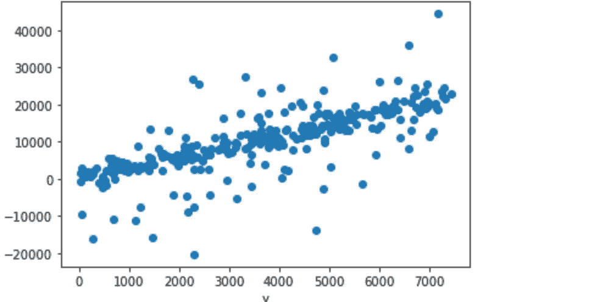
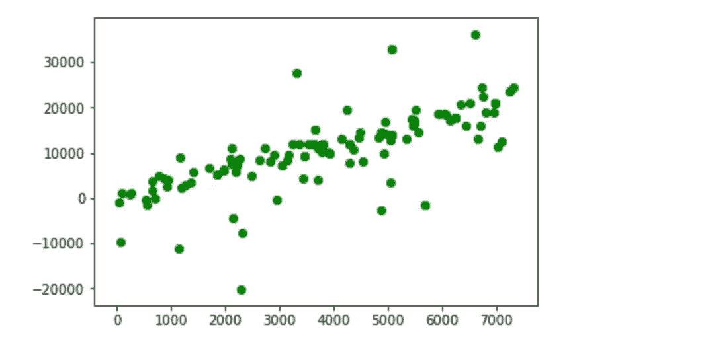
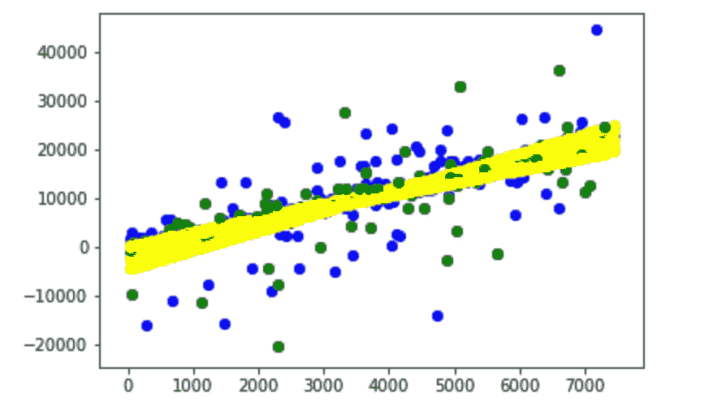

# 理解偏差和方差

> 原文：<https://towardsdatascience.com/understanding-bias-and-variance-25b079e6b44b?source=collection_archive---------30----------------------->

## 用一点插图和一点代码简化这些概念

任何学习数据科学 101 课程的人都会遇到这些定义机器学习模型准确性的术语偏差和方差。我发现它周围的一些材料令人困惑，所以我想我会尝试用一些插图和代码来解释。

在我开始写代码之前，基本上偏差只不过是应用于不同测试数据集时模型中的预期误差(误差的平均值)。让我用飞镖靶来类比。圆圈中的数字代表误差，直到圆圈的圆周处。

Board A

在电路板 A 中，平均误差或偏置等于(0 + 0 + 0 + 1 + 2) / 5 = 0.6

Board B

尽管电路板 B 看起来与电路板 A 不同，但它具有相同的平均误差或偏差= (0 + 0 + 1 + 1 + 1) / 5= 0.6

现在的问题是你会赌哪个飞镖手？一个使用板 A 或板 b，这就是差异的来源。

方差是应用于不同测试数据点时误差的方差。现在让我们分别用 A 板和 B 板试着把这个概念应用到两个投掷飞镖的人身上。

棋盘 A 的方差= (0 + 0 + 0 + 1 + 2 ) / 5 = 1.0

棋盘 B 的方差= (0 + 0 + 1 + 1 + 1 ) / 5 = 0.6

这表明，虽然板 A 飞镖投掷者击中靶心的次数比板 B 飞镖投掷者多 50%,但当他不正确时，他更加不稳定。另一方面，B 板飞镖手稳稳的，总是在靶心标上或靶心标周围盘旋。在机器学习模型的世界中，通常类似于棋盘 B 飞镖投掷者的模型是优选的，因为它避免了令人尴尬的错误并且更加稳定。

事实证明，类似于棋盘 B 的行为发生在过度拟合的机器学习模型中(相对于训练集过度拟合)，即，即使模型的偏差较低，方差也会较高。因此，差异越大，你就越担心把它推向生产，因为一旦出了问题，它会变得非常糟糕。

在一个没有过度拟合(可能是[正则化](/of-suppandi-regularization-and-lasso-the-feature-selector-2a09acfdbc1b?source=your_stories_page---------------------------))的模型中，方差将会很低——这意味着在测试集上遇到的错误不会是荒谬的。

我已经通过将线性和三次回归应用于具有随机扰动的线性数据集说明了这一点。

Universe of data points

Points sampled for training

Cubic regression

Linear Regression

浏览下面的代码(希望是不言自明的)将帮助您看到，尽管三次和线性回归的平均误差(偏差)有些相似(类似于我们的飞镖游戏)，但是三次回归的方差太高，这使它类似于 a 板上出色但不稳定的飞镖游戏。

在这种情况下，这意味着数据科学家应该选择线性回归模型来推广到生产中。

总之，作为数据科学家，重要的是不要看平均误差(偏差)，还要注意方差。方差越大，意味着虽然有些情况下模型是超级准确的，但也有一些情况下模型会出现严重错误，这是您希望避免的。