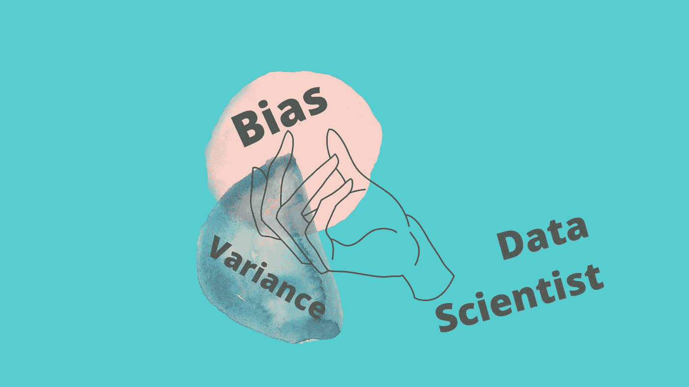
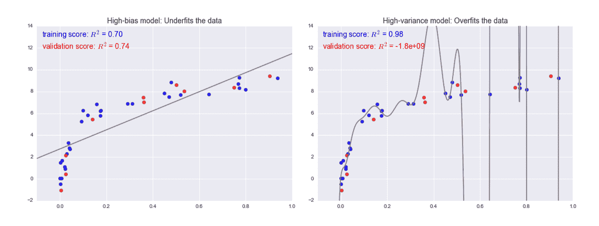

# 在 3 分钟内了解偏差-方差权衡

> 原文：<https://towardsdatascience.com/understanding-bias-variance-trade-off-in-3-minutes-c516cb013513?source=collection_archive---------29----------------------->

## 机器学习照明讲座—2019 年 10 月 11 日

Balancing them is like magic

> 躲在付费墙后面？[点击这里](/understanding-bias-variance-trade-off-in-3-minutes-c516cb013513?source=friends_link&sk=8f7d1597590e810ab42cd07c01ff9ab4)阅读完整的故事与我的朋友链接。

**偏差**和**方差**是在训练机器学习模型时要调整的**核心参数**。

当我们讨论预测模型时，**预测误差**可以分解成两个主要的子分量:由于**偏差、**造成的误差和由于**方差造成的误差。**

**偏差-方差权衡**是**偏差**引入的误差和方差产生的误差**之间的**张力**。为了理解如何最大限度地利用这种权衡，并避免我们的模型过拟合或欠拟合，让我们首先学习偏差方差。**

## 偏差引起的误差

由于 ***偏差*** 产生的误差是模型的预测值 和真实值 的 ***之间的距离。在这种类型的错误中，模型很少关注训练数据，并且 ***过度简化*** 模型，并且不学习模式。模型**通过**不考虑所有特征**来学习错误的关系*****

## **由于差异导致的误差**

给定数据点或数值的模型预测可变性 ***告诉我们数据的分布*** 。在这种类型的错误中，模型在训练数据 中花费了 l ***ot 的注意力，以至于记住它而不是从中学习。方差误差较大的模型不能灵活地对以前没有见过的数据进行归纳。***

> 如果偏见和差异是阅读的行为，那就像略读课文和记忆课文一样

我们希望我们的机器模型从它接触到的数据中学习，而不是*“知道它是关于什么的”*或*一个字一个字地记住它。*

# **偏差—方差权衡**

偏差-方差权衡是关于平衡，而 ***是关于在偏差引起的误差和*方差引起的误差*之间找到最佳平衡点*** 。

> 这是一个适配不足和适配过度的两难选择

Plot by Jake VanderPla

如果模型用灰色线表示，我们可以看到高偏差模型是一个过度简化数据的模型，而高方差模型是一个过于复杂而过度拟合数据的模型。

## **简而言之:**

*   **偏差**是模型做出的简化假设，使目标函数更容易逼近。
*   **方差**是在给定不同训练数据的情况下，目标函数的估计将改变的量。
*   **偏差-方差权衡**是我们的机器模型在偏差和方差引入的误差之间执行的最佳点。

*在本帖中，我们讨论了 c* ***偏差和方差的概念含义*** *。接下来，我们将探讨* ***代码中的概念。***

***未来阅读:***

[*理解偏差-方差权衡*](http://scott.fortmann-roe.com/docs/BiasVariance.html) 斯科特·福特曼-罗著

[*《统计学习的要素》*](https://web.stanford.edu/~hastie/ElemStatLearn/) 作者:特雷弗·哈斯蒂、罗伯特·蒂布拉尼和杰罗姆·弗里德曼