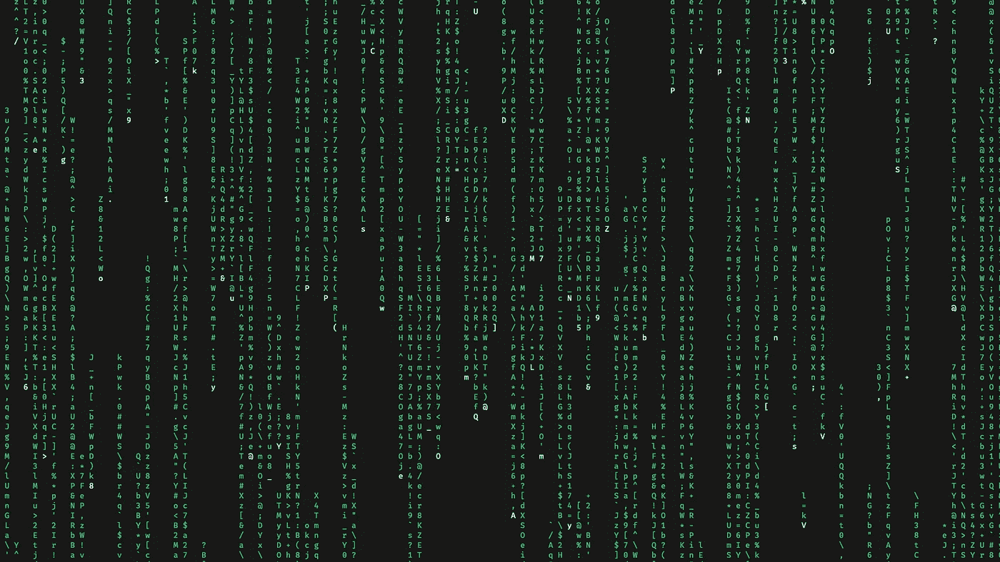
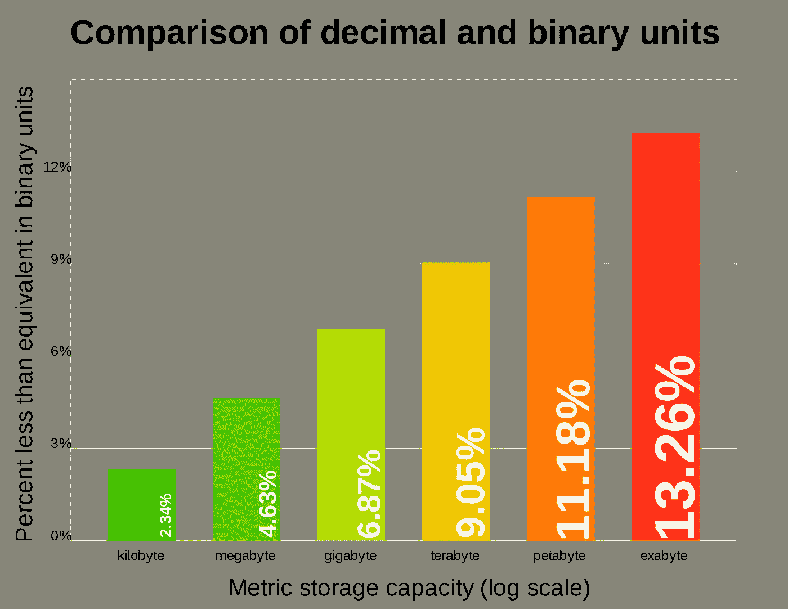
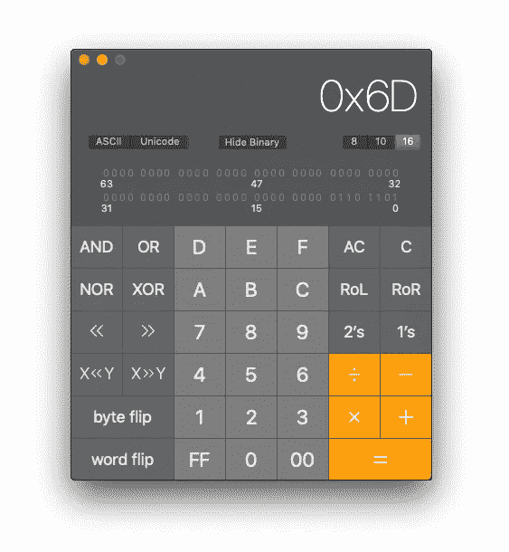
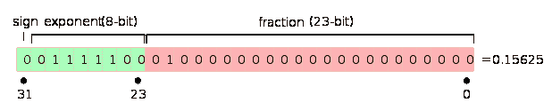

# 理解二进制数据

> 原文：<https://towardsdatascience.com/understanding-binary-data-fc4c78c9e677?source=collection_archive---------6----------------------->

让我们说些咒语。



“You get used to it, I don’t even see the code, All I see is blond, brunette, redhead”

在这篇文章中，我解释了真实存在于我们电脑中的数据。如果你想知道 1 和 0 的序列是如何产生有意义的信息的，这篇文章就是为你准备的。

# 比特和字节

计算机中的所有数据都表示为一系列 1 和 0。取决于数据存储的位置—内存、固态硬盘、硬盘、DVD 等。—1 和 0 的物理编码不同，但从概念上讲，它们是两种不同的状态——这就是全部。


Hard drives and computer memory just stores ones and zeros. Photo by [Patrick Lindenberg](https://unsplash.com/@heapdump?utm_source=medium&utm_medium=referral) on [Unsplash](https://unsplash.com?utm_source=medium&utm_medium=referral)

一个这样的数据片段——0 或 1——被称为 ***位*** 。八位组成一个 ***字节*** 。字节作为一个单元是相关的，因为——一般来说——它们是最小的可寻址内存单元。

假设你有 40 位数据，那么 5 个字节:

`01001000``01100101 01101100``01101100`

您可以通过指定从起始点的偏移量来请求读取或写入其中一个字节的数据。你总是一次读或写一个完整的字节，而不是单个的位。因此，除了压缩机制之外，大多数信息都是以字节为基本单位进行编码的，而不是以比特为单位。

> 顺便说一句，在文章的最后你将能够回到上面的 40 位，并弄清楚它们的意思。当你到了那里，试着回来看看。你会想出办法的。我保证。

# 为什么一个字节是 8 位，而不是 10 位？

历史和现实的原因交织在一起。

我会试着暗示潜在的实际问题。让我们后退一步:对我们来说，乘以或除以 10 的幂是微不足道的，只需添加零或移动小数点，对吗？

`3.1415 ✕ 100 = 314.15`

这在我们的十进制系统中是正确的——一个基于 10 的幂的数字系统。

计算机内部做二进制运算。二进制算术以 2 的幂为基础。在二进制算术中，像 8 = 2 这样的 2 的幂同样方便。

让我们看一个二进制算术的例子:

`13 ✕ 8 = 104`对应`00001101 ✕ 1000 = 01101000`

它只是将输入向左移动三位。先不要试图理解编码。只要注意到结果是通过将数字向左移动而简单地计算出来的。

总之:如果数据单元的大小是 2 的幂，比如 8 = 2，那么计算机需要做的许多内部计算就比其他情况简单得多。

# 一千字节有多少字节？

好问题。没有关于千字节、兆字节、千兆字节等的官方标准。直到 1998 年。然而，这些设备在技术人员和消费者中被广泛使用。你买了一个硬盘，它的大小以千兆字节为单位。

技术人员正在计算 2 ⁰ =每千字节 1024 字节，每兆字节 1024 千字节，每千兆字节 1024 兆字节，等等。正如我们所了解的，当你使用计算机内存时，2 的幂是很实用的。

众所周知，销售硬盘的营销人员有一个巧妙的想法，即缺乏官方标准，他们可以声称“他们的”单位是基于 1000，因此“他们的”千兆字节是 1000 = 1，000，000，000 字节——而不是 1024 = 1，073，741，824，这样他们就可以[在空间上少给你](https://en.wikipedia.org/wiki/Binary_prefix)一笔钱。驱动力越大，差异越大。



您购买了 500GB 的硬盘，并一直想知道为什么您的计算机一直声称它只有 465.66 GB。

嗯，[标准化最终于 1998 年发生](https://en.wikipedia.org/wiki/Mebibyte)。可惜的是，企业贪婪成为了官方标准，原来基于 2 ⁰=1024 的单位变成了‘bi’单位: [kibibytes，mebibytes，gibibytes](https://en.wikipedia.org/wiki/Binary_prefix) 等。更糟糕的是，通常的缩写形式，KB，MB，GB 等。也被吸引住了。最初的 base-2 单位现在是 KiB、MiB 和 GiB。


It’s kibibytes, not kilobytes. You’re a professional. Sound like a Teletubbie!

在学术界之外，大多数技术人员仍然认为一千字节是 1024 字节。软件世界分裂了，一些公司开始采用这个“标准”，一些没有。有些让你选择。


For me, kilobytes will also always have 1024 bytes. Byte me!

但是我跑题了。

# 剖析一个字节

让我们来看一个样本字节值:`01101101`

大声读出该值，并根据记忆重复一遍。不太容易，是吧？

当与人类交流二进制数据时，1 和 0 的效率非常低。让我们将一个字节值分成两组，每组 4 位——这些组被称为[半字节](https://en.wikipedia.org/wiki/Nibble)——并为一个半字节可以采用的所有位模式分配一个符号。

我们可以开始使用符号来代替位模式。我们的字节值`01101101`变成了`6D`。

这被称为十六进制记法，简称 hex，因为有 16 种不同的符号。此外，由于十进制数可能会产生歧义，因此十六进制值通常会以 0x 作为前缀来消除这种歧义。所以我们在看`0x6D`。

这还不是一种解释，只是一种更简洁的方式来书写和表达价值。

# 解释二进制数据

无论 1 和 0 代表什么，都完全取决于上下文。


> “那么 0x6D 的信息量是多少呢？”
> 
> “这是一种 1 和 0 的模式”
> 
> “是啊，但这意味着什么？”
> 
> “这只是 1 和 0”
> 
> “我明白了”

如果您将 0x6D 解释为一个 [ASCII 字符](https://www.asciitable.xyz/)，它将是`m`。如果你把它解释为一个二进制补码数，那么它就是 T1。如果你要把它解释成一个有三个小数的[定点数](http://www-inst.eecs.berkeley.edu/~cs61c/sp06/handout/fixedpt.html)，那就是`13.625`。

当给定一段二进制数据时，通常必须给出上下文才能理解它。对于文本文件来说，它是[编码](https://en.wikipedia.org/wiki/Character_encoding)，目前主要是[UTF-8](https://en.wikipedia.org/wiki/UTF-8)——一种兼容 [ASCII](https://en.wikipedia.org/wiki/ASCII) 的文本字符编码。对于其他类型的文件，比如说 PNG 文件，你必须在相应的[文件格式规范](https://www.w3.org/TR/2003/REC-PNG-20031110)中查找数据的含义。

# 二进制整数

一个字节(或一个字节序列)的第一种和默认解释是正整数。在解释字节值时，文档通常暗示您知道如何将字节作为整数读取。

**来自 PNG 文件格式规范:**

> " PNG 数据流的前八个字节总是包含下列(十进制)值:
> 
> 137 80 78 71 13 10 26 10"

那么…这些十进制值的位模式是什么？暂时还是坚持我们的`0x6D`值吧。我们会找到答案的。十六进制值`0x6D`就是数字`109`，但是我怎么知道这个呢？

我们习惯于十进制系统。但是选择`10`作为基数和`0–9`作为数字是完全任意的。

> 我们只是手上有 10 个手指的动物，这使得数量在计算时既熟悉又方便——比如牲畜或大米袋。数字 10 本身并不特别，只是对我们人类来说很实用。

## 十进制系统

当我们写下数字时，我们写下一个范围在`0-9`内的数字，代表我们的基数`10`的每个幂，从右边的 10⁰开始。我们在左边增加了 10 的额外幂的数字，只要我们需要它们来表达我们的数字。

numbers in the decimal system

## 八进制系统

我们可以用更小的基数`8`来代替使用数字`0–7`。它被称为八进制系统。这不是一个完全虚构的例子。其实是用过的。也许你已经在 Linux 系统上的[文件权限](https://en.wikipedia.org/wiki/File_system_permissions#Numeric_notation)的上下文中见过了。正如十六进制数通常以 0x 为前缀以消除歧义一样，八进制数通常以 0 为前缀。

numbers in the octal system

## 十六进制系统

所以我们把基数从 10 降到了 8。我们也可以上去，去说基地`16`。不过，我们会在数字上遇到麻烦。

我们需要`0–15`和过去 9 的数字，我们没有既定的惯例。让我们使用十六进制数字:`A=10, B=11, C=12, D=13, E=14, F=15`

numbers in the hexadecimal system

## 二进制

只要我们手头有商定的数字，基数的选择完全是任意的。让我们完全简化，使用基数`2`，数字`0–1`。

numbers in the binary system

## 整数摘要

现在你可以看到`01101101`、`0x6D`和`109 are`对同一个整数的不同表示法。现在看一下像这样的 ASCII 表[应该就明白了，它们是用各种格式索引的。这只是一种礼貌，所以你可以在手边的任何系统中使用索引来查找这个字符。](https://www.asciitable.xyz/)

# 二进制文本

打开一个文本编辑编辑器，创建一个新文件，把“Hello World”放进去，保存为一个简单的文本文件。

现在得到一个十六进制编辑器。十六进制编辑器只是一个文件编辑器，它不会为您解释文件的内容——它只是向您显示原始的二进制内容。任何基本的免费十六进制编辑器都可以。你也可以使用[在线十六进制编辑器](https://hexed.it/)。

在十六进制编辑器中打开文本文件。它会显示文件的二进制内容。它应该看起来像这样。


binary contents of a simple text file

十六进制编辑器通常显示三列:从文件开始的偏移量(通常是十六进制)、文件的二进制内容(也是十六进制)，第三列显示被解释为 [ASCII](https://en.wikipedia.org/wiki/ASCII) 字符的文件字节。

如果您的文件内容在开头有一些额外的字节，很可能您的文本编辑器在您的文件中保存了一个 [BOM](https://en.wikipedia.org/wiki/Byte_order_mark) 。别担心。

> 还记得我们之前的 40 比特吗？你现在知道了你需要弄清楚它说什么的一切。
> 
> `01001000``01100101 01101100``01101100`

# 更深入

我们已经有了基本的东西。以下每个主题都值得写一篇自己的文章。但是我们已经在空间、时间和读者的注意力上捉襟见肘了，所以我把你引向稍后阅读的资源。

我知道你还有疑问！🤓

# 固有整数

到目前为止，我们只讨论了正整数，一次只讨论一个字节。但是…

> “编码大于 255 的整数怎么样？一个字节中没有足够的位来存储更高的值。而负数呢？”

好问题。您使用固定长度的连续字节—通常是 2 字节、4 字节和 8 字节—这扩展了 2 的幂。对有符号整数使用[二进制补码](https://en.wikipedia.org/wiki/Two%27s_complement)编码。

大多数非玩具计算器带有正常的、科学的和程序员的观点。在研究这些东西时，打开计算器上的“程序员视角”。



A “Programmer” view of your system calculator probably supports hex and binary views

一旦你开始使用不止一个字节来表示一个值，[字节序](https://en.wikipedia.org/wiki/Endianness)就变得很重要，尤其是从文件或网络中读取字节时，所以要记住这一点。

# 分数

到目前为止，我们只讨论了整数。关于:

> π=3.1415926535…

有一个[标准化的](https://en.wikipedia.org/wiki/IEEE_754)，硬件支持浮点小数的表示。最常用的版本是 4 字节单精度，通常称为'[浮点型](https://en.wikipedia.org/wiki/Single-precision_floating-point_format)'，以及 8 字节版本，通常称为'[双精度型](https://en.wikipedia.org/wiki/Double-precision_floating-point_format)'。



The interpretation of bits in a 4 byte a float

大致思路如下:

符号存储在最左边的位。0 代表正数，1 表示负数。我们的示例编号是正数。

红色阴影表示一个分数，即`1`加上所选的负 2 次方的和——如二分之一、四分之一、八分之一等。…在上面的示例中，我们仅在四分之一位置设置了一个位。所以分数是`1.25`

请注意，分数将始终介于`1.0`和`2.0`之间。

在下一步中，您将计算由绿色阴影部分给出的指数。我们的指数是`124`。标准要求我们将分数乘以`2^(exp-127)`，所以在我们的例子中，我们乘以`2^-3 = 1/8`。

最后，我们的位模式编码的数字是:

`1.25 × 1/8 = 0,15625`

您可能想知道如何使用这种编码有效地将十进制数转换为浮点数。在实践中，您永远不需要手动操作，生态系统——就像您的编程语言标准库——会为您处理好。

哦，关于π，试着解释一下这个模式:

```
0 10000000 10010010000111111011011
```

你可能也想知道对小数的近似有多精确，现在我们用的是 1/2 而不是 1/10。[很多人做](https://stackoverflow.com/questions/588004/is-floating-point-math-broken)，连做[的那帮家伙都比](https://docs.microsoft.com/en-us/office/troubleshoot/excel/floating-point-arithmetic-inaccurate-result)优秀。

# 结论

我们的数据只是 1 和 0。它被分组和解释的方式使它有意义。在这种情况下，如果您曾经被要求处理二进制数据，您现在应该有足够的信息来正确理解它所附带的文档。

为了测试你的理解，试着看一下[形状文件格式规范](https://www.esri.com/library/whitepapers/pdfs/shapefile.pdf)，看看它是否有意义。


Photo by [Scott Blake](https://unsplash.com/@sunburned_surveyor?utm_source=medium&utm_medium=referral) on [Unsplash](https://unsplash.com?utm_source=medium&utm_medium=referral)