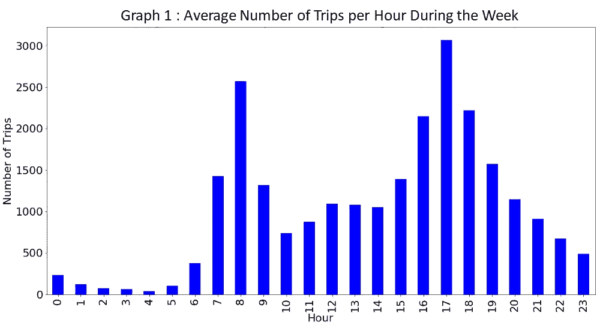
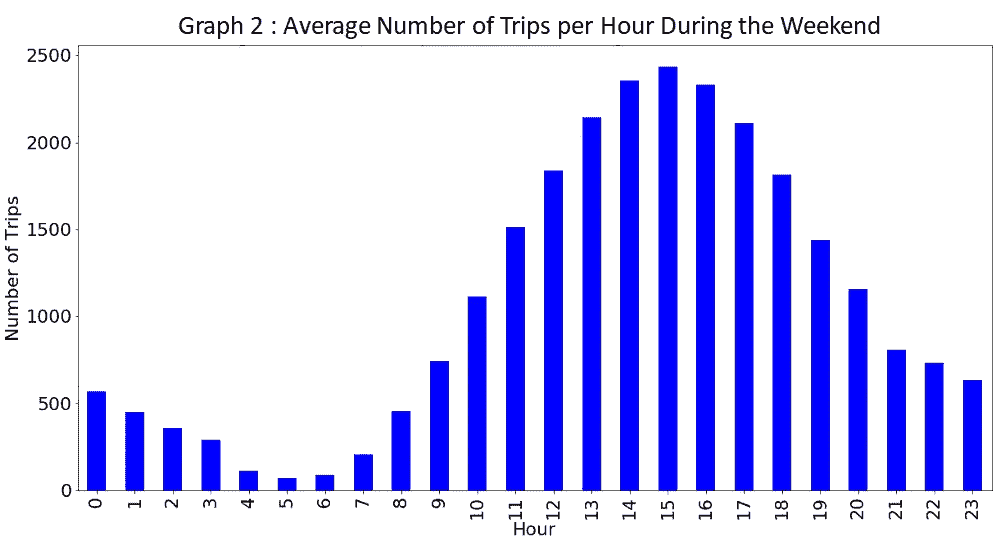
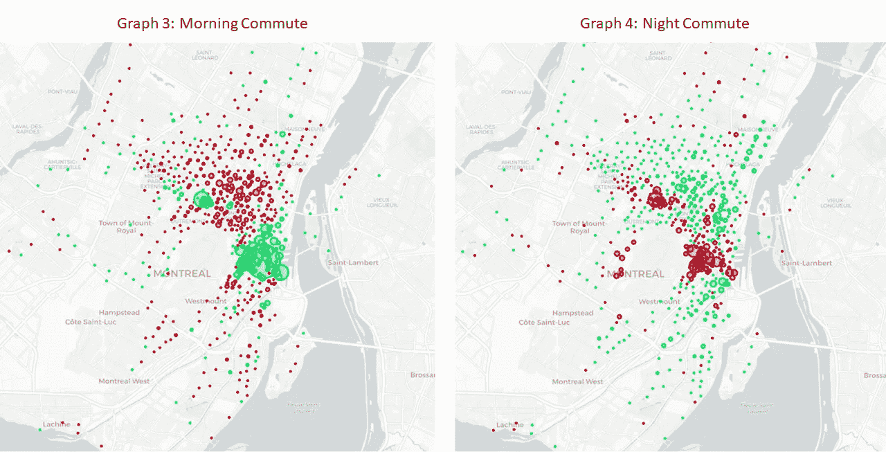
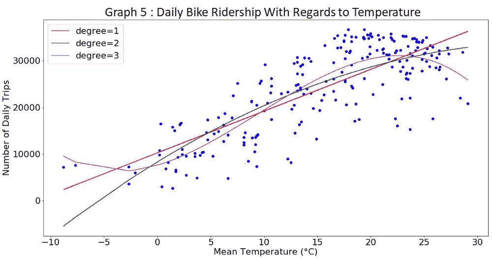
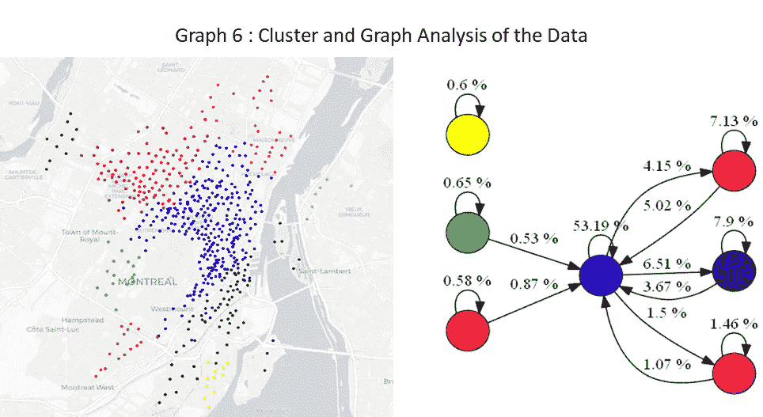

# 理解碧溪通勤者:用 Python 分析蒙特利尔的自行车共享系统

> 原文：<https://towardsdatascience.com/understanding-bixi-commuters-an-analysis-of-montreals-bike-share-system-in-python-cb34de0e2304?source=collection_archive---------20----------------------->

蒙特利尔的自行车共享系统 BIXI 于 2009 年问世。当时，这是自行车共享系统的早期尝试之一。它的模型后来被出口到世界其他城市，如纽约和伦敦。作为一名蒙特利尔人、自行车爱好者和软件工程学生，我很好奇去探索其[公开可用的数据](https://montreal.bixi.com/en/open-data)，所以我下载了【2018 年以来的 530 万次 BIXI 旅行。

通过此分析，您将了解蒙特利尔人何时何地使用碧溪自行车，气温等因素如何影响骑行量，以及骑行量在社区内和社区间如何变化。在接下来的部分中，我将更详细地介绍这些见解和代码(可在 [GitHub](https://github.com/grego10/bixi) 上获得):

1.  数据
2.  乘客偷看，想象全天的交通流量
3.  ****高峰时段**通勤者的空间**进出流量****
4.  **预测骑行习惯和**温度**之间的**或**关系**
5.  ****数据的聚类和图形分析****

# **数据**

**BIXI 提供的两个数据集:**

**车站:**

*   **密码**
*   **名字**
*   **纬度**
*   **经度**

**旅行:**

*   **开始日期**
*   **起点站代码**
*   **结束日期**
*   **终点站代码**
*   **持续时间秒**
*   **是成员**

**我开始使用 2019 年 5 月的数据进行分析，以评估全天的客流量和地点(第 2 节和第 3 节)。然后使用 2018 年全年的数据将乘客量与温度相关联，并根据我需要的更多粒度形成聚类(第 4 和第 5 节)。**

**在清理数据时，持续时间不到 2 分钟的行程被删除，因为任何人都很难在这么短的时间内到达另一个站点。**

**每个月的数据发布在不同的 csv 文件中，但是可以使用 Pandas(一个用于数据操作的 python 库)轻松合并这些数据。它预装了 Anaconda。Pandas 也在整个项目中使用，因为它使操作数据成为一个用户友好的过程。代码读取并合并 2018 年与熊猫的所有数据。**

```
import pandas as pd#read CSV file
def read_trips():

 data_files = glob.glob(‘data2018/OD_2018-*.csv’)
 li = []
 for filename in data_files:
 df = pd.read_csv(filename, index_col=None, header=0)
 li.append(df)

 #convert argument to datetime
 data = pd.concat(li, axis=0, ignore_index=True)
 data[‘start_date’] = pd.to_datetime(data[‘start_date’], format=’%Y-%m-%d’, errors=’coerce’)
 data[‘end_date’] = pd.to_datetime(data[‘end_date’], format=’%Y-%m-%d’, errors=’coerce’)

 #filtering out trips that were less than 2 min
 data = data.drop(data[data[‘duration_sec’] < 120].index)

 #adding a day number column to identify days of the week
 data[‘day_number’] =   pd.to_datetime(data[‘start_date’]).dt.dayofweek
 data = data.drop(data[data[‘day_number’].isin([5, 6])].index)

 return data
```

# **可视化全天的交通状况**

**首先要调查的是 BIXI 用户的个人资料。通过绘制数据可以看出，该系统在一周内的使用量比周末多。此外，通过查看一周中的使用高峰(图 1)，可以假设许多**用户通过使用 BIXIs** 在早上 7 点到 9 点之间上下班，在下午 4 点到 6 点之间下班。在周末(图 2)，分布更加平稳，用户大多在下午骑自行车，这可能表明骑自行车的人使用 BIXIs 进行休闲。**

********

**通过使用 python 库 Pandas 处理数据并使用 Matplotlib 绘制数据，很容易创建这样的可视化，如下所示。**

```
import pandas as pd
import matplotlib.pyplot as plt#creates a bar chart with the departures per hour during the week
def visualizePerHourWeek(data, column_name, color=’#0000FF’, title=’Avreage Number of Trips Per Hour During the Week — May 2019'):

 dataWeek = data.drop(data[data[‘week_day_b’] == 0].index)
 plt.figure(figsize=(20, 10))
 ax = ((dataWeek[column_name].groupby(dataWeek[column_name].dt.hour)
 .count())/23).plot(kind=”bar”, color=color)

 ax.set_xlabel('Hour')
 ax.set_ylabel('Number of Trips')
 ax.set_title(title)
 plt.rcParams.update({‘font.size’: 22})
 plt.show()
```

# **高峰时间通勤者的空间流入和流出**

**查看一周内每小时出行次数的条形图，通过尝试确定 BIXI 骑手在早上和晚上往返的区域来完善这一分析是很有趣的。**

**为此，计算了 2019 年 5 月每个车站的净流入量。出行净流入量由特定时间窗口内某个站点的进入出行量减去离开出行量确定。**绿色站点有净流入量，红色站点有净流出量**。圆圈的大小基于净流入或流出流量计数。**

**查看下图(图 3 和图 4)可以看到**用户主要在一英里终点**进出市区。这并不奇怪，因为这些地区有很多办公室。**

****

**Each circle is a station. **Red stations** have a net outflux of trips. **Green stations** have a net influx of trips. The **size of the circle is [= (trips in — trips out)].** The analysis was performed for May 2019.**

**上面的可视化效果是使用 were 创建的。Folium 允许用户创建地理可视化，它可以使用 pip 安装。上面的可视化效果是使用下面的代码创建的。应当注意，传递给该功能的数据帧包含与特定时隙的每个站相关的净流入或流出流量。**

```
import folium
def densityMap(stations):

 #generate a new map
 Montreal = [45.508154, -73.587450]
 map = folium.Map(location = Montreal,
 zoom_start = 12,
 tiles = “CartoDB positron”)

 #calculate stations radius
 stations[‘radius’] = pd.Series( index=data.index)
 stations[‘radius’] = np.abs(stations[‘net_departures’])
 stations[‘radius’] = stations[‘radius’].astype(float) #set stations color
 stations[‘color’] = ‘#E80018’ # red 
 stations.loc[stations[‘net_departures’].between(-10000,0), ‘color’] = ‘#00E85C’ # green

 lat = stations[‘latitude’].values
 lon = stations[‘longitude’].values
 name = stations[‘name’].values
 rad = stations[‘radius’].values
 color = stations[‘color’].values
 net_dep = stations[‘net_departures’]

 #populate map
 for _lat, _lon, _rad, _color, _name, _nd in zip(lat, lon, rad, color, name, net_dep):
  folium.Circle(location = [_lat,_lon], 
  radius = _rad/5,
  color = _color,
  tooltip = _name + “ / net. dep:” +str(_nd),
  fill = True).add_to(map)

 #save map
 f = ‘maps/map_density.html’
 map.save(f)
```

# **骑车习惯与温度的相关性**

**现在已经确定骑自行车的人使用 BIXI 上下班，让我们看看其他的预测因素。蒙特利尔是一个温度变化很大的城市，夏天很容易达到 30 摄氏度，冬天则低至零下 30 摄氏度。来自碧溪的自行车在 11 月从街上拿走，然后在 4 月被带回来。值得一问的是，温度在多大程度上预测了网络的使用情况。**

****

**Each dot is the count of trips on a given day in 2018**

**从上面的图中可以看出，随着气温变暖，日客流量增加**，预计出行次数在 0 到 20 摄氏度之间增加了两倍，从 10，000 次增加到 30，000 次**。可以认为，三次多项式回归提供了这种情况下的最佳拟合，因为人们会预计，随着温度接近冰点，日客流量将保持较低水平。当气温变暖时，日客流量会迅速增加，但当天气太热时，客流量会停滞甚至下降。从图上看，每天的旅行次数似乎在 22 摄氏度左右开始减少。这种减少也可能是因为人们在炎热的月份里度假。**

**从 R 平方得分可以看出，70%的可变性是用三阶多项式回归的温度来解释的，其他要考虑的因素可能是周末与一周。我也尝试过关联离地铁站的距离，但结果并不确定。**

```
Variance r2 score linear: 0.63
Variance r2 score poly2: 0.65
Variance r2 score poly3: 0.70
```

**可以使用库 Sklearn 在 python 中执行回归。用于该分析的日平均温度来自加拿大政府的公开的[数据集](http://climate.weather.gc.ca/climate_data/daily_data_e.html?StationID=51157)。下面是用来执行这个线性回归的代码。**

```
import matplotlib.pyplot as plt
from sklearn.linear_model import LinearRegression
from sklearn.preprocessing import PolynomialFeatures
from sklearn.metrics import r2_scoredef scatterPlot(dataDay):

 X = dataDay[[‘Mean Temp (°C)’]].values
 X_1 = dataDay[[‘Mean Temp (°C)’]].values
 X_2 = dataDay[[‘Mean Temp (°C)’]].values
 X_3 = dataDay[[‘Mean Temp (°C)’]].values
 Y = dataDay[[‘departures_cnt’]].values

 #Linear regression
 linear_regressor = LinearRegression()
 linear_regressor.fit(X, Y)
 Y_pred_linear = linear_regressor.predict(X)
 print(‘Variance score linear: %.2f’ % r2_score(Y, Y_pred_linear))

 #polynmial degree 2 regression
 polynomial_feat = PolynomialFeatures(degree=2)
 x_poly_2 = polynomial_feat.fit_transform(X)
 polynomial_regressor = LinearRegression()
 polynomial_regressor.fit(x_poly_2, Y)

 Y_pred_poly_2 = polynomial_regressor.predict(x_poly_2)
 print(‘Variance score poly2: %.2f’ % r2_score(Y, Y_pred_poly_2))

 #polynmial degree 3 regression
 polynomial_feat_3 = PolynomialFeatures(degree=3)
 x_poly_3 = polynomial_feat_3.fit_transform(X)
 polynomial_regressor_3 = LinearRegression()
 polynomial_regressor_3.fit(x_poly_3, Y)

 Y_pred_poly_3 = polynomial_regressor_3.predict(x_poly_3)
 print(‘Variance score poly3: %.2f’ % r2_score(Y, Y_pred_poly_3))#Ploting the data
 plt.figure(figsize=(20, 10))
 plt.title(‘Daily Bike Ridership With Regards to Temperature’)
 plt.scatter(X_1,Y,c=’blue’,marker=’o’)
 plt.xlabel(‘Mean Temperature (°C)’)
 plt.ylabel(‘Number of Daily Trips’)
 plt.plot(X_1, Y_pred_linear, color=’red’)

 sort_axis = operator.itemgetter(0)
 sorted_zip = sorted(zip(X_2,Y_pred_poly_2), key=sort_axis)
 X_2, Y_pred_poly_2 = zip(*sorted_zip)
 plt.plot(X_2, Y_pred_poly_2, color=’green’)

 sort_axis = operator.itemgetter(0)
 sorted_zip = sorted(zip(X_3,Y_pred_poly_3), key=sort_axis)
 X_3, Y_pred_poly_3 = zip(*sorted_zip)
 plt.plot(X_3, Y_pred_poly_3, color=’magenta’)

 plt.plot(X_1, Y_pred_linear, ‘-r’, label=’degree=1') 
 plt.plot(X_2, Y_pred_poly_2, ‘-g’, label=’degree=2') 
 plt.plot(X_3, Y_pred_poly_3, ‘-m’, label=’degree=3')
 plt.legend(loc=’upper left’)

 plt.rcParams.update({‘font.size’: 22})
 plt.show()
```

# **数据的聚类和图形分析**

**此分析的最后一部分是关于估计整个网络的流量。为了做到这一点，这些站点形成了光谱簇。谱聚类是一种来自图论的技术。它试图通过使用连接节点的边来识别节点组，在这种情况下是站点，在这种情况下是行程。为此，它最大限度地减少不同集群之间的出行次数，最大限度地增加集群内部的出行次数。最后，它给出了骑车人从车站骑车时所处地理区域的概念。**

**从下面的地图可以看出，2018 年 53%的出行发生在蓝色集群内，表明网络中的大部分交通发生在高原社区和市中心之间。此外**可以看出，大多数集群由地理特征界定，这些地理特征通常是高速公路或火车轨道。**例如，红色和蓝色集群之间的分裂主要发生在火车轨道上。此外，市中心区和老港口社区沿着 Ville-Marie 高速公路分为蓝色和紫色两部分。**

****

****Each dot on the map is a station and its color identifies to cluster to which it pertains**. On the graph on the right the color of the nodes identifies the cluster and the **vertices identify the percentage of the traffic that occurred within or between clusters** in 2018\. for Instance 5.02% or the traffic occurred from a red station to a blue station in 2018\. Edges representing less than 0.5% of yearly traffic have been removed.**

**查看下图，我们可以假设，为了促进蒙特利尔的自行车运动，该市应该投资巩固自行车爱好者已经存在的网络，在这种情况下，蓝色集群，并促进与其他集群的联系。例如，**城市应该确保在蓝色集群中有安全的自行车道可用，骑车人也可以高效、安全地穿过高速公路或火车轨道，这些道路会将他们与其他相邻集群隔开。****

**上面的图形分析是使用库 fleur 和库 Graphviz 中的 Diagraph 进行的。这两者都必须使用 pip 安装。地图的绘制与上面的相似。使用 Pandas 数据框，通过下面的代码可以快速生成 Graphviz。**

```
def create_graphviz(data):
 #create the graph
 G = Digraph(format=’png’)
 G.attr(rankdir=’LR’, size=’10')
 G.attr(‘node’, shape=’circle’)
 nodelist = [] #prepare the data
 data = data.drop([‘count’], axis=1)
 data[‘from’] = pd.to_numeric(data[‘from’], downcast=’integer’)
 data[‘to’] = pd.to_numeric(data[‘to’], downcast=’integer’)
 data[‘from’] = data[‘from’].apply(str)
 data[‘to’] = data[‘to’].apply(str)
 #add the nodes and edges to the graph 
 for idx, row in data.iterrows():
  node1, node2, weight = [str(i) for i in row] if node1 not in nodelist:
   G.node(node1)
   nodelist.append(node2)
  if node2 not in nodelist:
   G.node(node2)
   nodelist.append(node2) #transform the edge label to XX,XX% format
  percent = float(weight)
  percent = percent*100
  percent = round(percent, 2)
  percent = str(percent)
  G.edge(node1,node2, label = (“”+ percent +” %”)) #show graph
 G.render(‘bixi_graph’, view=True)
```

# **结论**

**总之，这一探索性分析是使用 2018 年和 2019 年 5 月的 BIXI 数据进行的。人们已经看到通勤者在工作日使用碧溪上下班，周末使用碧溪休闲。此外，网络的使用受到温度的严重影响，因为天气变冷时用户会减少。此外，大部分网络用户仍然停留在市中心、高原和周边地区。这可能是因为地理障碍，如高速公路和火车轨道，使得他们很难通勤到附近的社区。**

**进一步的分析也有助于了解趋势和模式，例如用户在早上和晚上通勤的具体路径。这也将为自行车手对自行车道网络的需求提供深刻的见解。访问站点容量等其他数据将有助于更好地了解网络的局限性和重新平衡的需求(通过卡车将自行车运送到其他站点)。因此，描绘一幅完整的形势图，以优化蒙特利尔的 BIXI 和自行车运动。**

**最后，我要感谢其他开发者和作家，他们用自己的分析启发了我的工作，更具体地说是[托德·w·施耐德](https://github.com/toddwschneider)、[伊登·奥](https://edenau.github.io/visualize-bike-mobility/)和[乔恩·诺德比](https://github.com/jonnor)。**