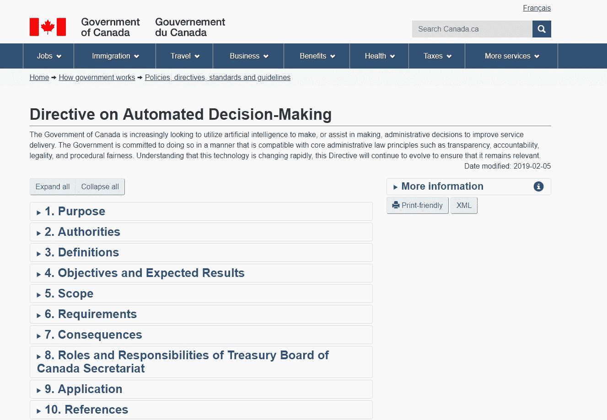
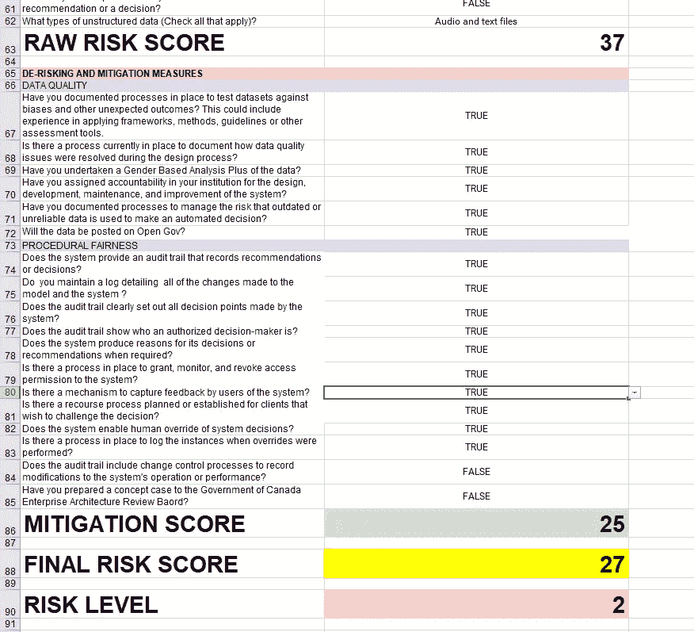

# 了解加拿大的算法影响评估工具

> 原文：<https://towardsdatascience.com/understanding-canadas-algorithmic-impact-assessment-tool-cd0d3c8cafab?source=collection_archive---------21----------------------->

## 这是与联邦政府做生意的必备条件

From [Unsplash](https://unsplash.com/photos/z21Lwed8Js8).

(注:我不隶属于加拿大联邦政府。我们的公司是一家 [*合格的 AI 厂商*](https://buyandsell.gc.ca/procurement-data/tender-notice/PW-EE-017-34526) *，但是我这篇文章的目标仅仅是展示如何解释和执行我认为将是任何厂商项目向前发展的强制性要求。)*

随着最近新的加拿大政府的[预先合格的人工智能供应商名单](https://buyandsell.gc.ca/procurement-data/tender-notice/PW-EE-017-34526)和关于自动决策的[指令](https://www.tbs-sct.gc.ca/pol/doc-eng.aspx?id=32592)的出现，已经投入了同等的努力来刺激护栏内的创新，这似乎是一个充满政府创新的未来。

这种方法的基础是一个(某种程度上)集中的框架，它允许技术人员和非技术人员就部署的解决方案的可持续性和长期影响以及他们在各自组织中的角色进行透明的讨论。

虽然领导和执行团队的努力值得称赞，但是有可能扩展它的覆盖范围，以帮助确保高度技术性的项目的更少的长期暴露。经过一定的修改(见下文)，我建议您在自己的项目中使用该工具，以帮助确保商业和生产准备就绪，无论政府是否参与。

# 背景

已经有一篇[透彻的文章解释了算法影响评估需求背后的基本原理](https://medium.com/@supergovernance/the-government-of-canadas-algorithmic-impact-assessment-take-two-8a22a87acf6f)，所以这里是关键的要点:

*   早在 2018 年 12 月，财政委员会秘书处更新了他们关于自动化决策的[任务](https://docs.google.com/document/d/1LdciG-UYeokx3U7ZzRng3u4T3IHrBXXk9JddjjueQok/edit?usp=sharing)。
*   开发该工具是为了帮助组织“通过提供适当的治理、监督和报告以及审计要求，更好地理解和减轻与自动化决策(ADM)系统相关的风险。”(摘自[超治篇](https://medium.com/@supergovernance/the-government-of-canadas-algorithmic-impact-assessment-take-two-8a22a87acf6f))。)
*   从 2019 年 2 月开始，有一个不言而喻的期望，即任何政府实体都将使用该工具(或其版本)来监督、控制和缓解 ADM 系统部署的潜在问题。

The [website of the ADM directive](https://www.tbs-sct.gc.ca/pol/doc-eng.aspx?id=32592) as it came out in February 2019.

## 等等——财政委员会秘书处是做什么的？

对于加拿大以外的人来说(即使是在加拿大境内，也不直接与联邦政府打交道)，国库委员会秘书处有点像一个神话人物。

[The TBS website.](https://www.canada.ca/en/treasury-board-secretariat.html)

尽管它的主要任务是“就政府如何在项目和服务上花钱向财政部长委员会提供咨询和建议”(来自[网站](https://www.canada.ca/en/treasury-board-secretariat.html))，但它不同于[英国内阁办公室](https://www.gov.uk/government/organisations/cabinet-office)和[美国创新办公室](https://en.wikipedia.org/wiki/Office_of_American_Innovation)。它列出了下列义务:

*   政府开支和运作的透明度
*   政策、标准、指令和指南
*   开放式政府
*   公共服务的创新
*   公共服务的价值观和道德
*   公共服务中的专业发展

这不同于你的标准行政部门。他们正在通过加速和简化政府职能来试验和寻找为加拿大人服务的新方法。现在不用看政治，你就能明白为什么他们非常适合在政府内部颁布使用人工智能的最佳实践。

# 工具——保险清单

算法影响评估工具是一种记分卡，旨在引起人们对可能被忽略的设计和部署决策的注意。它提出了许多关于为什么、做什么以及如何建立一个系统的问题，以避免陷阱和问题(以及对政府的潜在指责，这在选举季节总是一个风险)。

这个工具可以在 github.io 上交互使用[,从一开始就已经做了大量的修改。这无疑是对其早期](https://canada-ca.github.io/aia-eia-js/)[基于 Excel 的记分卡](https://open.canada.ca/data/dataset/748a97fb-6714-41ef-9fb8-637a0b8e0da1/resource/d1733817-60ab-4cc8-8621-521b9ddc047f/download/aiaen.xlsx)(可从 AIA [原始网站](https://open.canada.ca/data/en/dataset/748a97fb-6714-41ef-9fb8-637a0b8e0da1)获得)的升级。该工具的新版本与现有的和未来的政府政策更加紧密地联系在一起，因此为了清楚起见，让我们探讨一下早期版本。

The clumsy-but-specific spreadsheet-based system.

主要影响评估包括 4 个主要部分:

*   **商业案例。**你是想加快速度吗？您是否正在尝试清理积压的活动？你正在努力使你的组织现代化吗？
*   **系统概述。**主要的技术基础是什么？图像识别、文本分析，还是流程和工作流自动化？
*   **决策失察。**它是否与健康、经济利益、社会援助、出入和流动性或许可证和执照有关？
*   **数据源。**是否来自多个来源？它是否依赖于个人(潜在可识别的)信息？安全分类是什么，由谁控制？

这些支票避免了明显的“我认为这很酷”的问题，浪费了金钱。它还意外地设定了衡量成功的总体标准，通常与部门的关键绩效指标挂钩。

(关于新友邦保险的完整问题列表，您可以参考 [github repo](https://github.com/canada-ca/aia-eia-js/) 的问卷调查的 [raw JSON](https://github.com/canada-ca/aia-eia-js/blob/master/src/survey-enfr.json) 。)

# 好的，坏的和丑陋的

这篇文章的大部分内容是对所完成的工作的持续缓慢的点头，就像有人向米开朗基罗竖起大拇指让他继续前进。下面列出了需要更多注意的几点。

## 好的—最佳实践在前面和中间

很多问题涵盖了这个工具应该涵盖的内容。它询问临时部署的关键功能，以便进行检查和平衡。以下是一些例子:

> "你会维护一个日志，详细记录对模型和系统所做的所有更改吗？"
> 
> "当需要时，系统能够为它的决定或建议提供理由吗？"
> 
> “是否有授予、监控和撤销系统访问权限的流程？(是/否)"
> 
> “该系统是否允许人工干预系统决策？是否有适当的流程来记录执行覆盖时的实例？”

太好了，这正是它需要问的。但是仍然有很多东西需要修复。

## 不好的方面——缺乏量化或精确性

当我们使用记分卡时，不强迫回答的能力会比仅仅填补空白更有帮助。以下是一些例子:

> “决策的风险很高吗？(是/否)"
> 
> “决策对个人经济利益的影响可能是:(很少或没有影响/中度影响/高度影响/非常高度影响)”
> 
> “在你的机构中，你是否对系统的设计、开发、维护和改进赋予了责任？(是/否)"

现在，“利害关系”、“风险”和“责任”可以在每个部门的基础上量化和定义，但我希望看到一个标准的定义(如 [ISO 的影响与概率计算](https://www.iso.org/iso-31000-risk-management.html))。

还有一个让我有点困惑的令人惊讶的问题:

> “您是否有记录在案的流程来针对偏见和其他意外结果测试数据集？这可能包括应用框架、方法、准则或其他评估工具的经验。”

这就是这个工具的目的。我承认其崇高的包罗万象的性质不允许每一种可能的情况下的细节，但至少应该提到或提及“这是你如何知道你在正确的轨道上”的参考。

## 丑陋的政治化

与旧版本相比，这是该工具当前版本令我惊讶的一个方面。它旨在帮助各部门为现在和即将成为公民的人提供更好的服务，而不是通过不搅动罐子来帮助一个政党获得或保持权力。问题是:

> “项目是否处于公众严格审查(例如，出于隐私考虑)和/或频繁诉讼的范围内？”

虽然我知道，从表面上看，这似乎是一个适当的问题，但这样一个问题的历史背景确实有很多政治含义。(对于那些好奇的人来说，首席审计员称联邦雇员的薪资改革是一次“[不可理解的失败](https://www.theregister.co.uk/2018/05/29/canada_phoenix_payroll_system_audit/)”。值得带着一袋爆米花去读。)

如果某个特定的领域受到公众的密切关注，并且经常被提起诉讼，那么它就应该被更新和创新。

我真心希望我读错了。我不希望政府内部的创新能力被政治动荡拖慢[。](https://www.aljazeera.com/news/2019/01/gov-shutdown-long-affected-190107150120233.html)

# 面向未来的约定

在不影响到目前为止在建立一个全面彻底的框架方面所做的巨大努力的情况下，我建议修改检查表，添加以下内容。

## 1.对问题的简单修改

将许多是/否问题移到“示范”文档中，有助于更彻底地检查解决方案。例如:

*   Change " *您会开发一个流程*来记录数据质量问题在设计过程中是如何解决的吗？"to " *您计划如何*记录和传达已发现的数据质量问题？"
*   "*您是否在您的机构中分配了*系统设计、开发、维护和改进的责任？"应该变成“*谁*是系统的设计、开发、维护、*修复、重构、*和改进的责任方？”
*   "*您是否有*记录在案的流程来测试数据集是否存在偏差和其他意外结果？"可以"*针对偏见和其他意外结果测试数据集的所有*记录流程是什么？

## 2.长期所有权和变革管理

谁将拥有算法？该工具现在有一个简单的责任问题。然而，我的好朋友 Jen 说，最好的流程和技术是那些像员工一样管理的流程和技术:它们在某人的监督下，并且有明确的成功衡量标准。因此:

*   谁来维护？此人/这些人的工作职责是否已更新，以包括此特定系统？
*   就人员、预算和时间而言，未来用于维护 it 的资源有多少？
*   是否为预期的技术变化制定了维护计划？(至少每季度或每两年*一次*。)

## 3.翻译和评估成功的衡量标准

我过去曾在智能系统环境中谈论过[“正确构建事物”与“构建正确的事物”，深受 ISO 13485](/implementing-defensive-design-in-ai-deployments-fc8fdff11c27) 的启发。这适用于功能系统与业务案例脱节的情况，因为它在技术上得到了维护(例如，本周发布的 VueJS 的任何版本)，但没有重新处理以回答核心组织问题。

如果没有对每个团队和部门如何建立和度量进展(更不用说成功)的清晰理解，就不可能评估一个系统是否在不投入大量资金的情况下产生了实质性的差异。

花额外的一两个月时间为项目构建定制的记分卡，这样在初始部署后就不会出现太多意外。

# 结论

AIA 工具满足了政府创新任务中的一个关键需求，即建立探索性项目的监督机制。

具有讽刺意味的是，目前与该工具相关的最大风险与它试图评估的每个项目相同——好主意，糟糕的执行。在这种特殊情况下，执行是关于更新和教育的，这样每个人都知道什么是向前发展的最佳实践集。

如果应用正确，这个工具将确保您的项目可以承受未来几年，而不需要在更具支持性的基础上从头开始重建。如果做错了，貌似合理的否认会导致诉讼(或者更糟)，所以现在就花额外的时间来确保你的项目有一个坚实的基础。

*如果您对本文或我们的 AI 咨询框架有其他问题，请随时通过*[***LinkedIn***](https://www.linkedin.com/in/mnlemay/)**或通过* [***电子邮件***](mailto:matt@lemay.ai) *联系。**

## *你可能喜欢的其他文章*

*   *[实施企业人工智能战略](/implementing-a-corporate-ai-strategy-a64e641384c8)*
*   *[在人工智能部署中实施防御性设计](/implementing-defensive-design-in-ai-deployments-fc8fdff11c27)*
*   *[离群点感知聚类:超越 K 均值](/outlier-aware-clustering-beyond-k-means-76f7bf8b4899)*
*   *[深度学习图像分类器的罗夏测试](/rorschach-tests-for-deep-learning-image-classifiers-68c019fcc9a9)*
*   *[为客户提供人工智能原型作为营销策略](/ai-prototypes-for-clients-as-a-marketing-strategy-70de404d27b5)*

*我的首席技术官丹尼尔·夏皮罗(Daniel Shapiro)的其他文章您可能会喜欢:*

*   *[人工智能和不良数据](/artificial-intelligence-and-bad-data-fbf2564c541a)*
*   *[人工智能:超参数](/artificial-intelligence-hyperparameters-48fa29daa516)*
*   *[人工智能:让你的用户给你的数据贴标签](https://medium.com/towards-data-science/artificial-intelligence-get-your-users-to-label-your-data-b5fa7c0c9e00)*