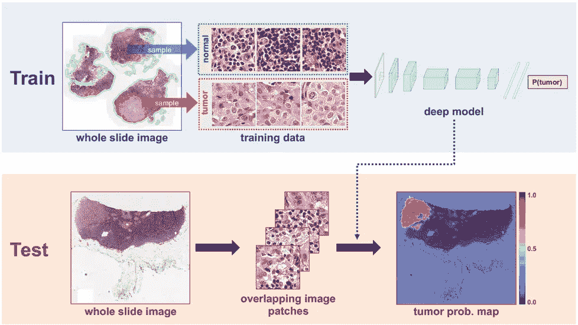
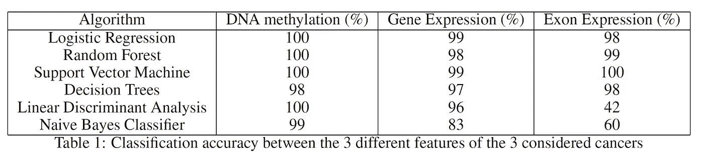
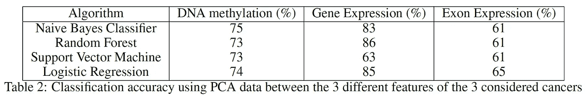
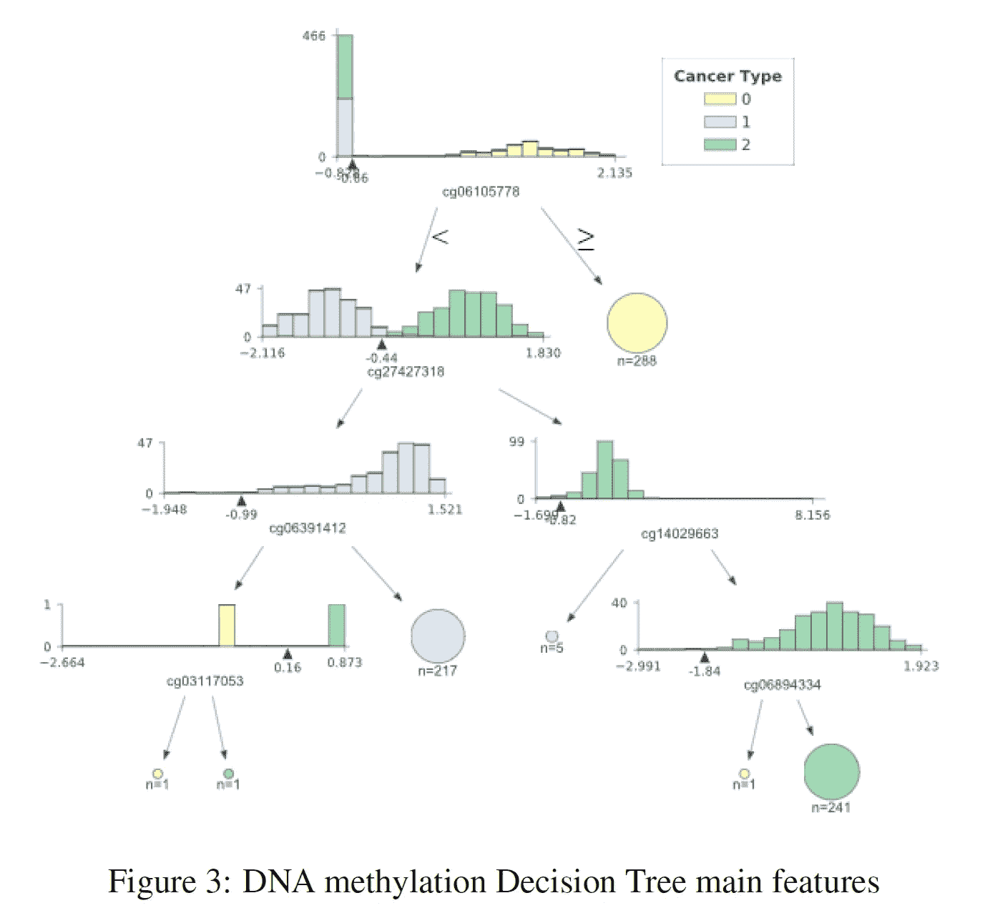
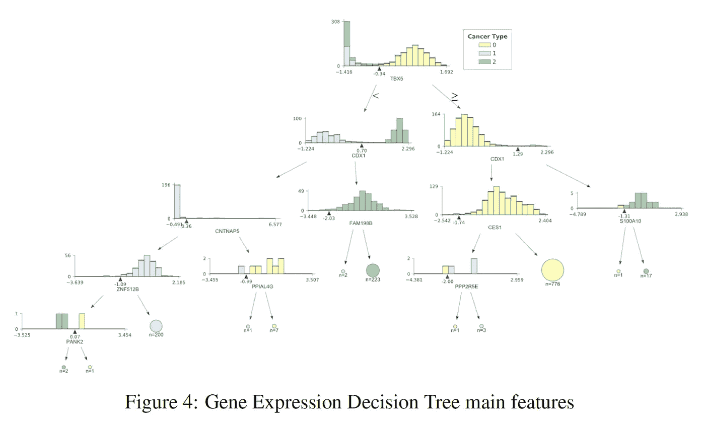
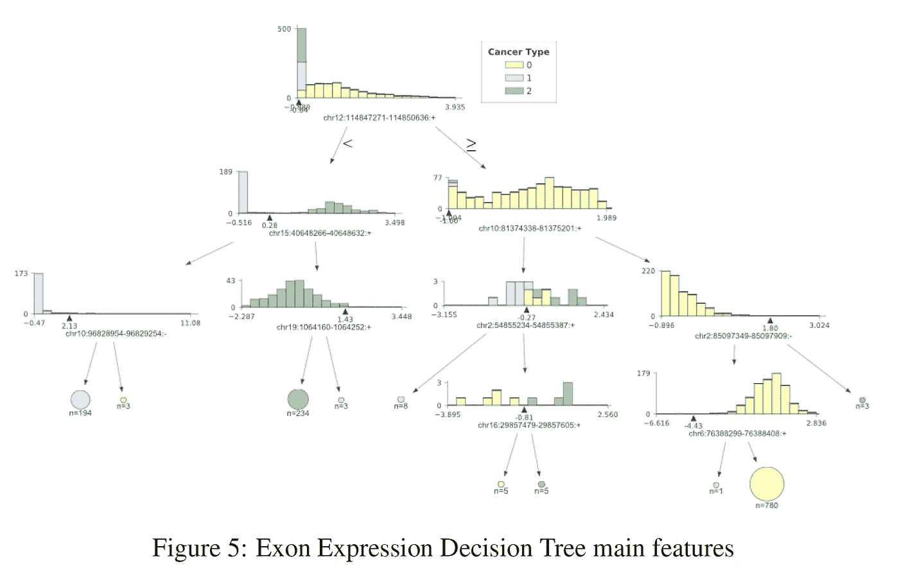
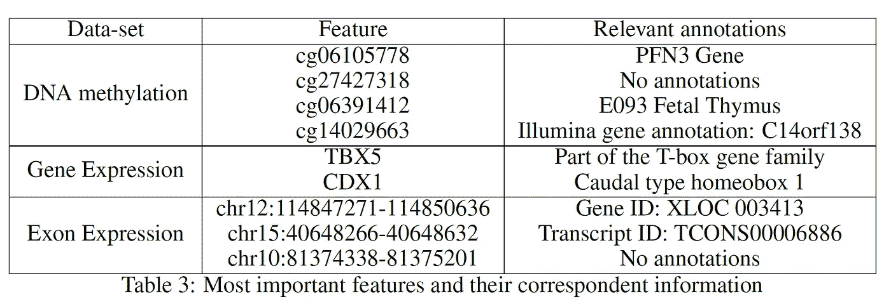

# 使用机器学习了解癌症

> 原文：<https://towardsdatascience.com/understanding-cancer-using-machine-learning-84087258ee18?source=collection_archive---------11----------------------->

## 机器学习(ML)在医学中的应用变得越来越重要。一个应用实例可以是癌症检测和分析。

(Source: [https://news.developer.nvidia.com/wp-content/uploads/2016/06/DL-Breast-Cancer-Detection-Image.png](https://news.developer.nvidia.com/wp-content/uploads/2016/06/DL-Breast-Cancer-Detection-Image.png))

***注来自《走向数据科学》的编辑:*** *虽然我们允许独立作者根据我们的* [*规则和指导方针*](/questions-96667b06af5) *发表文章，但我们不认可每个作者的贡献。你不应该在没有寻求专业建议的情况下依赖一个作者的作品。详见我们的* [*读者术语*](/readers-terms-b5d780a700a4) *。*

# 介绍

正如许多研究人员所证明的[1，2]，机器学习(ML)在医学中的应用现在变得越来越重要。研究人员现在将 ML 用于 EEG 分析和癌症检测/分析等应用中。例如，通过检查生物数据，如 DNA 甲基化和 RNA 测序，就有可能推断哪些基因会导致癌症，哪些基因反而能够抑制其表达。在这篇文章中，我将向你介绍我是如何检查关于 TCGA 肝癌、宫颈癌和结肠癌的 9 个不同数据集的。所有的数据集都是由 UCSC 谢轩(加州大学圣克鲁兹分校网站)提供的。对于所考虑的 3 种不同类型的癌症中的每一种，使用了三个数据集，包含关于 DNA 甲基化(甲基化 450k)、基因表达 RNAseq (IlluminaHiSeq)和最终外显子表达 RNAseq (IlluminaHiSeq)的信息。然后，这些数据集按信息类型而不是按癌症进行分组。我决定使用这些数据集，因为它们具有所有的共同特征，并且共享相似数量的样本。此外，我决定选择这些类型的癌症，因为它们提供了人体基因和染色体特征的不同观点，因为不同的癌症位于身体的不同部位。这样，在这项工作中获得的分类结果可以推广到其他形式的癌症。DNA 甲基化在基因表达的调节中起着重要作用，其修饰可以导致癌细胞的产生或抑制[3]。

# 分类

每个数据集都必须进行转置和预处理。在形成最终的三个数据集之后，进行不同类型癌症之间的分类。为了产生这些结果，使用了 70%训练，30%测试的分割比率。如表 1 所示，考虑了许多分类算法。这些结果是利用整个数据集和旨在正确区分三种不同类型癌症的分类器获得的。

# 特征抽出

我对 3 个给定的数据集执行了主成分分析(PCA ),以查看仅使用前两个主成分会如何影响分类精度结果(表 2)。主成分分析旨在降低数据集的维数，同时尽可能多地保留方差。从表 2 中可以注意到，将数据维数减少到两个特征并没有导致准确性的急剧下降。

图 1 提供了使用逻辑回归的 PCA 分类结果，两个轴代表 PCA 产生的两个主要成分。外显子表达数据集似乎受五氯苯甲醚的影响最大，最高准确率为 65%。这一结果的原因是不同类别之间的主要重叠，如图 1(c)所示。

最后，我决定应用另一种特征提取技术，如 t-SNE。这种技术可以实现将高维数据可视化到低维空间中，从而最大化不同类别之间的分离。结果如图 2 所示，双轴代表由 t-SNE 设计的两个主要组件。三种不同类型的癌症中的每一种都用不同的颜色标记(TCGA 肝癌= 0，宫颈癌= 1，结肠癌= 2)。从图 2 中可以看出，t-SNE 创造了两个能够很好地区分三个不同类别的特征。

# 特征选择

前面几节向我们展示了使用整个数据集可以获得非常好的分类结果。使用特征提取技术，如主成分分析和 t-SNE，已经表明有可能减少维数，同时仍然产生可观的分类分数。由于这些结果，我决定绘制一个决策树，代表分类中使用的主要特征(权重最大的特征)，以便更仔细地研究最重要的特征。由于决策树在所有三个数据集中的分类性能，我决定使用决策树进行分析。结果见图 3 (DNA 甲基化)、图 4(基因表达)和图 5(外显子表达)。

在每个图中，不同的癌症类型用不同的颜色表示(TCGA 肝癌= 0，宫颈癌= 1，结肠癌= 2)。所有三种癌症的特征分布都表示在树的起始节点中。只要我们向下移动每个分支，算法就会尝试使用每个节点图下面描述的功能来最好地分离不同的分布。沿着分布生成的圆表示在跟随某个节点之后被正确分类的元素的数量，元素的数量越大，圆的大小就越大。

为了生成这些图形，我使用了 Terence Parr 和 Prince Grover 创建的 dtreeviz.trees 库。我决定使用这个库，因为它使我能够可视化树的每个分支中的特性分布。当试图分析类别之间的差异以及观察算法如何做出分类决策时，这在生物学领域可能特别重要。

# 估价

表 3 总结了三个不同树的顶部(前两层)使用的特性。经过仔细研究，查看在线可用数据库，为每个特性添加了一系列相关注释(表 3)。对于 cg27427318 和 chr 10:81374338–81375201，无法找到任何相关信息。

从分析的特征中推断出的一些最有趣的结果是:

1.  PFN3 已被鉴定为与 cg06105778 最接近的基因。根据邹丽、丁志杰等人在 2010 年进行的一项研究，轮廓蛋白(Pfns)可能被归类为乳腺癌中的一种肿瘤抑制蛋白[4]。
2.  根据诺埃尔·j·埃亨、古汉·兰加斯瓦米等人的“Holt-Oram 综合征男性前列腺癌:TBX5 突变的首次临床关联”，TBX5 基因“被认为在突变时上调肿瘤细胞增殖和转移”[5]。Yu J，Ma X 等人的另一项研究证明，患有 TBX5 结肠癌的患者存活率低得多[6]。
3.  Alexa Hryniuk、Stephanie Grainger 等人开展的研究强调，“Cdx1 的缺失导致远端结肠肿瘤发病率显著增加”[7]。

仅使用表 3 中列出的各个数据集的特征，我最终决定使用 PCA 和线性判别分析(LDA)将数据减少到二维，并执行朴素贝叶斯(NB)和支持向量机(SVM)分类，以查看覆盖了多少数据方差。结果如表 4 所示，该表显示，仅使用数据集中最重要的特征即可获得出色的分类结果(由于噪声降低)。在所有考虑的情况下，原始数据差异的 83%到 99%被保留。

# 结论

总来说，这个项目产生了很好的结果。作为进一步的发展，尝试替代的特征选择技术，如递归特征选择(RFS)或 SVM(如我的另一篇文章中所解释的),看看是否可以识别其他类型的基因/染色体，这将是有趣的。这种分析的另一个可能的改进是使用包含来自健康受试者的数据的数据集来交叉验证所获得的结果。

我要感谢 Adam Prugel-Bennett 教授给我这个机会来实施这个项目。

# 联系人

如果你想了解我最新的文章和项目[，请通过媒体](https://medium.com/@pierpaoloippolito28?source=post_page---------------------------)关注我，并订阅我的[邮件列表](http://eepurl.com/gwO-Dr?source=post_page---------------------------)。以下是我的一些联系人详细信息:

*   [领英](https://uk.linkedin.com/in/pier-paolo-ippolito-202917146?source=post_page---------------------------)
*   [个人博客](https://pierpaolo28.github.io/blog/?source=post_page---------------------------)
*   [个人网站](https://pierpaolo28.github.io/?source=post_page---------------------------)
*   [中等轮廓](https://towardsdatascience.com/@pierpaoloippolito28?source=post_page---------------------------)
*   [GitHub](https://github.com/pierpaolo28?source=post_page---------------------------)
*   [卡格尔](https://www.kaggle.com/pierpaolo28?source=post_page---------------------------)

# 文献学

[1]维里戴安娜·罗梅罗·马丁内斯。使用深度学习检测组织病理学图像中的乳腺癌。访问:https://medium . com/datadriveninvestor/detecting-breast-cancer-in-organism-photo-images-using-deep learning-a 66552 AEF 98，2019 年 4 月。

[2]胡子龙嘎，唐金山，等.基于图像的癌症检测和诊断的深度学习，一项调查。查阅网址:https://www . science direct . com/science/article/ABS/pii/s 0031320318301845，2019 年 5 月。

[3] Luczak MW，Jagodzi nski PP . DNA 甲基化在癌症发展中的作用。访问时间:https://www.ncbi.nlm.nih.gov/pubmed/16977793, 2019 年 5 月。

[4]邹丽、丁志杰和帕萨·罗伊。Profilin-1 过表达抑制 MDA-MB-231 乳腺癌细胞增殖部分通过 p27kip1 上调获得:[https://www . NCBI . NLM . NIH . gov/PMC/articles/PMC 2872929/pdf/NIH ms-202017 . pdf](https://www.ncbi.nlm.nih.gov/pmc/articles/PMC2872929/pdf/nihms-202017.pdf)，2019 年 5 月。

[5]诺埃尔·埃亨、古汉·兰加斯瓦米和皮埃尔·蒂里翁。Holt-Oram 综合征男性患者的前列腺癌:TBX5 突变的首次临床关联于 2019 年 5 月在[https://www.hindawi.com/journals/criu/2013/405343/](https://www.hindawi.com/journals/criu/2013/405343/)获得。

[6]于军，马 X，等.一种新的肿瘤抑制基因 T-box 转录因子 5 的表观遗传失活与结肠癌相关.访问时间:https://www.ncbi.nlm.nih.gov/pubmed/20802524, 2019 年 5 月。

[7] Alexa Hryniuk，Stephanie Grainger 等。Cdx1 和 Cdx2 具有肿瘤抑制功能。访问时间:https://www.ncbi.nlm.nih.gov/pmc/articles/PMC4246091/, 2019 年 5 月。